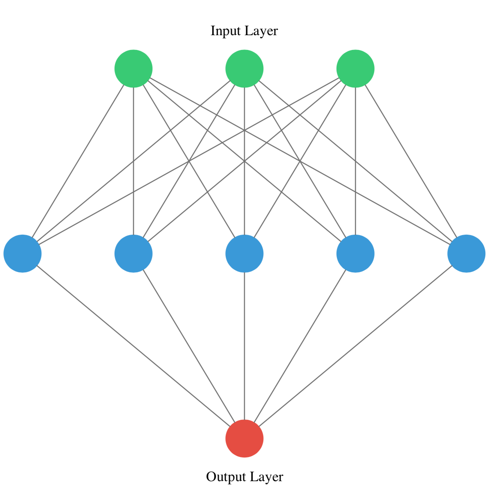
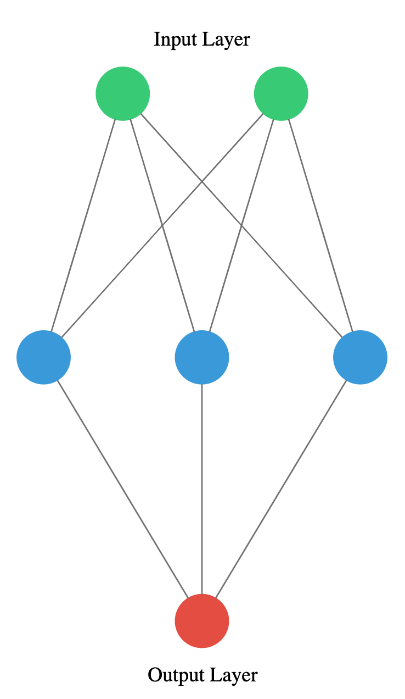
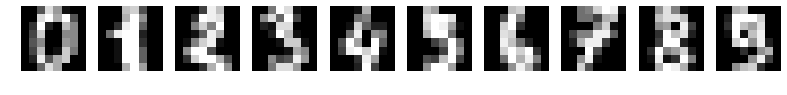

```{r setup, include=FALSE}
knitr::opts_chunk$set(echo = TRUE, message = FALSE, warning = FALSE)

```


# Introducing Keras

## Hello nets!
You're going to build a simple neural network to get a feeling of how quickly it is to accomplish this in Keras.

You will build a network that takes two numbers as an input, passes them through a hidden layer of 10 neurons, and finally outputs a single non-constrained number.

A non-constrained output can be obtained by avoiding setting an activation function in the output layer. This is useful for problems like regression, when we want our output to be able to take any non-constrained value.

include hello.nets.png
 

```{python}
# Import the Sequential model and Dense layer
from tensorflow.keras.models import Sequential
from tensorflow.keras.layers import Dense

# Create a Sequential model
model = Sequential()

# Add an input layer and a hidden layer with 10 neurons
model.add(Dense(10, input_shape=(2,), activation="relu"))

# Add a 1-neuron output layer
model.add(Dense(1))

# Summarise your model
model.summary()

```


## Counting parameters
You've just created a neural network. But you're going to create a new one now, taking some time to think about the weights of each layer. The Keras Dense layer and the Sequential model are already loaded for you to use.

This is the network you will be creating:



```{python}

# Instantiate a new Sequential model
model = Sequential()

# Add a Dense layer with five neurons and three inputs
model.add(Dense(5, input_shape=(3,), activation="relu"))

# Add a final Dense layer with one neuron and no activation
model.add(Dense(1))

# Summarize your model
model.summary()
```


### Question
- Given the model you just built, which answer is correct regarding the number of weights (parameters) in the hidden layer?

- ***There are 20 parameters, 15 from the connections of our inputs to our hidden layer and 5 from the bias weight of each neuron in the hidden layer.***


## Build as shown!
You will take on a final challenge before moving on to the next lesson. Build the network shown in the picture below. Prove your mastered Keras basics in no time!



```{python}

# Instantiate a Sequential model
model = Sequential()

# Build the input and hidden layer
model.add(Dense(3, input_shape = (2,)))

# Add the ouput layer
model.add(Dense(1))
```


## Specifying a model
You will build a simple regression model to predict the orbit of the meteor!

Your training data consist of measurements taken at time steps from -10 minutes before the impact region to +10 minutes after. Each time step can be viewed as an X coordinate in our graph, which has an associated position Y for the meteor orbit at that time step.

Note that you can view this problem as approximating a quadratic function via the use of neural networks.


This data is stored in two numpy arrays: one called time_steps , what we call features, and another called y_positions, with the labels. Go on and build your model! It should be able to predict the y positions for the meteor orbit at future time steps.

Keras Sequential model and Dense layers are available for you to use.


```{python}
# Instantiate a Sequential model
model = Sequential()

# Add a Dense layer with 50 neurons and an input of 1 neuron
model.add(Dense(50, input_shape=(1,), activation='relu'))

# Add two Dense layers with 50 neurons and relu activation
model.add(Dense(50, activation= "relu"))
model.add(Dense(50, activation= "relu"))

# End your model with a Dense layer and no activation
model.add(Dense(1))
```


## Training
You're going to train your first model in this course, and for a good cause!

Remember that before training your Keras models you need to compile them. This can be done with the .compile() method. The .compile() method takes arguments such as the optimizer, used for weight updating, and the loss function, which is what we want to minimize. Training your model is as easy as calling the .fit() method, passing on the features, labels and a number of epochs to train for.

The regression model you built in the previous exercise is loaded for you to use, along with the time_steps and y_positions data. Train it and evaluate it on this very same data, let's see if your model can learn the meteor's trajectory.

```{python}
time_steps_script = "time_steps.py"

filename = 'path_to_your_script.py'

with open(time_steps_script, 'r') as file:
    script_content = file.read()

exec(script_content)

# Compile your model
model.compile(optimizer = "adam", loss = "mse")

print("Training started..., this can take a while:")

# Fit your model on your data for 30 epochs
model.fit(time_steps,y_positions, epochs = 30)

# Evaluate your model 
print("Final loss value:",model.evaluate(time_steps, y_positions))
```

## Predicting the orbit!
You've already trained a model that approximates the orbit of the meteor approaching Earth and it's loaded for you to use.

Since you trained your model for values between -10 and 10 minutes, your model hasn't yet seen any other values for different time steps. You will now visualize how your model behaves on unseen data.

If you want to check the source code of plot_orbit, paste show_code(plot_orbit) into the console.

Hurry up, the Earth is running out of time!

Remember np.arange(x,y) produces a range of values from x to y-1. That is the [x, y) interval.

```{python}
import numpy as np
# Predict the twenty minutes orbit
twenty_min_orbit = model.predict(np.arange(-10, 11))

# Plot the twenty minute orbit 
plot_orbit(twenty_min_orbit)
```


```{python}

# Predict the eighty minute orbit
eighty_min_orbit = model.predict(np.arange(-40, 41))

# Plot the eighty minute orbit 
plot_orbit(eighty_min_orbit)

```

# Going Deeper

## Exploring dollar bills
You will practice building classification models in Keras with the Banknote Authentication dataset.

Your goal is to distinguish between real and fake dollar bills. In order to do this, the dataset comes with 4 features: variance,skewness,kurtosis and entropy. These features are calculated by applying mathematical operations over the dollar bill images. The labels are found in the dataframe's class column.


```{python}
import pandas as pd
banknotes = pd.read_csv("data/banknotes.csv")

# Import seaborn
import seaborn as sns
# Use pairplot and set the hue to be our class column
sns.pairplot(banknotes, hue= "class") 

# Describe the data
print('Dataset stats: \n',banknotes.describe())

# Count the number of observations per class
print('Observations per class: \n',banknotes["class"].value_counts())


```


## A binary classification model
Now that you know what the Banknote Authentication dataset looks like, we'll build a simple model to distinguish between real and fake bills.

You will perform binary classification by using a single neuron as an output. The input layer will have 4 neurons since we have 4 features in our dataset. The model's output will be a value constrained between 0 and 1.

We will interpret this output number as the probability of our input variables coming from a fake dollar bill, with 1 meaning we are certain it's a
fake bill.


```{python}

# Import the sequential model and dense layer
from tensorflow.keras.models import Sequential
from tensorflow.keras.layers import Dense

# Create a sequential model
model = Sequential()

# Add a dense layer 
model.add(Dense(1, input_shape=(4,), activation= "sigmoid"))

# Compile your model
model.compile(loss='binary_crossentropy', optimizer="sgd", metrics=['accuracy'])

# Display a summary of your model
model.summary()
```

## Is this dollar bill fake ?
You are now ready to train your model and check how well it performs when classifying new bills! The dataset has already been partitioned into features: X_train & X_test, and labels: y_train & y_test.

```{python}
from sklearn.model_selection import train_test_split
# Separate features and labels
X = banknotes.drop('class', axis=1)  # Features
y = banknotes['class']  # Labels

# Split the dataset into training and testing sets
X_train, X_test, y_train, y_test = train_test_split(X, y, test_size=0.2, random_state=42)

# Train your model for 20 epochs
model.fit(X_train, y_train, epochs = 20)

# Evaluate your model accuracy on the test set
accuracy = model.evaluate(X_test, y_test)[1]

# Print accuracy
print('Accuracy:', accuracy)
```


## A multi-class model
You're going to build a model that predicts who threw which dart only based on where that dart landed! (That is the dart's x and y coordinates on the board.)

This problem is a multi-class classification problem since each dart can only be thrown by one of 4 competitors. So classes/labels are mutually exclusive, and therefore we can build a neuron with as many output as competitors and use the softmax activation function to achieve a total sum of probabilities of 1 over all competitors.

The Sequential model and Dense layers are already imported for you to use.

```{python}
# Instantiate a sequential model
model = Sequential()
  
# Add 3 dense layers of 128, 64 and 32 neurons each
model.add(Dense(128, input_shape=(2,), activation='relu'))
model.add(Dense(64, activation='relu'))
model.add(Dense(32, activation='relu'))
  
# Add a dense layer with as many neurons as competitors
model.add(Dense(4, activation= "softmax"))
  
# Compile your model using categorical_crossentropy loss
model.compile(loss= "categorical_crossentropy",
              optimizer='adam',
              metrics=['accuracy'])
              
```


## Prepare your dataset
In the console you can check that your labels, darts.competitor are not yet in a format to be understood by your network. They contain the names of the competitors as strings. You will first turn these competitors into unique numbers,then use the to_categorical() function from keras.utils to turn these numbers into their one-hot encoded representation.

This is useful for multi-class classification problems, since there are as many output neurons as classes and for every observation in our dataset we just want one of the neurons to be activated.

The dart's dataset is loaded as darts. Pandas is imported as pd. Let's prepare this dataset!


```{python}

darts = pd.read_csv("data/darts.csv")
# Transform into a categorical variable
darts.competitor = pd.Categorical(darts.competitor)

# Assign a number to each category (label encoding)
darts.competitor = darts.competitor.cat.codes 

# Import to_categorical from keras utils module
from tensorflow.keras.utils import to_categorical

coordinates = darts.drop(['competitor'], axis=1)
# Use to_categorical on your labels
competitors = to_categorical(darts.competitor)

# Now print the one-hot encoded labels
print('One-hot encoded competitors: \n',competitors)

```


## Training on dart throwers

Your model is now ready, just as your dataset. It's time to train!

The coordinates features and competitors labels you just transformed have been partitioned into coord_train,coord_test and competitors_train,competitors_test.

Your model is also loaded. Feel free to visualize your training data or model.summary() in the console.

Let's find out who threw which dart just by looking at the board!

```{python}
# Now, split the datasets into training and testing sets
coord_train, coord_test, competitors_train, competitors_test = train_test_split(
    coordinates,  # features
    competitors,  # target
    test_size=0.2,  # proportion of the dataset to include in the test split
    random_state=42  # seed used by the random number generator for reproducibility
)


# Fit your model to the training data for 200 epochs
model.fit(coord_train, competitors_train, epochs= 200)

# Evaluate your model accuracy on the test data
accuracy = model.evaluate(coord_test, competitors_test)[1]

# Print accuracy
print('Accuracy:', accuracy)
```


## Softmax predictions
Your recently trained model is loaded for you. This model is generalizing well!, that's why you got a high accuracy on the test set.

Since you used the softmax activation function, for every input of 2 coordinates provided to your model there's an output vector of 4 numbers. Each of these numbers encodes the probability of a given dart being thrown by one of the 4 possible competitors.

When computing accuracy with the model's .evaluate() method, your model takes the class with the highest probability as the prediction. np.argmax() can help you do this since it returns the index with the highest value in an array.

Use the collection of test throws stored in coords_small_test and np.argmax()to check this out!

```{python}
import numpy as np
# Predict on coords_small_test
coords_small_test = coord_test.iloc[:5, :]
competitors_small_test = competitors_test[:5, :]
preds = model.predict(coords_small_test)

# Print preds vs true values
print("{:45} | {}".format('Raw Model Predictions','True labels'))
for i,pred in enumerate(preds):
  print("{} | {}".format(pred,competitors_small_test[i]))

# Extract the position of highest probability from each pred vector
preds_chosen = [np.argmax(pred) for pred in preds]

# Print preds vs true values
print("{:10} | {}".format('Rounded Model Predictions','True labels'))
for i,pred in enumerate(preds_chosen):
  print("{:25} | {}".format(pred,competitors_small_test[i]))
```


## An irrigation machine
You're going to automate the watering of farm parcels by making an intelligent irrigation machine. Multi-label classification problems differ from multi-class problems in that each observation can be labeled with zero or more classes. So classes/labels are not mutually exclusive, you could water all, none or any combination of farm parcels based on the inputs.

To account for this behavior what we do is have an output layer with as many neurons as classes but this time, unlike in multi-class problems, each output neuron has a sigmoid activation function. This makes each neuron in the output layer able to output a number between 0 and 1 independently.

The Sequential() model and Dense() layers are ready to be used. It's time to build an intelligent irrigation machine!


```{python}

# Instantiate a Sequential model
model = Sequential()

# Add a hidden layer of 64 neurons and a 20 neuron's input
model.add(Dense(64, input_shape =(20,),  activation='relu'))

# Add an output layer of 3 neurons with sigmoid activation

model.add(Dense(3,   activation='sigmoid'))

# Compile your model with binary crossentropy loss
model.compile(optimizer='adam',
           loss = "binary_crossentropy" ,
           metrics=['accuracy'])

model.summary()


```


## Training with multiple labels
An output of your multi-label model could look like this: [0.76 , 0.99 , 0.66 ]. If we round up probabilities higher than 0.5, this observation will be classified as containing all 3 possible labels [1,1,1]. For this particular problem, this would mean watering all 3 parcels in your farm is the right thing to do, according to the network, given the input sensor measurements.

You will now train and predict with the model you just built. sensors_train, parcels_train, sensors_test and parcels_test are already loaded for you to use.

Let's see how well your intelligent machine performs!


```{python}


irrigation_df = pd.read_csv('data/irrigation_machine.csv', index_col=0)

# Define lists of column names for sensors and parcels
sensor_columns = [col for col in irrigation_df.columns if 'sensor_' in col]
parcel_columns = [col for col in irrigation_df .columns if 'parcel_' in col]

# Separate sensor readings and parcel indicators
sensors = irrigation_df[sensor_columns] # Sensor readings columns
parcels = irrigation_df[parcel_columns]  # Parcel indicators columns

# Split the datasets into training and testing sets
sensors_train, sensors_test, parcels_train, parcels_test = train_test_split(
    sensors, parcels, test_size=0.2, random_state=42
)

# Checking the shapes of the resulting datasets to confirm successful split
sensors_train.shape, sensors_test.shape, parcels_train.shape, parcels_test.shape

# Train for 100 epochs using a validation split of 0.2
model.fit(sensors_train, parcels_train, epochs = 100, validation_split = 0.2)

# Predict on sensors_test and round up the predictions
preds = model.predict(sensors_test)
preds_rounded = np.round(preds)

# Print rounded preds
print('Rounded Predictions: \n', preds_rounded)

# Evaluate your model's accuracy on the test data
accuracy = model.evaluate(sensors_test, parcels_test)[1]

# Print accuracy
print('Accuracy:', accuracy)
```


## The history callback
The history callback is returned by default every time you train a model with the .fit() method. To access these metrics you can access the history dictionary parameter inside the returned h_callback object with the corresponding keys.

The irrigation machine model you built in the previous lesson is loaded for you to train, along with its features and labels now loaded as X_train, y_train, X_test, y_test. This time you will store the model's historycallback and use the validation_data parameter as it trains.

You will plot the results stored in history with plot_accuracy() and plot_loss(), two simple matplotlib functions. You can check their code in the console by pasting show_code(plot_loss).

Let's see the behind the scenes of our training!


```{python}

# Create a sequential model
model = Sequential()

# Add a dense layer 
model.add(Dense(1, input_shape=(4,), activation= "sigmoid"))

# Compile your model
model.compile(loss='binary_crossentropy', optimizer="sgd", metrics=['accuracy'])


# Train your model and save its history
h_callback = model.fit(X_train, y_train, epochs = 100,
               validation_data=(X_test, y_test))

# Plot train vs test loss during training
plot_loss(h_callback.history['loss'], h_callback.history['val_loss'])

# Plot train vs test accuracy during training
plot_accuracy(h_callback.history['accuracy'], h_callback.history['val_accuracy'])
```


## Early stopping your model
The early stopping callback is useful since it allows for you to stop the model training if it no longer improves after a given number of epochs. To make use of this functionality you need to pass the callback inside a list to the model's callback parameter in the .fit() method.

The model you built to detect fake dollar bills is loaded for you to train, this time with early stopping. X_train, y_train, X_test and y_test are also available for your use.


```{python}

# Create a sequential model
model = Sequential()

# Add a dense layer 
model.add(Dense(1, input_shape=(4,), activation= "sigmoid"))

# Compile your model
model.compile(loss='binary_crossentropy', optimizer="sgd", metrics=['accuracy'])


# Import the early stopping callback
from tensorflow.keras.callbacks import EarlyStopping
# Define a callback to monitor val_accuracy
monitor_val_acc = EarlyStopping(monitor= 'val_accuracy', patience=5)

# Create a sequential model
model = Sequential()

# Add a dense layer 
model.add(Dense(1, input_shape=(4,), activation= "sigmoid"))

# Compile your model
model.compile(loss='binary_crossentropy', optimizer="sgd", metrics=['accuracy'])

# Train your model using the early stopping callback
model.fit(X_train, y_train, epochs = 100, 
    validation_data=(X_test, y_test),
    callbacks = [monitor_val_acc])

```

## A combination of callbacks


```{python}
# Import the EarlyStopping and ModelCheckpoint callbacks
from tensorflow.keras.callbacks import EarlyStopping, ModelCheckpoint

# Early stop on validation accuracy
monitor_val_acc = EarlyStopping(monitor = 'val_accuracy', patience = 3)

# Save the best model as best_banknote_model.hdf5
model_checkpoint = ModelCheckpoint("best_banknote_model.hdf5", save_best_only = True)

# Create a sequential model
model = Sequential()

# Add a dense layer 
model.add(Dense(1, input_shape=(4,), activation= "sigmoid"))

# Compile your model
model.compile(loss='binary_crossentropy', optimizer="sgd", metrics=['accuracy'])

# Fit your model for a stupid amount of epochs
h_callback = model.fit(X_train, y_train,
                    epochs = 1000000000000,
                    callbacks = [monitor_val_acc, model_checkpoint],
                    validation_data = (X_test, y_test))
```

#  Improving Your Model Performance

## Learning the digits
You're going to build a model on the digits dataset, a sample dataset that comes pre-loaded with scikit learn. The digits dataset consist of 8x8 pixel handwritten digits from 0 to 9:

 
You want to distinguish between each of the 10 possible digits given an image, so we are dealing with multi-class classification.
The dataset has already been partitioned into X_train, y_train, X_test, and y_test, using 30% of the data as testing data. The labels are already one-hot encoded vectors, so you don't need to use Keras to_categorical() function.

Let's build this new model!

```{python}
import numpy as np
from tensorflow.keras.utils import to_categorical
digits_pixels =  np.load("data/Digits/digits_pixels.npy")
digits_target =  np.load("data/Digits/digits_target.npy")
digits_target_binary = to_categorical(digits_target)
X_train, X_test, y_train, y_test = train_test_split(digits_pixels, digits_target_binary, test_size=0.25, random_state=42)

## instantiate the model
model = Sequential()

# Input and hidden layer with input_shape, 16 neurons, and relu 
model.add(Dense(16, input_shape = (64,), activation = "relu"))

# Output layer with 10 neurons (one per digit) and softmax
model.add(Dense(10, activation = "softmax"))

# Compile your model
model.compile(optimizer = "adam", loss = "categorical_crossentropy", metrics = ["accuracy"])

# Test if your model is well assembled by predicting before training
print(model.predict(X_train))
```

## Is the model overfitting?
 Let's train the model you just built and plot its learning curve to check out if it's overfitting! You can make use of the loaded function plot_loss() to plot training loss against validation loss, you can get both from the history callback.


```{python}
# Train your model for 60 epochs, using X_test and y_test as validation data
h_callback = model.fit(X_train, y_train, epochs = 60, validation_data = (X_test, y_test), verbose=0)

# Extract from the h_callback object loss and val_loss to plot the learning curve
plot_loss(h_callback.history['loss'], h_callback.history['val_loss'])
```

- This graph doesn't show overfitting but convergence. It looks like your model has learned all it could from the data and it no longer improves. The test loss, although higher than the training loss, is not getting worse, so we aren't overfitting to the training data.
If you want to inspect the plot_loss() function code, paste this in the console: show_code(plot_loss)


## Do we need more data?
It's time to check whether the digits dataset model you built benefits from more training examples!

In order to keep code to a minimum, various things are already initialized and ready to use:

- The model you just built.
- X_train,y_train,X_test, and y_test.
- The initial_weights of your model, saved after using model.get_weights().
- A pre-defined list of training sizes: training_sizes.
- A pre-defined early stopping callback monitoring loss: early_stop.
- Two empty lists to store the evaluation results: train_accs and test_accs.
Train your model on the different training sizes and evaluate the results on X_test. End by plotting the results with plot_results().

The full code for this exercise can be found on the slides!

```{python}
# Create the list of training sizes
# Store initial model weights
initial_weights = model.get_weights()
training_sizes = np.array([ 125,  502,  879, 1255])
train_accs = []
test_accs = []
early_stop = EarlyStopping(monitor = "loss", patience = 3)
for size in training_sizes:
  	# Get a fraction of training data (we only care about the training data)
    X_train_frac, y_train_frac = X_train[:size], y_train[:size]

    # Reset the model to the initial weights and train it on the new training data fraction
    model.set_weights(initial_weights)
    model.fit(X_train_frac, y_train_frac, epochs = 50, callbacks = [early_stop])

    # Evaluate and store both: the training data fraction and the complete test set results
    train_accs.append(model.evaluate(X_train_frac, y_train_frac)[1])
    test_accs.append(model.evaluate(X_test, y_test)[1])
    
# Plot train vs test accuracies
plot_results(train_accs, test_accs)


```


## Different activation functions
The sigmoid(),tanh(), ReLU(), and leaky_ReLU() functions have been defined and ready for you to use. Each function receives an input number X and returns its corresponding Y value.

- Which of the statements below is false?

The false statement among the ones provided is:

"The sigmoid() and tanh() both take values close to -1 for big negative numbers."

Here's why the other statements are true and why the false one is incorrect:

1. **True Statement:** "The sigmoid() takes a value of 0.5 when X = 0 whilst tanh() takes a value of 0."
   - **Explanation:** The sigmoid function, defined as $f(x) = \frac{1}{1 + e^{-x}}$, indeed takes a value of 0.5 when $x = 0$. The hyperbolic tangent function (tanh), defined as $f(x) = \frac{e^x - e^{-x}}{e^x + e^{-x}}$, takes a value of 0 when $x = 0$.

2. **True Statement:** "The leaky_ReLU() takes a value of -0.01 when X = -1 whilst ReLU() takes a value of 0."
   - **Explanation:** The Leaky ReLU (Rectified Linear Unit) activation function is defined as $f(x) = x$ for $x > 0$ and $f(x) = \alpha x$ for $x \leq 0$, where $\alpha$ is a small coefficient (e.g., 0.01). Thus, for $x = -1$, leaky ReLU returns $-0.01$. The standard ReLU function is defined as $f(x) = \max(0, x)$, and it returns 0 for any $x \leq 0$, including $x = -1$.

3. **False Statement:** "The sigmoid() and tanh() both take values close to -1 for big negative numbers."
   - **Explanation:** For large negative $x$ values, the sigmoid function approaches 0, not -1. The sigmoid function's output range is between 0 and 1. On the other hand, the tanh function, which outputs values in the range of -1 to 1, does approach -1 for large negative $x$ values. This discrepancy makes the statement false.
   
   
## Comparing activation functions
Comparing activation functions involves a bit of coding, but nothing you can't do!

You will try out different activation functions on the multi-label model you built for your farm irrigation machine in chapter 2. The function get_model('relu') returns a copy of this model and applies the 'relu' activation function to its hidden layer.

You will loop through several activation functions, generate a new model for each and train it. By storing the history callback in a dictionary you will be able to visualize which activation function performed best in the next exercise!

X_train, y_train, X_test, y_test are ready for you to use when training your models.


```{python}
activations = ['relu', 'leaky_relu', 'tanh', 'sigmoid']

activation_results = {}

for act in activations:
    # Get a new model with the current activation using the get_model function
    model = get_model(act)
    # Fit the model on-the-go
    h_callback = model.fit(sensors_train, parcels_train, epochs=100, validation_data=(sensors_test, parcels_test), verbose=0)
    activation_results[act] = h_callback
    print(act + " model ready")
```


### Comparing activation functions II
What you coded in the previous exercise has been executed to obtain theactivation_results variable, this time 100 epochs were used instead of 20. This way you will have more epochs to further compare how the training evolves per activation function.

For every h_callback of each activation function in activation_results:

The h_callback.history['val_loss'] has been extracted.
The h_callback.history['val_accuracy'] has been extracted.
Both are saved into two dictionaries: val_loss_per_function and val_acc_per_function.

Pandas is also loaded as pd for you to use. Let's plot some quick validation loss and accuracy charts!


```{python}

val_loss_per_function = {k:v.history['val_loss'] for k,v in activation_results.items()}
val_acc_per_function = {k:v.history['accuracy'] for k,v in activation_results.items()}
# Create a dataframe from val_loss_per_function
val_loss= pd.DataFrame(val_loss_per_function)

# Call plot on the dataframe
val_loss.plot(title='Loss per Activation function')

plt.show()

# Create a dataframe from val_acc_per_function
val_acc = pd.DataFrame(val_acc_per_function)

# Call plot on the dataframe

val_acc.plot(title='Acc per Activation function')

plt.show()
```


