Communicating with Data in the Tidyverse
================
Mburu
8/11/2021

## Join the two data sets together

In the video, you have learned that the inner\_join() function of dplyr
needs to be given a “key” on which two data frames are joined. Actually,
multiple keys that need to match can be specified. In this first
exercise, you are going to join two data sets by two keys. The data
frames ilo\_hourly\_compensation and ilo\_working\_hours are already
loaded for you and are available in your workspace.

This course touches on a lot of concepts you may have forgotten, so if
you ever need a quick refresher, download the tidyverse Cheat Sheet and
keep it handy!

``` r
library(tidyverse)
library(data.table)
load("ilo_working_hours.RData")
load("ilo_hourly_compensation.RData")
# Join both data frames
ilo_data <- ilo_hourly_compensation %>%
  inner_join(ilo_working_hours, by = c("country", "year"))

# Count the resulting rows
ilo_data  %>% 
    count()
```

    ## # A tibble: 1 × 1
    ##       n
    ##   <int>
    ## 1   612

``` r
# Examine ilo_data
ilo_data %>% head()
```

    ## # A tibble: 6 × 4
    ##   country   year   hourly_compensation working_hours
    ##   <chr>     <chr>                <dbl>         <dbl>
    ## 1 Australia 1980.0                8.44          34.6
    ## 2 Canada    1980.0                8.87          34.8
    ## 3 Denmark   1980.0               10.8           31.9
    ## 4 Finland   1980.0                8.61          35.6
    ## 5 France    1980.0                8.90          35.4
    ## 6 Italy     1980.0                8.09          35.7

## Change variable types

For displaying data in ggplot2 graphics, it is often helpful to convert
all the variables to the right data type. Usually, categorical variables
like country in this example should be converted to factors before
plotting them. You can do so using as.factor(). In your data set, two
columns are still of type “character” – use mutate() to turn them into
factors.

``` r
# Turn year and country into a factor
ilo_data_corrected <- ilo_data %>%
  mutate(year = as.factor(as.integer(as.numeric(year))),
        country = as.factor(country))

# See the results
ilo_data_corrected %>% head()
```

    ## # A tibble: 6 × 4
    ##   country   year  hourly_compensation working_hours
    ##   <fct>     <fct>               <dbl>         <dbl>
    ## 1 Australia 1980                 8.44          34.6
    ## 2 Canada    1980                 8.87          34.8
    ## 3 Denmark   1980                10.8           31.9
    ## 4 Finland   1980                 8.61          35.6
    ## 5 France    1980                 8.90          35.4
    ## 6 Italy     1980                 8.09          35.7

## Filter the data for plotting

Use the filter() function of dplyr to remove non-European countries. A
vector called european\_countries has been created that contains all
European countries which should remain in the data set. Here, the %in%
operator introduced in the video might come in handy. Note that only a
subset of European countries for which enough data exist is retained.
For instance, Poland is missing.

``` r
ilo_data <- ilo_data %>%
  mutate(year = as.integer(as.numeric(year)))

european_countries <- c("Finland", "France", "Italy", "Norway", "Spain", "Sweden", 
                        "Switzerland", "United Kingdom", "Belgium", "Ireland", 
                        "Luxembourg", "Portugal", "Netherlands", "Germany", 
                        "Hungary", "Austria", "Czech Rep.")


# Only retain European countries
ilo_data <- ilo_data %>%
  filter(country %in% european_countries)
```

## Some summary statistics

Use dplyrs group\_by() and summarize() to compute summary statistics for
both years.

``` r
# Examine the structure of ilo_data
str(ilo_data)
```

    ## tibble [380 × 4] (S3: tbl_df/tbl/data.frame)
    ##  $ country            : chr [1:380] "Finland" "France" "Italy" "Norway" ...
    ##  $ year               : int [1:380] 1980 1980 1980 1980 1980 1980 1980 1980 1981 1981 ...
    ##  $ hourly_compensation: num [1:380] 8.61 8.9 8.09 11.8 5.86 ...
    ##  $ working_hours      : num [1:380] 35.6 35.4 35.7 30.4 36.8 ...

``` r
# Group and summarize the data
ilo_data %>%
  group_by(year) %>%
  summarise(mean_hourly_compensation = mean(hourly_compensation),
            mean_working_hours = mean(working_hours)) %>% 
    head()
```

    ## # A tibble: 6 × 3
    ##    year mean_hourly_compensation mean_working_hours
    ##   <int>                    <dbl>              <dbl>
    ## 1  1980                     9.27               34.0
    ## 2  1981                     8.69               33.6
    ## 3  1982                     8.36               33.5
    ## 4  1983                     7.81               33.9
    ## 5  1984                     7.54               33.7
    ## 6  1985                     7.79               33.7

## A basic scatter plot

In this exercise, you will create a very basic scatter plot with
ggplot2. This is mostly a repetition of stuff you’ve learnt in the
prerequisites for this course, so it should be easy for you.

``` r
# Filter for 2006
plot_data <- ilo_data %>%
  filter(year == 2006)
  
# Create the scatter plot
ggplot(plot_data) +
  geom_point(aes(x = working_hours, y = hourly_compensation))
```

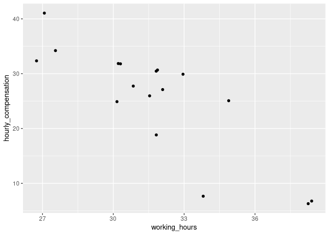<!-- -->

## Add labels to the plot

As mentioned in the video, you’re going to enhance the plot from the
previous exercise by adding a title, a subtitle, and a caption to the
plot as well as giving the axes meaningful names. You’re going to use
the labs() function to do this – try using ?labs in the console to see
the available options.

``` r
# Create the plot
ilo_plot <- ggplot(plot_data) +
  geom_point(aes(x = working_hours, y = hourly_compensation)) +
  # Add labels
  labs(
    x = "Working hours per week",
    y = "Hourly compensation",
    title = "The more people work, the less compensation they seem to receive",
    subtitle = "Working hours and hourly compensation in European countries, 2006",
    caption = "Data source: ILO, 2017"
  )

ilo_plot
```

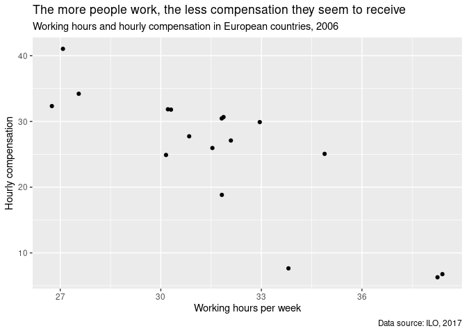<!-- -->

## Apply a default theme

As you’ve learnt in the videos, ggplot2 comes with a set of predefined
themes. Try out some of them!

``` r
# Add a different theme
ilo_plot +
  theme_minimal()
```

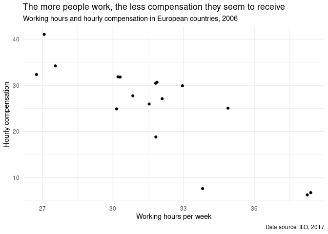<!-- -->

## Change the appearance of titles

Besides applying defined theme presets, you can tweak your plot even
more by altering different style attributes of it. Hint: You can reuse
and overwrite the ilo\_plot variable generated in the previous exercise
– the current plot is already shown in the window on the right.

``` r
ilo_plot <- ilo_plot +
  theme_minimal() +
  # Customize the "minimal" theme with another custom "theme" call
  theme(
    text = element_text(family = "Bookman"),
    title = element_text(color = "gray25"),
    plot.caption = element_text(color = "gray30"),
    plot.subtitle = element_text(size = 12)
  )

# Render the plot object
ilo_plot
```

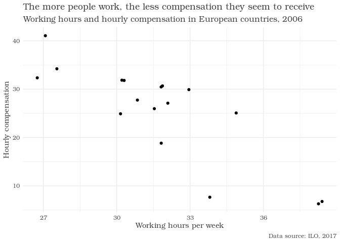<!-- -->

## Alter background color and add margins

Further customize the look of your plot with more arguments to the theme
function call. You can continue working on your ilo\_plot object created
in the last exercise.

-   Change the overall background color of your plot to “gray95”.
-   This time, another function than element\_text is needed – one for
    rectangular plot elements. Rewatch the video to know which.
-   Add margins to the plot: 5mm top and bottom, 10mm to the left and
    the right.
-   The margins need to be specified in the following order: top, right,
    bottom, and left.

``` r
ilo_plot +
  # "theme" calls can be stacked upon each other, so this is already the third call of "theme"
  theme(
    plot.background = element_rect(fill = "gray95"),
    plot.margin = unit(c(5, 10, 5, 10), units = "mm")
  )
```

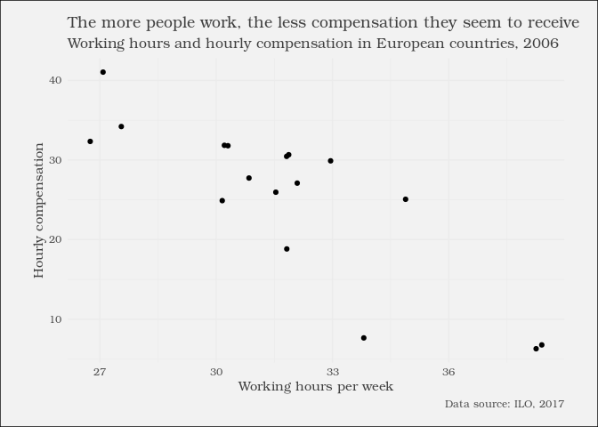<!-- -->

## Prepare the data set for the faceted plot

You’re now going to prepare your data set for producing the faceted
scatter plot in the next exercise, as mentioned in the video. For this,
the data set needs to contain only the years 1996 and 2006, because your
plot will only have two facets. ilo\_data has been pre-loaded for you.

``` r
# Filter ilo_data to retain the years 1996 and 2006
ilo_datap <- ilo_data %>%
  filter(year == 1996 | year == 2006)
# Again, you save the plot object into a variable so you can save typing later on
ilo_plot <- ggplot(ilo_datap, aes(x = working_hours, y = hourly_compensation)) +
  geom_point() +
   labs(
    x = "Working hours per week",
    y = "Hourly compensation",
    title = "The more people work, the less compensation they seem to receive",
    subtitle = "Working hours and hourly compensation in European countries, 2006",
    caption = "Data source: ILO, 2017"
  ) +
  # Add facets here
  facet_grid(.~year)
 
ilo_plot
```

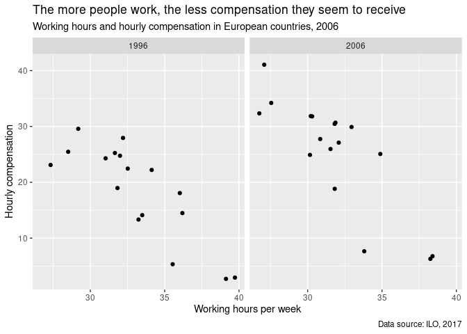<!-- -->

## Define your own theme function

In the video you saw how a lot of typing can be saved by replacing code
chunks with function calls. You saw how a function is usually defined,
now you will apply this knowledge in order to make your previous two
theme() calls reusable.

``` r
# Define your own theme function below
theme_ilo <- function() {
   theme_minimal() +
  theme(
    text = element_text(family = "Bookman", color = "gray25"),
    plot.subtitle = element_text(size = 12),
    plot.caption = element_text(color = "gray30"),
    plot.background = element_rect(fill = "gray95"),
    plot.margin = unit(c(5, 10, 5, 10), units = "mm")
  )
}
```

## Apply the new theme function to the plot

Once you have created your own theme\_ilo() function, it is time to
apply it to a plot object. In the video you saw that theme() calls can
be chained. You’re going to make use of this and add another theme()
call to adjust some peculiarities of the faceted plot.

``` r
# Apply your theme function (dont't forget to call it with parentheses!)
ilo_plot <- ilo_plot +
  theme_ilo()

# Examine ilo_plot
ilo_plot
```

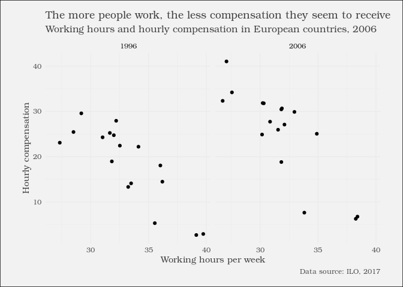<!-- -->

``` r
ilo_plot +
  # Add another theme call
  theme(
    # Change the background fill and color
    strip.background = element_rect(fill = "gray60", color = 'gray95'),
    # Change the color of the text
    strip.text = element_text(color = "white")
  )
```

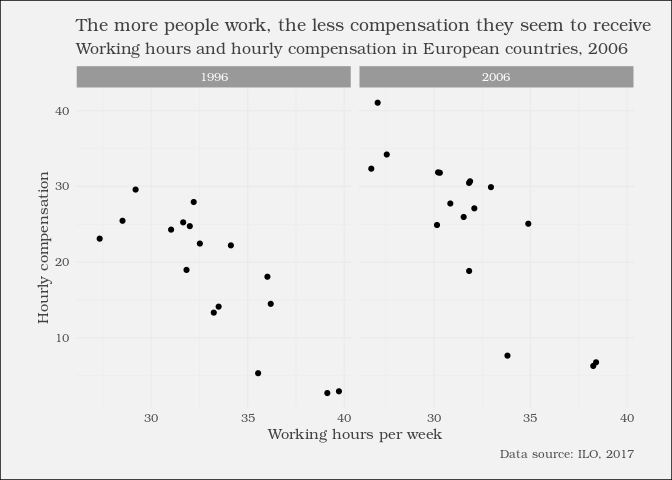<!-- -->

## A basic dot plot

As shown in the video, use only geom\_path() to create the basic
structure of the dot plot.

``` r
# Create the dot plot
ggplot(ilo_datap, aes(working_hours, country))+
geom_path()
```

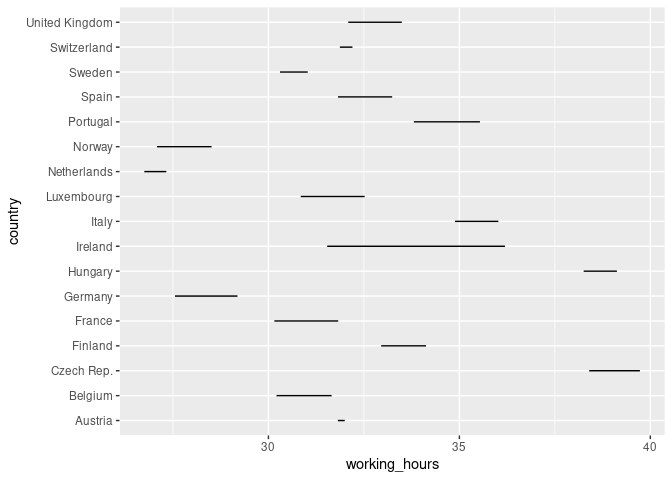<!-- -->

## Add arrows to the lines in the plot

Instead of labeling years, use the arrow argument of the geom\_path()
call to show the direction of change. The arrows will point from 1996 to
2006, because that’s how the data set is ordered. The arrow() function
takes two arguments: The first is length, which can be specified with a
unit() call, which you might remember from previous exercises. The
second is type which defines how the arrow head will look.

``` r
ggplot(ilo_datap) +
  geom_path(aes(x = working_hours, y = country),
  # Add an arrow to each path
  arrow = arrow(length = unit(1.5, "mm"), type = "closed"))
```

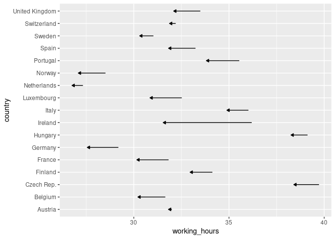<!-- -->

## Add some labels to each country

A nice thing that can be added to plots are annotations or labels, so
readers see the value of each data point displayed in the plot panel.
This often makes axes obsolete, an advantage you’re going to use in the
last exercise of this chapter. These labels are usually added with
geom\_text() or geom\_label(). The latter adds a background to each
label, which is not needed here.

``` r
ggplot(ilo_datap) +
  geom_path(aes(x = working_hours, y = country),
            arrow = arrow(length = unit(1.5, "mm"), type = "closed")) +
  # Add a geom_text() geometry
  geom_text(
          aes(x = working_hours,
              y = country,
              label = round(working_hours, 1))
        )
```

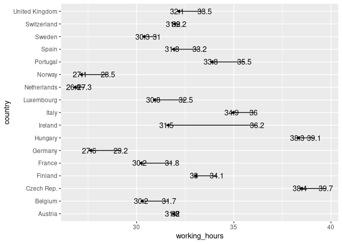<!-- -->

## Reordering elements in the plot

As shown in the video, use mutate() and fct\_reorder() to change the
factor level ordering of a variable.

``` r
ilo_datap <- ilo_datap %>%
    mutate(country = as.factor(country))


library(forcats)

# Reorder country factor levels
ilo_datap <- ilo_datap %>%
  # Arrange data frame
  arrange(year) %>%
  # Reorder countries by working hours in 2006
  mutate(country = fct_reorder(country,
                               working_hours,
                               last))

# Plot again
ggplot(ilo_datap) +
  geom_path(aes(x = working_hours, y = country),
            arrow = arrow(length = unit(1.5, "mm"), type = "closed")) +
    geom_text(
          aes(x = working_hours,
              y = country,
              label = round(working_hours, 1))
          )
```

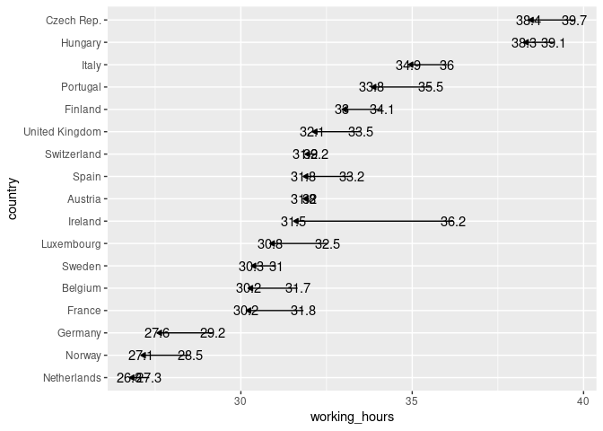<!-- -->

## Correct ugly label positions

The labels still kind of overlap with the lines in the dot plot. Use a
conditional hjust aesthetic in order to better place them, and change
their appearance.

``` r
# Save plot into an object for reuse
ilo_dot_plot <- ggplot(ilo_datap) +
  geom_path(aes(x = working_hours, y = country),
            arrow = arrow(length = unit(1.5, "mm"), type = "closed")) +
    # Specify the hjust aesthetic with a conditional value
    geom_text(
          aes(x = working_hours,
              y = country,
              label = round(working_hours, 1),
              hjust = ifelse(year == "2006", 1.4, -0.4)
            ),
          # Change the appearance of the text
          size = 3,
          family = "Bookman",
          color = "gray25"
          )

ilo_dot_plot
```

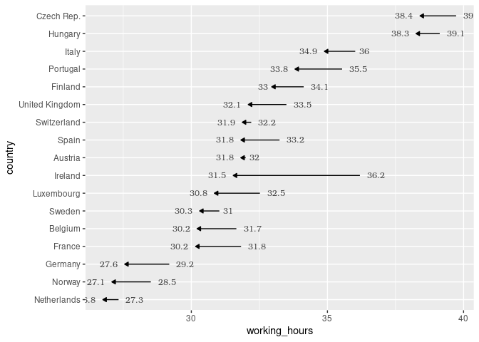<!-- -->

## Change the viewport so labels don’t overlap with plot border

Use a function introduced in the previous video to change the viewport
of the plotting area. Also apply your custom theme.

``` r
# Reuse ilo_dot_plot
ilo_dot_plot <- ilo_dot_plot +
  # Add labels to the plot
  labs(
    x = "Working hours per week",
    y = "Country",
    title = "People work less in 2006 compared to 1996",
    subtitle = "Working hours in European countries, development since 1996",
    caption = "Data source: ILO, 2017"
  ) +
  # Apply your theme
  theme_ilo() +
  # Change the viewport
  coord_cartesian(xlim = c(25, 41))
  
# View the plot
ilo_dot_plot
```

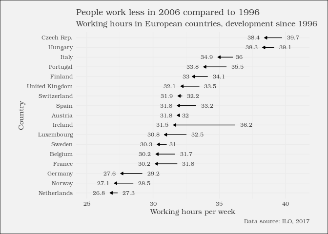<!-- -->

## Optimizing the plot for mobile devices

The x-axis title is already quite superfluous because you’ve added
labels for both years. You’ll now add country labels to the plot, so all
of the axes can be removed.

In this exercise, you’re going to encounter something that is probably
new to you: New data sets can be given to single geometries like
geom\_text(), so these geometries don’t use the data set given to the
initial ggplot() call. In this exercise, you are going to need this
because you only want to add one label to each arrow. If you were to use
the original data set ilo\_data, two labels would be added because there
are two observations for each country in the data set, one for 1996 and
one for 2006.

``` r
# Compute temporary data set for optimal label placement
median_working_hours <- ilo_datap %>%
  group_by(country) %>%
  summarize(median_working_hours_per_country = median(working_hours)) %>%
  ungroup()

# Have a look at the structure of this data set
str(median_working_hours)
```

    ## tibble [17 × 2] (S3: tbl_df/tbl/data.frame)
    ##  $ country                         : Factor w/ 17 levels "Netherlands",..: 1 2 3 4 5 6 7 8 9 10 ...
    ##  $ median_working_hours_per_country: num [1:17] 27 27.8 28.4 31 30.9 ...

``` r
ilo_dot_plot +
  # Add label for country
  geom_text(data = median_working_hours,
            aes(y = country,
                x = median_working_hours_per_country,
                label = country),
            vjust = 2,
            family = "Bookman",
            color = "gray25") +
  # Remove axes and grids
  theme(
    axis.ticks = element_blank(),
    axis.title = element_blank(),
    axis.text = element_blank(),
    panel.grid = element_blank(),
    # Also, let's reduce the font size of the subtitle
    plot.subtitle = element_text(size = 9)
  )
```

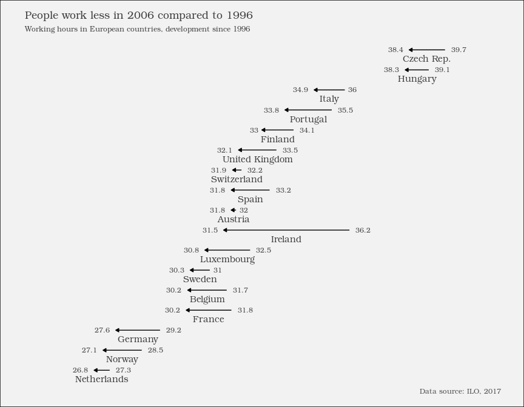<!-- -->
