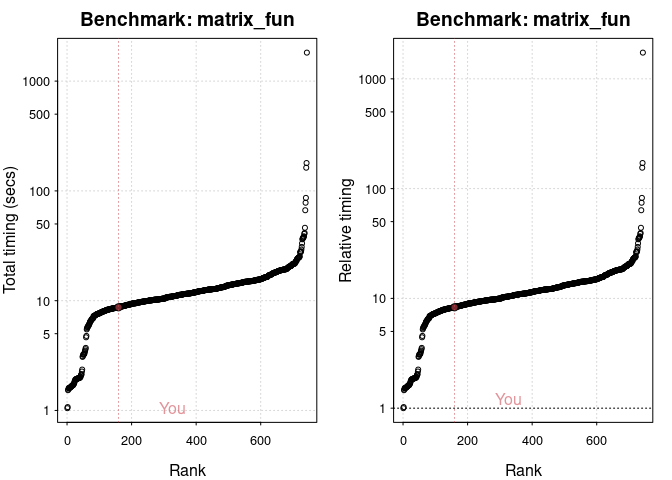

Writing Efficient R Code
================
Mburu
8/13/2021

## R version

One of the relatively easy optimizations available is to use an
up-to-date version of R. In general, R is very conservative, so
upgrading doesn’t break existing code. However, a new version will often
provide free speed boosts for key functions.

The version command returns a list that contains (among other things)
the major and minor version of R currently being used.

``` r
# Print the R version details using version
version
```

    ##                _                           
    ## platform       x86_64-pc-linux-gnu         
    ## arch           x86_64                      
    ## os             linux-gnu                   
    ## system         x86_64, linux-gnu           
    ## status                                     
    ## major          4                           
    ## minor          1.0                         
    ## year           2021                        
    ## month          05                          
    ## day            18                          
    ## svn rev        80317                       
    ## language       R                           
    ## version.string R version 4.1.0 (2021-05-18)
    ## nickname       Camp Pontanezen

``` r
# Assign the variable major to the major component
major <- version$major

# Assign the variable minor to the minor component
minor <- version$minor
```

## Comparing read times of CSV and RDS files

One of the most common tasks we perform is reading in data from CSV
files. However, for large CSV files this can be slow. One neat trick is
to read in the data and save as an R binary file (rds) using saveRDS().
To read in the rds file, we use readRDS().

Note: Since rds is R’s native format for storing single objects, you
have not introduced any third-party dependencies that may change in the
future.

To benchmark the two approaches, you can use system.time(). This
function returns the time taken to evaluate any R expression. For
example, to time how long it takes to calculate the square root of the
numbers from one to ten million, you would write the following:

``` r
# How long does it take to read movies from CSV?
system.time(read.csv("movies.csv"))
```

    ##    user  system elapsed 
    ##   0.127   0.003   0.130

``` r
# How long does it take to read movies from RDS?
system.time(readRDS("movies.rds"))
```

    ##    user  system elapsed 
    ##   0.032   0.000   0.032

## Elapsed time

Using system.time() is convenient, but it does have its drawbacks when
comparing multiple function calls. The microbenchmark package solves
this problem with the microbenchmark() function.

``` r
# Load the microbenchmark package
library(microbenchmark)

# Compare the two functions
compare <- microbenchmark(read.csv("movies.csv"), 
                          readRDS("movies.rds"), 
                          times = 100)

# Print compare
compare
```

<div class="kable-table">

| expr                   |      time |
|:-----------------------|----------:|
| readRDS(“movies.rds”)  |  32483755 |
| readRDS(“movies.rds”)  |  31659122 |
| read.csv(“movies.csv”) | 122965235 |
| readRDS(“movies.rds”)  |  34842030 |
| read.csv(“movies.csv”) | 118982760 |
| read.csv(“movies.csv”) | 120360682 |
| readRDS(“movies.rds”)  |  30406190 |
| read.csv(“movies.csv”) | 120023886 |
| read.csv(“movies.csv”) | 123721137 |
| readRDS(“movies.rds”)  |  35540330 |
| readRDS(“movies.rds”)  |  30040996 |
| read.csv(“movies.csv”) | 120866010 |
| read.csv(“movies.csv”) | 122992148 |
| readRDS(“movies.rds”)  |  30275578 |
| read.csv(“movies.csv”) | 122294406 |
| readRDS(“movies.rds”)  |  31041673 |
| read.csv(“movies.csv”) | 127457629 |
| readRDS(“movies.rds”)  |  30982716 |
| readRDS(“movies.rds”)  |  32007577 |
| read.csv(“movies.csv”) | 135784789 |
| read.csv(“movies.csv”) | 124695981 |
| readRDS(“movies.rds”)  |  30887828 |
| readRDS(“movies.rds”)  |  30294069 |
| readRDS(“movies.rds”)  |  30683784 |
| read.csv(“movies.csv”) | 130685853 |
| read.csv(“movies.csv”) | 123862966 |
| read.csv(“movies.csv”) | 128496905 |
| readRDS(“movies.rds”)  |  30671630 |
| read.csv(“movies.csv”) | 167466846 |
| read.csv(“movies.csv”) | 127581070 |
| readRDS(“movies.rds”)  |  30712088 |
| read.csv(“movies.csv”) | 156300717 |
| readRDS(“movies.rds”)  |  31367455 |
| read.csv(“movies.csv”) | 135226121 |
| readRDS(“movies.rds”)  |  31766145 |
| read.csv(“movies.csv”) | 135733422 |
| readRDS(“movies.rds”)  |  30955534 |
| readRDS(“movies.rds”)  |  30857522 |
| readRDS(“movies.rds”)  |  30286550 |
| read.csv(“movies.csv”) | 128071590 |
| readRDS(“movies.rds”)  |  31152871 |
| readRDS(“movies.rds”)  |  30543145 |
| readRDS(“movies.rds”)  |  43462002 |
| readRDS(“movies.rds”)  |  31091426 |
| readRDS(“movies.rds”)  |  29993360 |
| read.csv(“movies.csv”) | 133482826 |
| read.csv(“movies.csv”) | 130700453 |
| readRDS(“movies.rds”)  |  32244155 |
| read.csv(“movies.csv”) | 130951000 |
| read.csv(“movies.csv”) | 154136267 |
| readRDS(“movies.rds”)  |  30288900 |
| readRDS(“movies.rds”)  |  30092242 |
| read.csv(“movies.csv”) | 127183377 |
| read.csv(“movies.csv”) | 129740927 |
| readRDS(“movies.rds”)  |  31115845 |
| readRDS(“movies.rds”)  |  30286265 |
| readRDS(“movies.rds”)  |  30197020 |
| readRDS(“movies.rds”)  |  31927915 |
| read.csv(“movies.csv”) | 152004631 |
| readRDS(“movies.rds”)  |  30480358 |
| read.csv(“movies.csv”) | 126607275 |
| read.csv(“movies.csv”) | 131514103 |
| read.csv(“movies.csv”) | 126669277 |
| readRDS(“movies.rds”)  |  33737875 |
| readRDS(“movies.rds”)  |  29630980 |
| readRDS(“movies.rds”)  |  30948024 |
| readRDS(“movies.rds”)  |  31319804 |
| readRDS(“movies.rds”)  |  30563318 |
| readRDS(“movies.rds”)  |  33689680 |
| read.csv(“movies.csv”) | 127531778 |
| readRDS(“movies.rds”)  |  31243101 |
| readRDS(“movies.rds”)  |  31051412 |
| readRDS(“movies.rds”)  |  30648852 |
| read.csv(“movies.csv”) | 133183172 |
| read.csv(“movies.csv”) | 125697340 |
| read.csv(“movies.csv”) | 131878447 |
| read.csv(“movies.csv”) | 158989339 |
| readRDS(“movies.rds”)  |  31061978 |
| read.csv(“movies.csv”) | 127671723 |
| read.csv(“movies.csv”) | 154961981 |
| read.csv(“movies.csv”) | 122746939 |
| readRDS(“movies.rds”)  |  30762206 |
| read.csv(“movies.csv”) | 123681373 |
| readRDS(“movies.rds”)  |  31509041 |
| read.csv(“movies.csv”) | 123306284 |
| readRDS(“movies.rds”)  |  33313130 |
| readRDS(“movies.rds”)  |  29708849 |
| readRDS(“movies.rds”)  |  29975253 |
| read.csv(“movies.csv”) | 128311459 |
| readRDS(“movies.rds”)  |  33028859 |
| read.csv(“movies.csv”) | 122322635 |
| read.csv(“movies.csv”) | 125199871 |
| read.csv(“movies.csv”) | 126736885 |
| read.csv(“movies.csv”) | 128479907 |
| read.csv(“movies.csv”) | 125583033 |
| read.csv(“movies.csv”) | 133718503 |
| readRDS(“movies.rds”)  |  30956094 |
| read.csv(“movies.csv”) | 154476698 |
| readRDS(“movies.rds”)  |  30778656 |
| read.csv(“movies.csv”) | 124484937 |
| readRDS(“movies.rds”)  |  30720752 |
| read.csv(“movies.csv”) | 156473287 |
| read.csv(“movies.csv”) | 124388382 |
| readRDS(“movies.rds”)  |  33207526 |
| readRDS(“movies.rds”)  |  30561954 |
| read.csv(“movies.csv”) | 131469765 |
| read.csv(“movies.csv”) | 131867397 |
| readRDS(“movies.rds”)  |  30927478 |
| readRDS(“movies.rds”)  |  30198602 |
| read.csv(“movies.csv”) | 129675250 |
| read.csv(“movies.csv”) | 130288831 |
| read.csv(“movies.csv”) | 132919354 |
| read.csv(“movies.csv”) | 158757666 |
| read.csv(“movies.csv”) | 126610712 |
| read.csv(“movies.csv”) | 128006706 |
| readRDS(“movies.rds”)  |  31044682 |
| read.csv(“movies.csv”) | 154161022 |
| readRDS(“movies.rds”)  |  31437696 |
| readRDS(“movies.rds”)  |  31798106 |
| read.csv(“movies.csv”) | 131044075 |
| read.csv(“movies.csv”) | 130509583 |
| read.csv(“movies.csv”) | 137182977 |
| readRDS(“movies.rds”)  |  31229746 |
| read.csv(“movies.csv”) | 129673653 |
| read.csv(“movies.csv”) | 132973748 |
| read.csv(“movies.csv”) | 157622049 |
| readRDS(“movies.rds”)  |  30527515 |
| readRDS(“movies.rds”)  |  31509199 |
| readRDS(“movies.rds”)  |  30420068 |
| read.csv(“movies.csv”) | 127677153 |
| read.csv(“movies.csv”) | 129715944 |
| read.csv(“movies.csv”) | 128860472 |
| read.csv(“movies.csv”) | 129632456 |
| readRDS(“movies.rds”)  |  31508090 |
| readRDS(“movies.rds”)  |  32349651 |
| read.csv(“movies.csv”) | 157844399 |
| read.csv(“movies.csv”) | 133688779 |
| read.csv(“movies.csv”) | 135694389 |
| readRDS(“movies.rds”)  |  30773018 |
| readRDS(“movies.rds”)  |  30973695 |
| readRDS(“movies.rds”)  |  30770484 |
| readRDS(“movies.rds”)  |  30061336 |
| read.csv(“movies.csv”) | 131551786 |
| read.csv(“movies.csv”) | 135888714 |
| read.csv(“movies.csv”) | 156411433 |
| read.csv(“movies.csv”) | 130645361 |
| read.csv(“movies.csv”) | 132189298 |
| readRDS(“movies.rds”)  |  34148254 |
| readRDS(“movies.rds”)  |  29966920 |
| readRDS(“movies.rds”)  |  30498838 |
| readRDS(“movies.rds”)  |  30375728 |
| readRDS(“movies.rds”)  |  30680600 |
| read.csv(“movies.csv”) | 128915670 |
| read.csv(“movies.csv”) | 128670233 |
| readRDS(“movies.rds”)  |  33845780 |
| read.csv(“movies.csv”) | 129069927 |
| readRDS(“movies.rds”)  |  31515691 |
| readRDS(“movies.rds”)  |  33859954 |
| read.csv(“movies.csv”) | 151178110 |
| readRDS(“movies.rds”)  |  31069258 |
| read.csv(“movies.csv”) | 130978862 |
| readRDS(“movies.rds”)  |  31016991 |
| readRDS(“movies.rds”)  |  30408455 |
| readRDS(“movies.rds”)  |  32814350 |
| read.csv(“movies.csv”) | 130834175 |
| read.csv(“movies.csv”) | 136761168 |
| read.csv(“movies.csv”) | 128501246 |
| readRDS(“movies.rds”)  |  31295380 |
| readRDS(“movies.rds”)  |  30114361 |
| readRDS(“movies.rds”)  |  30854036 |
| read.csv(“movies.csv”) | 131286041 |
| read.csv(“movies.csv”) | 135374088 |
| readRDS(“movies.rds”)  |  31361753 |
| read.csv(“movies.csv”) | 129252565 |
| readRDS(“movies.rds”)  |  31314411 |
| readRDS(“movies.rds”)  |  31442496 |
| readRDS(“movies.rds”)  |  33527409 |
| readRDS(“movies.rds”)  |  30705665 |
| readRDS(“movies.rds”)  |  33244070 |
| read.csv(“movies.csv”) | 129723478 |
| read.csv(“movies.csv”) | 133476727 |
| readRDS(“movies.rds”)  |  30706914 |
| readRDS(“movies.rds”)  |  30213465 |
| read.csv(“movies.csv”) | 164200944 |
| readRDS(“movies.rds”)  |  31865304 |
| read.csv(“movies.csv”) | 126807949 |
| readRDS(“movies.rds”)  |  33586923 |
| read.csv(“movies.csv”) | 126270822 |
| readRDS(“movies.rds”)  |  58055253 |
| read.csv(“movies.csv”) | 132766249 |
| read.csv(“movies.csv”) | 130683899 |
| readRDS(“movies.rds”)  |  31567983 |
| read.csv(“movies.csv”) | 129983028 |
| readRDS(“movies.rds”)  |  34852981 |
| read.csv(“movies.csv”) | 135365099 |
| readRDS(“movies.rds”)  |  31793115 |
| readRDS(“movies.rds”)  |  31201304 |
| read.csv(“movies.csv”) | 129056343 |
| read.csv(“movies.csv”) | 130201301 |
| readRDS(“movies.rds”)  |  33394176 |

</div>

My hardware For many problems your time is the expensive part. If having
a faster computer makes you more productive, it can be cost effective to
buy one. However, before you splash out on new toys for yourself, your
boss/partner may want to see some numbers to justify the expense.
Measuring the performance of your computer is called benchmarking, and
you can do that with the benchmarkme package.

``` r
# Load the benchmarkme package
library(benchmarkme)

# Assign the variable ram to the amount of RAM on this machine
ram <- get_ram()
ram
```

    ## 16.5 GB

``` r
# Assign the variable cpu to the cpu specs
cpu <- get_cpu()
cpu
```

    ## $vendor_id
    ## [1] "GenuineIntel"
    ## 
    ## $model_name
    ## [1] "11th Gen Intel(R) Core(TM) i7-11370H @ 3.30GHz"
    ## 
    ## $no_of_cores
    ## [1] 8

## Benchmark DataCamp’s machine

The benchmarkme package allows you to run a set of standardized
benchmarks and compare your results to other users. One set of
benchmarks tests is reading and writing speeds.

The function call

res = benchmark\_io(runs = 1, size = 5) records the length of time it
takes to read and write a 5MB file.

``` r
# Run the io benchmark
res <- benchmark_io(runs = 1, size = 50)
```

    ## Preparing read/write io

    ## # IO benchmarks (2 tests) for size 50 MB:

    ##   Writing a csv with 6250000 values: 4 (sec).

    ##   Reading a csv with 6250000 values: 1.58 (sec).

``` r
# Plot the results
plot(res)
```

    ## You are ranked 1 out of 119 machines.

    ## Press return to get next plot

    ## You are ranked 3 out of 119 machines.

<!-- --><!-- -->

## Benchmark r operations

``` r
# Run each benchmark 3 times
res <- benchmark_std(runs = 10)
```

    ## # Programming benchmarks (5 tests):

    ##  3,500,000 Fibonacci numbers calculation (vector calc): 0.116 (sec).

    ##  Grand common divisors of 1,000,000 pairs (recursion): 0.394 (sec).

    ##  Creation of a 3,500 x 3,500 Hilbert matrix (matrix calc): 0.162 (sec).

    ##  Creation of a 3,000 x 3,000 Toeplitz matrix (loops): 1.12 (sec).

    ##  Escoufier's method on a 60 x 60 matrix (mixed): 0.737 (sec).

    ## # Matrix calculation benchmarks (5 tests):

    ##  Creation, transp., deformation of a 5,000 x 5,000 matrix: 0.283 (sec).

    ##  2,500 x 2,500 normal distributed random matrix^1,000: 0.148 (sec).

    ##  Sorting of 7,000,000 random values: 0.519 (sec).

    ##  2,500 x 2,500 cross-product matrix (b = a' * a): 7.27 (sec).

    ##  Linear regr. over a 5,000 x 500 matrix (c = a \ b'): 0.595 (sec).

    ## # Matrix function benchmarks (5 tests):

    ##  Cholesky decomposition of a 3,000 x 3,000 matrix: 3.88 (sec).

    ##  Determinant of a 2,500 x 2,500 random matrix: 2.14 (sec).

    ##  Eigenvalues of a 640 x 640 random matrix: 0.462 (sec).

    ##  FFT over 2,500,000 random values: 0.176 (sec).

    ##  Inverse of a 1,600 x 1,600 random matrix: 2.13 (sec).

``` r
plot(res)
```

    ## You are ranked 3 out of 749 machines.

    ## Press return to get next plot

    ## You are ranked 94 out of 747 machines.

<!-- -->

    ## Press return to get next plot

    ## You are ranked 163 out of 747 machines.

<!-- --><!-- -->

## Timings - growing a vector

Growing a vector is one of the deadly sins in R; you should always avoid
it.

The growing() function defined below generates n random standard normal
numbers, but grows the size of the vector each time an element is added!

Note: Standard normal numbers are numbers drawn from a normal
distribution with mean 0 and standard deviation 1.

n &lt;- 30000 \# Slow code growing &lt;- function(n) { x &lt;- NULL
for(i in 1:n) x &lt;- c(x, rnorm(1)) x }

``` r
growing <- function(n) {
    x = NULL
    for(i in 1:n) 
        x = c(x, rnorm(1))
    x
}

# Use <- with system.time() to store the result as res_grow
system.time(res_grow <- growing(30000))
```

    ##    user  system elapsed 
    ##   0.669   0.000   0.669
