Introduction to Statistics with R
================

## Summary Statistics

### Mean and median

In this chapter, you’ll be working with the 2018 Food Carbon Footprint
Index from nu3. The food_consumption dataset contains information about
the kilograms of food consumed per person per year in each country in
each food category (consumption) as well as information about the carbon
footprint of that food category (co2_emissions) measured in kilograms of
carbon dioxide, or CO , per person per year in each country.

In this exercise, you’ll compute measures of center to compare food
consumption in the US and Belgium using your dplyr skills.

dplyr is loaded for you and food_consumption is available.

``` r
library(tidyverse)
food_consumption <- readRDS("food_consumption.rds")

food_consumption %>%
  # Filter for Belgium and USA
  filter(country %in% c("Belgium", "USA")) %>%
  # Group by country
  group_by(country) %>%
  # Get mean_consumption and median_consumption
  summarise(mean_consumption = mean(consumption),
            median_consumption = median(consumption))
```

| country | mean_consumption | median_consumption |
|:--------|-----------------:|-------------------:|
| Belgium |         42.13273 |              12.59 |
| USA     |         44.65000 |              14.58 |

### Mean vs. median

In the video, you learned that the mean is the sum of all the data
points divided by the total number of data points, and the median is the
middle value of the dataset where 50% of the data is less than the
median, and 50% of the data is greater than the median. In this
exercise, you’ll compare these two measures of center.

``` r
food_consumption %>%
  # Filter for rice food category
  filter(food_category == "rice") %>%
  # Create histogram of co2_emission
  ggplot(aes(co2_emission)) +
  geom_histogram()
```

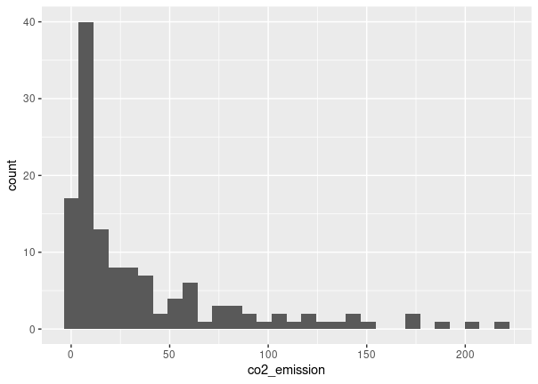<!-- -->

``` r
food_consumption %>%
  # Filter for rice food category
  filter(food_category == "rice")  %>% 
  # Get mean_co2 and median_co2
  summarise(mean_co2 = mean(co2_emission),
            median_co2 = median(co2_emission))
```

| mean_co2 | median_co2 |
|---------:|-----------:|
| 37.59162 |       15.2 |

### Quartiles, quantiles, and quintiles

Quantiles are a great way of summarizing numerical data since they can
be used to measure center and spread, as well as to get a sense of where
a data point stands in relation to the rest of the dataset. For example,
you might want to give a discount to the 10% most active users on a
website.

In this exercise, you’ll calculate quartiles, quintiles, and deciles,
which split up a dataset into 4, 5, and 10 pieces, respectively.

The dplyr package is loaded and food_consumption is available.

``` r
# Calculate the deciles of co2_emission
quantile(food_consumption$co2_emission, probs = seq(0,1,0.1))
```

    ##       0%      10%      20%      30%      40%      50%      60%      70% 
    ##    0.000    0.668    3.540    7.040   11.026   16.530   25.590   44.271 
    ##      80%      90%     100% 
    ##   99.978  203.629 1712.000

### Variance and standard deviation

Variance and standard deviation are two of the most common ways to
measure the spread of a variable, and you’ll practice calculating these
in this exercise. Spread is important since it can help inform
expectations. For example, if a salesperson sells a mean of 20 products
a day, but has a standard deviation of 10 products, there will probably
be days where they sell 40 products, but also days where they only sell
one or two. Information like this is important, especially when making
predictions.

Both dplyr and ggplot2 are loaded, and food_consumption is available.

``` r
# Calculate variance and sd of co2_emission for each food_category
food_consumption %>% 
  group_by(food_category) %>% 
  summarise(var_co2 = var(co2_emission),
            sd_co2 = sd(co2_emission))
```

| food_category |       var_co2 |      sd_co2 |
|:--------------|--------------:|------------:|
| beef          | 88748.4081324 | 297.9067105 |
| eggs          |    21.3718192 |   4.6229665 |
| fish          |   921.6373491 |  30.3584807 |
| lamb_goat     | 16475.5183631 | 128.3569958 |
| dairy         | 17671.8919851 | 132.9356686 |
| nuts          |    35.6396522 |   5.9698955 |
| pork          |  3094.9635372 |  55.6323965 |
| poultry       |   245.0268013 |  15.6533320 |
| rice          |  2281.3762431 |  47.7637545 |
| soybeans      |     0.8798818 |   0.9380202 |
| wheat         |    71.0239365 |   8.4275700 |

``` r
# Plot food_consumption with co2_emission on x-axis
ggplot(food_consumption, aes(co2_emission)) +
  # Create a histogram
  geom_histogram() +
  # Create a separate sub-graph for each food_category
  facet_wrap(~food_category)
```

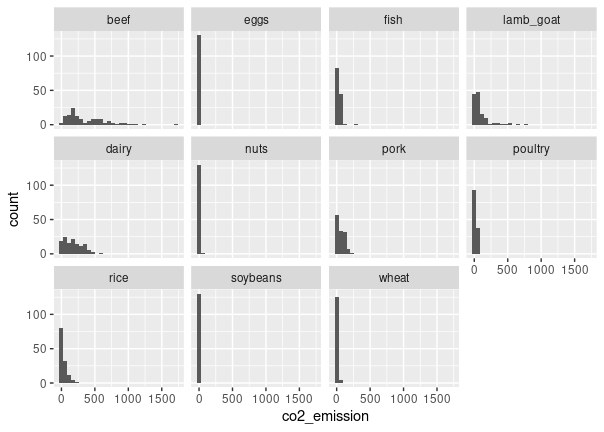<!-- -->

### Finding outliers using IQR

Outliers can have big effects on statistics like mean, as well as
statistics that rely on the mean, such as variance and standard
deviation. Interquartile range, or IQR, is another way of measuring
spread that’s less influenced by outliers. IQR is also often used to
find outliers. If a value is less than or greater than , it’s considered
an outlier. In fact, this is how the lengths of the whiskers in a
ggplot2 box plot are calculated.

``` r
# Calculate total co2_emission per country: emissions_by_country
emissions_by_country <- food_consumption %>%
  group_by(country) %>%
  summarize(total_emission = sum(co2_emission))

# Compute the first and third quartiles and IQR of total_emission
q1 <- quantile(emissions_by_country$total_emission, 0.25)
q3 <- quantile(emissions_by_country$total_emission, 0.75)
iqr <- q3 - q1

# Calculate the lower and upper cutoffs for outliers
lower <- q1 - 1.5 * iqr
upper <- q3 + 1.5 * iqr

# Filter emissions_by_country to find outliers
emissions_by_country %>%
  filter(total_emission<lower | total_emission > upper)
```

| country   | total_emission |
|:----------|---------------:|
| Argentina |         2172.4 |

## More Distributions and the Central Limit Theorem

### Calculating probabilities

You’re in charge of the sales team, and it’s time for performance
reviews, starting with Amir. As part of the review, you want to randomly
select a few of the deals that he’s worked on over the past year so that
you can look at them more deeply. Before you start selecting deals,
you’ll first figure out what the chances are of selecting certain deals.

``` r
amir_deals <- readRDS("seller_1.rds")

# Calculate probability of picking a deal with each product
amir_deals %>%
  count(product) %>%
  mutate(prob = n/sum(n))
```

| product   |   n |      prob |
|:----------|----:|----------:|
| Product A |  23 | 0.1292135 |
| Product B |  62 | 0.3483146 |
| Product C |  15 | 0.0842697 |
| Product D |  40 | 0.2247191 |
| Product E |   5 | 0.0280899 |
| Product F |  11 | 0.0617978 |
| Product G |   2 | 0.0112360 |
| Product H |   8 | 0.0449438 |
| Product I |   7 | 0.0393258 |
| Product J |   2 | 0.0112360 |
| Product N |   3 | 0.0168539 |

### Sampling deals

In the previous exercise, you counted the deals Amir worked on. Now it’s
time to randomly pick five deals so that you can reach out to each
customer and ask if they were satisfied with the service they received.
You’ll try doing this both with and without replacement.

Additionally, you want to make sure this is done randomly and that it
can be reproduced in case you get asked how you chose the deals, so
you’ll need to set the random seed before sampling from the deals.

dplyr is loaded and amir_deals is available.

``` r
# Set random seed to 31
set.seed(31)

# Sample 5 deals with replacement
amir_deals %>%
  sample_n(5, replace = F)
```

| product   | client  | status |  amount | num_users |
|:----------|:--------|:-------|--------:|----------:|
| Product D | Current | Lost   | 3086.88 |        55 |
| Product C | Current | Lost   | 3727.66 |        19 |
| Product D | Current | Lost   | 4274.80 |         9 |
| Product B | Current | Won    | 4965.08 |         9 |
| Product A | Current | Won    | 5827.35 |        50 |

### Creating a probability distribution

A new restaurant opened a few months ago, and the restaurant’s
management wants to optimize its seating space based on the size of the
groups that come most often. On one night, there are 10 groups of people
waiting to be seated at the restaurant, but instead of being called in
the order they arrived, they will be called randomly. In this exercise,
you’ll investigate the probability of groups of different sizes getting
picked first. Data on each of the ten groups is contained in the
restaurant_groups data frame.

Remember that expected value can be calculated by multiplying each
possible outcome with its corresponding probability and taking the sum.
The restaurant_groups data is available and dplyr and ggplot2 are
loaded.

``` r
restaurant_groups <- data.frame(group_id = c("A", "B", "C",
                                             "D", "E", "F", "G", 
                                             "H", "I", "J"),
                                group_size = c(2, 4, 6, 2, 2,
                                               2, 3, 2, 4, 2))

# Create probability distribution
size_distribution <- restaurant_groups %>%
  count(group_size) %>%
  mutate(probability = n / sum(n))

# Calculate expected group size
expected_val <- sum(size_distribution$group_size *
                      size_distribution$probability)
expected_val
```

    ## [1] 2.9

``` r
# Calculate probability of picking group of 4 or more
size_distribution %>%
  # Filter for groups of 4 or larger
  filter(group_size >= 4) %>%
  # Calculate prob_4_or_more by taking sum of probabilities
  summarise(prob_4_or_more = sum(probability))
```

| prob_4\_or_more |
|----------------:|
|             0.3 |

### Data back-ups

The sales software used at your company is set to automatically back
itself up, but no one knows exactly what time the back-ups happen. It is
known, however, that back-ups happen exactly every 30 minutes. Amir
comes back from sales meetings at random times to update the data on the
client he just met with. He wants to know how long he’ll have to wait
for his newly-entered data to get backed up. Use your new knowledge of
continuous uniform distributions to model this situation and answer
Amir’s questions.

``` r
# Min and max wait times for back-up that happens every 30 min
min <- 0
max <- 30

# Calculate probability of waiting less than 5 mins
prob_less_than_5 <- punif(5, min, max)
prob_less_than_5
```

    ## [1] 0.1666667

``` r
# Calculate probability of waiting more than 5 mins
prob_greater_than_5 <- punif(5, min, max, lower.tail = F)
prob_greater_than_5
```

    ## [1] 0.8333333

``` r
# Calculate probability of waiting 10-20 mins
prob_between_10_and_20 <- punif(20, min, max) -  punif(10, min, max)
prob_between_10_and_20
```

    ## [1] 0.3333333

### Simulating wait times

To give Amir a better idea of how long he’ll have to wait, you’ll
simulate Amir waiting 1000 times and create a histogram to show him what
he should expect. Recall from the last exercise that his minimum wait
time is 0 minutes and his maximum wait time is 30 minutes.

A data frame called wait_times is available and dplyr and ggplot2 are
loaded.

``` r
wait_times <- data.frame(simulation_nb = 1:1000)
# Set random seed to 334
set.seed(334)

# Generate 1000 wait times between 0 and 30 mins, save in time column
wait_times %>%
  mutate(time = runif(1000, min = 0, max = 30)) %>%
  # Create a histogram of simulated times
  ggplot(aes(time)) +
  geom_histogram()
```

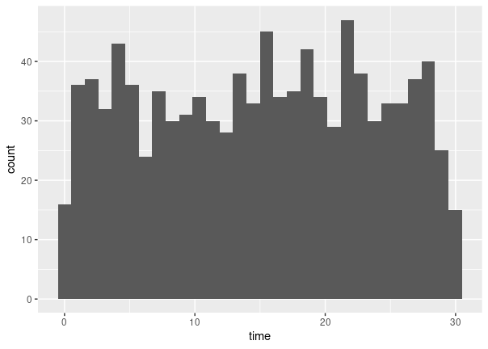<!-- -->

### Simulating sales deals

Assume that Amir usually works on 3 deals per week, and overall, he wins
30% of deals he works on. Each deal has a binary outcome: it’s either
lost, or won, so you can model his sales deals with a binomial
distribution. In this exercise, you’ll help Amir simulate a year’s worth
of his deals so he can better understand his performance.

``` r
# Set random seed to 10
set.seed(10)

# Simulate a single deal
rbinom(1, 1, p = 0.3)
```

    ## [1] 0

``` r
# Simulate 1 week of 3 deals
rbinom(1, 3, p = 0.3)
```

    ## [1] 0

``` r
# Simulate 52 weeks of 3 deals
deals <- rbinom(52, 3, p = 0.3)

# Calculate mean deals won per week
mean(deals)
```

    ## [1] 0.8076923

### Calculating binomial probabilities

Just as in the last exercise, assume that Amir wins 30% of deals. He
wants to get an idea of how likely he is to close a certain number of
deals each week. In this exercise, you’ll calculate what the chances are
of him closing different numbers of deals using the binomial
distribution.

``` r
# Probability of closing 3 out of 3 deals
dbinom(3, 3, p = 0.3)
```

    ## [1] 0.027

``` r
# Probability of closing <= 1 deal out of 3 deals

pbinom(1, 3, p = 0.3)
```

    ## [1] 0.784

``` r
# Probability of closing > 1 deal out of 3 deals
pbinom(1, 3, p = 0.3, lower.tail = F)
```

    ## [1] 0.216

### How many sales will be won?

Now Amir wants to know how many deals he can expect to close each week
if his win rate changes. Luckily, you can use your binomial distribution
knowledge to help him calculate the expected value in different
situations. Recall from the video that the expected value of a binomial
distribution can be calculated by n \* p

``` r
# Expected number won with 30% win rate
won_30pct <- 3 * 0.3
won_30pct
```

    ## [1] 0.9

``` r
# Expected number won with 25% win rate
won_25pct <- 3 * 0.25
won_25pct
```

    ## [1] 0.75

``` r
# Expected number won with 35% win rate
won_35pct <- 3 * 0.35
won_35pct
```

    ## [1] 1.05

## More Distributions and the Central Limit Theorem

### Distribution of Amir’s sales

Since each deal Amir worked on (both won and lost) was different, each
was worth a different amount of money. These values are stored in the
amount column of amir_deals As part of Amir’s performance review, you
want to be able to estimate the probability of him selling different
amounts, but before you can do this, you’ll need to determine what kind
of distribution the amount variable follows.

Both dplyr and ggplot2 are loaded and amir_deals is available.

``` r
source("data.R")
# Histogram of amount with 10 bins
ggplot(amir_deals, aes(amount))+
  geom_histogram(bins = 10)
```

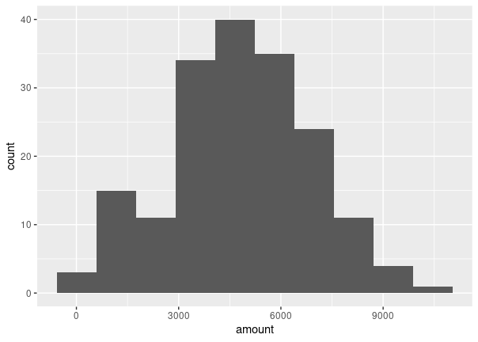<!-- -->

### Probabilities from the normal distribution

Since each deal Amir worked on (both won and lost) was different, each
was worth a different amount of money. These values are stored in the
amount column of amir_deals and follow a normal distribution with a mean
of 5000 dollars and a standard deviation of 2000 dollars. As part of his
performance metrics, you want to calculate the probability of Amir
closing a deal worth various amounts.

``` r
# Probability of deal < 7500
pnorm(7500, mean = 5000, sd = 2000)
```

    ## [1] 0.8943502

``` r
# Probability of deal > 1000

pnorm(1000, mean = 5000, sd = 2000, lower.tail = F)
```

    ## [1] 0.9772499

``` r
# Probability of deal between 3000 and 7000

pnorm(7000, mean = 5000, sd = 2000) -  pnorm(3000, mean = 5000, sd = 2000)
```

    ## [1] 0.6826895

``` r
# Calculate amount that 75% of deals will be more than

qnorm(.75, mean = 5000, sd = 2000, lower.tail = F) 
```

    ## [1] 3651.02

### Simulating sales under new market conditions

The company’s financial analyst is predicting that next quarter, the
worth of each sale will increase by 20% and the volatility, or standard
deviation, of each sale’s worth will increase by 30%. To see what Amir’s
sales might look like next quarter under these new market conditions,
you’ll simulate new sales amounts using the normal distribution and
store these in the new_sales data frame, which has already been created
for you.

``` r
# Calculate new average amount
new_mean <- 5000 * 1.2

# Calculate new standard deviation
new_sd <- 2000 * 1.3


# Simulate 36 sales
new_sales <- new_sales %>% 
  mutate(amount = rnorm(36, new_mean, new_sd))

# Create histogram with 10 bins
ggplot(new_sales, aes(amount))+
  geom_histogram(bins = 10)
```

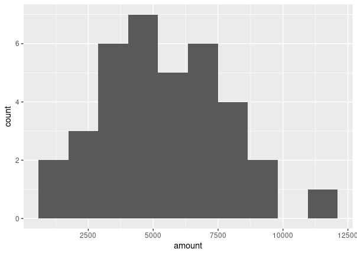<!-- -->

The CLT in action The central limit theorem states that a sampling
distribution of a sample statistic approaches the normal distribution as
you take more samples, no matter the original distribution being sampled
from.

In this exercise, you’ll focus on the sample mean and see the central
limit theorem in action while examining the num_users column of
amir_deals more closely, which contains the number of people who intend
to use the product Amir is selling.

Both dplyr and ggplot2 are loaded and amir_deals is available.

``` r
# Create a histogram of num_users
ggplot(amir_deals, aes(num_users))+
  geom_histogram(bins = 10)
```

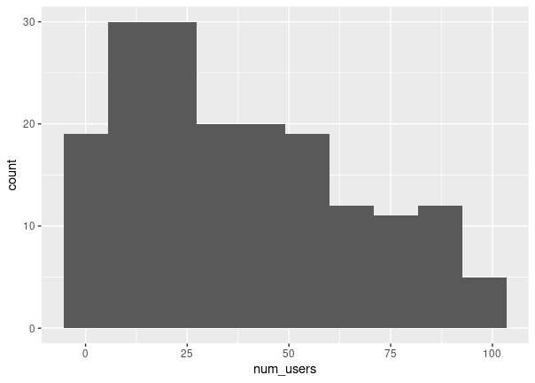<!-- -->

``` r
# Set seed to 104
set.seed(104)

# Sample 20 num_users from amir_deals and take mean
sample(amir_deals$num_users, size = 20, replace = TRUE) %>%
  mean()
```

    ## [1] 30.35

``` r
# Repeat the above 100 times
sample_means <- replicate(1000, sample(amir_deals$num_users,
                                      size = 20, replace = TRUE) %>%
                            mean())

# Create data frame for plotting
samples <- data.frame(mean = sample_means)

# Histogram of sample means
ggplot(samples, aes(mean))+
  geom_histogram(bins = 10)
```

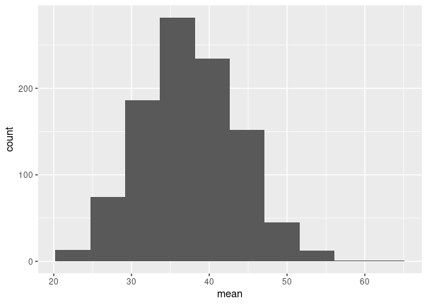<!-- -->

### The mean of means

You want to know what the average number of users (num_users) is per
deal, but you want to know this number for the entire company so that
you can see if Amir’s deals have more or fewer users than the company’s
average deal. The problem is that over the past year, the company has
worked on more than ten thousand deals, so it’s not realistic to compile
all the data. Instead, you’ll estimate the mean by taking several random
samples of deals, since this is much easier than collecting data from
everyone in the company.

The user data for all the company’s deals is available in all_deals.

``` r
# Set seed to 321
set.seed(321)

# Take 30 samples of 20 values of num_users, take mean of each sample
sample_means <- replicate(30, (sample(all_deals$num_users, size = 20)) %>%
  mean())


# Calculate mean of sample_means
mean(sample_means)
```

    ## [1] 37.02667

``` r
# Calculate mean of num_users in amir_deals
mean(amir_deals$num_users)
```

    ## [1] 37.65169

### Tracking lead responses

Your company uses sales software to keep track of new sales leads. It
organizes them into a queue so that anyone can follow up on one when
they have a bit of free time. Since the number of lead responses is a
countable outcome over a period of time, this scenario corresponds to a
Poisson distribution. On average, Amir responds to 4 leads each day. In
this exercise, you’ll calculate probabilities of Amir responding to
different numbers of leads.

``` r
# Probability of 5 responses
#What's the probability that Amir responds to 5 leads in a day, given that he responds to an average of 4?
dpois(5,  lambda = 4)
```

    ## [1] 0.1562935

``` r
# Probability of 5 responses from coworker
#Amir's coworker responds to an average of 5.5 leads per day. What is the probability that she answers 5 leads in a day?
dpois(5,  lambda = 5.5)
```

    ## [1] 0.1714007

``` r
# Probability of 2 or fewer responses
ppois(2,  lambda = 4)
```

    ## [1] 0.2381033

``` r
# Probability of > 10 responses
ppois(10,  lambda = 4, lower.tail = FALSE)
```

    ## [1] 0.002839766

Modeling time between leads To further evaluate Amir’s performance, you
want to know how much time it takes him to respond to a lead after he
opens it. On average, it takes 2.5 hours for him to respond. In this
exercise, you’ll calculate probabilities of different amounts of time
passing between Amir receiving a lead and sending a response.

``` r
# Probability response takes < 1 hour
pexp(1, rate =  1/2.5)
```

    ## [1] 0.32968

``` r
# Probability response takes > 4 hours
pexp(4, rate =  1/2.5, lower.tail = FALSE)
```

    ## [1] 0.2018965

``` r
# Probability response takes 3-4 hours
pexp(4, rate =  1/2.5) - pexp(3, rate =  1/2.5)
```

    ## [1] 0.09929769

## Correlation and Experimental Design

### Relationships between variables

In this chapter, you’ll be working with a dataset world_happiness
containing results from the 2019 World Happiness Report. The report
scores various countries based on how happy people in that country are.
It also ranks each country on various societal aspects such as social
support, freedom, corruption, and others. The dataset also includes the
GDP per capita and life expectancy for each country.

In this exercise, you’ll examine the relationship between a country’s
life expectancy (life_exp) and happiness score (happiness_score) both
visually and quantitatively. Both dplyr and ggplot2 are loaded and
world_happiness is available.

``` r
world_happiness <- readRDS("world_happiness_sugar.rds")
# Add a linear trendline to scatterplot
ggplot(world_happiness, aes(life_exp, happiness_score)) +
  geom_point() +
  geom_smooth(method = "lm",se = F)
```

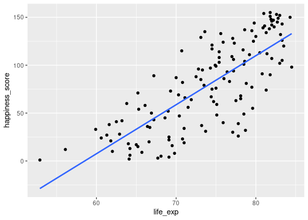<!-- -->

``` r
# Correlation between life_exp and happiness_score
cor(world_happiness$life_exp,world_happiness$happiness_score )
```

    ## [1] 0.7737615

### What can’t correlation measure?

While the correlation coefficient is a convenient way to quantify the
strength of a relationship between two variables, it’s far from perfect.
In this exercise, you’ll explore one of the caveats of the correlation
coefficient by examining the relationship between a country’s GDP per
capita (gdp_per_cap) and happiness score.

Both dplyr and ggplot2 are loaded and world_happiness is available.

``` r
# Scatterplot of gdp_per_cap and life_exp
ggplot(world_happiness, aes(gdp_per_cap, life_exp)) +
  geom_point()
```

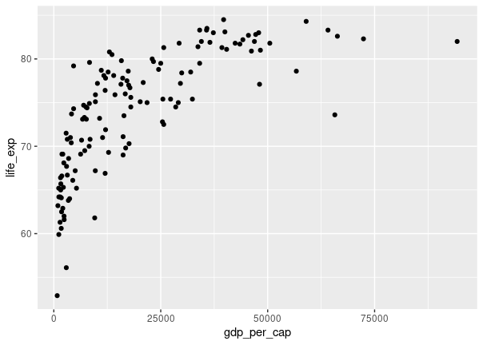<!-- -->

``` r
# Correlation between gdp_per_cap and life_exp
cor(world_happiness$life_exp,world_happiness$gdp_per_cap )
```

    ## [1] 0.7235027

- ***The correlation coefficient can’t account for any relationships
  that aren’t linear, regardless of strength.***

### Transforming variables

When variables have skewed distributions, they often require a
transformation in order to form a linear relationship with another
variable so that correlation can be computed. In this exercise, you’ll
perform a transformation yourself.

Both dplyr and ggplot2 are loaded and world_happiness is available.

``` r
# Scatterplot of happiness_score vs. gdp_per_cap
ggplot(world_happiness, aes(gdp_per_cap, happiness_score)) +
  geom_point()
```

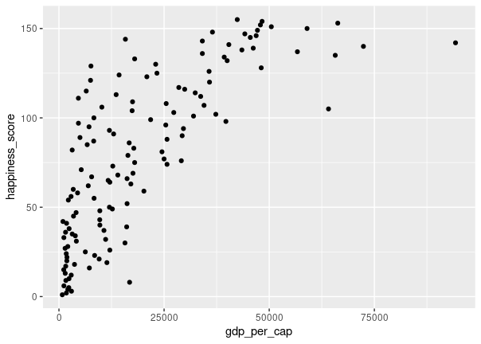<!-- -->

``` r
# Calculate correlation
cor(world_happiness$happiness_score,world_happiness$gdp_per_cap )
```

    ## [1] 0.7601853

``` r
# Create log_gdp_per_cap column
world_happiness <- world_happiness %>%
  mutate(log_gdp_per_cap = log(gdp_per_cap))

# Scatterplot of happiness_score vs. log_gdp_per_cap
ggplot(world_happiness, aes(log_gdp_per_cap, happiness_score)) +
  geom_point()
```

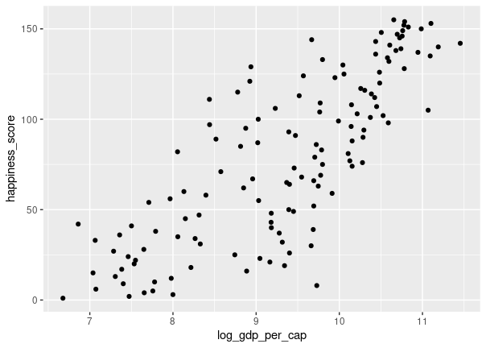<!-- -->

``` r
# Calculate correlation
cor(world_happiness$log_gdp_per_cap,
 world_happiness$happiness_score)
```

    ## [1] 0.7965484

- The relationship between GDP per capita and happiness became more
  linear by applying a log transformation. Log transformations are great
  to use on variables with a skewed distribution, such as GDP.

### Does sugar improve happiness?

A new column has been added to world_happiness called
grams_sugar_per_day, which contains the average amount of sugar eaten
per person per day in each country. In this exercise, you’ll examine the
effect of a country’s average sugar consumption on its happiness score.

Both dplyr and ggplot2 are loaded and world_happiness is available.

``` r
# Scatterplot of grams_sugar_per_day and happiness_score
ggplot(world_happiness, aes(grams_sugar_per_day, happiness_score)) +
  geom_point()
```

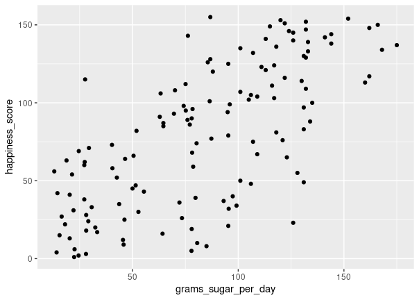<!-- -->

``` r
# Correlation between grams_sugar_per_day and happiness_score
cor(world_happiness$grams_sugar_per_day,
 world_happiness$happiness_score)
```

    ## [1] 0.69391

- If correlation always implied that one thing causes another, people
  may do some nonsensical things, like eat more sugar to be happier.
