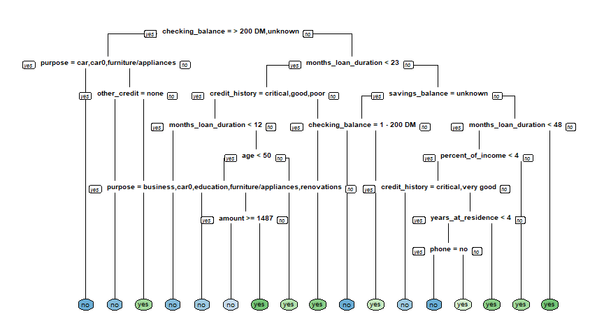
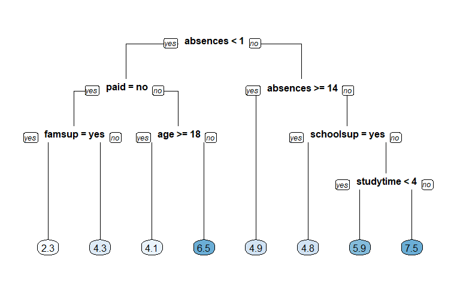
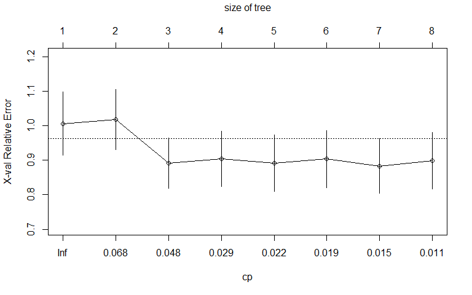
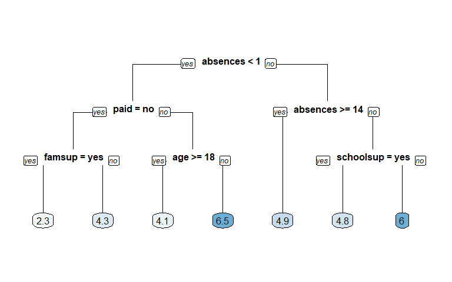
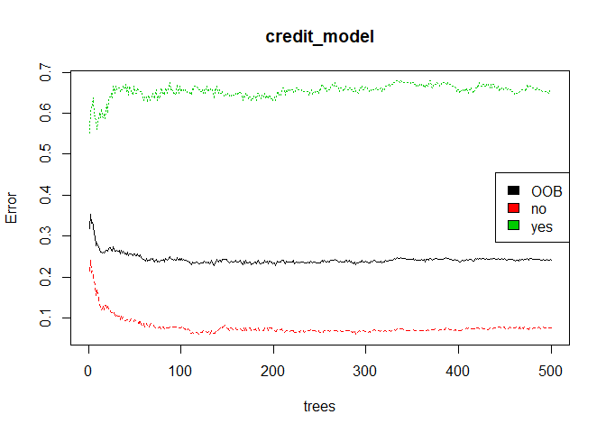
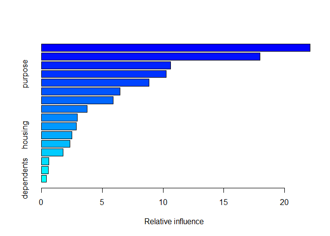
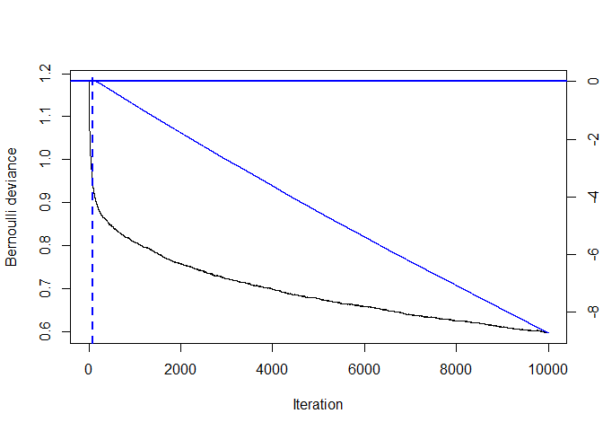
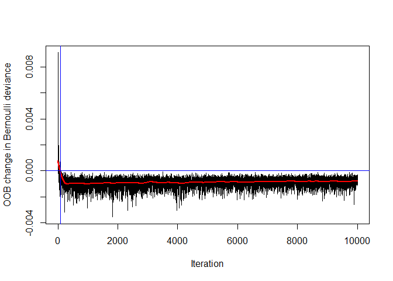
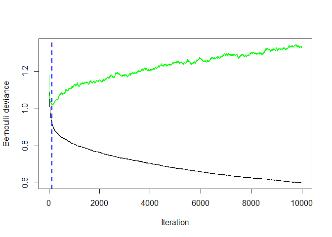
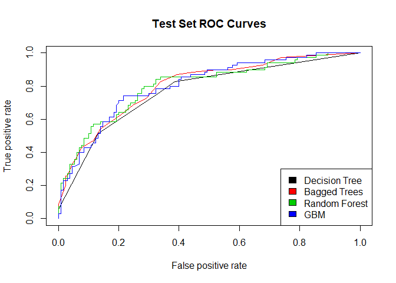

ML with tree based models in r
================
Mburu
4/4/2020

## Build a classification tree

Let’s get started and build our first classification tree. A
classification tree is a decision tree that performs a classification
(vs regression) task. You will train a decision tree model to understand
which loan applications are at higher risk of default using a subset of
the German Credit Dataset. The response variable, called “default”,
indicates whether the loan went into a default or not, which means this
is a binary classification problem (there are just two classes). You
will use the rpart package to fit the decision tree and the rpart.plot
package to visualize the tree.

``` r
# Look at the data
library(tidyverse)
library(rpart)
library(rpart.plot)
credit <- read.csv("credit.csv")

creditsub <- credit[sample(1:nrow(credit), 522),]
str(creditsub)
```

    ## 'data.frame':    522 obs. of  17 variables:
    ##  $ checking_balance    : Factor w/ 4 levels "< 0 DM","> 200 DM",..: 4 4 4 3 2 4 1 4 4 3 ...
    ##  $ months_loan_duration: int  12 12 54 24 15 30 12 12 9 24 ...
    ##  $ credit_history      : Factor w/ 5 levels "critical","good",..: 1 4 3 1 2 1 2 2 1 2 ...
    ##  $ purpose             : Factor w/ 6 levels "business","car",..: 5 2 2 3 4 5 5 2 4 3 ...
    ##  $ amount              : int  1935 1503 9436 11938 392 4530 708 1413 1244 11328 ...
    ##  $ savings_balance     : Factor w/ 5 levels "< 100 DM","> 1000 DM",..: 1 1 5 1 1 1 1 2 5 1 ...
    ##  $ employment_duration : Factor w/ 5 levels "< 1 year","> 7 years",..: 2 3 3 3 1 4 3 4 2 3 ...
    ##  $ percent_of_income   : int  4 4 2 2 4 4 2 3 4 2 ...
    ##  $ years_at_residence  : int  4 4 2 3 4 4 3 2 4 3 ...
    ##  $ age                 : int  43 41 39 39 23 26 38 55 41 29 ...
    ##  $ other_credit        : Factor w/ 3 levels "bank","none",..: 2 2 2 2 2 2 2 2 2 1 ...
    ##  $ housing             : Factor w/ 3 levels "other","own",..: 2 3 2 2 3 3 2 2 3 2 ...
    ##  $ existing_loans_count: int  3 1 1 2 1 1 1 1 2 2 ...
    ##  $ job                 : Factor w/ 4 levels "management","skilled",..: 2 2 4 1 2 1 4 2 4 1 ...
    ##  $ dependents          : int  1 1 2 2 1 1 2 1 1 1 ...
    ##  $ phone               : Factor w/ 2 levels "no","yes": 2 1 1 2 2 2 1 1 1 2 ...
    ##  $ default             : Factor w/ 2 levels "no","yes": 1 1 1 2 1 1 1 1 1 2 ...

``` r
# Create the model
credit_model <- rpart(formula = default ~ ., 
                      data = creditsub, 
                      method = "class")

# Display the results
rpart.plot(x = credit_model, yesno = 2, type = 0, extra = 0)
```

<!-- -->

## Train/test split

For this exercise, you’ll randomly split the German Credit Dataset into
two pieces: a training set (80%) called credit\_train and a test set
(20%) that we will call credit\_test. We’ll use these two sets
throughout the chapter.

``` r
# Total number of rows in the credit data frame
n <- nrow(credit)

# Number of rows for the training set (80% of the dataset)
n_train <- round(.8 * n) 

# Create a vector of indices which is an 80% random sample
set.seed(123)
train_indices <- sample(1:n, n_train)

# Subset the credit data frame to training indices only
credit_train <- credit[train_indices, ]  
  
# Exclude the training indices to create the test set
credit_test <- credit[-train_indices, ]  

# Train the model (to predict 'default')
credit_model <- rpart(formula = default ~., 
                      data = credit_train, 
                      method = "class")

# Look at the model output                      
print(credit_model)
```

    ## n= 800 
    ## 
    ## node), split, n, loss, yval, (yprob)
    ##       * denotes terminal node
    ## 
    ##   1) root 800 230 no (0.7125000 0.2875000)  
    ##     2) checking_balance=> 200 DM,unknown 365  48 no (0.8684932 0.1315068) *
    ##     3) checking_balance=< 0 DM,1 - 200 DM 435 182 no (0.5816092 0.4183908)  
    ##       6) months_loan_duration< 22.5 259  85 no (0.6718147 0.3281853)  
    ##        12) credit_history=critical,good,poor 235  68 no (0.7106383 0.2893617)  
    ##          24) months_loan_duration< 11.5 70  11 no (0.8428571 0.1571429) *
    ##          25) months_loan_duration>=11.5 165  57 no (0.6545455 0.3454545)  
    ##            50) amount>=1282 112  30 no (0.7321429 0.2678571) *
    ##            51) amount< 1282 53  26 yes (0.4905660 0.5094340)  
    ##             102) purpose=business,education,furniture/appliances 34  12 no (0.6470588 0.3529412) *
    ##             103) purpose=car,renovations 19   4 yes (0.2105263 0.7894737) *
    ##        13) credit_history=perfect,very good 24   7 yes (0.2916667 0.7083333) *
    ##       7) months_loan_duration>=22.5 176  79 yes (0.4488636 0.5511364)  
    ##        14) savings_balance=> 1000 DM,unknown 29   7 no (0.7586207 0.2413793) *
    ##        15) savings_balance=< 100 DM,100 - 500 DM,500 - 1000 DM 147  57 yes (0.3877551 0.6122449)  
    ##          30) months_loan_duration< 47.5 119  54 yes (0.4537815 0.5462185)  
    ##            60) amount>=2313.5 93  45 no (0.5161290 0.4838710)  
    ##             120) amount< 3026 19   5 no (0.7368421 0.2631579) *
    ##             121) amount>=3026 74  34 yes (0.4594595 0.5405405)  
    ##               242) percent_of_income< 2.5 38  15 no (0.6052632 0.3947368)  
    ##                 484) purpose=business,car,education 23   6 no (0.7391304 0.2608696) *
    ##                 485) purpose=car0,furniture/appliances,renovations 15   6 yes (0.4000000 0.6000000) *
    ##               243) percent_of_income>=2.5 36  11 yes (0.3055556 0.6944444) *
    ##            61) amount< 2313.5 26   6 yes (0.2307692 0.7692308) *
    ##          31) months_loan_duration>=47.5 28   3 yes (0.1071429 0.8928571) *

## Compute confusion matrix

As discussed in the previous video, there are a number of different
metrics by which you can measure the performance of a classification
model. In this exercise, we will evaluate the performance of the model
using test set classification error. A confusion matrix is a convenient
way to examine the per-class error rates for all classes at once. The
confusionMatrix() function from the caret package prints both the
confusion matrix and a number of other useful classification metrics
such as “Accuracy” (fraction of correctly classified instances). The
caret package has been loaded for you.

``` r
library(caret)
# Generate predicted classes using the model object
class_prediction <- predict(object = credit_model,  
                        newdata = credit_test,   
                        type = "class")  
                            
# Calculate the confusion matrix for the test set
confusionMatrix(data = class_prediction,       
                reference = credit_test$default, positive = "yes")  
```

    ## Confusion Matrix and Statistics
    ## 
    ##           Reference
    ## Prediction  no yes
    ##        no  117  44
    ##        yes  13  26
    ##                                           
    ##                Accuracy : 0.715           
    ##                  95% CI : (0.6471, 0.7764)
    ##     No Information Rate : 0.65            
    ##     P-Value [Acc > NIR] : 0.03046         
    ##                                           
    ##                   Kappa : 0.3023          
    ##                                           
    ##  Mcnemar's Test P-Value : 7.08e-05        
    ##                                           
    ##             Sensitivity : 0.3714          
    ##             Specificity : 0.9000          
    ##          Pos Pred Value : 0.6667          
    ##          Neg Pred Value : 0.7267          
    ##              Prevalence : 0.3500          
    ##          Detection Rate : 0.1300          
    ##    Detection Prevalence : 0.1950          
    ##       Balanced Accuracy : 0.6357          
    ##                                           
    ##        'Positive' Class : yes             
    ## 

## Compare models with a different splitting criterion

Train two models that use a different splitting criterion and use the
validation set to choose a “best” model from this group. To do this
you’ll use the parms argument of the rpart() function. This argument
takes a named list that contains values of different parameters you can
use to change how the model is trained. Set the parameter split to
control the splitting criterion.

``` r
# Train a gini-based model
credit_model1 <- rpart(formula = default ~ ., 
                       data = credit_train, 
                       method = "class",
                       parms = list(split = "gini"))

# Train an information-based model
credit_model2 <- rpart(formula = default ~ ., 
                       data = credit_train, 
                       method = "class",
                       parms = list(split = "information"))

# Generate predictions on the validation set using the gini model
pred1 <- predict(object = credit_model1, 
             newdata = credit_test,
             type = "class")    

# Generate predictions on the validation set using the information model
pred2 <- predict(object = credit_model2, 
             newdata = credit_test,
             type = "class") 

dt_preds <- predict(object = credit_model2, 
             newdata = credit_test,
             type = "prob") 

# Compare classification error
library(Metrics)
ce(actual = credit_test$default, 
   predicted = pred1)
```

    ## [1] 0.285

``` r
ce(actual = credit_test$default, 
   predicted = pred2)  
```

    ## [1] 0.285

## The response is final\_grade (numeric: from 0 to 20, output target).

After initial exploration, split the data into training, validation, and
test sets. In this chapter, we will introduce the idea of a validation
set, which can be used to select a “best” model from a set of competing
models. In Chapter 1, we demonstrated a simple way to split the data
into two pieces using the sample() function. In this exercise, we will
take a slightly different approach to splitting the data that allows us
to split the data into more than two parts (here, we want three: train,
validation, test). We still use the sample() function, but instead of
sampling the indices themselves, we will assign each row to either the
training, validation or test sets according to a probability
distribution. The dataset grade is already in your workspace.

``` r
grade <- read.csv("grade.csv")
# Look at the data
str(grade)
```

    ## 'data.frame':    395 obs. of  8 variables:
    ##  $ final_grade: num  3 3 5 7.5 5 7.5 5.5 3 9.5 7.5 ...
    ##  $ age        : int  18 17 15 15 16 16 16 17 15 15 ...
    ##  $ address    : Factor w/ 2 levels "R","U": 2 2 2 2 2 2 2 2 2 2 ...
    ##  $ studytime  : int  2 2 2 3 2 2 2 2 2 2 ...
    ##  $ schoolsup  : Factor w/ 2 levels "no","yes": 2 1 2 1 1 1 1 2 1 1 ...
    ##  $ famsup     : Factor w/ 2 levels "no","yes": 1 2 1 2 2 2 1 2 2 2 ...
    ##  $ paid       : Factor w/ 2 levels "no","yes": 1 1 2 2 2 2 1 1 2 2 ...
    ##  $ absences   : int  6 4 10 2 4 10 0 6 0 0 ...

``` r
# Set seed and create assignment
set.seed(1)
assignment <- sample(1:3, size = nrow(grade), prob = c(.7, .15, .15), replace = TRUE)

# Create a train, validation and tests from the original data frame 
grade_train <- grade[assignment == 1, ]    # subset grade to training indices only
grade_valid <- grade[assignment == 2, ]  # subset grade to validation indices only
grade_test <- grade[assignment == 3, ]   # subset grade to test indices only
```

## Train a regression tree model

In this exercise, we will use the grade\_train dataset to fit a
regression tree using rpart() and visualize it using rpart.plot(). A
regression tree plot looks identical to a classification tree plot, with
the exception that there will be numeric values in the leaf nodes
instead of predicted classes. This is very similar to what we did
previously in Chapter 1. When fitting a classification tree, we use
method = “class”, however, when fitting a regression tree, we need to
set method = “anova”. By default, the rpart() function will make an
intelligent guess as to what the method value should be based on the
data type of your response column, but it’s recommened that you
explictly set the method for reproducibility reasons (since the
auto-guesser may change in the future). The grade\_train training set is
loaded into the workspace.

``` r
# Train the model
grade_model <- rpart(formula = final_grade ~ ., 
                     data = grade_train, 
                     method = "anova")

# Look at the model output                      
print(grade_model)
```

    ## n= 282 
    ## 
    ## node), split, n, deviance, yval
    ##       * denotes terminal node
    ## 
    ##  1) root 282 1519.49700 5.271277  
    ##    2) absences< 0.5 82  884.18600 4.323171  
    ##      4) paid=no 50  565.50500 3.430000  
    ##        8) famsup=yes 22  226.36360 2.272727 *
    ##        9) famsup=no 28  286.52680 4.339286 *
    ##      5) paid=yes 32  216.46880 5.718750  
    ##       10) age>=17.5 10   82.90000 4.100000 *
    ##       11) age< 17.5 22   95.45455 6.454545 *
    ##    3) absences>=0.5 200  531.38000 5.660000  
    ##      6) absences>=13.5 42  111.61900 4.904762 *
    ##      7) absences< 13.5 158  389.43670 5.860759  
    ##       14) schoolsup=yes 23   50.21739 4.847826 *
    ##       15) schoolsup=no 135  311.60000 6.033333  
    ##         30) studytime< 3.5 127  276.30710 5.940945 *
    ##         31) studytime>=3.5 8   17.00000 7.500000 *

``` r
# Plot the tree model
rpart.plot(x = grade_model, yesno = 2, type = 0, extra = 0)
```

<!-- -->

## Evaluate a regression tree model

Predict the final grade for all students in the test set. The grade is
on a 0-20 scale. Evaluate the model based on test set RMSE (Root Mean
Squared Error). RMSE tells us approximately how far away our predictions
are from the true values.

``` r
# Generate predictions on a test set
pred <- predict(object = grade_model,   # model object 
                newdata = grade_test)  # test dataset

# Compute the RMSE
rmse(actual = grade_test$final_grade, 
     predicted = pred)
```

    ## [1] 2.278249

## Tuning the model

Tune (or “trim”) the model using the prune() function by finding the
best “CP” value (CP stands for “Complexity Parameter”).

``` r
# Plot the "CP Table"
plotcp(grade_model)
```

<!-- -->

``` r
# Print the "CP Table"
print(grade_model$cptable)
```

    ##           CP nsplit rel error    xerror       xstd
    ## 1 0.06839852      0 1.0000000 1.0066743 0.09169976
    ## 2 0.06726713      1 0.9316015 1.0185398 0.08663026
    ## 3 0.03462630      2 0.8643344 0.8923588 0.07351895
    ## 4 0.02508343      3 0.8297080 0.9046335 0.08045100
    ## 5 0.01995676      4 0.8046246 0.8920489 0.08153881
    ## 6 0.01817661      5 0.7846679 0.9042142 0.08283114
    ## 7 0.01203879      6 0.7664912 0.8833557 0.07945742
    ## 8 0.01000000      7 0.7544525 0.8987112 0.08200148

``` r
# Retrieve optimal cp value based on cross-validated error
opt_index <- which.min(grade_model$cptable[, "xerror"])
cp_opt <- grade_model$cptable[opt_index, "CP"]

# Prune the model (to optimized cp value)
grade_model_opt <- prune(tree = grade_model, 
                         cp = cp_opt)
                          
# Plot the optimized model
rpart.plot(x = grade_model_opt, yesno = 2, type = 0, extra = 0)
```

<!-- -->

## Generate a grid of hyperparameter values

Use expand.grid() to generate a grid of maxdepth and minsplit values.

``` r
# Establish a list of possible values for minsplit and maxdepth
minsplit <- seq(1, 4, 1)
maxdepth <- seq(1, 6, 1)

# Create a data frame containing all combinations 
hyper_grid <- expand.grid(minsplit = minsplit, maxdepth = maxdepth)

# Check out the grid
head(hyper_grid)
```

    ##   minsplit maxdepth
    ## 1        1        1
    ## 2        2        1
    ## 3        3        1
    ## 4        4        1
    ## 5        1        2
    ## 6        2        2

``` r
# Print the number of grid combinations
nrow(hyper_grid)
```

    ## [1] 24

## Generate a grid of models

In this exercise, we will write a simple loop to train a “grid” of
models and store the models in a list called grade\_models. R users who
are familiar with the apply functions in R could think about how this
loop could be easily converted into a function applied to a list as an
extra-credit thought experiment.

``` r
# Number of potential models in the grid
num_models <- nrow(hyper_grid)

# Create an empty list to store models
grade_models <- list()

# Write a loop over the rows of hyper_grid to train the grid of models
for (i in 1:num_models) {

    # Get minsplit, maxdepth values at row i
    minsplit <- hyper_grid$minsplit[i]
    maxdepth <- hyper_grid$maxdepth[i]

    # Train a model and store in the list
    grade_models[[i]] <- rpart(formula = final_grade ~ ., 
                               data = grade_train, 
                               method = "anova",
                               minsplit = minsplit,
                               maxdepth = maxdepth)
}
```

Evaluate the grid Earlier in the chapter we split the dataset into three
parts: training, validation and test.

A dataset that is not used in training is sometimes referred to as a
“holdout” set. A holdout set is used to estimate model performance and
although both validation and test sets are considered to be holdout
data, there is a key difference:

Just like a test set, a validation set is used to evaluate the
performance of a model. The difference is that a validation set is
specifically used to compare the performance of a group of models with
the goal of choosing a “best model” from the group. All the models in a
group are evaluated on the same validation set and the model with the
best performance is considered to be the winner. Once you have the best
model, a final estimate of performance is computed on the test set. A
test set should only ever be used to estimate model performance and
should not be used in model selection. Typically if you use a test set
more than once, you are probably doing something wrong.

``` r
# Number of potential models in the grid
num_models <- length(grade_models)

# Create an empty vector to store RMSE values
rmse_values <- c()

# Write a loop over the models to compute validation RMSE
for (i in 1:num_models) {

    # Retrieve the i^th model from the list
    model <- grade_models[[i]]
    
    # Generate predictions on grade_valid 
    pred <- predict(object = model,
                    newdata = grade_valid)
    
    # Compute validation RMSE and add to the 
    rmse_values[i] <- rmse(actual = grade_valid$final_grade, 
                           predicted = pred)
}

# Identify the model with smallest validation set RMSE
best_model <- grade_models[[which.min(rmse_values)]]

# Print the model paramters of the best model
best_model$control
```

    ## $minsplit
    ## [1] 2
    ## 
    ## $minbucket
    ## [1] 1
    ## 
    ## $cp
    ## [1] 0.01
    ## 
    ## $maxcompete
    ## [1] 4
    ## 
    ## $maxsurrogate
    ## [1] 5
    ## 
    ## $usesurrogate
    ## [1] 2
    ## 
    ## $surrogatestyle
    ## [1] 0
    ## 
    ## $maxdepth
    ## [1] 1
    ## 
    ## $xval
    ## [1] 10

``` r
# Compute test set RMSE on best_model
pred <- predict(object = best_model,
                newdata = grade_test)
rmse(actual = grade_test$final_grade, 
     predicted = pred)
```

    ## [1] 2.124109

## Train a bagged tree model

Let’s start by training a bagged tree model. You’ll be using the
bagging() function from the ipred package. The number of bagged trees
can be specified using the nbagg parameter, but here we will use the
default (25). If we want to estimate the model’s accuracy using the
“out-of-bag” (OOB) samples, we can set the the coob parameter to TRUE.
The OOB samples are the training obsevations that were not selected into
the bootstrapped sample (used in training). Since these observations
were not used in training, we can use them instead to evaluate the
accuracy of the model (done automatically inside the bagging()
function).

``` r
library(ipred)
# Bagging is a randomized model, so let's set a seed (123) for reproducibility
set.seed(123)

# Train a bagged model
credit_model <- bagging(formula = default ~ ., 
                        data = credit_train,
                        coob = TRUE)

# Print the model
print(credit_model)
```

    ## 
    ## Bagging classification trees with 25 bootstrap replications 
    ## 
    ## Call: bagging.data.frame(formula = default ~ ., data = credit_train, 
    ##     coob = TRUE)
    ## 
    ## Out-of-bag estimate of misclassification error:  0.2537

## Prediction and confusion matrix

As you saw in the video, a confusion matrix is a very useful tool for
examining all possible outcomes of your predictions (true positive, true
negative, false positive, false negative). In this exercise, you will
predict those who will default using bagged trees. You will also create
the confusion matrix using the confusionMatrix() function from the caret
package. It’s always good to take a look at the output using the print()
function.

``` r
# Generate predicted classes using the model object
class_prediction <- predict(object = credit_model,    
                            newdata = credit_test,  
                            type = "class")  # return classification labels

# Print the predicted classes
print(class_prediction)
```

    ##   [1] no  no  no  no  yes no  no  no  no  no  no  no  no  yes no  no  no 
    ##  [18] no  no  no  yes no  no  no  no  no  yes no  no  no  no  no  no  no 
    ##  [35] no  no  yes yes no  yes no  yes no  no  no  no  no  no  no  yes no 
    ##  [52] yes no  yes yes no  yes no  yes no  no  yes no  no  yes yes no  yes
    ##  [69] no  no  no  yes yes no  no  no  no  no  no  yes no  no  no  no  yes
    ##  [86] no  no  yes no  no  no  no  no  yes yes no  no  no  no  no  no  yes
    ## [103] no  no  yes no  no  no  no  no  no  no  no  no  no  no  no  no  no 
    ## [120] no  yes no  yes no  no  yes yes no  yes no  no  no  no  no  yes no 
    ## [137] yes yes no  no  no  no  yes no  no  no  yes no  no  no  no  yes no 
    ## [154] no  no  no  no  no  no  yes no  no  yes no  yes no  no  no  no  no 
    ## [171] no  no  no  no  no  no  no  no  no  no  no  no  yes yes yes no  yes
    ## [188] no  no  no  no  no  yes no  no  no  yes no  no  yes
    ## Levels: no yes

``` r
# Calculate the confusion matrix for the test set
confusionMatrix(data =  class_prediction,     
                reference =  credit_test$default, positive = "yes")  
```

    ## Confusion Matrix and Statistics
    ## 
    ##           Reference
    ## Prediction  no yes
    ##        no  119  33
    ##        yes  11  37
    ##                                           
    ##                Accuracy : 0.78            
    ##                  95% CI : (0.7161, 0.8354)
    ##     No Information Rate : 0.65            
    ##     P-Value [Acc > NIR] : 4.557e-05       
    ##                                           
    ##                   Kappa : 0.4787          
    ##                                           
    ##  Mcnemar's Test P-Value : 0.001546        
    ##                                           
    ##             Sensitivity : 0.5286          
    ##             Specificity : 0.9154          
    ##          Pos Pred Value : 0.7708          
    ##          Neg Pred Value : 0.7829          
    ##              Prevalence : 0.3500          
    ##          Detection Rate : 0.1850          
    ##    Detection Prevalence : 0.2400          
    ##       Balanced Accuracy : 0.7220          
    ##                                           
    ##        'Positive' Class : yes             
    ## 

## Predict on a test set and compute AUC

In binary classification problems, we can predict numeric values instead
of class labels. In fact, class labels are created only after you use
the model to predict a raw, numeric, predicted value for a test point.
The predicted label is generated by applying a threshold to the
predicted value, such that all tests points with predicted value greater
than that threshold get a predicted label of “1” and, points below that
threshold get a predicted label of “0”. In this exercise, generate
predicted values (rather than class labels) on the test set and evaluate
performance based on AUC (Area Under the ROC Curve). The AUC is a common
metric for evaluating the discriminatory ability of a binary
classification model.

``` r
# Generate predictions on the test set
pred <- predict(object = credit_model,
                newdata = credit_test,
                type = "prob")

# `pred` is a matrix
class(pred)
```

    ## [1] "matrix"

``` r
# Look at the pred format
head(pred)
```

    ##        no  yes
    ## [1,] 0.92 0.08
    ## [2,] 0.92 0.08
    ## [3,] 1.00 0.00
    ## [4,] 1.00 0.00
    ## [5,] 0.16 0.84
    ## [6,] 0.84 0.16

``` r
# Compute the AUC (`actual` must be a binary (or 1/0 numeric) vector)
credit_ipred_model_test_auc <- auc(actual = ifelse(credit_test$default == "yes", 1, 0), 
    predicted = pred[,"yes"])  

credit_ipred_model_test_auc
```

    ## [1] 0.8084066

## Cross-validate a bagged tree model in caret

Use caret::train() with the “treebag” method to train a model and
evaluate the model using cross-validated AUC. The caret package allows
the user to easily cross-validate any model across any relevant
performance metric. In this case, we will use 5-fold cross validation
and evaluate cross-validated AUC (Area Under the ROC Curve).

``` r
# Specify the training configuration
ctrl_bag <- trainControl(method = "cv",     # Cross-validation
                     number = 5,      # 5 folds
                     classProbs = TRUE,                  # For AUC
                     summaryFunction = twoClassSummary)  # For AUC

# Cross validate the credit model using "treebag" method; 
# Track AUC (Area under the ROC curve)
set.seed(1)  # for reproducibility
credit_caret_model <- train(default ~ .,
                            data = credit_train, 
                            method = "treebag",
                            metric = "ROC",
                            trControl = ctrl_bag)

# Look at the model object
print(credit_caret_model)
```

    ## Bagged CART 
    ## 
    ## 800 samples
    ##  16 predictor
    ##   2 classes: 'no', 'yes' 
    ## 
    ## No pre-processing
    ## Resampling: Cross-Validated (5 fold) 
    ## Summary of sample sizes: 640, 640, 640, 640, 640 
    ## Resampling results:
    ## 
    ##   ROC        Sens       Spec     
    ##   0.7309497  0.8789474  0.4086957

``` r
# Inspect the contents of the model list 
names(credit_caret_model)
```

    ##  [1] "method"       "modelInfo"    "modelType"    "results"     
    ##  [5] "pred"         "bestTune"     "call"         "dots"        
    ##  [9] "metric"       "control"      "finalModel"   "preProcess"  
    ## [13] "trainingData" "resample"     "resampledCM"  "perfNames"   
    ## [17] "maximize"     "yLimits"      "times"        "levels"      
    ## [21] "terms"        "coefnames"    "contrasts"    "xlevels"

``` r
# Print the CV AUC
credit_caret_model$results[,"ROC"]
```

    ## [1] 0.7309497

## Generate predictions from the caret model

Generate predictions on a test set for the caret model.

``` r
# Generate predictions on the test set
bag_preds <- predict(object = credit_caret_model, 
                newdata = credit_test,
                type = "prob")

# Compute the AUC (`actual` must be a binary (or 1/0 numeric) vector)
credit_caret_model_test_auc <- auc(actual = ifelse(credit_test$default == "yes", 1, 0), 
                    predicted = pred[,"yes"])

credit_caret_model_test_auc
```

    ## [1] 0.8084066

## Compare test set performance to CV performance

In this excercise, you will print test set AUC estimates that you
computed in previous exercises. These two methods use the same code
underneath, so the estimates should be very similar.

The credit\_ipred\_model\_test\_auc object stores the test set AUC from
the model trained using the ipred::bagging() function. The
credit\_caret\_model\_test\_auc object stores the test set AUC from the
model trained using the caret::train() function with method = “treebag”.
Lastly, we will print the 5-fold cross-validated estimate of AUC that is
stored within the credit\_caret\_model object. This number will be a
more accurate estimate of the true model performance since we have
averaged the performance over five models instead of just one.

On small datasets like this one, the difference between test set model
performance estimates and cross-validated model performance estimates
will tend to be more pronounced. When using small data, it’s recommended
to use cross-validated estimates of performance because they are more
stable.

``` r
# Print ipred::bagging test set AUC estimate
print(credit_ipred_model_test_auc)
```

    ## [1] 0.8084066

``` r
# Print caret "treebag" test set AUC estimate
print(credit_caret_model_test_auc)
```

    ## [1] 0.8084066

``` r
# Compare to caret 5-fold cross-validated AUC
credit_caret_model$results[, "ROC"]
```

    ## [1] 0.7309497

## Train a Random Forest model

Here you will use the randomForest() function from the randomForest
package to train a Random Forest classifier to predict loan default.

``` r
library(randomForest)
# Train a Random Forest
set.seed(1)  # for reproducibility
credit_model <- randomForest(formula = default ~ ., 
                             data = credit_train)
                             
# Print the model output                             
print(credit_model)
```

    ## 
    ## Call:
    ##  randomForest(formula = default ~ ., data = credit_train) 
    ##                Type of random forest: classification
    ##                      Number of trees: 500
    ## No. of variables tried at each split: 4
    ## 
    ##         OOB estimate of  error rate: 24.12%
    ## Confusion matrix:
    ##      no yes class.error
    ## no  527  43   0.0754386
    ## yes 150  80   0.6521739

## Evaluate out-of-bag error

Here you will plot the OOB error as a function of the number of trees
trained, and extract the final OOB error of the Random Forest model from
the trained model object.

``` r
# Grab OOB error matrix & take a look
err <- credit_model$err.rate
head(err)
```

    ##            OOB        no       yes
    ## [1,] 0.3170732 0.2150000 0.5517241
    ## [2,] 0.3525641 0.2400000 0.6083916
    ## [3,] 0.3310924 0.2091346 0.6145251
    ## [4,] 0.3333333 0.2154812 0.6192893
    ## [5,] 0.3264746 0.1992263 0.6367925
    ## [6,] 0.3040000 0.1872659 0.5925926

``` r
# Look at final OOB error rate (last row in err matrix)
oob_err <- err[nrow(err), "OOB"]
print(oob_err)
```

    ##     OOB 
    ## 0.24125

``` r
# Plot the model trained in the previous exercise
plot(credit_model)

# Add a legend since it doesn't have one by default
legend(x = "right", 
       legend = colnames(err),
       fill = 1:ncol(err))
```

<!-- -->

## Evaluate model performance on a test set

Use the caret::confusionMatrix() function to compute test set accuracy
and generate a confusion matrix. Compare the test set accuracy to the
OOB accuracy.

``` r
# Generate predicted classes using the model object
class_prediction <- predict(object = credit_model,   # model object 
                            newdata = credit_test,  # test dataset
                            type = "class") # return classification labels
                            
# Calculate the confusion matrix for the test set
cm <- confusionMatrix(data = class_prediction,       # predicted classes
                      reference = credit_test$default, positive = "yes")  # actual classes
print(cm)
```

    ## Confusion Matrix and Statistics
    ## 
    ##           Reference
    ## Prediction  no yes
    ##        no  123  40
    ##        yes   7  30
    ##                                        
    ##                Accuracy : 0.765        
    ##                  95% CI : (0.7, 0.8219)
    ##     No Information Rate : 0.65         
    ##     P-Value [Acc > NIR] : 0.0002983    
    ##                                        
    ##                   Kappa : 0.4205       
    ##                                        
    ##  Mcnemar's Test P-Value : 3.046e-06    
    ##                                        
    ##             Sensitivity : 0.4286       
    ##             Specificity : 0.9462       
    ##          Pos Pred Value : 0.8108       
    ##          Neg Pred Value : 0.7546       
    ##              Prevalence : 0.3500       
    ##          Detection Rate : 0.1500       
    ##    Detection Prevalence : 0.1850       
    ##       Balanced Accuracy : 0.6874       
    ##                                        
    ##        'Positive' Class : yes          
    ## 

``` r
# Compare test set accuracy to OOB accuracy
paste0("Test Accuracy: ", cm$overall[1])
```

    ## [1] "Test Accuracy: 0.765"

``` r
paste0("OOB Accuracy: ", 1 - oob_err)
```

    ## [1] "OOB Accuracy: 0.75875"

## Advantage of OOB error

What is the main advantage of using OOB error instead of validation or
test error? - If you evaluate your model using OOB error, then you don’t
need to create a separate test set

## Evaluate test set AUC

In Chapter 3, we learned about the AUC metric for evaluating binary
classification models. In this exercise, you will compute test set AUC
for the Random Forest model.

``` r
# Generate predictions on the test set
pred <- predict(object = credit_model,
            newdata = credit_test,
            type = "prob")

# `pred` is a matrix
class(pred)
```

    ## [1] "matrix" "votes"

``` r
# Look at the pred format
head(pred)
```

    ##       no   yes
    ## 1  0.904 0.096
    ## 3  0.902 0.098
    ## 7  1.000 0.000
    ## 9  0.970 0.030
    ## 12 0.216 0.784
    ## 22 0.826 0.174

``` r
# Compute the AUC (`actual` must be a binary 1/0 numeric vector)
auc(actual = ifelse(credit_test$default == "yes", 1, 0), 
    predicted = pred[,"yes"])                    
```

    ## [1] 0.8187363

## Tuning a Random Forest via mtry

In this exercise, you will use the randomForest::tuneRF() to tune mtry
(by training several models). This function is a specific utility to
tune the mtry parameter based on OOB error, which is helpful when you
want a quick & easy way to tune your model. A more generic way of tuning
Random Forest parameters will be presented in the following exercise.

``` r
# Execute the tuning process
set.seed(1)              
res <- tuneRF(x = subset(credit_train, select = -default),
              y = credit_train$default,
              ntreeTry = 500)
```

    ## mtry = 4  OOB error = 24.12% 
    ## Searching left ...
    ## mtry = 2     OOB error = 23.88% 
    ## 0.01036269 0.05 
    ## Searching right ...
    ## mtry = 8     OOB error = 23.62% 
    ## 0.02072539 0.05

<!-- -->

``` r
# Look at results
print(res)
```

    ##       mtry OOBError
    ## 2.OOB    2  0.23875
    ## 4.OOB    4  0.24125
    ## 8.OOB    8  0.23625

``` r
# Find the mtry value that minimizes OOB Error
mtry_opt <- res[,"mtry"][which.min(res[,"OOBError"])]
print(mtry_opt)
```

    ## 8.OOB 
    ##     8

``` r
# If you just want to return the best RF model (rather than results)
# you can set `doBest = TRUE` in `tuneRF()` to return the best RF model
# instead of a set performance matrix.
```

## Tuning a Random Forest via tree depth

In Chapter 2, we created a manual grid of hyperparameters using the
expand.grid() function and wrote code that trained and evaluated the
models of the grid in a loop. In this exercise, you will create a grid
of mtry, nodesize and sampsize values. In this example, we will identify
the “best model” based on OOB error. The best model is defined as the
model from our grid which minimizes OOB error. Keep in mind that there
are other ways to select a best model from a grid, such as choosing the
best model based on validation AUC. However, for this exercise, we will
use the built-in OOB error calculations instead of using a separate
validation set.

``` r
# Establish a list of possible values for mtry, nodesize and sampsize
mtry <- seq(4, ncol(credit_train) * 0.8, 2)
nodesize <- seq(3, 8, 2)
sampsize <- nrow(credit_train) * c(0.7, 0.8)

# Create a data frame containing all combinations 
hyper_grid <- expand.grid(mtry = mtry, nodesize = nodesize, sampsize = sampsize)

# Create an empty vector to store OOB error values
oob_err <- c()

# Write a loop over the rows of hyper_grid to train the grid of models
for (i in 1:nrow(hyper_grid)) {

    # Train a Random Forest model
    model <- randomForest(formula = default ~ ., 
                          data = credit_train,
                          mtry = hyper_grid$mtry[i],
                          nodesize = hyper_grid$nodesize[i],
                          sampsize = hyper_grid$sampsize[i])
                          
    # Store OOB error for the model                      
    oob_err[i] <- model$err.rate[nrow(model$err.rate), "OOB"]
}

# Identify optimal set of hyperparmeters based on OOB error
opt_i <- which.min(oob_err)
print(hyper_grid[opt_i,])
```

    ##   mtry nodesize sampsize
    ## 2    6        3      560

## Bagged trees vs. boosted trees

What is the main difference between bagged trees and boosted trees?

  - Boosted trees improve the model fit by considering past fits and
    bagged trees do not

## Train a GBM model

Here you will use the gbm() function to train a GBM classifier to
predict loan default. You will train a 10,000-tree GBM on the
credit\_train dataset, which is pre-loaded into your workspace. Using
such a large number of trees (10,000) is probably not optimal for a GBM
model, but we will build more trees than we need and then select the
optimal number of trees based on early performance-based stopping. The
best GBM model will likely contain fewer trees than we started with. For
binary classification, gbm() requires the response to be encoded as 0/1
(numeric), so we will have to convert from a “no/yes” factor to a 0/1
numeric response column.

Also, the the gbm() function requires the user to specify a distribution
argument. For a binary classification problem, you should set
distribution = “bernoulli”. The Bernoulli distribution models a binary
response.

``` r
library(gbm)
# Convert "yes" to 1, "no" to 0
credit_train$default <- ifelse(credit_train$default == "yes", 1, 0) 

# Train a 10000-tree GBM model
set.seed(1)
credit_model <- gbm(formula = default ~ ., 
                    distribution = "bernoulli", 
                    data = credit_train,
                    n.trees =  10000)
                    
# Print the model object                    
print(credit_model)
```

    ## gbm(formula = default ~ ., distribution = "bernoulli", data = credit_train, 
    ##     n.trees = 10000)
    ## A gradient boosted model with bernoulli loss function.
    ## 10000 iterations were performed.
    ## There were 16 predictors of which 16 had non-zero influence.

``` r
# summary() prints variable importance
summary(credit_model)
```

<!-- -->

    ##                                       var    rel.inf
    ## amount                             amount 22.0897595
    ## age                                   age 17.9626175
    ## credit_history             credit_history 10.6369658
    ## purpose                           purpose 10.2584546
    ## employment_duration   employment_duration  8.8596192
    ## checking_balance         checking_balance  6.4650840
    ## months_loan_duration months_loan_duration  5.8863990
    ## savings_balance           savings_balance  3.7722735
    ## job                                   job  2.9418015
    ## other_credit                 other_credit  2.8613862
    ## housing                           housing  2.5237773
    ## years_at_residence     years_at_residence  2.3409228
    ## percent_of_income       percent_of_income  1.7687143
    ## phone                               phone  0.6373101
    ## existing_loans_count existing_loans_count  0.5870700
    ## dependents                     dependents  0.4078447

## Prediction using a GBM model

The gbm package uses a predict() function to generate predictions from a
model, similar to many other machine learning packages in R. When you
see a function like predict() that works on many different types of
input (a GBM model, a RF model, a GLM model, etc), that indicates that
predict() is an “alias” for a GBM-specific version of that function. The
GBM specific version of that function is predict.gbm(), but for
convenience sake, we can just use predict() (either works).

One thing that’s particular to the predict.gbm() however, is that you
need to specify the number of trees used in the prediction. There is no
default, so you have to specify this manually. For now, we can use the
same number of trees that we specified when training the model, which is
10,000 (though this may not be the optimal number to use).

Another argument that you can specify is type, which is only relevant to
Bernoulli and Poisson distributed outcomes. When using Bernoulli loss,
the returned value is on the log odds scale by default and for Poisson,
it’s on the log scale. If instead you specify type = “response”, then
gbm converts the predicted values back to the same scale as the outcome.
This will convert the predicted values into probabilities for Bernoulli
and expected counts for Poisson.

``` r
# Since we converted the training response col, let's also convert the test response col
credit_test$default <- ifelse(credit_test$default == "yes", 1, 0) 

# Generate predictions on the test set
preds1 <- predict(object = credit_model, 
                  newdata = credit_test,
                  n.trees = 10000 )

# Generate predictions on the test set (scale to response)
preds2 <- predict(object = credit_model, 
                  newdata = credit_test,
                  n.trees = 10000,
                  type = "response")

# Compare the range of the two sets of predictions
range(preds1)
```

    ## [1] -6.004812  4.646991

``` r
range(preds2)
```

    ## [1] 0.002460783 0.990500685

## Evaluate test set AUC

Compute test set AUC of the GBM model for the two sets of predictions.
We will notice that they are the same value. That’s because AUC is a
rank-based metric, so changing the actual values does not change the
value of the AUC.

However, if we were to use a scale-aware metric like RMSE to evaluate
performance, we would want to make sure we converted the predictions
back to the original scale of the response.

``` r
# Generate the test set AUCs using the two sets of preditions & compare
auc(actual = credit_test$default, predicted = preds1)  #default
```

    ## [1] 0.7142857

``` r
auc(actual = credit_test$default, predicted = preds2)  #rescaled
```

    ## [1] 0.7142857

## Early stopping in GBMs

Use the gbm.perf() function to estimate the optimal number of boosting
iterations (aka n.trees) for a GBM model object using both OOB and CV
error. When you set out to train a large number of trees in a GBM (such
as 10,000) and you use a validation method to determine an earlier
(smaller) number of trees, then that’s called “early stopping”. The term
“early stopping” is not unique to GBMs, but can describe auto-tuning the
number of iterations in an iterative learning algorithm.

``` r
# Optimal ntree estimate based on OOB
ntree_opt_oob <- gbm.perf(object = credit_model, 
                          method = "OOB", 
                          oobag.curve = TRUE)
```

<!-- --><!-- -->

``` r
# Train a CV GBM model
set.seed(1)
credit_model_cv <- gbm(formula = default ~ ., 
                       distribution = "bernoulli", 
                       data = credit_train,
                       n.trees = 10000,
                       cv.folds = 5)

# Optimal ntree estimate based on CV
ntree_opt_cv <- gbm.perf(object = credit_model_cv , 
                         method = "cv")
```

<!-- -->

``` r
# Compare the estimates                         
print(paste0("Optimal n.trees (OOB Estimate): ", ntree_opt_oob))                         
```

    ## [1] "Optimal n.trees (OOB Estimate): 76"

``` r
print(paste0("Optimal n.trees (CV Estimate): ", ntree_opt_cv))
```

    ## [1] "Optimal n.trees (CV Estimate): 127"

## OOB vs CV-based early stopping

In the previous exercise, we used OOB error and cross-validated error to
estimate the optimal number of trees in the GBM. These are two different
ways to estimate the optimal number of trees, so in this exercise we
will compare the performance of the models on a test set. We can use the
same model object to make both of these estimates since the
predict.gbm() function allows you to use any subset of the total number
of trees (in our case, the total number is 10,000).

``` r
# Generate predictions on the test set using ntree_opt_oob number of trees
preds1 <- predict(object = credit_model, 
                  newdata = credit_test,
                  n.trees = ntree_opt_oob)
                  
# Generate predictions on the test set using ntree_opt_cv number of trees
gbm_preds <- predict(object = credit_model, 
                  newdata = credit_test,
                  n.trees = ntree_opt_cv)   

# Generate the test set AUCs using the two sets of preditions & compare
auc1 <- auc(actual = credit_test$default, predicted = preds1)  #OOB
auc2 <- auc(actual = credit_test$default, predicted =gbm_preds)  #CV 

# Compare AUC 
print(paste0("Test set AUC (OOB): ", auc1))                         
```

    ## [1] "Test set AUC (OOB): 0.802527472527472"

``` r
print(paste0("Test set AUC (CV): ", auc2))
```

    ## [1] "Test set AUC (CV): 0.792527472527473"

## Compare all models based on AUC

In this final exercise, we will perform a model comparison across all
types of models that we’ve learned about so far: Decision Trees, Bagged
Trees, Random Forest and Gradient Boosting Machine (GBM). The models
were all trained on the same training set, credit\_train, and
predictions were made for the credit\_test dataset.

We have pre-loaded four sets of test set predictions, generated using
the models we trained in previous chapters (one for each model type).
The numbers stored in the prediction vectors are the raw predicted
values themselves – not the predicted class labels. Using the raw
predicted values, we can calculate test set AUC for each model and
compare the results.

``` r
#credit_train$default <-  factor(credit_train$default, levels  = c(0, 1))
#credit_test$default <-  factor(credit_test$default, levels = c(0, 1))

myFolds <- createFolds(credit_train$default, k = 5)
# tuneGridRf <- data.frame(
#   .mtry = c(2, 3, 7),
#   .splitrule = "variance",
#   .min.node.size = 5
# )

myControl <- trainControl(
  method = "cv",
  number = 5,
  summaryFunction = twoClassSummary,
  classProbs = TRUE, # IMPORTANT!
  verboseIter = FALSE,
  index = myFolds
)

y =  factor(credit_train$default,levels = c(1,0),  labels = c("yes", "no"))
x <- credit_train %>% select(-default)
model_rf <- train(x =  x ,
                  y= y,
                  method = "ranger",
                  classification = TRUE,
                  metric = "ROC",
                  trControl = myControl)
 
rf_preds <- predict(model_rf, newdata = credit_test, type = "prob")

rf_preds <- rf_preds[, "yes"]

model_bag <- train(x = x, 
                   y = y,
                   method = "treebag",
                   metric = "ROC",
                   trControl = myControl)


bag_preds <- predict(model_bag, newdata = credit_test, type = "prob")

bag_preds  <-bag_preds[, "yes"]


hyperparams_gbm <- expand.grid(n.trees = seq(100,500, by = 50), 
                           interaction.depth = 1:7, 
                           shrinkage = seq(0.1, 0.9, by = .1), 
                           n.minobsinnode = seq(10, 30, 10))
model_gbm <- train(x = x,
                   y = y,
                   method = "gbm",
                   #tuneGrid = hyperparams_gbm,
                   metric = "ROC",
                   trControl = myControl)
```

    ## Iter   TrainDeviance   ValidDeviance   StepSize   Improve
    ##      1        1.2650             nan     0.1000    0.0039
    ##      2        1.2427             nan     0.1000    0.0095
    ##      3        1.2226             nan     0.1000    0.0072
    ##      4        1.2078             nan     0.1000    0.0015
    ##      5        1.1963             nan     0.1000    0.0018
    ##      6        1.1816             nan     0.1000    0.0039
    ##      7        1.1712             nan     0.1000    0.0007
    ##      8        1.1601             nan     0.1000    0.0007
    ##      9        1.1506             nan     0.1000   -0.0010
    ##     10        1.1402             nan     0.1000    0.0044
    ##     20        1.0561             nan     0.1000    0.0007
    ##     40        0.9714             nan     0.1000   -0.0006
    ##     60        0.9192             nan     0.1000   -0.0048
    ##     80        0.8788             nan     0.1000   -0.0041
    ##    100        0.8515             nan     0.1000   -0.0014
    ##    120        0.8191             nan     0.1000   -0.0056
    ##    140        0.7927             nan     0.1000   -0.0041
    ##    150        0.7834             nan     0.1000   -0.0037
    ## 
    ## Iter   TrainDeviance   ValidDeviance   StepSize   Improve
    ##      1        1.2528             nan     0.1000    0.0081
    ##      2        1.2246             nan     0.1000    0.0064
    ##      3        1.1934             nan     0.1000    0.0106
    ##      4        1.1729             nan     0.1000    0.0022
    ##      5        1.1475             nan     0.1000    0.0070
    ##      6        1.1305             nan     0.1000    0.0000
    ##      7        1.1180             nan     0.1000    0.0005
    ##      8        1.0926             nan     0.1000    0.0005
    ##      9        1.0726             nan     0.1000    0.0045
    ##     10        1.0576             nan     0.1000   -0.0013
    ##     20        0.9674             nan     0.1000   -0.0046
    ##     40        0.8488             nan     0.1000   -0.0153
    ##     60        0.7727             nan     0.1000   -0.0039
    ##     80        0.6981             nan     0.1000   -0.0045
    ##    100        0.6502             nan     0.1000   -0.0015
    ##    120        0.6014             nan     0.1000   -0.0036
    ##    140        0.5684             nan     0.1000   -0.0033
    ##    150        0.5464             nan     0.1000   -0.0009
    ## 
    ## Iter   TrainDeviance   ValidDeviance   StepSize   Improve
    ##      1        1.2438             nan     0.1000    0.0155
    ##      2        1.2147             nan     0.1000    0.0054
    ##      3        1.1900             nan     0.1000    0.0060
    ##      4        1.1626             nan     0.1000    0.0052
    ##      5        1.1412             nan     0.1000    0.0017
    ##      6        1.1199             nan     0.1000    0.0026
    ##      7        1.0992             nan     0.1000    0.0009
    ##      8        1.0813             nan     0.1000   -0.0046
    ##      9        1.0672             nan     0.1000   -0.0023
    ##     10        1.0506             nan     0.1000   -0.0080
    ##     20        0.9000             nan     0.1000   -0.0032
    ##     40        0.7530             nan     0.1000   -0.0073
    ##     60        0.6553             nan     0.1000   -0.0054
    ##     80        0.5664             nan     0.1000   -0.0073
    ##    100        0.5062             nan     0.1000   -0.0059
    ##    120        0.4603             nan     0.1000   -0.0057
    ##    140        0.4111             nan     0.1000   -0.0043
    ##    150        0.3856             nan     0.1000   -0.0035
    ## 
    ## Iter   TrainDeviance   ValidDeviance   StepSize   Improve
    ##      1        1.0493             nan     0.1000    0.0012
    ##      2        1.0312             nan     0.1000    0.0065
    ##      3        1.0190             nan     0.1000   -0.0028
    ##      4        1.0054             nan     0.1000    0.0000
    ##      5        0.9983             nan     0.1000   -0.0054
    ##      6        0.9814             nan     0.1000   -0.0030
    ##      7        0.9722             nan     0.1000    0.0000
    ##      8        0.9649             nan     0.1000    0.0024
    ##      9        0.9579             nan     0.1000    0.0004
    ##     10        0.9509             nan     0.1000    0.0011
    ##     20        0.9017             nan     0.1000   -0.0067
    ##     40        0.8232             nan     0.1000   -0.0027
    ##     60        0.7655             nan     0.1000   -0.0019
    ##     80        0.7302             nan     0.1000   -0.0026
    ##    100        0.6907             nan     0.1000   -0.0018
    ##    120        0.6691             nan     0.1000   -0.0074
    ##    140        0.6566             nan     0.1000   -0.0030
    ##    150        0.6459             nan     0.1000   -0.0042
    ## 
    ## Iter   TrainDeviance   ValidDeviance   StepSize   Improve
    ##      1        1.0321             nan     0.1000    0.0031
    ##      2        1.0123             nan     0.1000   -0.0019
    ##      3        0.9904             nan     0.1000    0.0021
    ##      4        0.9813             nan     0.1000   -0.0088
    ##      5        0.9736             nan     0.1000   -0.0005
    ##      6        0.9543             nan     0.1000    0.0044
    ##      7        0.9453             nan     0.1000   -0.0038
    ##      8        0.9327             nan     0.1000   -0.0033
    ##      9        0.9221             nan     0.1000   -0.0018
    ##     10        0.9059             nan     0.1000    0.0043
    ##     20        0.8193             nan     0.1000   -0.0042
    ##     40        0.6906             nan     0.1000   -0.0047
    ##     60        0.6227             nan     0.1000   -0.0049
    ##     80        0.5567             nan     0.1000   -0.0028
    ##    100        0.5066             nan     0.1000   -0.0055
    ##    120        0.4600             nan     0.1000   -0.0059
    ##    140        0.4173             nan     0.1000   -0.0066
    ##    150        0.4008             nan     0.1000   -0.0024
    ## 
    ## Iter   TrainDeviance   ValidDeviance   StepSize   Improve
    ##      1        1.0386             nan     0.1000    0.0032
    ##      2        1.0199             nan     0.1000    0.0012
    ##      3        1.0082             nan     0.1000   -0.0025
    ##      4        0.9934             nan     0.1000   -0.0032
    ##      5        0.9699             nan     0.1000   -0.0042
    ##      6        0.9500             nan     0.1000   -0.0011
    ##      7        0.9247             nan     0.1000    0.0039
    ##      8        0.9062             nan     0.1000   -0.0055
    ##      9        0.8931             nan     0.1000   -0.0046
    ##     10        0.8790             nan     0.1000   -0.0041
    ##     20        0.7603             nan     0.1000   -0.0044
    ##     40        0.6094             nan     0.1000   -0.0032
    ##     60        0.5139             nan     0.1000   -0.0026
    ##     80        0.4287             nan     0.1000   -0.0012
    ##    100        0.3686             nan     0.1000   -0.0040
    ##    120        0.3319             nan     0.1000   -0.0055
    ##    140        0.2831             nan     0.1000   -0.0024
    ##    150        0.2612             nan     0.1000   -0.0024
    ## 
    ## Iter   TrainDeviance   ValidDeviance   StepSize   Improve
    ##      1        1.1727             nan     0.1000    0.0048
    ##      2        1.1566             nan     0.1000    0.0042
    ##      3        1.1399             nan     0.1000    0.0027
    ##      4        1.1174             nan     0.1000    0.0048
    ##      5        1.0990             nan     0.1000    0.0023
    ##      6        1.0846             nan     0.1000    0.0023
    ##      7        1.0754             nan     0.1000    0.0018
    ##      8        1.0645             nan     0.1000    0.0035
    ##      9        1.0550             nan     0.1000   -0.0008
    ##     10        1.0466             nan     0.1000   -0.0008
    ##     20        0.9777             nan     0.1000    0.0019
    ##     40        0.8611             nan     0.1000   -0.0011
    ##     60        0.7978             nan     0.1000   -0.0013
    ##     80        0.7429             nan     0.1000   -0.0040
    ##    100        0.7077             nan     0.1000   -0.0046
    ##    120        0.6889             nan     0.1000   -0.0027
    ##    140        0.6654             nan     0.1000   -0.0016
    ##    150        0.6559             nan     0.1000   -0.0011
    ## 
    ## Iter   TrainDeviance   ValidDeviance   StepSize   Improve
    ##      1        1.1591             nan     0.1000    0.0058
    ##      2        1.1253             nan     0.1000    0.0114
    ##      3        1.0902             nan     0.1000    0.0116
    ##      4        1.0662             nan     0.1000    0.0025
    ##      5        1.0593             nan     0.1000   -0.0112
    ##      6        1.0380             nan     0.1000    0.0034
    ##      7        1.0167             nan     0.1000    0.0040
    ##      8        0.9910             nan     0.1000    0.0052
    ##      9        0.9677             nan     0.1000    0.0079
    ##     10        0.9546             nan     0.1000   -0.0062
    ##     20        0.8419             nan     0.1000   -0.0025
    ##     40        0.6865             nan     0.1000   -0.0037
    ##     60        0.6017             nan     0.1000   -0.0013
    ##     80        0.5465             nan     0.1000   -0.0042
    ##    100        0.4891             nan     0.1000   -0.0037
    ##    120        0.4468             nan     0.1000   -0.0030
    ##    140        0.4141             nan     0.1000   -0.0066
    ##    150        0.3985             nan     0.1000   -0.0030
    ## 
    ## Iter   TrainDeviance   ValidDeviance   StepSize   Improve
    ##      1        1.1740             nan     0.1000   -0.0038
    ##      2        1.1288             nan     0.1000    0.0121
    ##      3        1.0920             nan     0.1000    0.0046
    ##      4        1.0637             nan     0.1000    0.0088
    ##      5        1.0287             nan     0.1000    0.0107
    ##      6        1.0025             nan     0.1000   -0.0025
    ##      7        0.9746             nan     0.1000    0.0011
    ##      8        0.9501             nan     0.1000    0.0005
    ##      9        0.9284             nan     0.1000   -0.0074
    ##     10        0.9116             nan     0.1000   -0.0016
    ##     20        0.7753             nan     0.1000   -0.0005
    ##     40        0.6060             nan     0.1000   -0.0030
    ##     60        0.4993             nan     0.1000    0.0012
    ##     80        0.4251             nan     0.1000   -0.0042
    ##    100        0.3696             nan     0.1000   -0.0020
    ##    120        0.3210             nan     0.1000   -0.0020
    ##    140        0.2723             nan     0.1000   -0.0012
    ##    150        0.2511             nan     0.1000   -0.0026
    ## 
    ## Iter   TrainDeviance   ValidDeviance   StepSize   Improve
    ##      1        1.2101             nan     0.1000   -0.0015
    ##      2        1.1790             nan     0.1000    0.0183
    ##      3        1.1480             nan     0.1000    0.0163
    ##      4        1.1148             nan     0.1000    0.0101
    ##      5        1.0826             nan     0.1000    0.0125
    ##      6        1.0723             nan     0.1000    0.0024
    ##      7        1.0499             nan     0.1000    0.0121
    ##      8        1.0395             nan     0.1000   -0.0027
    ##      9        1.0187             nan     0.1000    0.0074
    ##     10        1.0063             nan     0.1000    0.0043
    ##     20        0.9174             nan     0.1000   -0.0016
    ##     40        0.8156             nan     0.1000   -0.0010
    ##     60        0.7405             nan     0.1000   -0.0031
    ##     80        0.7003             nan     0.1000   -0.0016
    ##    100        0.6655             nan     0.1000   -0.0023
    ##    120        0.6434             nan     0.1000   -0.0027
    ##    140        0.6147             nan     0.1000   -0.0048
    ##    150        0.6067             nan     0.1000   -0.0012
    ## 
    ## Iter   TrainDeviance   ValidDeviance   StepSize   Improve
    ##      1        1.1551             nan     0.1000    0.0184
    ##      2        1.1113             nan     0.1000    0.0181
    ##      3        1.0712             nan     0.1000    0.0178
    ##      4        1.0338             nan     0.1000    0.0092
    ##      5        1.0134             nan     0.1000    0.0058
    ##      6        0.9854             nan     0.1000    0.0107
    ##      7        0.9625             nan     0.1000    0.0084
    ##      8        0.9432             nan     0.1000    0.0041
    ##      9        0.9335             nan     0.1000   -0.0023
    ##     10        0.9221             nan     0.1000   -0.0025
    ##     20        0.8041             nan     0.1000   -0.0017
    ##     40        0.6691             nan     0.1000   -0.0066
    ##     60        0.5943             nan     0.1000   -0.0049
    ##     80        0.5265             nan     0.1000   -0.0049
    ##    100        0.4683             nan     0.1000   -0.0041
    ##    120        0.4215             nan     0.1000   -0.0018
    ##    140        0.3862             nan     0.1000   -0.0031
    ##    150        0.3698             nan     0.1000   -0.0018
    ## 
    ## Iter   TrainDeviance   ValidDeviance   StepSize   Improve
    ##      1        1.1719             nan     0.1000    0.0194
    ##      2        1.1111             nan     0.1000    0.0264
    ##      3        1.0633             nan     0.1000    0.0174
    ##      4        1.0323             nan     0.1000    0.0050
    ##      5        1.0085             nan     0.1000    0.0025
    ##      6        0.9997             nan     0.1000   -0.0087
    ##      7        0.9728             nan     0.1000    0.0075
    ##      8        0.9311             nan     0.1000    0.0128
    ##      9        0.9227             nan     0.1000   -0.0048
    ##     10        0.9037             nan     0.1000    0.0010
    ##     20        0.7400             nan     0.1000    0.0013
    ##     40        0.5865             nan     0.1000   -0.0055
    ##     60        0.4703             nan     0.1000   -0.0030
    ##     80        0.3800             nan     0.1000   -0.0036
    ##    100        0.3205             nan     0.1000   -0.0015
    ##    120        0.2803             nan     0.1000   -0.0023
    ##    140        0.2401             nan     0.1000   -0.0015
    ##    150        0.2183             nan     0.1000   -0.0013
    ## 
    ## Iter   TrainDeviance   ValidDeviance   StepSize   Improve
    ##      1        1.1683             nan     0.1000    0.0149
    ##      2        1.1484             nan     0.1000    0.0054
    ##      3        1.1290             nan     0.1000    0.0081
    ##      4        1.1046             nan     0.1000    0.0100
    ##      5        1.0993             nan     0.1000   -0.0032
    ##      6        1.0877             nan     0.1000    0.0007
    ##      7        1.0761             nan     0.1000    0.0006
    ##      8        1.0694             nan     0.1000    0.0002
    ##      9        1.0624             nan     0.1000   -0.0023
    ##     10        1.0458             nan     0.1000   -0.0009
    ##     20        0.9643             nan     0.1000   -0.0015
    ##     40        0.8710             nan     0.1000   -0.0019
    ##     60        0.8263             nan     0.1000   -0.0067
    ##     80        0.7926             nan     0.1000   -0.0050
    ##    100        0.7772             nan     0.1000   -0.0060
    ##    120        0.7532             nan     0.1000   -0.0031
    ##    140        0.7267             nan     0.1000   -0.0032
    ##    150        0.7225             nan     0.1000   -0.0028
    ## 
    ## Iter   TrainDeviance   ValidDeviance   StepSize   Improve
    ##      1        1.1726             nan     0.1000    0.0081
    ##      2        1.1329             nan     0.1000    0.0210
    ##      3        1.0909             nan     0.1000    0.0075
    ##      4        1.0686             nan     0.1000    0.0064
    ##      5        1.0454             nan     0.1000    0.0060
    ##      6        1.0313             nan     0.1000   -0.0003
    ##      7        1.0107             nan     0.1000    0.0060
    ##      8        0.9922             nan     0.1000    0.0039
    ##      9        0.9778             nan     0.1000   -0.0013
    ##     10        0.9617             nan     0.1000    0.0008
    ##     20        0.8664             nan     0.1000   -0.0030
    ##     40        0.7598             nan     0.1000   -0.0031
    ##     60        0.6822             nan     0.1000   -0.0028
    ##     80        0.6271             nan     0.1000    0.0005
    ##    100        0.5784             nan     0.1000   -0.0030
    ##    120        0.5264             nan     0.1000   -0.0046
    ##    140        0.4798             nan     0.1000   -0.0042
    ##    150        0.4659             nan     0.1000   -0.0067
    ## 
    ## Iter   TrainDeviance   ValidDeviance   StepSize   Improve
    ##      1        1.1689             nan     0.1000    0.0036
    ##      2        1.1327             nan     0.1000    0.0121
    ##      3        1.0929             nan     0.1000    0.0143
    ##      4        1.0462             nan     0.1000    0.0100
    ##      5        1.0181             nan     0.1000    0.0078
    ##      6        0.9997             nan     0.1000    0.0011
    ##      7        0.9750             nan     0.1000    0.0056
    ##      8        0.9586             nan     0.1000   -0.0003
    ##      9        0.9303             nan     0.1000    0.0071
    ##     10        0.9179             nan     0.1000   -0.0073
    ##     20        0.8060             nan     0.1000   -0.0029
    ##     40        0.6746             nan     0.1000   -0.0055
    ##     60        0.5787             nan     0.1000   -0.0073
    ##     80        0.4995             nan     0.1000   -0.0056
    ##    100        0.4327             nan     0.1000   -0.0024
    ##    120        0.3789             nan     0.1000   -0.0030
    ##    140        0.3350             nan     0.1000   -0.0035
    ##    150        0.3100             nan     0.1000   -0.0036
    ## 
    ## Iter   TrainDeviance   ValidDeviance   StepSize   Improve
    ##      1        1.1819             nan     0.1000    0.0092
    ##      2        1.1663             nan     0.1000    0.0076
    ##      3        1.1517             nan     0.1000    0.0061
    ##      4        1.1427             nan     0.1000    0.0039
    ##      5        1.1339             nan     0.1000    0.0044
    ##      6        1.1280             nan     0.1000    0.0022
    ##      7        1.1230             nan     0.1000    0.0019
    ##      8        1.1151             nan     0.1000    0.0023
    ##      9        1.1083             nan     0.1000    0.0030
    ##     10        1.0985             nan     0.1000    0.0035
    ##     20        1.0537             nan     0.1000    0.0010
    ##     40        1.0014             nan     0.1000   -0.0008
    ##     50        0.9848             nan     0.1000   -0.0002

``` r
gbm_preds <- predict(model_gbm, newdata = credit_test, type = "prob")

gbm_preds  <- gbm_preds[, "yes"]

model_dt <- train(x = x,
                   y = y,
                   method = "rpart",
                   metric = "ROC",
                   trControl = myControl)


dt_preds <- predict(model_dt, newdata = credit_test, type = "prob")
dt_preds  <- dt_preds[, "yes"]
```

``` r
# Generate the test set AUCs using the two sets of predictions & compare
actual <- credit_test$default
dt_auc <- auc(actual = actual, predicted = dt_preds)
bag_auc <- auc(actual = actual, predicted = bag_preds)
rf_auc <- auc(actual = actual, predicted = rf_preds)
gbm_auc <- auc(actual = actual, predicted = gbm_preds)
# 
# # Print results
sprintf("Decision Tree Test AUC: %.3f", dt_auc)
```

    ## [1] "Decision Tree Test AUC: 0.770"

``` r
sprintf("Bagged Trees Test AUC: %.3f", bag_auc)
```

    ## [1] "Bagged Trees Test AUC: 0.803"

``` r
sprintf("Random Forest Test AUC: %.3f", rf_auc)
```

    ## [1] "Random Forest Test AUC: 0.803"

``` r
sprintf("GBM Test AUC: %.3f", gbm_auc)
```

    ## [1] "GBM Test AUC: 0.804"

## Plot & compare ROC curves

We conclude this course by plotting the ROC curves for all the models
(one from each chapter) on the same graph. The ROCR package provides the
prediction() and performance() functions which generate the data
required for plotting the ROC curve, given a set of predictions and
actual (true) values.

The more “up and to the left” the ROC curve of a model is, the better
the model. The AUC performance metric is literally the “Area Under the
ROC Curve”, so the greater the area under this curve, the higher the
AUC, and the better-performing the model is.

``` r
library(ROCR)
# List of predictions
preds_list <- list(dt_preds, bag_preds, rf_preds, gbm_preds)

# List of actual values (same for all)
m <- length(preds_list)

actuals_list <- rep(list(credit_test$default), m)

# Plot the ROC curves
pred <- prediction(preds_list, actuals_list)
rocs <- performance(pred, "tpr", "fpr")
plot(rocs, col = as.list(1:m), main = "Test Set ROC Curves")
legend(x = "bottomright", 
       legend = c("Decision Tree", "Bagged Trees", "Random Forest", "GBM"),
       fill = 1:m)
```

<!-- -->
