Network analysis in r
================
Mburu
6/19/2020

# Creating an igraph object

Here you will learn how to create an igraph ‘object’ from data stored in
an edgelist. The data are friendships in a group of students. You will
also learn how to make a basic visualization of the network.

Each row of the friends dataframe represents an edge in the network.

``` r
library(tidyverse)
library(data.table)
library(igraph)
library(knitr)
friends <- fread("friends.csv")
```

``` r
# Inspect the first few rows of the dataframe 'friends'
head(friends) %>% kable
```

| name1  | name2  |
| :----- | :----- |
| Jessie | Sidney |
| Jessie | Britt  |
| Sidney | Britt  |
| Sidney | Donnie |
| Karl   | Berry  |
| Sidney | Rene   |

``` r
# Convert friends dataframe to a matrix
friends.mat <- as.matrix(friends)

# Convert friends matrix to an igraph object
g <- graph.edgelist(friends.mat, directed = FALSE)


# Make a very basic plot of the network
plot(g)
```

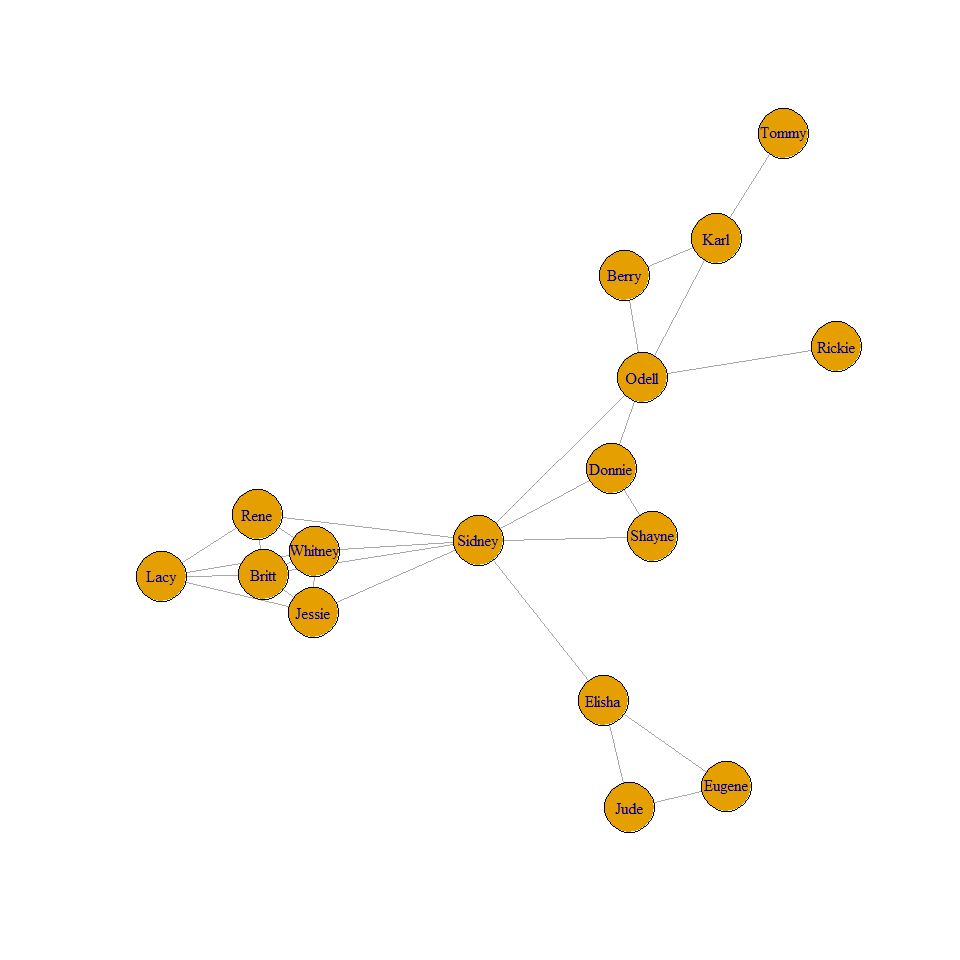<!-- -->

# Counting vertices and edges

A lot of basic information about a network can be extracted from an
igraph object. In this exercise you will learn how to count the vertices
and edges from a network by applying several functions to the graph
object g. Each row of the friends dataframe represents an edge in the
network.

``` r
# Subset vertices and edges
V(g)
```

    ## + 16/16 vertices, named, from 3eec45e:
    ##  [1] Jessie  Sidney  Britt   Donnie  Karl    Berry   Rene    Shayne  Elisha 
    ## [10] Whitney Odell   Lacy    Eugene  Jude    Rickie  Tommy

``` r
E(g)
```

    ## + 27/27 edges from 3eec45e (vertex names):
    ##  [1] Jessie --Sidney  Jessie --Britt   Sidney --Britt   Sidney --Donnie 
    ##  [5] Karl   --Berry   Sidney --Rene    Britt  --Rene    Sidney --Shayne 
    ##  [9] Sidney --Elisha  Sidney --Whitney Jessie --Whitney Donnie --Odell  
    ## [13] Sidney --Odell   Rene   --Whitney Donnie --Shayne  Jessie --Lacy   
    ## [17] Rene   --Lacy    Elisha --Eugene  Eugene --Jude    Berry  --Odell  
    ## [21] Odell  --Rickie  Karl   --Odell   Britt  --Lacy    Elisha --Jude   
    ## [25] Whitney--Lacy    Britt  --Whitney Karl   --Tommy

``` r
# Count number of edges
gsize(g)
```

    ## [1] 27

``` r
# Count number of vertices
gorder(g)
```

    ## [1] 16

# Node attributes and subsetting

In this exercise you will learn how to add attributes to vertices in the
network and view them.

``` r
genders <- c("M", "F", "F", "M", "M", "M",
             "F", "M", "M", "F", "M", "F", 
             "M", "F", "M", "M")

ages <- c("18", "19", "21", "20", "22", 
          "18", "23", "21", "22", "20",
          "20", "22", "21", "18", "19",
          "20") %>% as.numeric()


# Inspect the objects 'genders' and 'ages'
 genders
```

    ##  [1] "M" "F" "F" "M" "M" "M" "F" "M" "M" "F" "M" "F" "M" "F" "M" "M"

``` r
ages
```

    ##  [1] 18 19 21 20 22 18 23 21 22 20 20 22 21 18 19 20

``` r
# Create new vertex attribute called 'gender'
g <- set_vertex_attr(g, "gender", value = genders)

# Create new vertex attribute called 'age'
g <- set_vertex_attr(g, "age", value = ages)

# View all vertex attributes in a list
vertex_attr(g)
```

    ## $name
    ##  [1] "Jessie"  "Sidney"  "Britt"   "Donnie"  "Karl"    "Berry"   "Rene"   
    ##  [8] "Shayne"  "Elisha"  "Whitney" "Odell"   "Lacy"    "Eugene"  "Jude"   
    ## [15] "Rickie"  "Tommy"  
    ## 
    ## $gender
    ##  [1] "M" "F" "F" "M" "M" "M" "F" "M" "M" "F" "M" "F" "M" "F" "M" "M"
    ## 
    ## $age
    ##  [1] 18 19 21 20 22 18 23 21 22 20 20 22 21 18 19 20

``` r
# View attributes of first five vertices in a dataframe
V(g)[[1:5]] 
```

    ## + 5/16 vertices, named, from 3eec45e:
    ##     name gender age
    ## 1 Jessie      M  18
    ## 2 Sidney      F  19
    ## 3  Britt      F  21
    ## 4 Donnie      M  20
    ## 5   Karl      M  22

# Edge attributes and subsetting

In this exercise you will learn how to add attributes to edges in the
network and view them. For instance, we will add the attribute ‘hours’
that represents how many hours per week each pair of friends spend with
each other.

``` r
hours <- c("1", "2", "2", "1", "2", "5",
           "5", "1", "1", "3", "2", "1", "1",
           "5", "1", "2", "4", "1", "3", "1",
           "1", "1", "4", "1", "3", "3", "4") %>% as.numeric()


# View hours
hours
```

    ##  [1] 1 2 2 1 2 5 5 1 1 3 2 1 1 5 1 2 4 1 3 1 1 1 4 1 3 3 4

``` r
# Create new edge attribute called 'hours'
g <- set_edge_attr(g, "hours", value = hours)

# View edge attributes of graph object
edge_attr(g)
```

    ## $hours
    ##  [1] 1 2 2 1 2 5 5 1 1 3 2 1 1 5 1 2 4 1 3 1 1 1 4 1 3 3 4

``` r
# Find all edges that include "Britt"
E(g)[[inc('Britt')]]  
```

    ## + 5/27 edges from 3eec45e (vertex names):
    ##      tail    head tid hid hours
    ## 2  Jessie   Britt   1   3     2
    ## 3  Sidney   Britt   2   3     2
    ## 7   Britt    Rene   3   7     5
    ## 23  Britt    Lacy   3  12     4
    ## 26  Britt Whitney   3  10     3

``` r
# Find all pairs that spend 4 or more hours together per week
E(g)[[hours>= 4]]  
```

    ## + 6/27 edges from 3eec45e (vertex names):
    ##      tail    head tid hid hours
    ## 6  Sidney    Rene   2   7     5
    ## 7   Britt    Rene   3   7     5
    ## 14   Rene Whitney   7  10     5
    ## 17   Rene    Lacy   7  12     4
    ## 23  Britt    Lacy   3  12     4
    ## 27   Karl   Tommy   5  16     4

# Visualizing attributes

In this exercise we will learn how to create igraph objects with
attributes directly from dataframes and how to visualize attributes in
plots. We will use a second network of friendship connections between
students.

``` r
friends1_edges <- read_csv("friends1_edges.csv")
friends1_nodes <- read_csv("friends1_nodes.csv")
# Create an igraph object with attributes directly from dataframes
g1 <- graph_from_data_frame(d = friends1_edges, 
                            vertices = friends1_nodes, 
                            directed = FALSE)


# Subset edges greater than or equal to 5 hours
E(g1)[[hours>=5]]  
```

    ## + 4/25 edges from 3f14251 (vertex names):
    ##         tail      head tid hid hours
    ## 5     Kelley Valentine   3   6     5
    ## 8     Ronald   Jasmine   4   8     5
    ## 12 Valentine     Perry   6  15     5
    ## 15   Jasmine      Juan   8   9     6

``` r
# Set vertex color by gender
V(g1)$color <- ifelse(V(g1)$gender == "F", "orange", "dodgerblue")

# Plot the graph
plot(g1, vertex.label.color = "black")
```

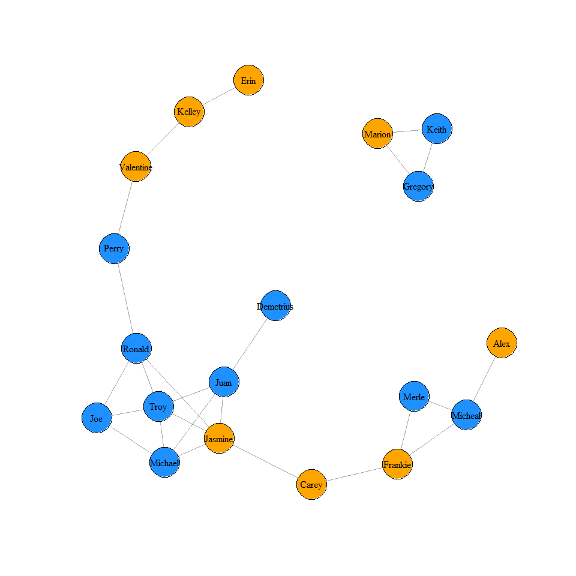<!-- --> \# Quiz on
attributes - What term is typically used to describe the relative
strength of edges? - weight

# Igraph network layouts

The igraph package provides several built in layout algorithms for
network visualization. Depending upon the size of a given network
different layouts may be more effective in communicating the structure
of the network. Ideally the best layout is the one that minimizes the
number of edges that cross each other in the network. In this exercise
you will explore just a few of the many default layout algorithms.
Re-executing the code for each plot will lead to a slightly different
version of the same layout type. Doing this a few times can help to find
the best looking visualization for your network.

``` r
library(igraph)

# Plot the graph object g1 in a circle layout
plot(g1, vertex.label.color = "black", layout = layout_in_circle(g1))
```

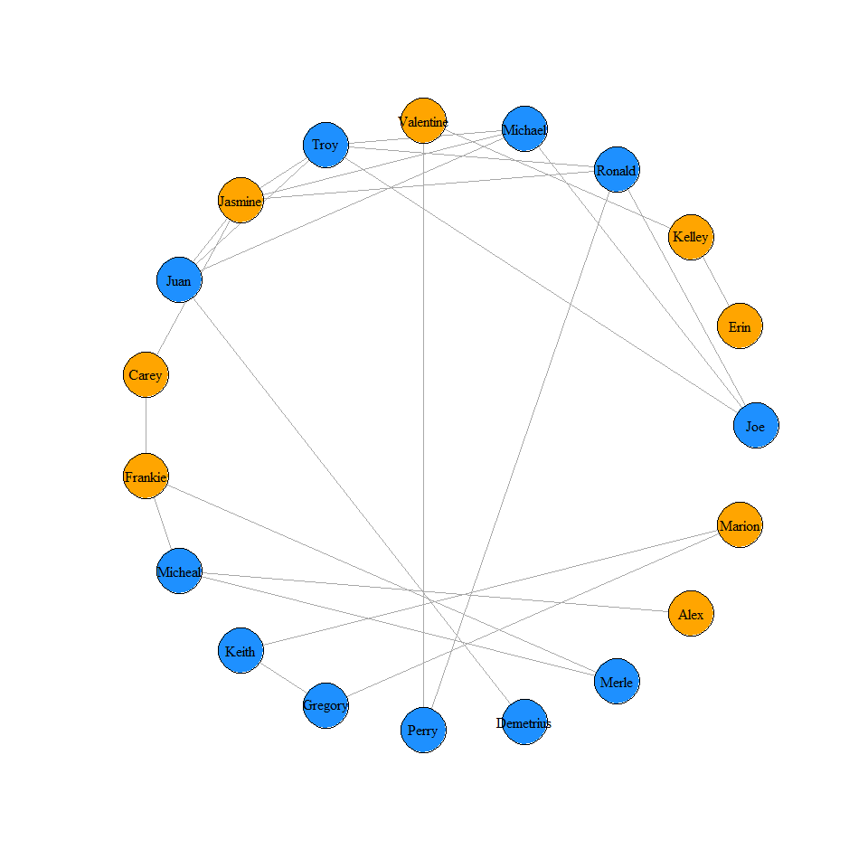<!-- -->

``` r
# Plot the graph object g1 in a Fruchterman-Reingold layout 
plot(g1, vertex.label.color = "black", layout = layout_with_fr(g1))
```

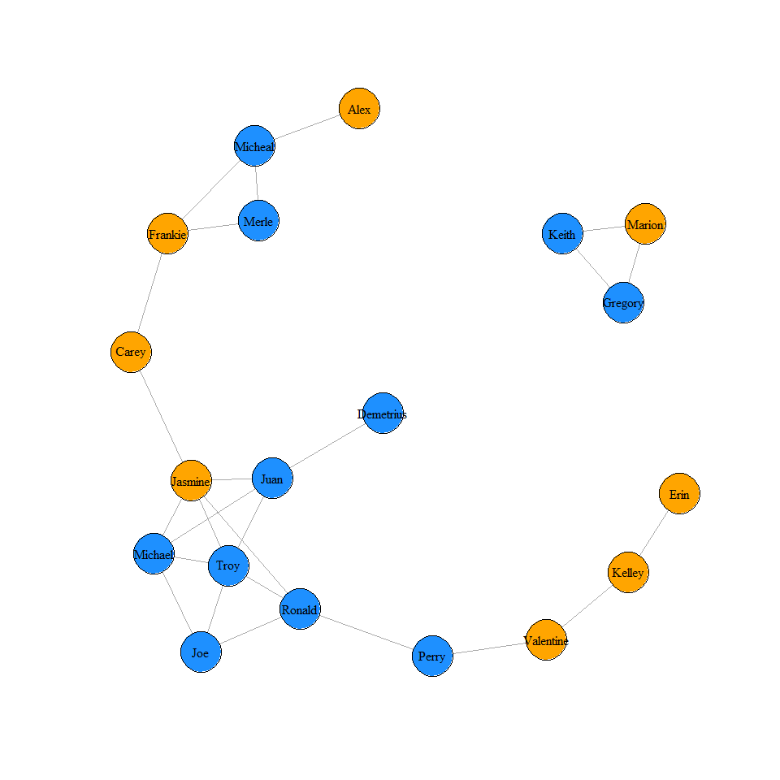<!-- -->

``` r
# Plot the graph object g1 in a Tree layout 
m <- layout_as_tree(g1)
plot(g1, vertex.label.color = "black", layout = m)
```

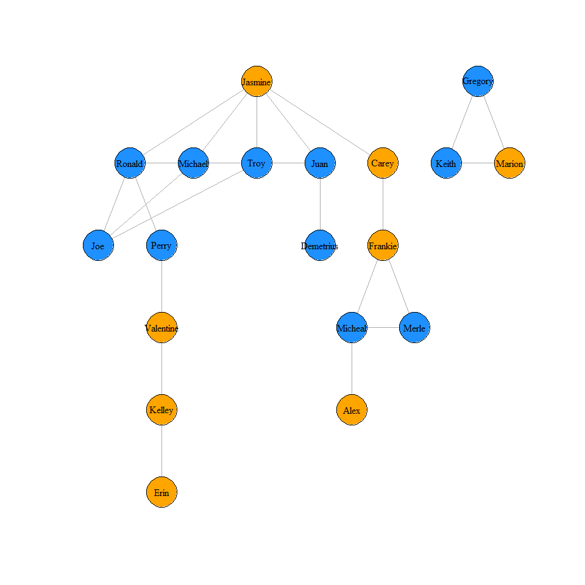<!-- -->

``` r
# Plot the graph object g1 using igraph's chosen layout 
m1 <- layout_nicely(g1)
plot(g1, vertex.label.color = "black", layout = m1)
```

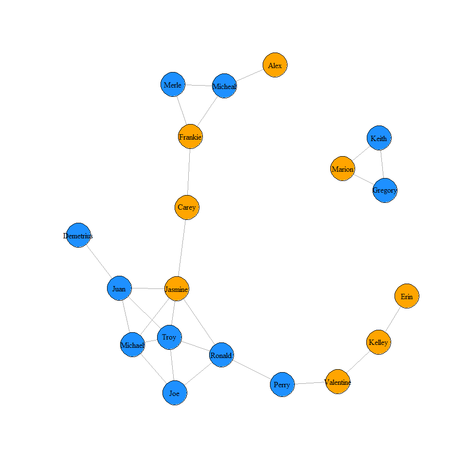<!-- -->

# Visualizing edges

In this exercise you will learn how to change the size of edges in a
network based on their weight, as well as how to remove edges from a
network which can sometimes be helpful in more effectively visualizing
large and highly clustered networks. In this introductory chapter, we
have just scratched the surface of what’s possible in visualizing igraph
networks. You will continue to develop these skills in future chapters.

``` r
# Create a vector of weights based on the number of hours each pair spend together
w1 <- E(g1)$hours

# Plot the network varying edges by weights
m1 <- layout_nicely(g1)
plot(g1, 
        vertex.label.color = "black", 
        edge.color = 'black',
        edge.width = w1,
        layout = m1)
```

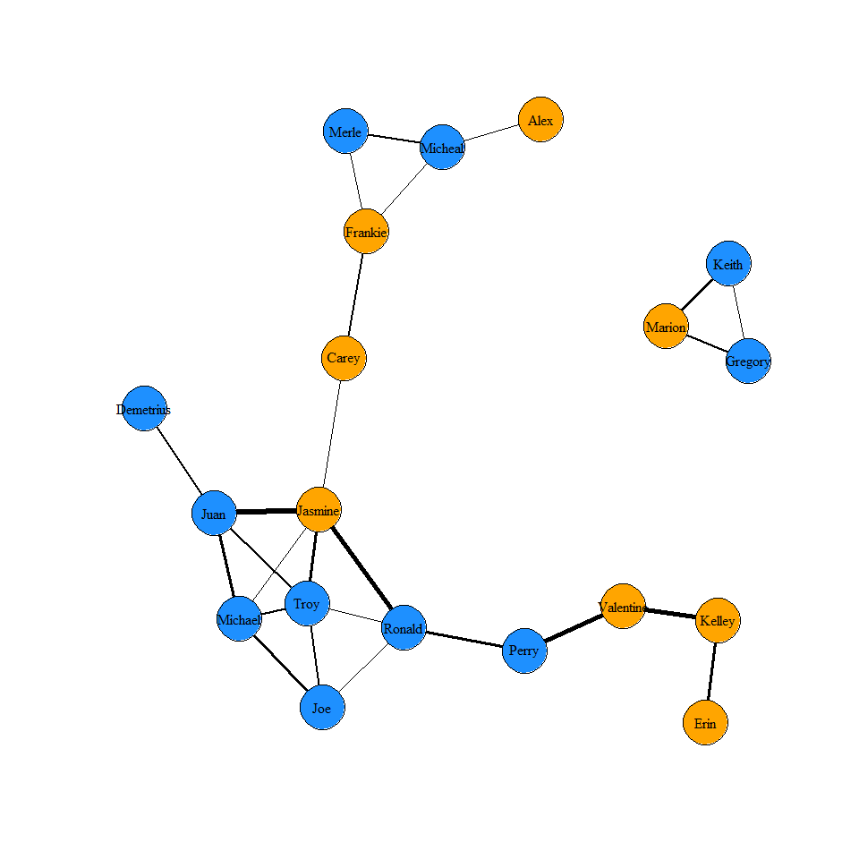<!-- -->

``` r
# Create a new igraph object by deleting edges that are less than 2 hours long 
g2 <- delete_edges(g1, E(g1)[hours < 2])


# Plot the new graph 
w2 <- E(g2)$hours
m2 <- layout_nicely(g2)

plot(g2, 
     vertex.label.color = "black", 
     edge.color = 'black',
     edge.width = w2,
     layout = m2)
```

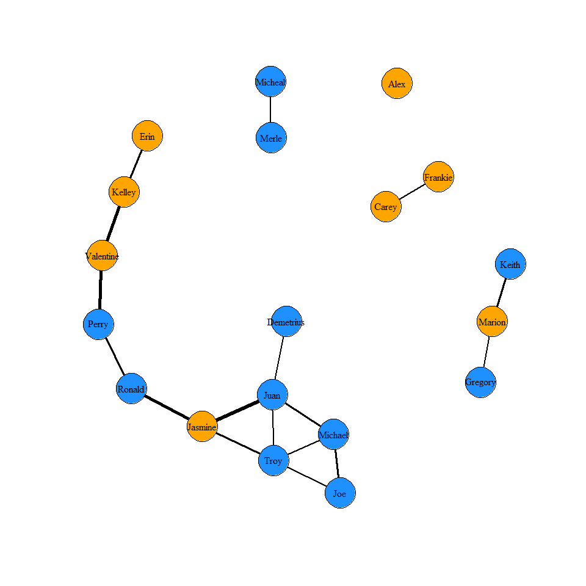<!-- -->

# Directed igraph objects

In this exercise you will learn how to create a directed graph from a
dataframe, how to inspect whether a graph object is directed and/or
weighted and how to extract those vertices at the beginning and end of
directed edges.

``` r
measles <- fread("measles.csv")
# Get the graph object
g <- graph_from_data_frame(measles, directed = TRUE)

# is the graph directed?
is.directed(g)
```

    ## [1] TRUE

``` r
# Is the graph weighted?
is.weighted(g)
```

    ## [1] FALSE

``` r
# Where does each edge originate from?
table(head_of(g, E(g)))
```

    ## 
    ##   1   2   3   4   5   6   7   8   9  10  11  12  13  14  15  17  18  19  20  21 
    ##   1   1   1   1   1   1   1   1   1   1   1   1   1   1   1   1   1   1   1   1 
    ##  22  23  24  25  26  27  28  29  30  31  32  33  34  35  36  37  38  39  40  41 
    ##   1   1   1   1   1   1   1   1   1   1   1   1   1   1   1   1   1   1   1   1 
    ##  42  43  44  45  46  47  48  49  50  51  52  53  54  55  56  57  58  61  62  63 
    ##   1   1   1   1   1   1   1   1   1   1   1   1   1   1   1   1   1   1   1   1 
    ##  64  65  66  67  68  69  70  71  72  73  74  75  76  77  78  79  80  81  82  83 
    ##   1   1   1   1   1   1   1   1   1   1   1   1   1   1   1   1   1   1   1   1 
    ##  84  85  86  87  88  89  90  91  92  93  94  95  96  97  98  99 100 101 102 103 
    ##   1   1   1   1   1   1   1   1   1   1   1   1   1   1   1   1   1   1   1   1 
    ## 104 105 106 107 108 109 110 111 112 113 114 115 116 117 118 119 120 121 122 123 
    ##   1   1   1   1   1   1   1   1   1   1   1   1   1   1   1   1   1   1   1   1 
    ## 124 125 126 127 128 129 130 131 132 133 134 135 136 137 138 139 140 141 142 143 
    ##   1   1   1   1   1   1   1   1   1   1   1   1   1   1   1   1   1   1   1   1 
    ## 144 145 146 147 148 149 150 151 152 153 154 155 156 157 158 159 160 161 162 163 
    ##   1   1   1   1   1   1   1   1   1   1   1   1   1   1   1   1   1   1   1   1 
    ## 164 165 166 167 168 169 170 171 172 173 174 175 176 177 178 179 180 181 182 183 
    ##   1   1   1   1   1   1   1   1   1   1   1   1   1   1   1   1   1   1   1   1 
    ## 184 185 186 187 
    ##   1   1   1   1

# Identifying edges for each vertex

In this exercise you will learn how to identify particular edges. You
will learn how to determine if an edge exists between two vertices as
well as finding all vertices connected in either direction to a given
vertex.

``` r
# Make a basic plot
plot(g, 
     vertex.label.color = "black", 
     edge.color = 'gray77',
     vertex.size = 0,
     edge.arrow.size = 0.1,
     layout = layout_nicely(g))
```

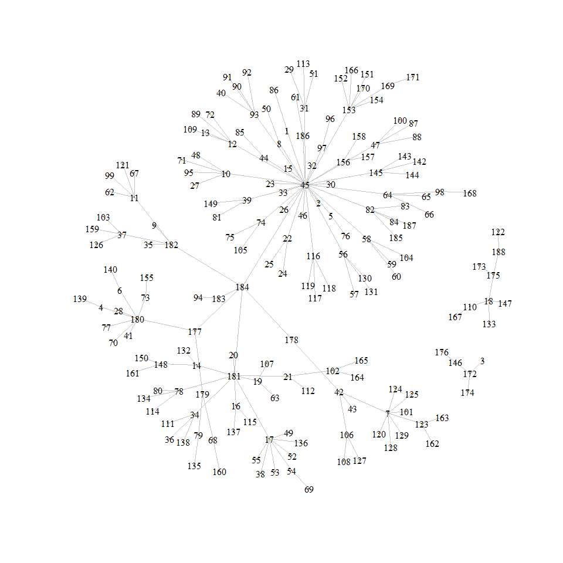<!-- -->

``` r
# Is there an edge going from vertex 184 to vertex 178?
g['184', '178']
```

    ## [1] 1

``` r
# Is there an edge going from vertex 178 to vertex 184?
g['178', '184']
```

    ## [1] 0

``` r
# Show all edges going to or from vertex 184
incident(g, '184', mode = c("all"))
```

    ## + 6/184 edges from 3f80f43 (vertex names):
    ## [1] 184->45  184->182 184->181 184->178 184->183 184->177

``` r
# Show all edges going out from vertex 184
incident(g, '184', mode = c("out"))
```

    ## + 6/184 edges from 3f80f43 (vertex names):
    ## [1] 184->45  184->182 184->181 184->178 184->183 184->177

## Neighbors

Often in network analysis it is important to explore the patterning of
connections that exist between vertices. One way is to identify
neighboring vertices of each vertex. You can then determine which
neighboring vertices are shared even by unconnected vertices indicating
how two vertices may have an indirect relationship through others. In
this exercise you will learn how to identify neighbors and shared
neighbors between pairs of vertices.

``` r
# Identify all neighbors of vertex 12 regardless of direction
neighbors(g, '12', mode = c('all'))
```

    ## + 5/187 vertices, named, from 3f80f43:
    ## [1] 45  13  72  89  109

``` r
# Identify other vertices that direct edges towards vertex 12
neighbors(g, '12', mode = c('in'))
```

    ## + 1/187 vertex, named, from 3f80f43:
    ## [1] 45

``` r
# Identify any vertices that receive an edge from vertex 42 and direct an edge to vertex 124
n1 <-neighbors(g, '42', mode = c('out'))
n2 <- neighbors(g, '124', mode = c('in'))
intersection(n1, n2)
```

    ## + 1/187 vertex, named, from 3f80f43:
    ## [1] 7

# Distances between vertices

The inter-connectivity of a network can be assessed by examining the
number and length of paths between vertices. A path is simply the chain
of connections between vertices. The number of intervening edges between
two vertices represents the geodesic distance between vertices. Vertices
that are connected to each other have a geodesic distance of 1. Those
that share a neighbor in common but are not connected to each other have
a geodesic distance of 2 and so on. In directed networks, the direction
of edges can be taken into account. If two vertices cannot be reached
via following directed edges they are given a geodesic distance of
infinity. In this exercise you will learn how to find the longest paths
between vertices in a network and how to discern those vertices that are
within n connections of a given vertex. For disease transmission
networks such as the measles dataset this helps you to identify how
quickly the disease spreads through the network.

``` r
# Which two vertices are the furthest apart in the graph ?
farthest_vertices(g) 
```

    ## $vertices
    ## + 2/187 vertices, named, from 3f80f43:
    ## [1] 184 162
    ## 
    ## $distance
    ## [1] 5

``` r
# Shows the path sequence between two furthest apart vertices.
get_diameter(g)  
```

    ## + 6/187 vertices, named, from 3f80f43:
    ## [1] 184 178 42  7   123 162

``` r
# Identify vertices that are reachable within two connections from vertex 42
ego(g, 2, '42', mode = c('out'))
```

    ## [[1]]
    ## + 13/187 vertices, named, from 3f80f43:
    ##  [1] 42  7   106 43  123 101 120 124 125 128 129 108 127

``` r
# Identify vertices that can reach vertex 42 within two connections
ego(g, 2, '42', mode = c('in'))
```

    ## [[1]]
    ## + 3/187 vertices, named, from 3f80f43:
    ## [1] 42  178 184

## Finding longest path between two vertices

  - What is the longest possible path in a network referred to as?
  - Diameter

# Identifying key vertices

Perhaps the most straightforward measure of vertex importance is the
degree of a vertex. The out-degree of a vertex is the number of other
individuals to which a vertex has an outgoing edge directed to. The
in-degree is the number of edges received from other individuals. In the
measles network, individuals that infect many other individuals will
have a high out-degree. In this exercise you will identify whether
individuals infect equivalent amount of other children or if there are
key children who have high out-degrees and infect many other children.

``` r
# Calculate the out-degree of each vertex
g.outd <- degree(g, mode = c("out"))

# View a summary of out-degree
table(g.outd)
```

    ## g.outd
    ##   0   1   2   3   4   6   7   8  30 
    ## 125  21  16  12   6   2   3   1   1

``` r
# Make a histogram of out-degrees
hist(g.outd, breaks = 30)
```

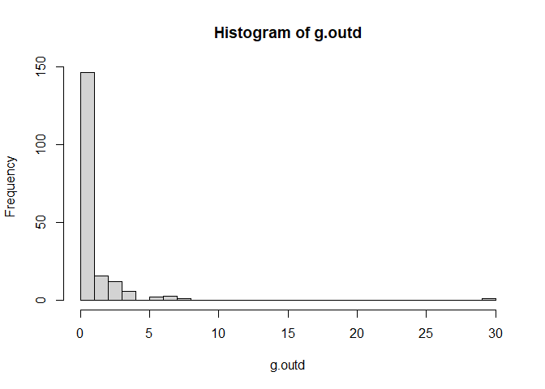<!-- -->

``` r
# Find the vertex that has the maximum out-degree
which.max(g.outd)
```

    ## 45 
    ##  1

# Betweenness

Another measure of the importance of a given vertex is its betweenness.
This is an index of how frequently the vertex lies on shortest paths
between any two vertices in the network. It can be thought of as how
critical the vertex is to the flow of information through a network.
Individuals with high betweenness are key bridges between different
parts of a network. In our measles transmission network, vertices with
high betweenness are those children who were central to passing on the
disease to other parts of the network. In this exercise, you will
identify the betweenness score for each vertex and then make a new plot
of the network adjusting the vertex size by its betweenness score to
highlight these key vertices.

``` r
# Calculate betweenness of each vertex
g.b <- betweenness(g, directed = TRUE)

# Show histogram of vertex betweenness
hist(g.b, breaks = 80)
```

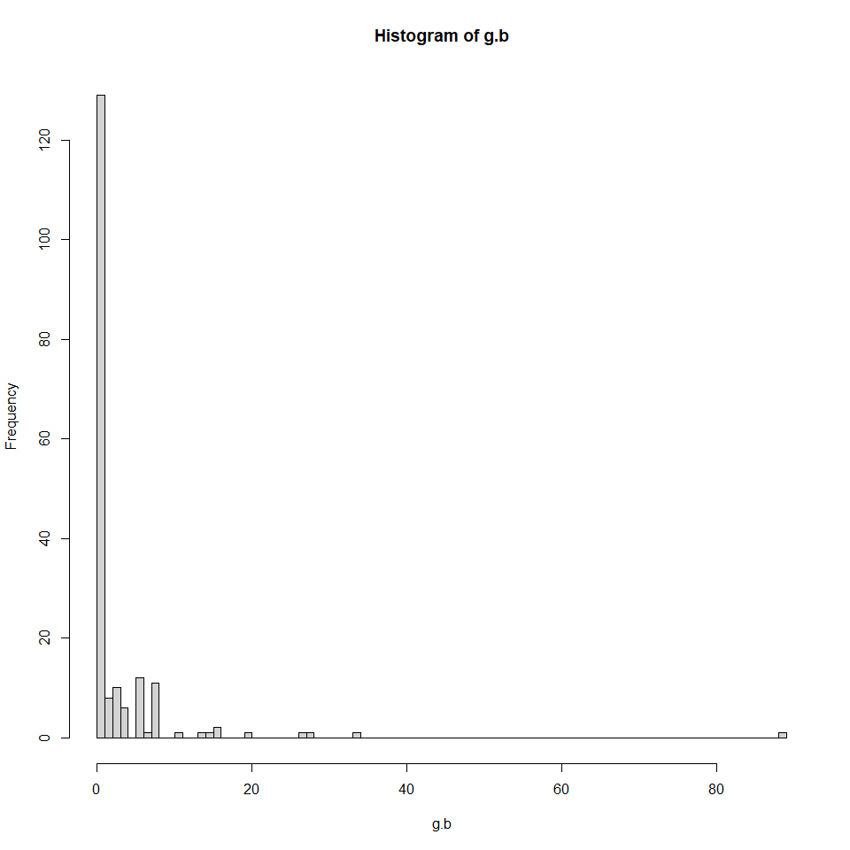<!-- -->

``` r
# Create plot with vertex size determined by betweenness score
plot(g, 
     vertex.label = NA,
     edge.color = 'black',
     vertex.size = sqrt(g.b)+1,
     edge.arrow.size = 0.05,
     layout = layout_nicely(g))
```

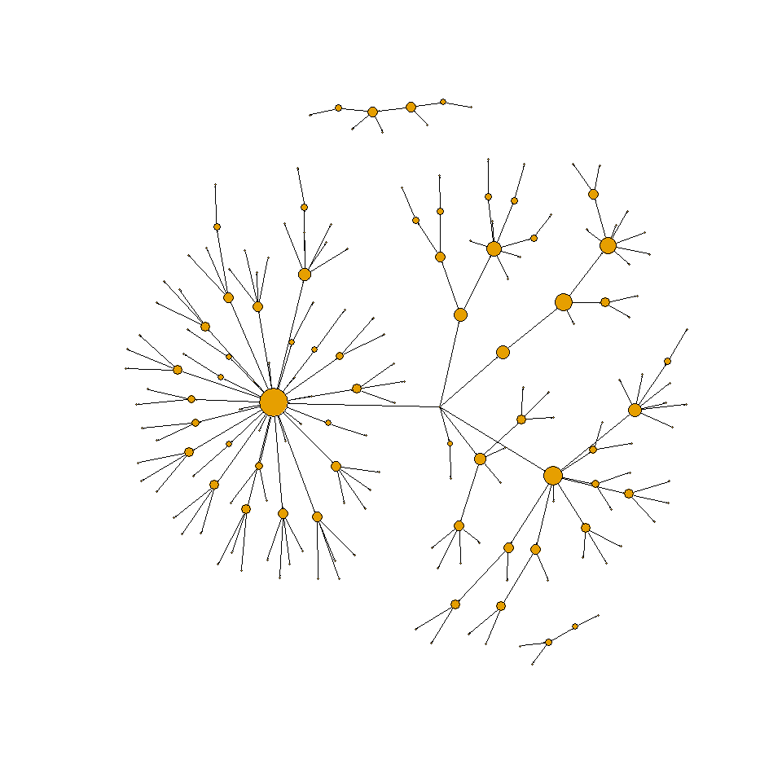<!-- -->

# Visualizing important nodes and edges

One issue with the measles dataset is that there are three individuals
for whom no information is known about who infected them. One of these
individuals (vertex 184) appears ultimately responsible for spreading
the disease to many other individuals even though they did not directly
infect too many individuals. However, because vertex 184 has no incoming
edge in the network they appear to have low betweenness. One way to
explore the importance of this vertex is by visualizing the geodesic
distances of connections going out from this individual. In this
exercise you shall create a plot of these distances from this patient
zero.

``` r
# Make an ego graph
g184 <- make_ego_graph(g, diameter(g), nodes = '184', mode = c("all"))[[1]]

# Get a vector of geodesic distances of all vertices from vertex 184 
dists <- distances(g184, "184")

# Create a color palette of length equal to the maximal geodesic distance plus one.
colors <- c("black", "red", "orange", "blue", "dodgerblue", "cyan")

# Set color attribute to vertices of network g184.
V(g184)$color <- colors[dists+1]

# Visualize the network based on geodesic distance from vertex 184 (patient zero).
plot(g184, 
     vertex.label = dists, 
     vertex.label.color = "white",
     vertex.label.cex = .6,
     edge.color = 'black',
     vertex.size = 7,
     edge.arrow.size = .05,
     main = "Geodesic Distances from Patient Zero"
     )
```

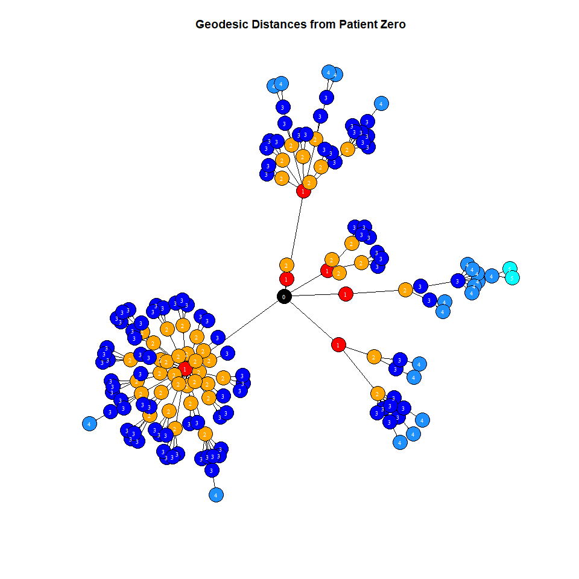<!-- -->

  - Which measure of a vertex importance is determined by how often that
    vertex lies on the shortest path between any two vertices in a
    network?

  - Betweenness

# Forrest Gump network

In this chapter you will use a social network based on the movie Forrest
Gump. Each edge of the network indicates that those two characters were
in at least one scene of the movie together. Therefore this network is
undirected. To familiarize yourself with the network, you will first
create the network object from the raw dataset. Then, you will identify
key vertices using a measure called eigenvector centrality. Individuals
with high eigenvector centrality are those that are highly connected to
other highly connected individuals. You will then make an exploratory
visualization of the network.

``` r
gump <- fread("gump.csv")
# Inspect Forrest Gump Movie dataset
head(gump) %>% kable()
```

| V1            | V2        |
| :------------ | :-------- |
| ABBIE HOFFMAN | JENNY     |
| ABBIE HOFFMAN | POLICEMAN |
| ANCHORMAN     | FORREST   |
| ANCHORMAN     | LT DAN    |
| ANCHORMAN     | MARGO     |
| ANCHORMAN     | MRS GUMP  |

``` r
# Make an undirected network
g <- graph_from_data_frame(gump, directed = FALSE)

# Identify key nodes using eigenvector centrality
g.ec <- eigen_centrality(g)
which.max(g.ec$vector)
```

    ## FORREST 
    ##      36

``` r
# Plot Forrest Gump Network
plot(g,
vertex.label.color = "black", 
vertex.label.cex = 0.6,
vertex.size = 25*(g.ec$vector),
edge.color = 'gray88',
main = "Forrest Gump Network"
)
```

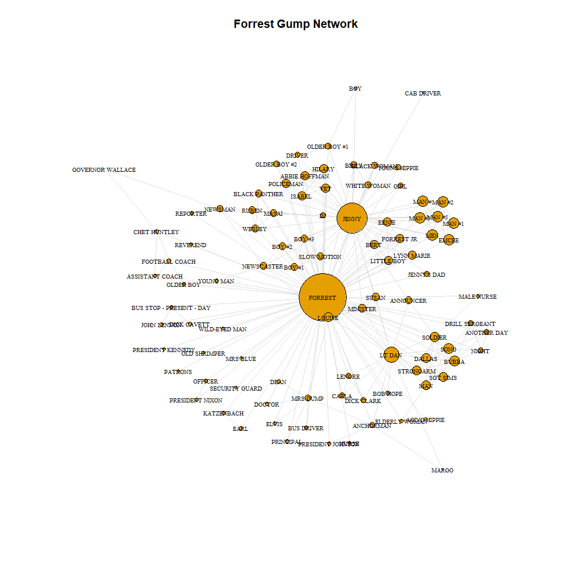<!-- -->

## Network density and average path length

The first graph level metric you will explore is the density of a graph.
This is essentially the proportion of all potential edges between
vertices that actually exist in the network graph. It is an indicator of
how well connected the vertices of the graph are.

Another measure of how interconnected a network is average path length.
This is calculated by determining the mean of the lengths of the
shortest paths between all pairs of vertices in the network. The longest
path length between any pair of vertices is called the diameter of the
network graph. You will calculate the diameter and average path length
of the original graph g.

``` r
# Get density of a graph
gd <- edge_density(g)

# Get the diameter of the graph g
diameter(g, directed = FALSE)
```

    ## [1] 4

``` r
# Get the average path length of the graph g
g.apl <- mean_distance(g, directed = FALSE)
g.apl
```

    ## [1] 1.994967

  - If a graph has 7 vertices there are 21 possible edges in the
    network. If 14 edges exist, what is the density of the network?

  - 0.67

# Random graphs

Generating random graphs is an important method for investigating how
likely or unlikely other network metrics are likely to occur given
certain properties of the original graph. The simplest random graph is
one that has the same number of vertices as your original graph and
approximately the same density as the original graph. Here you will
create one random graph that is based on the original Forrest Gump
Network.

``` r
# Create one random graph with the same number of nodes and edges as g
g.random <- erdos.renyi.game(n = gorder(g), p.or.m = gd, type = "gnp")

g.random
```

    ## IGRAPH 414b59c U--- 94 285 -- Erdos renyi (gnp) graph
    ## + attr: name (g/c), type (g/c), loops (g/l), p (g/n)
    ## + edges from 414b59c:
    ##  [1]  7--10  1--13  7--13 10--15 14--18 11--19  4--20 19--20  3--21  9--22
    ## [11] 17--22 20--22  6--23  2--24 18--24  2--25  5--25 11--25 24--26 12--28
    ## [21]  9--29 10--29 20--29  4--30 19--30 20--30 16--31 25--31  2--32 18--32
    ## [31] 25--32 27--32  6--33 11--33 18--33 28--33  3--34  9--34 10--34 16--34
    ## [41]  1--35 23--35 25--35 13--36 18--36 19--36 19--37 25--37  6--38 30--38
    ## [51] 15--39 22--39 27--39 29--39 35--39 35--40  7--41 12--41 21--41 30--41
    ## [61] 35--41  8--42 10--42 18--42 20--42  9--44 13--44 19--46 27--46 35--46
    ## [71]  7--47 26--47 32--47 36--47 38--47 39--47  7--48 12--48 20--48 23--48
    ## + ... omitted several edges

``` r
plot(g.random)
```

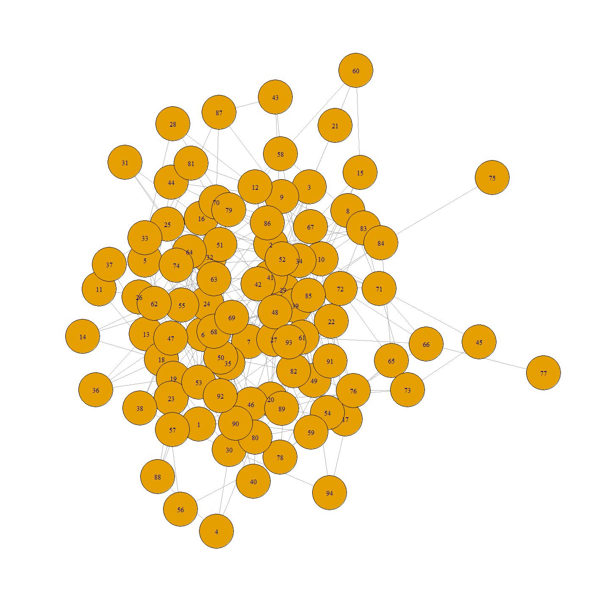<!-- -->

``` r
# Get density of new random graph `g.random`
edge_density(g.random)
```

    ## [1] 0.06520247

``` r
#Get the average path length of the random graph g.random
mean_distance(g.random, directed = FALSE)
```

    ## [1] 2.69984

# Network randomizations

In the previous exercise you may have noticed that the average path
length of the Forrest Gump network was smaller than the average path
length of the random network. If you ran the code a few times you will
have noticed that it is nearly always lower in the Forrest Gump network
than the random network. What this suggests is that the Forrest Gump
network is more highly interconnected than each random network even
though the random networks have the same number of vertices and
approximately identical graph densities. Rather than re-running this
code many times, you can more formally address this by creating 1000
random graphs based on the number of vertices and density of the
original Forrest Gump graph. Then, you can see how many times the
average path length of the random graphs is less than the original
Forrest Gump network. This is called a randomization test.

The graph g, and its average path length (that you calculated in the
previous exercise), g.apl are in your workspace.

``` r
# Generate 1000 random graphs
gl <- vector('list', 1000)
  
for(i in 1:1000){
  gl[[i]] <- erdos.renyi.game(n = gorder(g), p.or.m = gd, type = "gnp")
}

# Calculate average path length of 1000 random graphs
gl.apls <- unlist(lapply(gl, mean_distance, directed = FALSE))

# Plot the distribution of average path lengths
hist(gl.apls, xlim = range(c(1.5, 6)))
abline(v = mean(gl.apls), col = "red", lty = 3, lwd = 2)
```

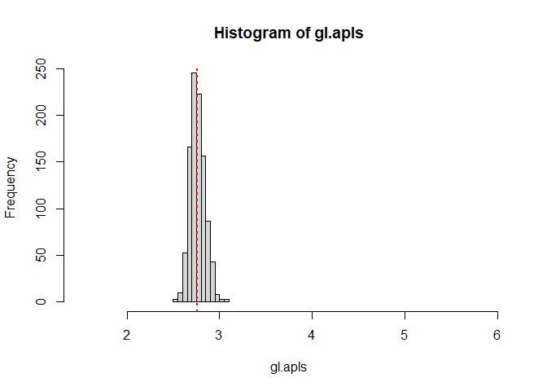<!-- -->

``` r
# Calculate the proportion of graphs with an average path length lower than our observed
mean(gl.apls  < g.apl)
```

    ## [1] 0

## Randomization quiz

  - Randomization tests enable you to identify:
  - Whether features of your original network are particularly unusual.

# Triangles and transitivity

Another important measure of local connectivity in a network graph
involves investigating triangles (also known as triads). In this
exercise you will find all closed triangles that exist in a network.
This means that an edge exists between three given vertices. You can
then calculate the transitivity of the network. This is equivalent to
the proportion of all possible triangles in the network that are closed.
You will also learn how to identify the number of closed triangles that
any given vertex is a part of and its local transitivity - that is, the
proportion of closed triangles that the vertex is a part of given the
theoretical number of triangles it could be a part of.

``` r
# Show all triangles in the network.
#matrix(triangles(g), nrow = 3)

# Count the number of triangles that vertex "BUBBA" is in.
count_triangles(g, vids='BUBBA')
```

    ## [1] 37

``` r
# Calculate  the global transitivity of the network.
g.tr <- transitivity(g)
g.tr
```

    ## [1] 0.1918082

``` r
# Calculate the local transitivity for vertex BUBBA.
transitivity(g, vids='BUBBA', type = "local")
```

    ## [1] 0.6727273

# Transitivity randomizations

As you did for the average path length, let’s investigate if the global
transitivity of the Forrest Gump network is significantly higher than we
would expect by chance for random networks of the same size and density.
You can compare Forrest Gump’s global transitivity to 1000 other random
networks.

``` r
# Calculate average transitivity of 1000 random graphs
gl.tr <- lapply(gl, transitivity)
gl.trs <- unlist(gl.tr)

# Get summary statistics of transitivity scores
summary(gl.trs)
```

    ##    Min. 1st Qu.  Median    Mean 3rd Qu.    Max. 
    ## 0.03284 0.05403 0.06160 0.06172 0.06910 0.10261

``` r
# Calculate the proportion of graphs with a transitivity score higher than Forrest Gump's network
mean(gl.trs > g.tr)
```

    ## [1] 0

# Cliques

Identifying cliques is a common practice in undirected networks. In a
clique every two unique nodes are adjacent - that means that every
individual node is connected to every other individual node in the
clique. In this exercise you will identify the largest cliques in the
Forrest Gump network. You will also identify the number of maximal
cliques of various sizes. A clique is maximal if it cannot be extended
to a larger clique.

``` r
# Identify the largest cliques in the network
largest_cliques(g)
```

    ## [[1]]
    ## + 9/94 vertices, named, from 4118fa9:
    ## [1] FORREST   STRONGARM BUBBA     DALLAS    LT DAN    MAN       SGT SIMS 
    ## [8] SOLDIER   SONG     
    ## 
    ## [[2]]
    ## + 9/94 vertices, named, from 4118fa9:
    ## [1] FORREST JENNY   EMCEE   MAN #   MAN #1  MAN #2  MAN #3  MAN #5  MEN

``` r
# Determine all maximal cliques in the network and assign to object 'clq'
clq <- max_cliques(g)

# Calculate the size of each maximal clique.
table(unlist(lapply(clq, length)))
```

    ## 
    ##  2  3  4  5  6  7  9 
    ## 12 24  7  2  4  2  2

# Visualize largest cliques

Often in network visualization you will need to subset part of a network
to inspect the inter-connections of particular vertices. Here, you will
create a visualization of the largest cliques in the Forrest Gump
network. In the last exercise you determined that there were two cliques
of size 9. You will plot these side-by-side after creating two new
igraph objects by subsetting out these cliques from the main network.
The function subgraph() enables you to choose which vertices to keep in
a new network object.

``` r
library(igraph)

# Assign largest cliques output to object 'lc'
lc <- largest_cliques(g)

# Create two new undirected subgraphs, each containing only the vertices of each largest clique.
gs1 <- as.undirected(subgraph(g, lc[[1]]))
gs2 <- as.undirected(subgraph(g, lc[[2]]))


# Plot the two largest cliques side-by-side

par(mfrow=c(1,2)) # To plot two plots side-by-side

plot(gs1,
     vertex.label.color = "black", 
     vertex.label.cex = 0.9,
     vertex.size = 0,
     edge.color = 'gray28',
     main = "Largest Clique 1",
     layout = layout.circle(gs1)
)

plot(gs2,
     vertex.label.color = "black", 
     vertex.label.cex = 0.9,
     vertex.size = 0,
     edge.color = 'gray28',
     main = "Largest Clique 2",
     layout = layout.circle(gs2)
)
```

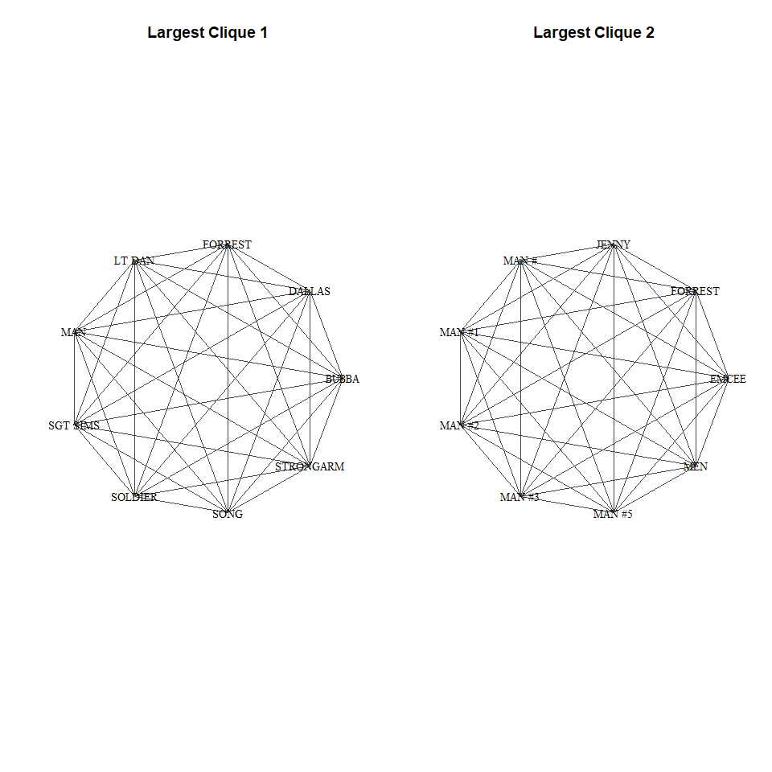<!-- -->

# Assortativity

In this exercise you will determine the assortativity() of the second
friendship network from the first chapter. This is a measure of how
preferentially attached vertices are to other vertices with identical
attributes. You will also determine the degree assortativity which
determines how preferentially attached are vertices to other vertices of
a similar degree.

``` r
# Plot the network
plot(g1)
```

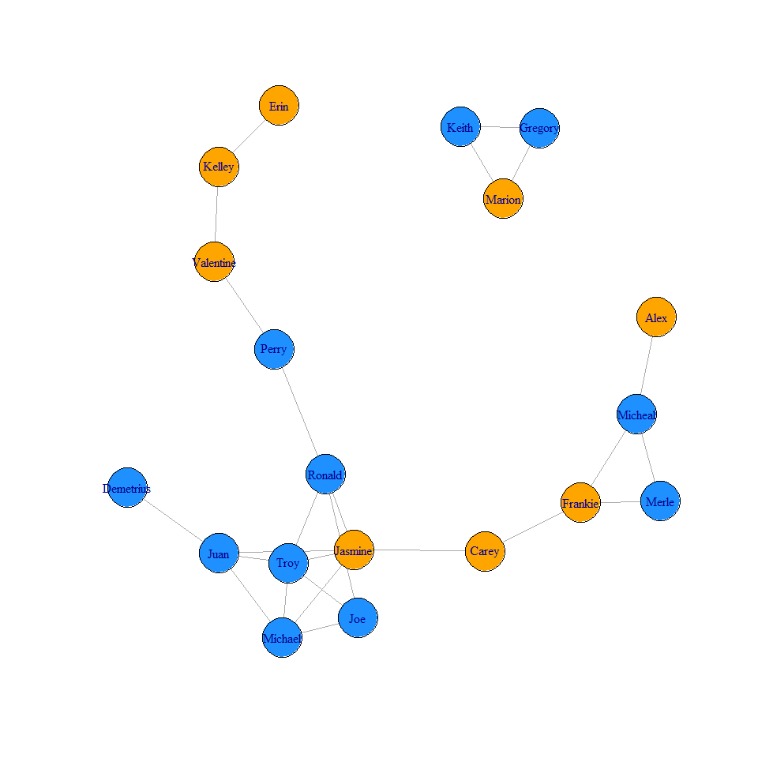<!-- -->

``` r
# Convert the gender attribute into a numeric value
values <- as.numeric(factor(V(g1)$gender))

# Calculate the assortativity of the network based on gender
assortativity(g1, values)
```

    ## [1] 0.1319444

``` r
# Calculate the assortativity degree of the network
assortativity.degree(g1, directed = FALSE)
```

    ## [1] 0.4615385

# Using randomizations to assess assortativity

In this exercise you will determine how likely the observed
assortativity in the friendship network is given the genders of vertices
by performing a randomization procedure. You will randomly permute the
gender of vertices in the network 1000 times and recalculate the
assortativity for each random network.

``` r
# Calculate the observed assortativity
observed.assortativity <- assortativity(g1, values)

# Calculate the assortativity of the network randomizing the gender attribute 1000 times
results <- vector('list', 1000)
for(i in 1:1000){
  results[[i]] <- assortativity(g1, sample(values))
}

# Plot the distribution of assortativity values and add a red vertical line at the original observed value
hist(unlist(results))

abline(v = observed.assortativity, col = "red", lty = 3, lwd=2)
```

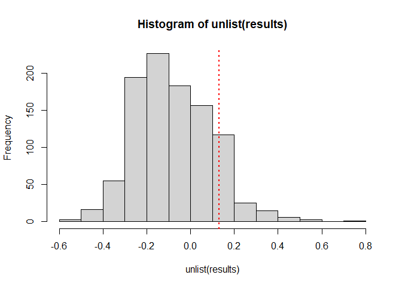<!-- -->

# Reciprocity

The reciprocity of a directed network reflects the proportion of edges
that are symmetrical. That is, the proportion of outgoing edges that
also have an incoming edge. It is commonly used to determine how
inter-connected directed networks are. An example of a such a network
may be grooming exchanges in chimpanzees. Certain chimps may groom
another but do not get groomed by that individual, whereas other chimps
may both groom each other and so would have a reciprocal tie.

``` r
# Make a plot of the chimp grooming network
# plot(g,
#      edge.color = "black",
#      edge.arrow.size = 0.3,
#      edge.arrow.width = 0.5)
# 
# # Calculate the reciprocity of the graph
# reciprocity(g)
```

## What does assortativity measure

  - How likely vertices are to connect to others that share some
    attribute in common.

# Fast-greedy community detection

The first community detection method you will try is fast-greedy
community detection. You will use the Zachary Karate Club network. This
social network contains 34 club members and 78 edges. Each edge
indicates that those two club members interacted outside the karate club
as well as at the club. Using this network you will determine how many
sub-communities the network has and which club members belong to which
subgroups. You will also plot the networks by community membership.

``` r
# Perform fast-greedy community detection on network graph
kc = fastgreedy.community(g)

# Determine sizes of each community
sizes(kc)
```

    ## Community sizes
    ##  1  2  3  4  5  6  7 
    ## 21 21 32  7  5  5  3

``` r
# Determine which individuals belong to which community
membership(kc)
```

    ##            ABBIE HOFFMAN                ANCHORMAN                ANNOUNCER 
    ##                        6                        1                        1 
    ##              ANOTHER DAY          ASSISTANT COACH                     BERT 
    ##                        1                        3                        5 
    ##                    BILLY              BLACK WOMAN                 BOB HOPE 
    ##                        2                        2                        1 
    ##                      BOY                   BOY #1                   BOY #2 
    ##                        2                        2                        2 
    ##                   BOY #3                    BUBBA BUS STOP - PRESENT - DAY 
    ##                        2                        1                        3 
    ##               CAB DRIVER                    CARLA             CHET HUNTLEY 
    ##                        2                        1                        3 
    ##                   DALLAS                     DEAN              DICK CAVETT 
    ##                        1                        3                        3 
    ##               DICK CLARK                   DOCTOR           DRILL SERGEANT 
    ##                        1                        3                        1 
    ##                    ELVIS                    EMCEE                    ERNIE 
    ##                        3                        4                        5 
    ##           FOOTBALL COACH             AGING HIPPIE            BLACK PANTHER 
    ##                        3                        3                        2 
    ##               BUS DRIVER                       DJ                   DRIVER 
    ##                        3                        2                        2 
    ##                     EARL            ELDERLY WOMAN                  FORREST 
    ##                        3                        1                        3 
    ##                     GIRL                   HILARY                   ISABEL 
    ##                        2                        6                        6 
    ##               FORREST JR                    JENNY                   LENORE 
    ##                        5                        2                        1 
    ##                   LOUISE                   LT DAN               LITTLE BOY 
    ##                        7                        1                        5 
    ##               MALE NURSE                    MAN #                   MAN #1 
    ##                        1                        4                        4 
    ##                   MAN #2                   MAN #3                    MASAI 
    ##                        4                        4                        2 
    ##                   MAN #5                 MINISTER               NEWSCASTER 
    ##                        4                        7                        3 
    ##         GOVERNOR WALLACE                  NEWSMAN                    NIGHT 
    ##                        3                        3                        1 
    ##             OLDER BOY #1                  OFFICER                 MRS GUMP 
    ##                        2                        3                        3 
    ##                    RUBEN                      MAN                 SGT SIMS 
    ##                        2                        1                        1 
    ##                  SOLDIER                     SONG                POLICEMAN 
    ##                        1                        1                        6 
    ##                    MARGO        PRESIDENT JOHNSON              WHITE WOMAN 
    ##                        1                        1                        2 
    ##              SLOW MOTION                STRONGARM              JOHN LENNON 
    ##                        2                        1                        3 
    ##                      MEN              JENNY'S DAD               LYNN MARIE 
    ##                        4                        2                        5 
    ##                 MRS BLUE                    NURSE             OLD SHRIMPER 
    ##                        3                        3                        3 
    ##             OLDER BOY #2        PRESIDENT KENNEDY                PRINCIPAL 
    ##                        2                        3                        3 
    ##                    SUSAN                      VET                   WESLEY 
    ##                        7                        6                        2 
    ##            WILD-EYED MAN             YOUNG HIPPIE                YOUNG MAN 
    ##                        3                        2                        3 
    ##               KATZENBACH                 REPORTER                OLDER BOY 
    ##                        3                        3                        3 
    ##                  PATRONS          PRESIDENT NIXON                 REVEREND 
    ##                        3                        3                        3 
    ##           SECURITY GUARD 
    ##                        3

``` r
# Plot the community structure of the network
plot(kc, g)
```

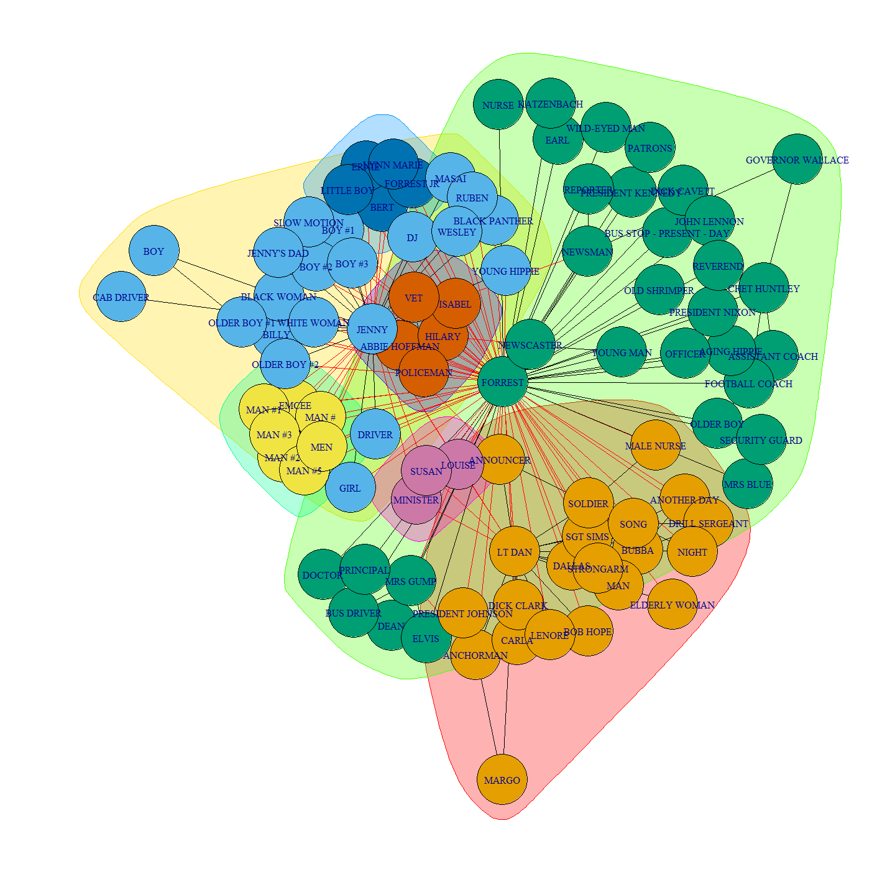<!-- -->

# Edge-betweenness community detection

An alternative community detection method is edge-betweenness. In this
exercise you will repeat the community detection of the karate club
using this method and compare the results visually to the fast-greedy
method.

``` r
# Perform edge-betweenness community detection on network graph
gc = edge.betweenness.community(g)

# Determine sizes of each community
sizes(gc)
```

    ## Community sizes
    ##  1  2  3  4  5  6  7  8  9 10 11 12 13 14 15 16 17 18 19 20 21 22 23 24 25 26 
    ##  5  3  1 10  5 14  3  5  3  4  3  1  6  1  4  1  1  2  1  1  3  1  2  2  2  1 
    ## 27 28 29 30 31 32 33 34 35 
    ##  1  1  1  1  1  1  1  1  1

``` r
# Plot community networks determined by fast-greedy and edge-betweenness methods side-by-side
par(mfrow = c(1, 2)) 
plot(kc, g)
plot(gc, g)
```

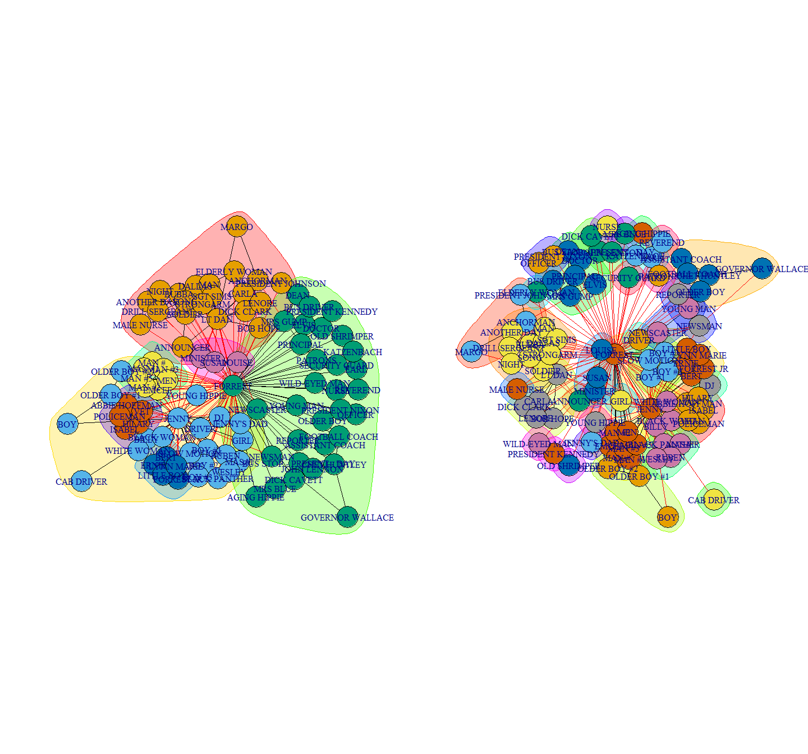<!-- -->

# Interactive networks with threejs

In this course you have exclusively used igraph to make basic static
network plots. There are many packages available to make network plots.
One very useful one is threejs which allows you to make interactive
network visualizations. This package also integrates seamlessly with
igraph. In this exercise you will make a basic interactive network plot
of the karate club network using the threejs package. Once you have
produced the visualization be sure to move the network around with your
mouse. You should be able to scroll in and out of the network as well as
rotate the network.

``` r
library(igraph)
library(threejs)

# Set a vertex attribute called 'color' to 'dodgerblue' 
g1 <- set_vertex_attr(g1, "color", value = "dodgerblue")

# Redraw the graph and make the vertex size 1
graphjs(g1, vertex.size = 1)
```

<!-- -->

# Sizing vertices in threejs

As with all network visualizations it is often worth adjusting the size
of vertices to illustrate their relative importance. This is also
straightforward in threejs. In this exercise you will create an
interactive threejs plot of the karate club network and size vertices
based on their relative eigenvector centrality.

``` r
# Create numerical vector of vertex eigenvector centralities 
# Create numerical vector of vertex eigenvector centralities 
# ec <- as.numeric(eigen_centrality(g)$vector )
# 
# # Create new vector 'v' that is equal to the square-root of 'ec' multiplied by 5
# v <- 5*sqrt(ec)
# 
# # Plot threejs plot of graph setting vertex size to v
# graphjs(g, vertex.size = v)
```

# 3D community network graph

Finally in this exercise you will create an interactive threejs plot
with the vertices based on their community membership as produced by the
fast-greedy community detection method.

``` r
# Create an object 'i' containin the memberships of the fast-greedy community detection
# i <-  membership(kc)
# 
# # Check the number of different communities
# sizes(kc)
# 
# # Add a color attribute to each vertex, setting the vertex color based on community membership
# g <- set_vertex_attr(g, "color", value = c("yellow", "blue", "red")[i])
# 
# # Plot the graph using threejs
# graphjs(g)
```
