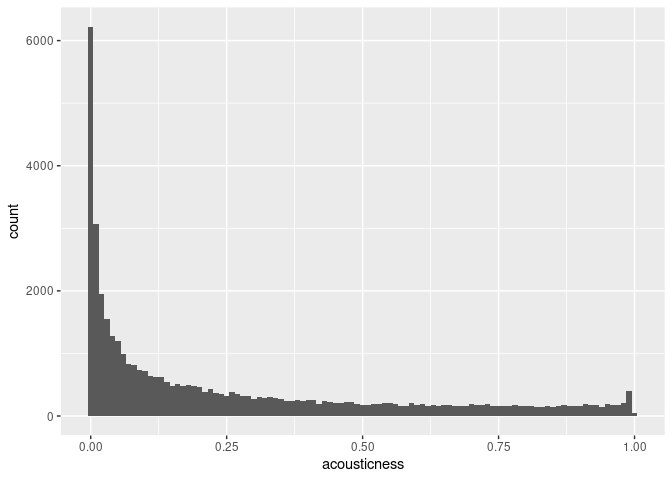

Sampling in R
================

## Reasons for sampling

Sampling is an important technique in your statistical arsenal. It isn’t
always appropriate though—you need to know when to use it and when to
work with the whole dataset.

-   Which of the following is not a good scenario to use sampling?
-   when data set is small

## Simple sampling with dplyr

Throughout this chapter you’ll be exploring song data from Spotify. Each
row of the dataset represents a song, and there are 41656 rows. Columns
include the name of the song, the artists who performed it, the release
year, and attributes of the song like its duration, tempo, and
danceability. We’ll start by looking at the durations.

Your first task is to sample the song dataset and compare a calculation
on the whole population and on a sample.

spotify_population is available and dplyr is loaded.

``` r
library(tidyverse)
library(fst)
library(knitr)
spotify_population <- read_fst("data/spotify_2000_2020.fst")
# View the whole population dataset

# Sample 1000 rows from spotify_population
spotify_sample <- slice_sample(spotify_population, n = 10)


# See the result
kable(spotify_sample)
```

| acousticness | artists                                                | danceability | duration_ms | duration_minutes | energy | explicit | id                     | instrumentalness | key | liveness | loudness | mode | name                                                          | popularity | release_date | speechiness |   tempo | valence | year |
|-------------:|:-------------------------------------------------------|-------------:|------------:|-----------------:|-------:|---------:|:-----------------------|-----------------:|----:|---------:|---------:|-----:|:--------------------------------------------------------------|-----------:|:-------------|------------:|--------:|--------:|-----:|
|     5.08e-05 | \[‘Motionless In White’\]                              |        0.390 |      205394 |         3.423233 |  0.939 |        0 | 0YZEYxd1oiqZRFhnnmTKKi |         0.00e+00 |   4 |   0.0968 |   -3.828 |    0 | Another Life                                                  |         68 | 2019-06-07   |      0.0787 | 161.997 |   0.495 | 2019 |
|     8.65e-01 | \[‘Blest’, ‘Roberto Orellana’\]                        |        0.454 |      249615 |         4.160250 |  0.426 |        0 | 7Gm6i5qqYLfHH8JEW2pUIn |         9.33e-04 |   6 |   0.1710 |   -7.294 |    0 | Llename (feat. Roberto Orellana)                              |         50 | 2007-01-01   |      0.0269 |  77.923 |   0.191 | 2007 |
|     5.27e-02 | \[‘Jacquees’\]                                         |        0.540 |      259918 |         4.331967 |  0.555 |        0 | 4TVinarpLQLZ5cWI9paHJv |         0.00e+00 |   4 |   0.4130 |   -9.858 |    0 | Feel It (feat. Rich Homie Quan, Lloyd)                        |         56 | 2014-02-04   |      0.0720 | 127.154 |   0.155 | 2014 |
|     5.99e-01 | \[‘Toño Y Freddy’\]                                    |        0.735 |      174067 |         2.901117 |  0.516 |        0 | 3w3xwSJe6GhgqTfbVGhBbv |         0.00e+00 |   7 |   0.3490 |   -4.390 |    1 | Brebaje                                                       |         41 | 2007-01-01   |      0.0289 | 132.481 |   0.956 | 2007 |
|     9.13e-01 | \[‘James Bay’\]                                        |        0.680 |      236787 |         3.946450 |  0.315 |        0 | 359lSGQwvAM3aZA5UNwqiQ |         0.00e+00 |  11 |   0.7120 |   -8.425 |    1 | If You Ever Wanna Be In Love - James Bay Spotify Session 2015 |         68 | 2015-08-07   |      0.0391 | 117.614 |   0.361 | 2015 |
|     5.40e-01 | \[‘Arcangel’, ‘Bad Bunny’, ‘Mambo Kingz’, ‘DJ Luian’\] |        0.815 |      264000 |         4.400000 |  0.514 |        1 | 6NSMQFKgjpQb0KkjMDYIK0 |         0.00e+00 |   6 |   0.6110 |   -9.446 |    0 | Tu No Vive Asi (feat. Mambo Kingz & DJ Luian)                 |         69 | 2016-09-30   |      0.3610 | 120.054 |   0.623 | 2016 |
|     9.39e-03 | \[‘Justin Bieber’\]                                    |        0.729 |      191573 |         3.192883 |  0.868 |        0 | 0yIywEquxORnu1dR0WYsdN |         0.00e+00 |   3 |   0.2830 |   -3.319 |    1 | Love Me                                                       |         65 | 2009-01-01   |      0.0609 | 124.957 |   0.632 | 2009 |
|     7.79e-01 | \[‘Edward Sharpe & The Magnetic Zeros’\]               |        0.476 |      259080 |         4.318000 |  0.478 |        0 | 6Kn5yzAyOw3jf4Y5a6d1Oq |         1.17e-01 |  11 |   0.1030 |  -11.766 |    1 | Man On Fire                                                   |         53 | 2012-05-29   |      0.0395 |  89.060 |   0.489 | 2012 |
|     3.17e-01 | \[‘N.O.R.E.’\]                                         |        0.791 |      264653 |         4.410883 |  0.863 |        1 | 5ZKVNTG7yu7gbX4vryqS2X |         1.10e-06 |   3 |   0.2700 |   -6.118 |    0 | Nothin’                                                       |         54 | 2002-01-01   |      0.1510 |  97.035 |   0.742 | 2002 |
|     1.08e-04 | \[‘Hollywood Undead’\]                                 |        0.563 |      167667 |         2.794450 |  0.946 |        0 | 7J8D1BVioYBaKFUnDAHTak |         5.12e-03 |   9 |   0.1180 |   -5.720 |    1 | Another Way Out                                               |         60 | 2012-01-01   |      0.0548 | 149.966 |   0.652 | 2012 |

## Simple sampling with dplyr

Throughout this chapter you’ll be exploring song data from Spotify. Each
row of the dataset represents a song, and there are 41656 rows. Columns
include the name of the song, the artists who performed it, the release
year, and attributes of the song like its duration, tempo, and
danceability. We’ll start by looking at the durations.

Your first task is to sample the song dataset and compare a calculation
on the whole population and on a sample.

spotify_population is available and dplyr is loaded.

``` r
# Calculate the mean duration in mins from spotify_population
mean_dur_pop <- summarize(spotify_population, mean(duration_minutes))


# Calculate the mean duration in mins from spotify_sample
mean_dur_samp <- summarize(spotify_sample, mean(duration_minutes))


# See the results
mean_dur_pop
```

    ##   mean(duration_minutes)
    ## 1               3.852152

``` r
mean_dur_samp
```

    ##   mean(duration_minutes)
    ## 1               3.787923

## Simple sampling with base-R

While dplyr provides great tools for sampling data frames, if you want
to work with vectors you can use base-R.

Let’s turn it up to eleven and look at the loudness property of each
song.

spotify_population is available.

``` r
# From previous step
loudness_pop <- spotify_population$loudness
loudness_samp <- sample(loudness_pop, size = 100)

# Calculate the standard deviation of loudness_pop
sd_loudness_pop <- sd(loudness_pop)

# Calculate the standard deviation of loudness_samp
sd_loudness_samp <- sd(loudness_samp)

# See the results
sd_loudness_pop
```

    ## [1] 4.524076

``` r
sd_loudness_samp
```

    ## [1] 4.884856

## Are findings from the sample generalizable?

You just saw how convenience sampling—collecting data via the easiest
method can result in samples that aren’t representative of the whole
population. Equivalently, this means findings from the sample are not
generalizable to the whole population. Visualizing the distributions of
the population and the sample can help determine whether or not the
sample is representative of the population.

The Spotify dataset contains a column named acousticness, which is a
confidence measure from zero to one of whether the track is acoustic,
that is, it was made with instruments that aren’t plugged in. Here,
you’ll look at acousticness in the total population of songs, and in a
sample of those songs.

spotify_population and spotify_mysterious_sample are available; dplyr
and ggplot2 are loaded.

``` r
ggplot(spotify_population, aes(acousticness))+
    geom_histogram(binwidth = 0.01)
```

<!-- -->

``` r
ggplot(spotify_population, aes(duration_minutes))+
    geom_histogram(binwidth = 0.5)
```

<!-- -->

## Generating random numbers

You’ve seen sample() and it’s dplyr cousin, slice_sample() for
generating pseudo-random numbers from a set of values. A related task is
to generate random numbers that follow a statistical distribution, like
the uniform distribution or the normal distribution.

Each random number generation function has a name beginning with “r”.
It’s first argument is the number of numbers to generate, but other
arguments are distribution-specific. Free hint: Try args(runif) and
args(rnorm) to see what arguments you need to pass to those functions.

n_numbers is available and set to 5000; ggplot2 is loaded.

``` r
n_numbers <- 5000
# Generate random numbers from ...
randoms <- data.frame(
  # a uniform distribution from -3 to 3
  uniform =runif(n_numbers, -3, 3),
  # a normal distribution with mean 5 and sd 2
  normal = rnorm(n_numbers, mean = 5, sd = 2)
)


# Plot a histogram of uniform values, binwidth 0.25
ggplot(randoms, aes(uniform)) +
    geom_histogram(binwidth = 0.25)
```

<!-- -->

``` r
# Plot a histogram of normal values, binwidth 0.5
ggplot(randoms, aes(normal)) +
    geom_histogram(binwidth = 0.5)
```

<!-- -->

## Understanding random seeds

While random numbers are important for many analyses, they create a
problem: the results you get can vary slightly. This can cause awkward
conversations with your boss when your script for calculating the sales
forecast gives different answers each time.

Setting the seed to R’s random number generator helps avoid such
problems by making the random number generation reproducible. - The
values of x are different to those of y.

``` r
set.seed(123)
x <- rnorm(5)
y <- rnorm(5)
x
```

    ## [1] -0.56047565 -0.23017749  1.55870831  0.07050839  0.12928774

``` r
y
```

    ## [1]  1.7150650  0.4609162 -1.2650612 -0.6868529 -0.4456620

-   x and y have identical values.

``` r
set.seed(123)
x <- rnorm(5)
set.seed(123)
y <- rnorm(5)
x
```

    ## [1] -0.56047565 -0.23017749  1.55870831  0.07050839  0.12928774

``` r
y
```

    ## [1] -0.56047565 -0.23017749  1.55870831  0.07050839  0.12928774

-   x and y have identical values.

``` r
set.seed(123)
x <- c(rnorm(5), rnorm(5))
set.seed(123)
y <- rnorm(10)
x
```

    ##  [1] -0.56047565 -0.23017749  1.55870831  0.07050839  0.12928774  1.71506499
    ##  [7]  0.46091621 -1.26506123 -0.68685285 -0.44566197

``` r
y
```

    ##  [1] -0.56047565 -0.23017749  1.55870831  0.07050839  0.12928774  1.71506499
    ##  [7]  0.46091621 -1.26506123 -0.68685285 -0.44566197
