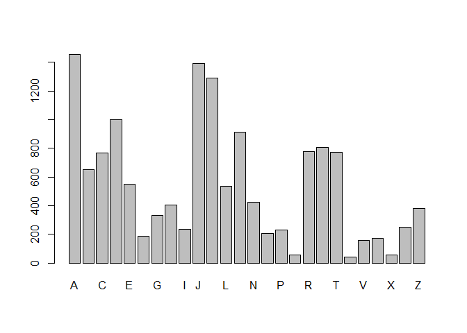
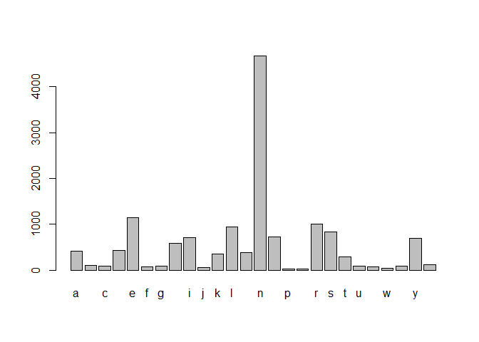
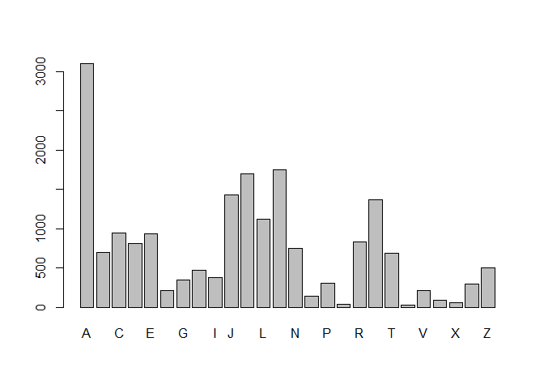
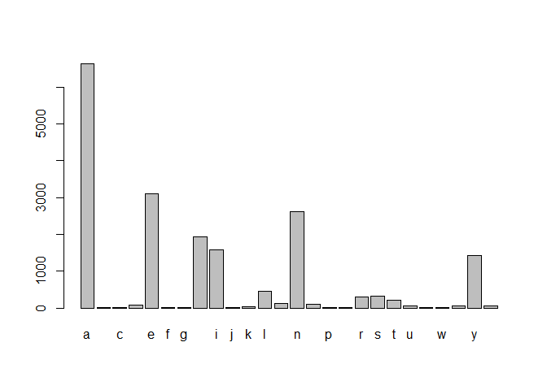
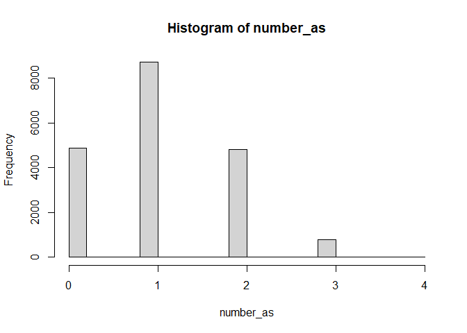
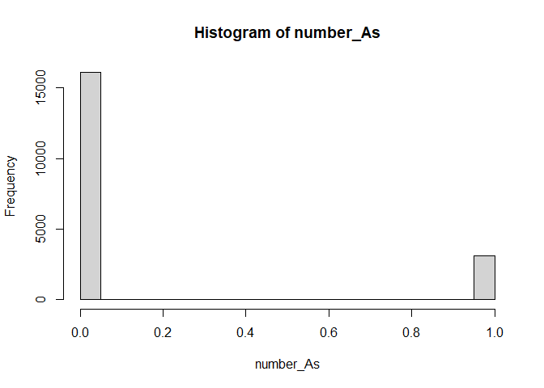
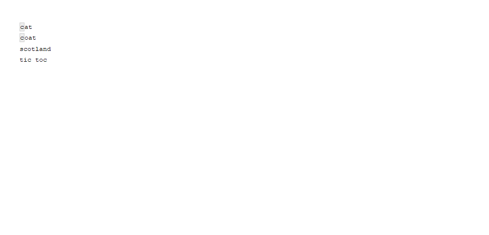

String manipulation with stringr in r
================
Mburu
5/31/2020

## Quotes

Let’s get started by entering some strings in R. In t he video you saw
that you use quotes to tell R to interpret something as a string. Both
double quotes (") and single (’) quotes work, but there are some
guidelines for which to use.

First, you should prefer double quotes (“) to single quotes (’). That
means, whenever you are defining a string your first intuition should be
to use”.

Unfortunately if your string has " inside it, R will interpret the
double quote as “this is the end of the string”, not as “this is the
character”". This is one time you can forget the first guideline and use
the single quote, ’, to define the string.

Finally, there are cases where you need both ’ and " inside the string.
In this case, fall back to the first guideline and use " to define the
string, but you’ll have to escape any double quotes inside the string
using a backslash (i.e. ").

To practice, you are going to enter a few lines from Lewis Carroll’s
Alice’s Adventures in Wonderland. Alice has just arrived at the tea
party…

``` r
# Define line1
line1 <-"The table was a large one, but the three were all crowded together at one corner of it:"

# Define line2
line2 <- '"No room! No room!" they cried out when they saw Alice coming.'

# Define line3
line3 <- '"There\'s plenty of room!" said Alice indignantly, and she sat down in a large arm-chair at one end of the table.'
```

## What you see isn’t always what you have

Take a look at line2, the string you just defined, by printing it:

line2 Even though you used single quotes so you didn’t have to escape
any double quotes, when R prints it, you’ll see escaped double quotes
(")\! R doesn’t care how you defined the string, it only knows what the
string represents, in this case, a string with double quotes inside.

When you ask R for line2 it is actually calling print(line2) and the
print() method for strings displays strings as you might enter them. If
you want to see the string it represents you’ll need to use a different
function: writeLines().

You can pass writeLines() a vector of strings and it will print them to
the screen, each on a new line. This is a great way to check the string
you entered really does represent the string you wanted.

  - Perfect\! The function cat() is very similar to writeLines(), but by
    default separates elements with a space, and will attempt to convert
    non-character objects to a string. We won’t use it in this course,
    but you might see it in other people’s code.

<!-- end list -->

``` r
# Putting lines in a vector
lines <- c(line1, line2, line3)

# Print lines
lines
```

    ## [1] "The table was a large one, but the three were all crowded together at one corner of it:"                           
    ## [2] "\"No room! No room!\" they cried out when they saw Alice coming."                                                  
    ## [3] "\"There's plenty of room!\" said Alice indignantly, and she sat down in a large arm-chair at one end of the table."

``` r
# Use writeLines() on lines
writeLines(lines)
```

    ## The table was a large one, but the three were all crowded together at one corner of it:
    ## "No room! No room!" they cried out when they saw Alice coming.
    ## "There's plenty of room!" said Alice indignantly, and she sat down in a large arm-chair at one end of the table.

``` r
# Write lines with a space separator
writeLines(lines,sep="")
```

    ## The table was a large one, but the three were all crowded together at one corner of it:"No room! No room!" they cried out when they saw Alice coming."There's plenty of room!" said Alice indignantly, and she sat down in a large arm-chair at one end of the table.

``` r
# Use writeLines() on the string "hello\n\U1F30D"
writeLines("hello\n\U1F30D")
```

    ## hello
    ## <U+0001F30D>

## Escape sequences

You might have been surprised at the output from the last part of the
last exercise. How did you get two lines from one string, and how did
you get that little globe? The key is the  

A sequence in a string that starts with a  is called an escape sequence
and allows us to include special characters in our strings. You saw one
escape sequence in the first exercise: " is used to denote a double
quote.

In `hello \n\U1F30D` there are two escape sequences: `\n` gives a
newline, and `\U` followed by up to 8 hex digits sequence denotes a
particular Unicode character.

Unicode is a standard for representing characters that might not be on
your keyboard. Each available character has a Unicode code point: a
number that uniquely identifies it. These code points are generally
written in hex notation, that is, using base 16 and the digits 0-9 and
A-F. You can find the code point for a particular character by looking
up a code chart. If you only need four digits for the codepoint, an
alternative escape sequence is `\u`.

When R comes across a  it assumes you are starting an escape, so if you
actually need a backslash in your string you’ll need the sequence \\

``` r
# Should display: To have a \ you need \\
writeLines("To have a \\ you need \\\\")
```

    ## To have a \ you need \\

``` r
# Should display: 
# This is a really 
# really really 
# long string
writeLines("This is a really \n really really \n long string")
```

    ## This is a really 
    ##  really really 
    ##  long string

``` r
# Use writeLines() with 
# "\u0928\u092e\u0938\u094d\u0924\u0947 \u0926\u0941\u0928\u093f\u092f\u093e"
writeLines("\u0928\u092e\u0938\u094d\u0924\u0947 \u0926\u0941\u0928\u093f\u092f\u093e")
```

    ## <U+0928><U+092E><U+0938><U+094D><U+0924><U+0947> <U+0926><U+0941><U+0928><U+093F><U+092F><U+093E>

## Using format() with numbers

The behavior of format() can be pretty confusing, so you’ll spend most
of this exercise exploring how it works.

Recall from the video, the scientific argument to format() controls
whether the numbers are displayed in fixed (scientific = FALSE) or
scientific (scientific = TRUE) format.

When the representation is scientific, the digits argument is the number
of digits before the exponent. When the representation is fixed, digits
controls the significant digits used for the smallest (in magnitude)
number. Each other number will be formatted to match the number of
decimal places in the smallest number. This means the number of decimal
places you get in your output depends on all the values you are
formatting\!

For example, if the smallest number is 0.0011, and digits = 1, then
0.0011 requires 3 places after the decimal to represent it to 1
significant digit, 0.001. Every other number will be formatted to 3
places after the decimal point.

So, how many decimal places will you get if 1.0011 is the smallest
number? You’ll find out in this exercise.

``` r
# Some vectors of numbers
percent_change  <- c(4, -1.91, 3.00, -5.002)
income <-  c(72.19, 1030.18, 10291.93, 1189192.18)
p_values <- c(0.12, 0.98, 0.0000191, 0.00000000002)

# Format c(0.0011, 0.011, 1) with digits = 1
format(c(0.0011, 0.011, 1), digits = 1)
```

    ## [1] "0.001" "0.011" "1.000"

``` r
# Format c(1.0011, 2.011, 1) with digits = 1

format(c(1.0011, 2.011, 1) , digits = 1)
```

    ## [1] "1" "2" "1"

``` r
# Format percent_change to one place after the decimal point

format(percent_change, digits = 2)
```

    ## [1] " 4.0" "-1.9" " 3.0" "-5.0"

``` r
# Format income to whole numbers
format(income, digits = 2)
```

    ## [1] "     72" "   1030" "  10292" "1189192"

``` r
# Format p_values in fixed format
format(p_values, scientific = FALSE)
```

    ## [1] "0.12000000000" "0.98000000000" "0.00001910000" "0.00000000002"

## Controlling other aspects of the string

Not only does format() control the way the number is represented, it
also controls some of the properties of the resulting string that affect
its display.

For example, by default format() will pad the start of the strings with
spaces so that the decimal points line up, which is really useful if you
are presenting the numbers in a vertical column. However, if you are
putting the number in the middle of a sentence, you might not want these
extra spaces. You can set trim = TRUE to remove them.

When numbers are long it can be helpful to “prettify” them, for example
instead of 1000000000 display 1,000,000,000. In this case a , is added
every 3 digits. This can be controlled by the big.interval and big.mark
arguments, e.g. format(1000000000, big.mark = “,”, big.interval = 3,
scientific = FALSE). These arguments are actually passed on to
prettyNum() so head there for any further details.

``` r
formatted_income <- format(income, digits = 2)

# Print formatted_income
formatted_income
```

    ## [1] "     72" "   1030" "  10292" "1189192"

``` r
# Call writeLines() on the formatted income
writeLines(formatted_income)
```

    ##      72
    ##    1030
    ##   10292
    ## 1189192

``` r
# Define trimmed_income
trimmed_income <- format(income, digits = 2, trim = TRUE)

# Call writeLines() on the trimmed_income

writeLines(trimmed_income)
```

    ## 72
    ## 1030
    ## 10292
    ## 1189192

``` r
# Define pretty_income
pretty_income <- format(income, digits = 2, big.mark = ",")

# Call writeLines() on the pretty_income
writeLines(pretty_income)
```

    ##        72
    ##     1,030
    ##    10,292
    ## 1,189,192

## formatC()

The function formatC() provides an alternative way to format numbers
based on C style syntax.

Rather than a scientific argument, formatC() has a format argument that
takes a code representing the required format. The most useful are:

“f” for fixed, “e” for scientific, and “g” for fixed unless scientific
saves space When using scientific format, the digits argument behaves
like it does in format(); it specifies the number of significant digits.
However, unlike format(), when using fixed format, digits is the number
of digits after the decimal point. This is more predictable than
format(), because the number of places after the decimal is fixed
regardless of the values being formatted.

formatC() also formats numbers individually, which means you always get
the same output regardless of other numbers in the vector.

The flag argument allows you to provide some modifiers that, for
example, force the display of the sign (flag = “+”), left align numbers
(flag = “-”) and pad numbers with leading zeros (flag = “0”). You’ll see
an example in this exercise

``` r
# From the format() exercise
x <- c(0.0011, 0.011, 1)
y <- c(1.0011, 2.011, 1)

# formatC() on x with format = "f", digits = 1
formatC(x, format = "f", digits = 1)
```

    ## [1] "0.0" "0.0" "1.0"

``` r
# formatC() on y with format = "f", digits = 1
formatC(y, format = "f", digits = 1)
```

    ## [1] "1.0" "2.0" "1.0"

``` r
# Format percent_change to one place after the decimal point
formatC(percent_change, format = "f", digits = 1)
```

    ## [1] "4.0"  "-1.9" "3.0"  "-5.0"

``` r
# percent_change with flag = "+"
formatC(percent_change, format = "f", digits = 1 , flag = "+")
```

    ## [1] "+4.0" "-1.9" "+3.0" "-5.0"

``` r
# Format p_values using format = "g" and digits = 2

formatC( p_values, format = "g", digits = 2)
```

    ## [1] "0.12"    "0.98"    "1.9e-05" "2e-11"

## Annotation of numbers

To get a handle on using paste(), you are going to annotate some of your
formatted number strings. The key points to remember are: The vectors
you pass to paste() are pasted together element by element, using the
sep argument to combine them. If the vectors passed to paste() aren’t
the same length, the shorter vectors are recycled up to the length of
the longest one. Only use collapse if you want a single string as
output. collapse specifies the string to place between different
elements.

``` r
pretty_percent <-  c("4", "-1.9", "3", "-5")
years <-  c("2010", "2011", "2012", "2013")
# Add $ to pretty_income
paste("$", pretty_income, sep = "")
```

    ## [1] "$       72" "$    1,030" "$   10,292" "$1,189,192"

``` r
# Add % to pretty_percent
paste( pretty_percent,"%", sep = "")
```

    ## [1] "4%"    "-1.9%" "3%"    "-5%"

``` r
# Create vector with elements like 2010: +4.0%`
year_percent <- paste(years, ": ", pretty_percent, "%", sep ="")

# Collapse all years into single string

paste(year_percent, collapse = ",")
```

    ## [1] "2010: 4%,2011: -1.9%,2012: 3%,2013: -5%"

# A very simple table

Combining format() and paste() is one way to display very simple tables.
Remember, since format() looks at all the values in a vector before
formatting, it uses a consistent format and will, by default, align on
the decimal point. This is usually the behavior you want for a column of
numbers in table.

format() can also take character vectors as input. In this case, you can
use the justify argument, specific to character input, to justify the
text to the left, right, or center.

You are going to put together the following table:

``` 
      Year 0   $       72
      Year 1   $    1,030
      Year 2   $   10,292
```

Project Lifetime $1,189,192 You’ll start by formatting the columns to
prepare to put them in a table, then you’ll use paste() to put together
each row. Then, you can use writeLines() to display each row on a new
line.

``` r
# Define the names vector
income_names <- c("Year 0", "Year 1", "Year 2", "Project Lifetime")

# Create pretty_income
pretty_income <- format(income, digits = 2, big.mark = ",")

# Create dollar_income
dollar_income <- paste("$", pretty_income, sep = "")

# Create formatted_names
formatted_names <- format(income_names, justify = "right")

# Create rows
rows <- paste(formatted_names, dollar_income, sep = "   ")

# Write rows
writeLines(rows)
```

    ##           Year 0   $       72
    ##           Year 1   $    1,030
    ##           Year 2   $   10,292
    ## Project Lifetime   $1,189,192

``` r
 toppings <- c("anchovies", "artichoke", "bacon", "breakfast bacon",
               "Canadian bacon", "cheese", "chicken", "chili peppers",
               "feta", "garlic", "green peppers", "grilled onions",
               "ground beef", "ham", "hot sauce", "meatballs", 
               "mushrooms", "olives", "onions", "pepperoni",
               "pineapple", "sausage", "spinach", "sun-dried tomato", 
               "tomatoes")


# Randomly sample 3 toppings
my_toppings <- sample(toppings, size = 3)

# Print my_toppings

my_toppings
```

    ## [1] "sausage"          "sun-dried tomato" "Canadian bacon"

``` r
# Paste "and " to last element: my_toppings_and
my_toppings_and <- paste(c("","","and "),my_toppings,sep = "" )

# Collapse with comma space: these_toppings
these_toppings <- paste(my_toppings_and, collapse = ", ")

# Add rest of sentence: my_order
my_order <- paste("I want to order a pizza with ", these_toppings,".", sep = "")

# Order pizza with writeLines()

writeLines(my_order)
```

    ## I want to order a pizza with sausage, sun-dried tomato, and Canadian bacon.

# Putting strings together with stringr

For your first stringr function, we’ll look at str\_c(), the c is short
for concatenate, a function that works like paste(). It takes vectors of
strings as input along with sep and collapse arguments.

There are two key ways str\_c() differs from paste(). First, the default
separator is an empty string, sep = "“, as opposed to a space, so it’s
more like paste0(). This is an example of a stringr function, performing
a similar operation to a base function, but using a default that is more
likely to be what you want. Remember in your pizza order, you had to set
sep =”" multiple times.

The second way str\_c() differs to paste() is in its handling of missing
values. paste() turns missing values into the string “NA”, whereas
str\_c() propagates missing values. That means combining any strings
with a missing value will result in another missing value. Let’s explore
this difference using your pizza order from the previous chapter.

  - This behavior is nice because you learn quickly when you might have
    missing values, rather than discovering later weird “NA”s inside
    your strings. Another stringr function that is useful when you may
    have missing values, is str\_replace\_na() which replaces missing
    values with any string you choose.

<!-- end list -->

``` r
library(stringr)

my_toppings <- c("cheese", NA, NA)
my_toppings_and <- paste(c("", "", "and "), my_toppings, sep = "")

# Print my_toppings_and
my_toppings_and
```

    ## [1] "cheese" "NA"     "and NA"

``` r
# Use str_c() instead of paste(): my_toppings_str
my_toppings_str <-  str_c(c("", "", "and "), my_toppings, sep = "")

# Print my_toppings_str
my_toppings_str
```

    ## [1] "cheese" NA       NA

``` r
# paste() my_toppings_and with collapse = ", "

paste(my_toppings_and, collapse = ", ")
```

    ## [1] "cheese, NA, and NA"

``` r
# str_c() my_toppings_str with collapse = ", "

str_c(my_toppings_str, collapse = ", ")
```

    ## [1] NA

# String length

Our next stringr function is str\_length(). str\_length() takes a vector
of strings as input and returns the number of characters in each string.
For example, try finding the number of characters in Batman’s name:

str\_length(c(“Bruce”, “Wayne”)) This is very similar to the base
function nchar() but you’ll see in the exercises str\_length() handles
factors in an intuitive way, whereas nchar() will just return an error.

Historically, nchar() was even worse, rather than returning an error if
you passed it a factor, it would return the number of characters in the
numeric encoding of the factor. Thankfully this behavior has been fixed,
but it was one of the original motivations behind str\_length().

Take your first look at babynames by asking if girls’ names are longer
than boys’ names.

  - The average length of the girls’ names in 2014 is about 1/3 of a
    character longer. Just be aware this is a naive average where each
    name is counted once, not weighted by how many babies received the
    name. A better comparison might be an average weighted by the n
    column in babynames.

<!-- end list -->

``` r
library(stringr)
library(babynames)
library(dplyr)

# Extracting vectors for boys' and girls' names
babynames_2014 <- filter(babynames, year == 2014)
boy_names <- filter(babynames_2014, sex == "M")$name
girl_names <- filter(babynames_2014, sex == "F")$name

# Take a look at a few boy_names
head(boy_names)
```

    ## [1] "Noah"    "Liam"    "Mason"   "Jacob"   "William" "Ethan"

``` r
# Find the length of all boy_names
boy_length <- str_length(boy_names)

# Take a look at a few lengths
head(boy_length)
```

    ## [1] 4 4 5 5 7 5

``` r
# Find the length of all girl_names
girl_length <- str_length(girl_names)

# Find the difference in mean length

 mean(girl_length) - mean(boy_length)
```

    ## [1] 0.3374758

``` r
# Confirm str_length() works with factors
head(str_length(factor(boy_names)))
```

    ## [1] 4 4 5 5 7 5

# Extracting substrings

The str\_sub() function in stringr extracts parts of strings based on
their location. As with all stringr functions, the first argument,
string, is a vector of strings. The arguments start and end specify the
boundaries of the piece to extract in characters.

For example, str\_sub(x, 1, 4) asks for the substring starting at the
first character, up to the fourth character, or in other words the first
four characters. Try it with my Batman’s name:

str\_sub(c(“Bruce”, “Wayne”), 1, 4) Both start and end can be negative
integers, in which case, they count from the end of the string. For
example, str\_sub(x, -4, -1), asks for the substring starting at the
fourth character from the end, up to the first character from the end,
i.e. the last four characters. Again, try it with Batman:

str\_sub(c(“Bruce”, “Wayne”), -4, -1) To practice, you’ll use str\_sub()
to look at popular first and last letters for names.

  - Did you see that “A” is the most popular first letter for both boys
    and girls, and the most popular last letter for girls. However, the
    most popular last letter for boys’ names was “n”. You might have
    seen substr() a base R function that is similar to str\_sub(). The
    big advantage of str\_sub() is the ability to use negative indexes
    to count from the end of a string.

<!-- end list -->

``` r
# Extract first letter from boy_names
boy_first_letter <- str_sub(boy_names, 1, 1)

# Tabulate occurrences of boy_first_letter

barplot(table(boy_first_letter))
```

<!-- -->

``` r
# Extract the last letter in boy_names, then tabulate
boy_last_letter <-  str_sub(boy_names, str_length(boy_names), str_length(boy_names))

barplot(table(boy_last_letter))
```

<!-- -->

``` r
# Extract the first letter in girl_names, then tabulate
girl_first_letter <- str_sub(girl_names, 1, 1)

barplot(table(girl_first_letter))
```

<!-- -->

``` r
# Extract the last letter in girl_names, then tabulate
girl_last_letter <- str_sub(girl_names, str_length(girl_names), str_length(girl_names))

barplot(table(girl_last_letter))
```

<!-- -->

# Detecting matches

str\_detect() is used to answer the question: Does the string contain
the pattern? It returns a logical vector of the same length as that of
the input vector string, with TRUE for elements that contain the pattern
and FALSE otherwise.

Let’s take a look at a simple example where you have a vector of strings
that represent pizza orders:

pizzas \<- c(“cheese”, “pepperoni”, “sausage and green peppers”) You can
ask which orders contain the pattern “pepper”, with

str\_detect(pizzas, pattern = fixed(“pepper”)) Try it out\! You should
get FALSE TRUE TRUE. Notice how both pepperoni and green peppers contain
the pattern of interest.

The output from str\_detect() can be used to count the number of
occurrences, or to subset out the strings that contain the pattern.
You’ll practice both to find the boys’ names that contain “zz”.

``` r
# Look for pattern "zz" in boy_names
contains_zz <- str_detect(boy_names, "zz")

# Examine str() of contains_zz
str(contains_zz)
```

    ##  logi [1:14047] FALSE FALSE FALSE FALSE FALSE FALSE ...

``` r
# How many names contain "zz"?
sum(contains_zz)
```

    ## [1] 16

``` r
# Which names contain "zz"?
boy_names[contains_zz]
```

    ##  [1] "Uzziah"    "Ozzie"     "Ozzy"      "Jazz"      "Uzziel"    "Chazz"    
    ##  [7] "Izzy"      "Azzam"     "Izzac"     "Izzak"     "Fabrizzio" "Jazziel"  
    ## [13] "Azzan"     "Izzaiah"   "Muizz"     "Yazziel"

``` r
boy_df <-  filter(babynames_2014, sex == "M")
# Which rows in boy_df have names that contain "zz"?
boy_df[contains_zz,]
```

    ## # A tibble: 16 x 5
    ##     year sex   name          n       prop
    ##    <dbl> <chr> <chr>     <int>      <dbl>
    ##  1  2014 M     Uzziah       67 0.0000328 
    ##  2  2014 M     Ozzie        62 0.0000303 
    ##  3  2014 M     Ozzy         57 0.0000279 
    ##  4  2014 M     Jazz         21 0.0000103 
    ##  5  2014 M     Uzziel       21 0.0000103 
    ##  6  2014 M     Chazz        17 0.00000832
    ##  7  2014 M     Izzy         16 0.00000783
    ##  8  2014 M     Azzam        14 0.00000685
    ##  9  2014 M     Izzac        13 0.00000636
    ## 10  2014 M     Izzak         8 0.00000391
    ## 11  2014 M     Fabrizzio     7 0.00000342
    ## 12  2014 M     Jazziel       6 0.00000293
    ## 13  2014 M     Azzan         5 0.00000245
    ## 14  2014 M     Izzaiah       5 0.00000245
    ## 15  2014 M     Muizz         5 0.00000245
    ## 16  2014 M     Yazziel       5 0.00000245

# Subsetting strings based on match

Since detecting strings with a pattern and then subsetting out those
strings is such a common operation, stringr provides a function
str\_subset() that does that in one step.

For example, let’s repeat our search for “pepper” in our pizzas using
str\_subset():

pizzas \<- c(“cheese”, “pepperoni”, “sausage and green peppers”)
str\_subset(pizzas, pattern = fixed(“pepper”)) We get a new vector of
strings, but it only contains those original strings that contained the
pattern.

str\_subset() can be easily confused with str\_extract(). str\_extract()
returns a vector of the same length as that of the input vector, but
with only the parts of the strings that matched the pattern. This won’t
be very interesting until we know about regular expressions, so we’ll
talk more about this in Chapter 3.

For now, you’ll repeat part of the last exercise using str\_subset() and
then find a few other interesting names.

``` r
# Find boy_names that contain "zz"
str_subset(boy_names, pattern = fixed("zz"))
```

    ##  [1] "Uzziah"    "Ozzie"     "Ozzy"      "Jazz"      "Uzziel"    "Chazz"    
    ##  [7] "Izzy"      "Azzam"     "Izzac"     "Izzak"     "Fabrizzio" "Jazziel"  
    ## [13] "Azzan"     "Izzaiah"   "Muizz"     "Yazziel"

``` r
# Find girl_names that contain "zz"
str_subset(girl_names, pattern = fixed("zz"))
```

    ##  [1] "Izzabella"  "Jazzlyn"    "Jazzlynn"   "Lizzie"     "Izzy"      
    ##  [6] "Lizzy"      "Mazzy"      "Izzabelle"  "Jazzmine"   "Jazzmyn"   
    ## [11] "Jazzelle"   "Jazzmin"    "Izzah"      "Jazzalyn"   "Jazzmyne"  
    ## [16] "Izzabell"   "Jazz"       "Mazzie"     "Alyzza"     "Izza"      
    ## [21] "Izzie"      "Jazzlene"   "Lizzeth"    "Jazzalynn"  "Jazzy"     
    ## [26] "Alizzon"    "Elizzabeth" "Jazzilyn"   "Jazzlynne"  "Jizzelle"  
    ## [31] "Izzabel"    "Izzabellah" "Izzibella"  "Jazzabella" "Jazzabelle"
    ## [36] "Jazzel"     "Jazzie"     "Jazzlin"    "Jazzlyne"   "Aizza"     
    ## [41] "Brizza"     "Ezzah"      "Fizza"      "Izzybella"  "Rozzlyn"

``` r
# Find girl_names that contain "U"
starts_U <- str_subset(girl_names, pattern = fixed("U"))
starts_U
```

    ##  [1] "Unique"  "Uma"     "Unknown" "Una"     "Uriah"   "Ursula"  "Unity"  
    ##  [8] "Umaiza"  "Urvi"    "Ulyana"  "Ula"     "Udy"     "Urwa"    "Ulani"  
    ## [15] "Umaima"  "Umme"    "Ugochi"  "Ulyssa"  "Umika"   "Uriyah"  "Ubah"   
    ## [22] "Umaira"  "Umi"     "Ume"     "Urenna"  "Uriel"   "Urijah"  "Uyen"

``` r
# Find girl_names that contain "U" and "z"
str_subset(starts_U, pattern = fixed("z"))
```

    ## [1] "Umaiza"

# Counting matches

Another stringr function that takes a vector of strings and a pattern is
str\_count(). str\_count() answers the question “How many times does the
pattern occur in each string?”. It always returns an integer vector of
the same length as that of the input vector.

If you count the occurrences of “pepper” in your pizzas, you’ll find no
occurrences in the first, and one each in the second and third,

pizzas \<- c(“cheese”, “pepperoni”, “sausage and green peppers”)
str\_count(pizzas, pattern = fixed(“pepper”)) Perhaps a little more
interesting is to count how many “e”s occur in each order

str\_count(pizzas, pattern = fixed(“e”)) You’ll use str\_count() to find
some names with lots of repeated letters.

``` r
# Count occurrences of "a" in girl_names
number_as <- str_count(girl_names, pattern = fixed("a"))

# Count occurrences of "A" in girl_names
number_As <- str_count(girl_names, pattern = fixed("A"))

# Histograms of number_as and number_As
hist(number_as)
```

<!-- -->

``` r
hist(number_As)
```

<!-- -->

``` r
# Find total "a" + "A"
total_as <- number_as + number_As

# girl_names with more than 4 a's
girl_names[total_as>4]
```

    ## [1] "Aaradhana"

# Parsing strings into variables

A common use for str\_split() is to pull apart raw string data into more
useful variables. In this exercise you’ll start by pulling apart a date
range, something like “23.01.2017 - 29.01.2017”, into separate variables
for the start of the range, “23.01.2017”, and the end of the range,
“29.01.2017”.

Remember, if the simplify argument is FALSE (the default) you’ll get
back a list of the same length as that of the input vector. More
commonly, you’ll want to pull out the first piece (or second piece etc.)
from every element, which is easier if you specify simplify = TRUE and
get a matrix as output. You’ll explore both of these output types in
this exercise.

``` r
# Some date data
date_ranges <- c("23.01.2017 - 29.01.2017", "30.01.2017 - 06.02.2017")

# Split dates using " - "
split_dates <-  str_split(date_ranges, pattern = fixed(" - "))
split_dates
```

    ## [[1]]
    ## [1] "23.01.2017" "29.01.2017"
    ## 
    ## [[2]]
    ## [1] "30.01.2017" "06.02.2017"

``` r
# Some date data
date_ranges <- c("23.01.2017 - 29.01.2017", "30.01.2017 - 06.02.2017")

# Split dates with n and simplify specified
split_dates_n <- str_split(date_ranges, 
                           pattern = fixed(" - "), n = 2, simplify = TRUE)
split_dates_n
```

    ##      [,1]         [,2]        
    ## [1,] "23.01.2017" "29.01.2017"
    ## [2,] "30.01.2017" "06.02.2017"

``` r
# From previous step
date_ranges <- c("23.01.2017 - 29.01.2017", "30.01.2017 - 06.02.2017")
split_dates_n <- str_split(date_ranges, fixed(" - "), n = 2, simplify = TRUE)

# Subset split_dates_n into start_dates and end_dates
start_dates <- split_dates_n[,1]
end_dates <- split_dates_n[,2]

# Split start_dates into day, month and year pieces

str_split(start_dates, fixed("."),  simplify = TRUE)
```

    ##      [,1] [,2] [,3]  
    ## [1,] "23" "01" "2017"
    ## [2,] "30" "01" "2017"

``` r
both_names <- c("Box, George", "Cox, David")

# Split both_names into first_names and last_names
both_names_split <- str_split(both_names, fixed(", "), n = 2, simplify = TRUE)

# Get first names
first_names <- both_names_split[, 2]

# Get last names
last_names <- both_names_split[, 1]
```

## Some simple text statistics

Generally, specifying simplify = TRUE will give you output that is
easier to work with, but you’ll always get n pieces (even if some are
empty, "").

Sometimes, you want to know how many pieces a string can be split into,
or you want to do something with every piece before moving to a simpler
structure. This is a situation where you don’t want to simplify and
you’ll have to process the output with something like lapply().

As an example, you’ll be performing some simple text statistics on your
lines from Alice’s Adventures in Wonderland from Chapter 1. Your goal
will be to calculate how many words are in each line, and the average
length of words in each line.

To do these calculations, you’ll need to split the lines into words. One
way to break a sentence into words is to split on an empty space " “.
This is a little naive because, for example, it wouldn’t pick up words
separated by a newline escape sequence like in”two\\nwords", but since
this situation doesn’t occur in your lines, it will do.

``` r
lines <- c("The table was a large one, but the three were all crowded together at one corner of it:",
           "\\No room! No room!\ they cried out when they saw Alice coming.",
           "\\There’s plenty of room!\ said Alice indignantly, and she sat down in a large arm-chair at one end of the table.")


# Split lines into words
words <- str_split(lines, patter = fixed(" "))

# Number of words per line
lapply(words, length)
```

    ## [[1]]
    ## [1] 18
    ## 
    ## [[2]]
    ## [1] 12
    ## 
    ## [[3]]
    ## [1] 21

``` r
# Number of characters in each word
word_lengths <- lapply(words, nchar)
  
  
# Average word length per line
lapply( word_lengths, mean)
```

    ## [[1]]
    ## [1] 3.888889
    ## 
    ## [[2]]
    ## [1] 4.166667
    ## 
    ## [[3]]
    ## [1] 4.333333

# Replacing to tidy strings

You’ve seen one common strategy to pull variables out of strings is to
split the string based on a pattern. Sometimes, it’s easier to just
replace the parts you don’t want with an empty string "". This is also a
common strategy to clean strings up, for example, to remove unwanted
punctuation or white space.

In this exercise you’ll pull out some numbers by replacing the part of
the string that isn’t a number, you’ll also play with the format of some
phone numbers. Pay close attention to the difference between
str\_replace() and str\_replace\_all().

``` r
# Some IDs
ids <- c("ID#: 192", "ID#: 118", "ID#: 001")

# Replace "ID#: " with ""
id_nums <- str_replace(ids, 'ID#: ',"" )

# Turn id_nums into numbers
id_ints <- as.numeric(id_nums)
# Some (fake) phone numbers
phone_numbers <- c("510-555-0123", "541-555-0167")

# Use str_replace() to replace "-" with " "

str_replace(phone_numbers, "-", " ")
```

    ## [1] "510 555-0123" "541 555-0167"

``` r
# Use str_replace_all() to replace "-" with " "
str_replace_all(phone_numbers, "-", " ")
```

    ## [1] "510 555 0123" "541 555 0167"

``` r
# Turn phone numbers into the format xxx.xxx.xxxx
str_replace_all(phone_numbers, "-", ".")
```

    ## [1] "510.555.0123" "541.555.0167"

# Review

You’ve covered a lot of stringr functions in this chapter:

str\_c() str\_length() str\_sub() str\_detect() str\_subset()
str\_count() str\_split() str\_replace() As a review we’ve got a few
tasks for you to do with some DNA sequences. We’ve put three sequences,
corresponding to three genes, from the genome of Yersinia pestis – the
bacteria that causes bubonic plague – into the vector genes.

Each string represents a gene, each character a particular nucleotide:
Adenine, Cytosine, Guanine or Thymine.

We aren’t going to tell you which function to use. It’s up to you to
choose the right one and specify the needed arguments. Good luck\!

``` r
# Find the number of nucleotides in each sequence
genes <- readRDS("C:/Users/mmburu/Desktop/data_camp/data_camp/R/string-manipulation-with-stringr-in-r/dna.rds")
str_length(genes)
```

    ## [1] 441 462 993

``` r
# Find the number of A's occur in each sequence
str_count(genes, pattern = fixed("A"))
```

    ## [1] 118 117 267

``` r
# Return the sequences that contain "TTTTTT"

str_subset(genes, pattern = fixed("TTTTTT"))
```

    ## [1] "TTAAGGAACGATCGTACGCATGATAGGGTTTTGCAGTGATATTAGTGTCTCGGTTGACTGGATCTCATCAATAGTCTGGATTTTGTTGATAAGTACCTGCTGCAATGCATCAATGGATTTACACATCACTTTAATAAATATGCTGTAGTGGCCAGTGGTGTAATAGGCCTCAACCACTTCTTCTAAGCTTTCCAATTTTTTCAAGGCGGAAGGGTAATCTTTGGCACTTTTCAAGATTATGCCAATAAAGCAGCAAACGTCGTAACCCAGTTGTTTTGGGTTAACGTGTACACAAGCTGCGGTAATGATCCCTGCTTGCCGCATCTTTTCTACTCTTACATGAATAGTTCCGGGGCTAACAGCGAGGTTTTTGGCTAATTCAGCATAGGGTGTGCGTGCATTTTCCATTAATGCTTTCAGGATGCTGCGATCGAGATTATCGATCTGATAAATTTCACTCAT"

``` r
# Replace all the "A"s in the sequences with a "_"

str_replace_all(genes, pattern = fixed("A"), "_")
```

    ## [1] "TT_G_GT___TT__TCC__TCTTTG_CCC___TCTCTGCTGG_TCCTCTGGT_TTTC_TGTTGG_TG_CGTC__TTTCT__T_TTTC_CCC__CCGTTG_GC_CCTTGTGCG_TC__TTGTTG_TCC_GTTTT_TG_TTGC_CCGC_G___GTGTC_T_TTCTG_GCTGCCT___CC__CCGCCCC___GCGT_CTTGGG_T___TC_GGCTTTTGTTGTTCG_TCTGTTCT__T__TGGCTGC__GTT_TC_GGT_G_TCCCCGGC_CC_TG_GTGG_TGTC_CG_TT__CC_C_GGCC_TTC_GCGT__GTTCGTCC__CTCTGGGCC_TG__GT_TTTCTGT_G____CCC_GCTTCTTCT__TTT_TCCGCT___TGTTC_GC__C_T_TTC_GC_CT_CC__GCGT_CTGCC_CTT_TC__CGTT_TGTC_GCC_T"                                                                                                                                                                                                                                                                                                                                                                                                                                                                                                                                                                        
    ## [2] "TT__GG__CG_TCGT_CGC_TG_T_GGGTTTTGC_GTG_T_TT_GTGTCTCGGTTG_CTGG_TCTC_TC__T_GTCTGG_TTTTGTTG_T__GT_CCTGCTGC__TGC_TC__TGG_TTT_C_C_TC_CTTT__T___T_TGCTGT_GTGGCC_GTGGTGT__T_GGCCTC__CC_CTTCTTCT__GCTTTCC__TTTTTTC__GGCGG__GGGT__TCTTTGGC_CTTTTC__G_TT_TGCC__T___GC_GC___CGTCGT__CCC_GTTGTTTTGGGTT__CGTGT_C_C__GCTGCGGT__TG_TCCCTGCTTGCCGC_TCTTTTCT_CTCTT_C_TG__T_GTTCCGGGGCT__C_GCG_GGTTTTTGGCT__TTC_GC_T_GGGTGTGCGTGC_TTTTCC_TT__TGCTTTC_GG_TGCTGCG_TCG_G_TT_TCG_TCTG_T___TTTC_CTC_T"                                                                                                                                                                                                                                                                                                                                                                                                                                                                                                                                                   
    ## [3] "_TG______C__TTT_TCC_____C__C__C___TC_GCTTCGT____TC_TTCTTTTCCCGCC__TT_G_GC__C__CTTGGCTTG_TCG__GTCC_GGCTCCT_TTTTG_GCCGTGTGGGTG_TGG__CCC__G_T__CCTTTCTGGTTCTG_G___GCGGT_C_GGT____GTT__GTC_TTGCCGG_TTC__CTTTTG__GTTGT_C_TTC_TT_GCG__GTGG___CGT____CCTT_GGGCGTTTTG_TTTTGGTGCTG_CC__GGGGTGT_T_CCC_T_TG___GC_TTGCGCCC_G_TG__G_TCGCCTG_GTGCT_TTC_TTCTGT_T_TGT_G_TC_GTGGG_TTGGG__CGGGTT_TGGGGG_CGGTG__CGT__CCTGGCTT_CCTG___TCG_CTGTT__C__G_TTT_TGC_GCG_TT___G___CTG__GCGGCG_TC_GTGCTG_GTTTGGTGTG__GCCTTTCCTGCCGG_TC_T_TTC_GTTT_TCC_C_GTG___GCCTGCGGGCC_G_TTCCCTG_TTT_G_TGCT___GGCCGTG__CGTGC__TTGCC___G_GTT_GGTGCTGTCTTCCTT_T_GGG_TTGGTGGC___TTGGC_G_TGGTC__TCCC_TG_TGTTCGTGCGCC_G_TT_TG_TG_TTGG_CCTCTCCG_GTGCGG__GGTTTCTCTGG_TT___CGGCG_C_TT_TTGTCTGG__CCC__T_TTGG__G_TGCCTTTG_G_T_TCTTCT_TGGG__TTCGTGTTG_TGCCG__GCTCTT__GCGTC_GTT_GCCCTG_CTGGCG_TG__G_CCGCTTGG__CTGG__TGGC_TC__TC_CTGTTGCGCGGTG___TGCC_C___CT_TCGGGGG_GGT_TTGGTC_GTCCCGCTT_GTG_TGTT_TTGCTGC_G___C__C_T_TTGGTC_GGTGC__TGTGGTGTTTGGGGCCCTG___TC_GCG_G___GTTG_TGGCCTGCTGT__"

# Final challenges

You’ve mastered using stringr functions on their own, but by combining
multiple operations together in sequence you can achieve quite
complicated manipulations.

As the final exercise we want to expose you to the power of combining
operations. You’ll complete two tasks:

You’ll turn a vector of full names, like “Bruce Wayne”, into abbreviated
names like “B. Wayne”. This requires combining str\_split(), str\_sub()
and str\_c().

You’ll compare how many boy names end in “ee” compared to girl names.
This requires combining str\_sub() with str\_detect() along with the
base function table().

``` r
# Define some full names
names <- c("Diana Prince", "Clark Kent")

# Split into first and last names
names_split <- str_split(names, pattern = fixed(" "), simplify = TRUE)

# Extract the first letter in the first name
abb_first <-  str_sub(names_split[, 1], 1, 1)

# Combine the first letter ". " and last name

str_c(abb_first, names_split[, 2], sep = ".")
```

    ## [1] "D.Prince" "C.Kent"

``` r
# Use all names in babynames_2014
all_names <- babynames_2014$name

# Get the last two letters of all_names
last_two_letters <- str_sub(all_names, -2, -1)

# Does the name end in "ee"?
ends_in_ee <- str_detect(last_two_letters, pattern = fixed("ee"))

# Extract rows and "sex" column
sex <- babynames_2014[ends_in_ee,]$sex

# Display result as a table
table(sex)
```

    ## sex
    ##   F   M 
    ## 572  84

Matching the start or end of the string rebus provides START and END
shortcuts to specify regular expressions that match the start and end of
the string. These are also known as anchors. You can try it out just by
typing

START You’ll see the output <regex> ^. The <regex> denotes this is a
special regex object and it has the value ^. ^ is the character used in
the regular expression language to denote the start of a string.

The special operator provided by rebus, %R% allows you to compose
complicated regular expressions from simple pieces. When you are reading
rebus code, think of %R% as “then”. For example, you could combine START
with c,

START %R% “c” to match the pattern “the start of string then a c”, or in
other words: strings that start with c. In rebus, if you want to match a
specific character, or a specific sequence of characters, you simply
specify them as a string, e.g. surround them with ".

``` r
library(rebus)
# Some strings to practice with
x <- c("cat", "coat", "scotland", "tic toc")

# Print END

END
```

    ## <regex> $

``` r
# Run me
str_view(x, pattern = START %R% "c")
```

<!-- -->
