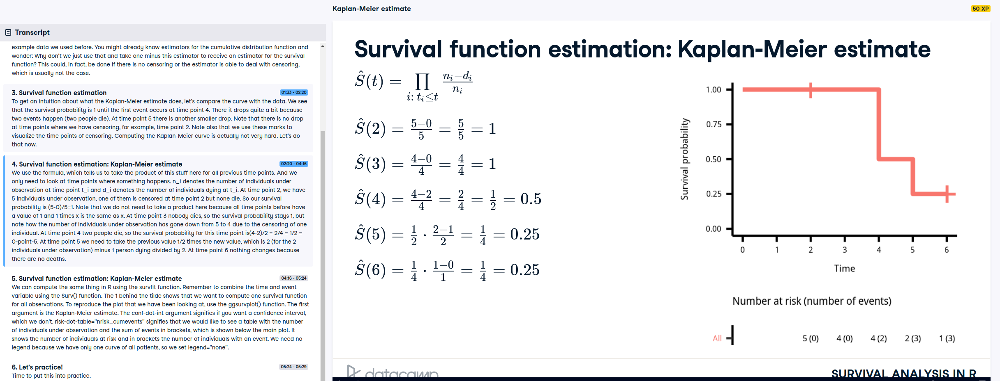

```{r setup, include=FALSE}
knitr::opts_chunk$set(echo = TRUE, 
                      warning = FALSE,
                      message = FALSE)
library(tidyverse)
library(survival)
library(mTools)
library(survminer)
```

## What is Survival Analysis?

### Introducing the GBSG2 dataset

In this course, we will frequently use the GBSG2 dataset. This dataset contains information on breast cancer patients and their survival. In this exercise, we will take a first look at it in R.

The TH.data package is loaded for you in this exercise.

```{r}
# Check out the help page for this dataset
help(GBSG2, package = "TH.data")
# Load the data
data(GBSG2, package = "TH.data")

# Look at the summary of the dataset
summary(GBSG2)
```

### Digging into the GBSG2 dataset 1

In the previous exercise, we learned about the GBSG2 dataset. Let's dig a bit deeper into it to understand the variables we will use in the following.

The cens variable contains values that indicate whether or not a person in the study has died. In this exercise, you'll explore these censored values.

```{r}
# Count censored and uncensored data
num_cens <- table(GBSG2$cens)
num_cens

# Create barplot of censored and uncensored data
barplot(num_cens)


```

### Using the Surv() function for GBSG2

In the video, we learned about the Surv() function, which generates a Surv object. Let's look a little deeper into what a Surv object actually is. We will use the GBSG2 data again.

The survival package and GBSG2 data are loaded for you in this exercise.

```{r}

# Create Surv-Object
sobj <- Surv( GBSG2$time, GBSG2$cens)

# Look at 10 first elements
sobj[1:10]

# Look at summary
summary(sobj)

# Look at structure
str(sobj)
```


### The UnempDur dataset

The UnempDur dataset contains information on how long people stay unemployed. In this case, the event (finding a job) is something positive. This information is stored in the censor1 variable, which has a value of 1 if an individual was re-employed at a full-time job. The spell variable indicates the length of time an individual was unemployed in number of two-week intervals.

In this exercise, you'll explore these censored values and create a Surv object, just as you did in the previous exercises with the GBSG2 dataset.


```{r}
# Load the UnempDur data
data(UnempDur, package = "Ecdat")

# Count censored and uncensored data
cens_employ_ft <- table(UnempDur$censor1)
cens_employ_ft

# Create barplot of censored and uncensored data
barplot(cens_employ_ft)

# Create Surv-Object
sobj <- Surv(UnempDur$spell, UnempDur$censor1)

# Look at 10 first elements
head(sobj, 10)
```

## Estimation of survival curves

### First Kaplan-Meier estimate

In this exercise, we will use the same data shown in the video. We will take a look at the survfit() function and the object it generates. This exercise will help you explore the survfit object.

####  Kaplan-Meier estimate Calculation

 

The survival package is loaded for you in this exercise.

```{r}
# Create time and event data
time <- c(5, 6, 2, 4, 4)
event <- c(1, 0, 0, 1, 1)

# Compute Kaplan-Meier estimate
km <- survfit(Surv(time, event) ~ 1)
km

# Take a look at the structure
str(km)

# Create data.frame
data.frame(time = km$time, n.risk = km$n.risk, n.event = km$n.event,
           n.censor = km$n.censor, surv = km$surv) %>%
    data_table()

```


### Exercise ignoring censoring

You throw a party and at 1 a.m. guests suddenly start dancing. You are curious to analyze how long your guests will dance for and start collecting data. The problem is that you get tired and go to bed after a while.

You obtain the following right censored dancing times data given in dancedat:

name is the name of your friend.
time is the right-censored dancing time.
obs_end indicates if you observed the end of your friends dance (1) or if you went to sleep before they stopped dancing (0).
You start analyzing the data in the morning, but you are tired and, at first, ignore the fact that you have censored observations. Then you remember this course on DataCamp and do it correctly.

The survival package is loaded for you in this exercise.

```{r}
# Create dancedat data
dancedat <- data.frame(
    name = c("Chris", "Martin", "Conny", "Desi", "Reni", "Phil", 
             "Flo", "Andrea", "Isaac", "Dayra", "Caspar"),
    time = c(20, 2, 14, 22, 3, 7, 4, 15, 25, 17, 12),
    obs_end = c(1, 1, 0, 1, 1, 1, 1, 1, 0, 0, 0))

# Estimate the survivor function pretending that all censored observations are actual observations.
km_wrong <- survfit(Surv(time) ~ 1, data = dancedat)

# Estimate the survivor function from this dataset via kaplan-meier.
km <- survfit(Surv(time, obs_end) ~ 1, data = dancedat)

# Plot the two and compare
ggsurvplot_combine(list(correct = km, 
                        wrong = km_wrong))
```


### Estimating and visualizing a survival curve

Let's take a look at the survival of breast cancer patients.

In this exercise, we work with the GBSG2 dataset again.

The survival and survminer packages and the GBSG2 data are loaded for you in this exercise.

```{r}
# Kaplan-Meier estimate
km <- survfit(Surv(time, cens)~1, data = GBSG2)

# plot of the Kaplan-Meier estimate
ggsurvplot(km)

# add the risk table to plot
ggsurvplot(km, risk.table = TRUE)

# add a line showing the median survival time
ggsurvplot(km, risk.table = TRUE, surv.median.line = "hv")
```


### Estimating median survival from a Weibull model

We can now estimate the survival of the breast cancer patients in the GBSG2 data using a Weibull model (function survreg()). Remember, the Weibull model estimates a smooth survival function instead of a step function, which is what the Kaplan-Meier method estimates.

The predict() function with type = "quantile" allows us to compute the quantiles of the distribution function. We will use this to compute the median survival.

The survival package and the GBSG2 data are loaded for you in this exercise.

- Estimate a Weibull model for the breast cancer patients.
- Compute the median survival from this model using the predict() function with type = "quantile"

```{r}
# Weibull model
wb <- survreg(Surv(time, cens) ~ 1, data = GBSG2)

# Compute the median survival from the model
predict(wb, type = "quantile", p = 0.5, newdata = data.frame(1))
```

Survival curve quantiles from a Weibull model
We can now estimate the survival of the breast cancer patients in the GBSG2 data using a Weibull model.

The predict() function with type = "quantile" allows us to compute the quantiles of the distribution function. As we learned in this course so far, the survival function is 1 - the distribution function ( S = 1 -D), so we can easily compute the quantiles of the survival function using the predict() function.

The survival package and GBSG2 data are loaded for you in this exercise.

- Estimate a Weibull model for the breast cancer patients.
- Get the time point at which the probability of surviving longer than that time point is 70 Percent (using the predict() function with type = "quantile").

```{r}
# Weibull model
wb <- survreg(Surv(time, cens) ~ 1, data = GBSG2)

# 70 Percent of patients survive beyond time point...
predict(wb, type = "quantile", p = 1-.7, newdata = data.frame(1))

```

### Estimating the survival curve with survreg()

We can now estimate the survival of the breast cancer patients in the GBSG2 data using a Weibull model.

The Weibull distribution has two parameters, which determine the form of the survival curve.

The survival package and the GBSG2 data are loaded for you in this exercise.

- Estimate a Weibull model for the breast cancer patients.
- Compute the estimated survival curve from the model using the predict() function with type = "quantile".
- Create a data.frame with the time points and corresponding survival probabilities.
- Look at the first few lines of the result using the function head().

```{r}
# Weibull model
wb <- survreg(Surv(time, cens) ~ 1, GBSG2)

# Retrieve survival curve from model probabilities 
surv <- seq(.99, .01, by = -.01)

# Get time for each probability
t <- predict(wb, type = "quantile", p = 1 - surv, newdata = data.frame(1))

# Create data frame with the information
surv_wb <- data.frame(time = t, surv = surv)

# Look at first few lines of the result
head(surv_wb ) %>%
    data_table()
```


### Comparing Weibull model and Kaplan-Meier estimate
Let's plot the survival curve we get from the Weibull model for the GBSG2 data!

The survival and survminer packages and the GBSG2 data are loaded for you in this exercise.

- Compute the Weibull model for the GBSG2 data.
- Compute the survival curve from the model.
- Plot the survival curves you get from the two estimates.

```{r}
# Weibull model
wb <- survreg(Surv(time, cens) ~ 1, GBSG2)

# Retrieve survival curve from model
surv <- seq(.99, .01, by = -.01)

# Get time for each probability
t <- predict(wb, type = "quantile", p = 1-surv, newdata = data.frame(1))

# Create data frame with the information needed for ggsurvplot_df
surv_wb <- data.frame(time = t, 
                      surv = surv, 
                      upper = NA, 
                      lower = NA, 
                      std.err = NA)

# Plot
ggsurvplot_df(fit = surv_wb, 
              surv.geom = geom_line)
```

## The Weibull model

### Interpreting coefficients
We have a dataset of lung cancer patients. In this exercise, we want to know if the sex of the patients is associated with their survival time.

The survival package and the dataset are already loaded for you.

- Use the survreg() function to estimate a Weibull model.
- Women survive longer from
```{r}
# Look at the data set
load("dat.rda")
str(dat)

# Estimate a Weibull model
wbmod <- survreg(Surv(time, status) ~ sex, data = dat)
broom::tidy(wbmod) %>%
    data_table()
```


### Compute Weibull model

For a Weibull model with covariates, we can compute the survival curve just as we did for the Weibull model without covariates. The only thing we need to do is specify the covariate values for a given survival curve in the predict() function. This can be done with the argument newdata.

- Compute a Weibull model for the GBSG2 dataset with covariate horTh to analyze the effect of hormonal therapy on the survival of patients.
- Compute the survival curve for patients who receive hormonal therapy.
- Take a look at the survival curve with str().

```{r}
# Weibull model
wbmod <- survreg(Surv(time, cens) ~ horTh, data = GBSG2)

# Retrieve survival curve from model
surv <- seq(.99, .01, by = -.01)
t_yes <- predict(wbmod, type = "quantile", p = 1 - surv,
  newdata = data.frame(horTh = "yes"))

# Take a look at survival curve
str(t_yes)
```

Computing a Weibull model and the survival curves
In this exercise we will reproduce the example from the video using the following steps:

- Compute Weibull model
- Decide on "imaginary patients"
- Compute survival curves
- Create data.frame with survival curve information
- Plot
In this exercise, we will focus on the first three steps. The next exercise will cover the remaining steps.

The survival, survminer, and reshape2 packages and the GBSG2 data are loaded for you in this exercise.

- Compute the Weibull model for the GBSG2 data with covariates horTh and tsize.
- Decide on "imaginary patients": the two levels of horTh and the 25%, 50%, and 75% quantiles of tsize.

```{r}
# Weibull model
wbmod <- survreg(Surv(time, cens) ~horTh  + tsize, data = GBSG2)

# Imaginary patients
newdat <- expand.grid(
  horTh = levels(GBSG2$horTh),
  tsize = quantile(GBSG2$tsize, probs = c(.25, 0.5, 0.75)))
data_table(newdat)

# Compute survival curves
surv <- seq(.99, .01, by = -.01)
t <- predict(wbmod, type = "quantile", p = 1 - surv,
  newdata = newdat)

# How many rows and columns does t have?
dim(t)
```

### Visualising a Weibull model
In this exercise we will reproduce the example from the video following the steps:


```{r}
# Use cbind() to combine the information in newdat with t
surv_wbmod_wide <- cbind(newdat, t)
  
# Use melt() to bring the data.frame to long format
library(reshape2)
surv_wbmod <- melt(surv_wbmod_wide, 
                   id.vars = c("horTh", "tsize"), 
                   variable.name = "surv_id", 
                   value.name = "time")

# Use surv_wbmod$surv_id to add the correct survival probabilities surv
surv_wbmod$surv <- surv[as.numeric(surv_wbmod$surv_id)]

# Add columns upper, lower, std.err, and strata to the data.frame
surv_wbmod[, c("upper", "lower", "std.err", "strata")] <- NA

# Plot the survival curves
ggsurvplot_df(surv_wbmod, surv.geom = geom_line,
  linetype = "horTh", color = "tsize", legend.title = NULL)

```

