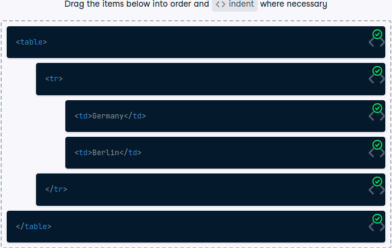
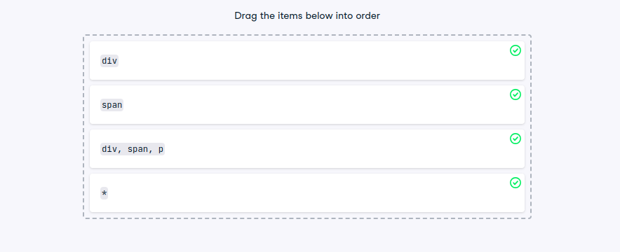
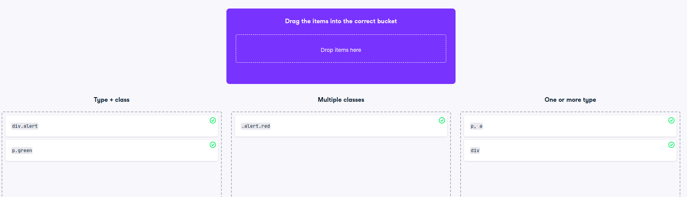
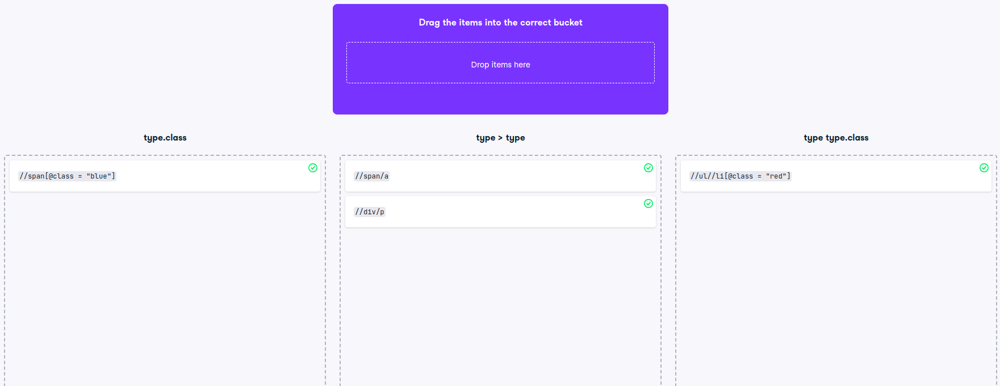

```{r setup, include=FALSE}
knitr::opts_chunk$set(echo = TRUE, 
                      message = FALSE,
                      warning = FALSE)
```


## Introduction to HTML and Web Scraping

### Reading HTML 

```{r}
library(tidyverse)
library(rvest)
library(xml2)
html_excerpt_raw <- '
<html> 
  <body> 
    <h1>Web scraping is cool</h1>
    <p>It involves writing code – be it R or Python.</p>
    <p><a href="https://datacamp.com">DataCamp</a> 
		has courses on it.</p>
  </body> 
</html>'
# Turn the raw excerpt into an HTML document R understands
html_excerpt <- read_html(html_excerpt_raw)
html_excerpt
# Print the HTML excerpt with the xml_structure() function
xml_structure(html_excerpt)
```


```{r}
list_raw_html <- "<html>
  <body>
    <ol>
      <li>Learn HTML</li>
      <li>Learn CSS</li>
      <li>Learn R</li>
      <li>Scrape everything!*</li>
    </ol>
    <small>*Do it responsibly!</small>
  </body>
</html>"


```

### Select all children of a list
Given the following ordered list (using the ol element), which is stored as list_raw_html:

- Learn HTML
- Learn CSS
- Learn R
- Scrape everything!*

*Do it responsibly!*

In this exercise, you'll learn to apply the rvest function that allows you to directly select children of a certain node.


```{r}
# Read in the corresponding HTML string
list_html <- read_html(list_raw_html)
# Extract the ol node
ol_node <- list_html %>% 
	html_element('ol')
# Extract and print the nodeset of all the children of ol_node
ol_node %>%
	html_children()
```

### Parse hyperlinks into a data frame
Have a look at the following ul list of "helpful links".

It consists of three li elements that in turn contain a elements with the links:

#### Helpful links

- [Wikipedia](https://www.wikipedia.org)
- [Dictionary](https://www.dictionary.com)
- [Search Engine](https://www.google.com)

*Compiled with help from Google.*

The corresponding HTML code is available as a string in hyperlink_raw_html.

In this exercise, you'll parse these links into an R data frame by selecting only a elements that are within li elements.

PS: You'll use tibble(), a function from the Tidyverse, for that. tibble() is basically a trimmed down version of data.frame(), which you certainly already know. Just like data.frame(), you specify column names and data as pairs of column names and values, like so:

```
my_tibble <- tibble(
  column_name_1 = value_1,
  column_name_2 = value_2,
  ...
```


```{r}
hyperlink_raw_html <- '<html>
  <body>
    <h3>Helpful links</h3>
    <ul>
      <li><a href="https://wikipedia.org">Wikipedia</a></li>
      <li><a href="https://dictionary.com">Dictionary</a></li>
      <li><a href="https://duckduckgo.com">Search Engine</a></li>
    </ul>
    <small>
      Compiled with help from <a href="https://google.com">Google</a>.
    </small>
  </body>
</html>'

# Extract all the a nodes from the bulleted list
links <- hyperlink_raw_html %>% 
  read_html() %>%
  html_elements('li a') # 'ul a' is also correct!

# Extract the needed values for the data frame
domain_value = links %>% html_attr("href")
name_value = links %>% html_text()

# Construct a data frame
link_df <- tibble(
  domain = domain_value,
  name = name_value
)

link_df
```


### The right order of table elements
Have a look at the following simple table without header:




On the right side, you see the corresponding HTML of this table (for brevity, only the first row of data is included). But it's in the wrong order!

### Turn a table into a data frame with html_table()
If a table has a header row (with th elements) and no gaps, scraping it is straightforward, as with the following table (having ID "clean"):


<table>
  <tr>
    <th>Mountain</th>
    <th>Height [m]</th>
    <th>First ascent</th>
    <th>Country</th>
  </tr>
  <tr>
    <td>Mount Everest</td>
    <td>8848</td>
    <td>1953</td>
    <td>Nepal, China</td>
  </tr>
  <tr>
    <td>K2</td>
    <td>8611</td>
    <td>1954</td>
    <td>Pakistan, China</td>
  </tr>
  <tr>
    <td>Kanchenjunga</td>
    <td>8586</td>
    <td>1955</td>
    <td>Nepal, India</td>
  </tr>
</table>


```{r}
mountains_raw_html <- '
<table>
  <tr>
    <th>Mountain</th>
    <th>Height [m]</th>
    <th>First ascent</th>
    <th>Country</th>
  </tr>
  <tr>
    <td>Mount Everest</td>
    <td>8848</td>
    <td>1953</td>
    <td>Nepal, China</td>
  </tr>
  <tr>
    <td>K2</td>
    <td>8611</td>
    <td>1954</td>
    <td>Pakistan, China</td>
  </tr>
  <tr>
    <td>Kanchenjunga</td>
    <td>8586</td>
    <td>1955</td>
    <td>Nepal, India</td>
  </tr>
</table>'

mountains_html <- read_html(mountains_raw_html)
mountains_html
# Extract the "clean" table into a data frame 
mountains <-mountains_html%>%
  #html_element("table#clean") %>%
  html_table(header =TRUE)
mountains

```

## Navigation and Selection with CSS

## Select multiple HTML types
As you have seen in the video, CSS can be used to style a web page. In the most basic form, this happens via type selectors, where styles are defined for and applied to all HTML elements of a certain type. In turn, you can also use type selectors to scrape pages for specific HTML elements.

As demonstrated in the video, you can also combine multiple type selectors via a comma, i.e. with html_elements("type1, type2"). This selects all elements that have type1 or type2.

Have a look at the following HTML:


```
<html> 
  <body> 
    <div>Python is perfect for programming.</div>
    <p>Still, R might be better suited for data analysis.</p>
    <small>(And has prettier charts, too.)</small>
  </body> 
</html>
```


```{r}
languages_raw_html <- '<html> 
  <body> 
    <div>Python is perfect for programming.</div>
    <p>Still, R might be better suited for data analysis.</p>
    <small>(And has prettier charts, too.)</small>
  </body>'
  
  
# Read in the HTML
languages_html <- read_html(languages_raw_html)
# Select the div and p tags and print their text
languages_html %>%
	html_elements('div, p') %>%
	html_text()
```

### Order CSS selectors by the number of results
Depending on how many HTML elements of the same type there are on a web page, CSS selectors will return a different number of nodes. It's always good to have a certain idea about the magnitude of specific queries. This way you recognize when there is a problem, e.g., if your code returns a lot less elements than expected.

Given almost the same HTML as before:

```
<html> 
  <body> 
    <div>Python is perfect for programming. 
      <span>It even works for scraping!</span>
    </div>
    <p>Still, R is better suited for data analysis. 
      <span>But scraping is also a breeze.</span>
    </p>
    <small>(It has prettier charts, too.)</small>
  </body> 
</html>

```


### Identify the correct selector types
With so many different types of CSS selectors and combinations thereof, you can easily lose track of things. Thus, they can't be practiced enough. After all, the more selectors and combinations you know, the easier it will make scraping complex web pages for you.




### Leverage the uniqueness of IDs
As you know, IDs should be unique across a web page. If you can make sure this is the case, it can reduce the complexity of your scraping selectors drastically.

Here's the structure of an HTML page you might encounter in the wild:

```
<html>
  <body>
    <div id = 'first'>
      <h1 class = 'big'>Joe Biden</h1>
      <p class = 'first blue'>Democrat</p>
      <p class = 'second blue'>Male</p>
    </div>
    <div id = 'second'>...</div>
    <div id = 'third'>
      <h1 class = 'big'>Donald Trump</h1>
      <p class = 'first red'>Republican</p>
      <p class = 'second red'>Male</p>
    </div>
  </body>
</html>

```
It has been read in for you with read_html() and is available through structured_html.

```{r}
structured_html_raw <- "<html>
  <body>
    <div id = 'first'>
      <h1 class = 'big'>Joe Biden</h1>
      <p class = 'first blue'>Democrat</p>
      <p class = 'second blue'>Male</p>
    </div>
    <div id = 'second'>...</div>
    <div id = 'third'>
      <h1 class = 'big'>Donald Trump</h1>
      <p class = 'first red'>Republican</p>
      <p class = 'second red'>Male</p>
    </div>
  </body>
</html>"


# Select the first div
structured_html_raw %>%
  read_html() %>%
  html_element("#first") 
```

Select the last child with a pseudo-class
In the following HTML showing the author of a text in the last paragraph, there are two groups of p nodes:

```
<html>
  <body>
    <div>
      <p class = 'text'>A sophisticated text [...]</p>
      <p class = 'text'>Another paragraph following [...]</p>
      <p class = 'text'>Author: T.G.</p>
    </div>
    <p>Copyright: DC</p>
  </body>
</html>
```


In this exercise, your job is to select the last p node within the div.

As you learned in the video, pseudo-classes can help you whenever you don't have other means of selecting a specific node of page, e.g., through an ID selector or a unique class.

The above HTML document is provided to you through the nested_html variable (already read in via read_html()).

```{r}
nested_html_raw <-"<html>
  <body>
    <div>
      <p class = 'text'>A sophisticated text [...]</p>
      <p class = 'text'>Another paragraph following [...]</p>
      <p class = 'text'>Author: T.G.</p>
    </div>
    <p>Copyright: DC</p>
  </body>
</html>"

nested_html <- nested_html_raw %>%
  read_html() 

nested_html%>%
  html_elements("p:last-child") 


# This time for real: Select only the last node of the p's wrapped by the div
nested_html %>%
	html_elements('.text:last-child') 
```


### Select direct descendants with the child combinator
By now, you surely know how to select elements by type, class, or ID. However, there are cases where these selectors won't work, for example, if you only want to extract direct descendants of the top ul element. For that, you will use the child combinator (>) introduced in the video.

Here, your goal is to scrape a list (contained in the languages_html document) of all mentioned computer languages, but without the accompanying information in the sub-bullets:


```{r}
languages_raw_html <-" <ul id = 'languages'>
    <li>SQL</li>
    <ul>    
      <li>Databases</li>
      <li>Query Language</li>
    </ul>
    <li>R</li>
    <ul>
      <li>Collection</li>
      <li>Analysis</li>
      <li>Visualization</li>
    </ul>
    <li>Python</li>
  </ul>"

languages_html <- languages_raw_html %>%
  read_html()

# Extract the text of all list elements
languages_html %>% 
	html_elements("#languages li") %>% 
	html_text()


# Extract only the text of the computer languages (without the sub lists)
languages_html %>% 
	html_elements('ul#languages > li') %>%  # first descendant of li
	html_text()
```


### How many elements get returned?
Given the following (unnecessarily complex) HTML…

How many HTML element nodes are returned with the (unnecessarily verbose) .first + .second > div, div.second.paragraph > div selector?

The objective here is that you learn to deal with more and more complex selectors. Together with the next exercise, you'll discover how to make these selectors as simple and elegant as possible. Copy/paste the HTML to the console on the right and read it in!

```{r}
raw_html <- '<html>
  <body>
    <div class="first section">
      Some text with a <a href="#">link</a>.
    </div>
    <div class="second section">
      Some text with <a href="#">another link</a>.
      <div class="first paragraph">Some text.</div>
      <div class="second paragraph">Some more text.
        <div>...</div>
      </div>
    </div>
  </body>
</html>'

html <- raw_html %>%
  read_html()

# .first + .second > div, div.second.paragraph > div selector
html %>%
  html_elements('.first + .second > div, div.second.paragraph > div') %>% 
  html_text()
```

- ***Note how the first selector .first + .second > div matches not only both div.paragraph, but also the div enclosed within div.second.paragraph, as it is the child of a div.second that follows directly after a div.first. The second selector div.first.paragraph is actually redundant here.***


### Simply the best!
Given the same HTML as in the previous exercise…


…can you find a way to select the same three nodes as before, but with a much simpler selector?

The variable complicated_html has been prepared for you. It contains the HTML document with the above source code.


```{r}
complicated_html_raw <- '<html>
  <body>
    <div class="first section">
      A text with a <a href="#">link</a>.
    </div>
    <div class="second section">
      Some text with <a href="#">another link</a>.
      <div class="first paragraph">Some text.</div>
      <div class="second paragraph">Some more text.
      </div>
    </div>
  </body>
</html>'

complicated_html <- complicated_html_raw %>%
  read_html()

#Construct a simple selector that selects all three descendants of div.second.section.
#This selector should only consist of exactly two div type selectors and a space, encompassing seven characters in total!

# Select the three divs with a simple selector
complicated_html %>%
	html_elements('div div')
```


- ***Sometimes, the way to go is easier than you think. However, it's usually good practice to write these selectors a bit self-explanatory, so you recognize immediately what the code you wrote some time ago actually was supposed to do. Thus, div.paragraph, div.paragraph > div might be a solution here that better documents what it actually does.***


Not every sibling is the same
In the video, you got to know the adjacent and general sibling combinator (+ and ~).

The following HTML code contains two headings followed by some code and span tags:


```{r}
html_code_raw <- "<html> 
<body> 
  <h2 class = 'first'>First example:</h2>
  <code>some = code(2)</code>
  <span>will compile to...</span>
  <code>some = more_code()</code>
  <h2 class = 'second'>Second example:</h2>
  <code>another = code(3)</code>
  <span>will compile to...</span>
  <code>another = more_code()</code>
</body> 
</html>"

code_html <- html_code_raw %>%
  read_html()

# # Select only the first code element in the second example
code_html %>%
	html_elements('h2.second + code') %>% 
	html_text()

# Select all code elements in the second example
code_html %>% 
	html_elements('h2.second ~ code') %>%
  	html_text()
```


Note that the two code examples here are not hierarchically organized. The only obvious difference is the class of the h2 element that precedes each example.

This HTML chunk has been read in for you and is available in the code_html variable.


## Advanced Selection with XPATH

### Find the correct CSS equivalent
Some XPATH queries have a direct equivalent in CSS.

Since you already know quite some CSS selectors, it might help to always mentally translate a path notation into the analogous CSS selector.

In this example, three different classes of CSS selectors are provided. For example, the first class type.class could be a CSS selector like div.section that would select all div elements with the section class.



