Handling Missing Data with Imputations in R
================

# The problem of missing data

``` r
knitr::opts_chunk$set(
    echo = TRUE,
    message = FALSE,
    warning = FALSE
)
library(tidyverse)
library(data.table)
library(janitor)
library(ggthemes)
library(here)
library(lubridate)
library(knitr)
library(broom)
```

## Linear regression with incomplete data

Missing data is a common problem and dealing with it appropriately is
extremely important. Ignoring the missing data points or filling them
incorrectly may cause the models to work in unexpected ways and cause
the predictions and inferences to be biased.

In this chapter, you will be working with the biopics dataset. It
contains information on a number of biographical movies, including their
earnings, subject characteristics and some other variables. Some of the
data points are, however, missing. The original data comes with the
fivethirtyeight R package, but in this course, you will work with a
slightly preprocessed version.

In this exercise, you will get to know the dataset and fit a linear
regression model to explain a movie’s earnings. Let’s begin!

### Print first 10 observations

``` r
biopics <- read_csv("data/biopics.csv")
# Print first 10 observations
head(biopics, 10) %>%
    kable()
```

| country | year | earnings | sub_num | sub_type | sub_race | non_white | sub_sex |
|:--------|-----:|---------:|--------:|:---------|:---------|----------:|:--------|
| UK      | 1971 |       NA |       1 | Criminal | NA       |         0 | Male    |
| US/UK   | 2013 |   56.700 |       1 | Other    | African  |         1 | Male    |
| US/UK   | 2010 |   18.300 |       1 | Athlete  | NA       |         0 | Male    |
| Canada  | 2014 |       NA |       1 | Other    | White    |         0 | Male    |
| US      | 1998 |    0.537 |       1 | Other    | NA       |         0 | Male    |
| US      | 2008 |   81.200 |       1 | Other    | other    |         1 | Male    |
| UK      | 2002 |    1.130 |       1 | Musician | White    |         0 | Male    |
| US      | 2013 |   95.000 |       1 | Athlete  | African  |         1 | Male    |
| US      | 1994 |   19.600 |       1 | Athlete  | NA       |         0 | Male    |
| US/UK   | 1987 |    1.080 |       2 | Author   | NA       |         0 | Male    |

### Get the number of missing values per variable

``` r
# Get the number of missing values per variable
biopics %>%
    is.na() %>% 
    colSums()
```

    ##   country      year  earnings   sub_num  sub_type  sub_race non_white   sub_sex 
    ##         0         0       324         0         0       197         0         0

### Fit linear regression to predict earnings

``` r
# Fit linear regression to predict earnings
model_1 <- lm(earnings ~ country + year + sub_type, 
              data = biopics)

summary(model_1)
```

    ## 
    ## Call:
    ## lm(formula = earnings ~ country + year + sub_type, data = biopics)
    ## 
    ## Residuals:
    ##     Min      1Q  Median      3Q     Max 
    ## -56.283 -20.466  -5.251   6.871 285.210 
    ## 
    ## Coefficients:
    ##                              Estimate Std. Error t value Pr(>|t|)   
    ## (Intercept)                 -743.2411   273.2831  -2.720  0.00682 **
    ## countryCanada/UK              -6.9648    19.5228  -0.357  0.72146   
    ## countryUK                      7.0207    15.4945   0.453  0.65071   
    ## countryUS                     30.9079    15.0039   2.060  0.04004 * 
    ## countryUS/Canada              31.6905    18.8308   1.683  0.09316 . 
    ## countryUS/UK                  23.7589    15.4580   1.537  0.12508   
    ## countryUS/UK/Canada           -4.8187    29.6967  -0.162  0.87118   
    ## year                           0.3783     0.1359   2.784  0.00562 **
    ## sub_typeActivist             -21.7103    13.0520  -1.663  0.09701 . 
    ## sub_typeActor                -41.6236    16.8004  -2.478  0.01364 * 
    ## sub_typeActress              -34.9628    17.5264  -1.995  0.04673 * 
    ## sub_typeActress / activist     7.1816    37.6378   0.191  0.84877   
    ## sub_typeArtist               -25.2620    13.8543  -1.823  0.06898 . 
    ## sub_typeAthlete              -10.7316    12.1242  -0.885  0.37661   
    ## sub_typeAthlete / military    66.3717    37.6682   1.762  0.07882 . 
    ## sub_typeAuthor               -25.9330    12.6080  -2.057  0.04034 * 
    ## sub_typeAuthor (poet)        -17.1963    17.1851  -1.001  0.31759   
    ## sub_typeComedian             -29.3344    18.3419  -1.599  0.11053   
    ## sub_typeCriminal              -7.3534    12.2475  -0.600  0.54857   
    ## sub_typeGovernment           -16.9917    23.5048  -0.723  0.47016   
    ## sub_typeHistorical            -4.0166    12.6665  -0.317  0.75133   
    ## sub_typeJournalist           -30.6610    28.0016  -1.095  0.27418   
    ## sub_typeMedia                -15.7588    16.7744  -0.939  0.34806   
    ## sub_typeMedicine               5.0987    21.0749   0.242  0.80895   
    ## sub_typeMilitary              15.1616    14.0730   1.077  0.28196   
    ## sub_typeMilitary / activist   29.8300    37.6688   0.792  0.42888   
    ## sub_typeMusician             -21.1765    12.1482  -1.743  0.08206 . 
    ## sub_typeOther                -17.5989    11.4405  -1.538  0.12476   
    ## sub_typePolitician           -21.0700    37.6688  -0.559  0.57623   
    ## sub_typeSinger                 1.0769    14.9161   0.072  0.94248   
    ## sub_typeTeacher               42.4600    37.6407   1.128  0.25997   
    ## sub_typeWorld leader           0.5964    16.2407   0.037  0.97072   
    ## ---
    ## Signif. codes:  0 '***' 0.001 '**' 0.01 '*' 0.05 '.' 0.1 ' ' 1
    ## 
    ## Residual standard error: 36 on 405 degrees of freedom
    ##   (324 observations deleted due to missingness)
    ## Multiple R-squared:  0.1799, Adjusted R-squared:  0.1171 
    ## F-statistic: 2.865 on 31 and 405 DF,  p-value: 1.189e-06

### Analyzing regression output

-   You are interested in how well the model you’ve just built fits the
    data. To measure this, you want to calculate the median absolute
    difference between the true and predicted earnings. You run the
    following line of code:
-   As some observations were removed from the model, the two vectors
    inside abs() have different lengths, and so the entries of the
    shorter one get replicated to enable the subtraction. Consequently,
    the resulting number has no meaning. Analyzing models fit to
    incomplete data can be treacherous

``` r
median(abs(biopics$earnings - model_1$fitted.values), na.rm = TRUE)
```

    ## [1] 21.66698

## Comparing models

Choosing the best of multiple competing models can be tricky if these
models are built on incomplete data. In this exercise, you will extend
the model you have built previously by adding one more explanatory
variable: the race of the movie’s subject. Then, you will try to compare
it to the previous model.

As a reminder, this is how you have fitted the first model:

-   model_1 \<- lm(earnings \~ country + year + sub_type, data =
    biopics) Let’s see if we can judge whether adding the race variable
    improves the model!

### Fit linear regression to predict earnings

``` r
# Fit linear regression to predict earnings
model_2 <- lm(earnings ~ country + year + sub_type + sub_race, 
              data = biopics)

# Print summaries of both models

summary(model_2)
```

    ## 
    ## Call:
    ## lm(formula = earnings ~ country + year + sub_type + sub_race, 
    ##     data = biopics)
    ## 
    ## Residuals:
    ##     Min      1Q  Median      3Q     Max 
    ## -58.323 -16.237  -4.018   5.614 200.234 
    ## 
    ## Coefficients:
    ##                              Estimate Std. Error t value Pr(>|t|)    
    ## (Intercept)                -139.27034  287.97218  -0.484 0.629031    
    ## countryCanada/UK              4.00206   18.25641   0.219 0.826643    
    ## countryUK                    13.84774   14.91395   0.929 0.353943    
    ## countryUS                    31.42015   14.32201   2.194 0.029069 *  
    ## countryUS/Canada             18.29811   18.65109   0.981 0.327403    
    ## countryUS/UK                 29.40669   14.79424   1.988 0.047817 *  
    ## countryUS/UK/Canada           5.28487   34.26999   0.154 0.877553    
    ## year                          0.08053    0.14277   0.564 0.573156    
    ## sub_typeActivist            -22.70696   13.91011  -1.632 0.103718    
    ## sub_typeActor               -37.18944   16.80696  -2.213 0.027722 *  
    ## sub_typeActress             -29.08213   17.54697  -1.657 0.098561 .  
    ## sub_typeActress / activist   22.74806   34.10892   0.667 0.505370    
    ## sub_typeArtist              -16.16366   14.44232  -1.119 0.264019    
    ## sub_typeAthlete               1.82705   13.21810   0.138 0.890163    
    ## sub_typeAthlete / military   81.76200   33.27768   2.457 0.014619 *  
    ## sub_typeAuthor              -16.89061   13.34913  -1.265 0.206817    
    ## sub_typeAuthor (poet)       -10.46216   17.81790  -0.587 0.557562    
    ## sub_typeComedian            -29.04858   19.58703  -1.483 0.139185    
    ## sub_typeCriminal             -3.63899   13.49577  -0.270 0.787636    
    ## sub_typeGovernment           -3.98375   21.53144  -0.185 0.853347    
    ## sub_typeHistorical           -1.84026   13.64400  -0.135 0.892806    
    ## sub_typeJournalist          -19.52435   25.70076  -0.760 0.448085    
    ## sub_typeMedia               -23.58188   18.39661  -1.282 0.200952    
    ## sub_typeMedicine             19.79476   33.28029   0.595 0.552465    
    ## sub_typeMilitary            -11.90055   15.58559  -0.764 0.445772    
    ## sub_typeMusician            -11.87866   12.76816  -0.930 0.352999    
    ## sub_typeOther                -8.26334   12.46291  -0.663 0.507854    
    ## sub_typePolitician          -13.12470   33.28805  -0.394 0.693677    
    ## sub_typeSinger               12.59513   15.42311   0.817 0.414829    
    ## sub_typeTeacher              52.19210   33.25064   1.570 0.117624    
    ## sub_typeWorld leader          5.70258   15.84955   0.360 0.719272    
    ## sub_raceAsian               -33.21461   17.04703  -1.948 0.052365 .  
    ## sub_raceHispanic            -25.63976    9.37824  -2.734 0.006657 ** 
    ## sub_raceMid Eastern          -0.75224   11.54403  -0.065 0.948091    
    ## sub_raceMulti racial        -26.03619    9.67832  -2.690 0.007571 ** 
    ## sub_raceother               -23.90532   12.36017  -1.934 0.054113 .  
    ## sub_raceWhite               -20.10327    5.90967  -3.402 0.000767 ***
    ## ---
    ## Signif. codes:  0 '***' 0.001 '**' 0.01 '*' 0.05 '.' 0.1 ' ' 1
    ## 
    ## Residual standard error: 31.01 on 280 degrees of freedom
    ##   (444 observations deleted due to missingness)
    ## Multiple R-squared:  0.2566, Adjusted R-squared:  0.161 
    ## F-statistic: 2.684 on 36 and 280 DF,  p-value: 3.145e-06

-   The two models are not comparable, because each of them is based on
    a different data sample.
-   With incomplete datasets, changing the model’s architecture can
    impact the set of observations that are actually used by the model.
    This might prevent us from comparing different models.

## Recognizing missing data mechanisms

In this exercise, you will face six different scenarios in which some
data are missing. Try assigning each of them to the most likely missing
data mechanism. As a refresher, here are some general guidelines:

-   If the reason for missingness is purely random, it’s MCAR.
-   If the reason for missingness can be explained by another variable,
    it’s MAR.
-   If the reason for missingness depends on the missing value itself,
    it’s MNAR.

Further explanation from [Missing data
mechanisms](https://www.ncbi.nlm.nih.gov/books/NBK493614/)

-   Missing completely at random (MCAR). When data are MCAR, the fact
    that the data are missing is independent of the observed and
    unobserved data. In other words, no systematic differences exist
    between participants with missing data and those with complete data.
    For example, some participants may have missing laboratory values
    because a batch of lab samples was processed improperly. In these
    instances, the missing data reduce the analyzable population of the
    study and consequently, the statistical power, but do not introduce
    bias: when data are MCAR, the data which remain can be considered a
    simple random sample of the full data set of interest. MCAR is
    generally regarded as a strong and often unrealistic assumption.
-   Missing at random (MAR). When data are MAR, the fact that the data
    are missing is systematically related to the observed but not the
    unobserved data.15 For example, a registry examining depression may
    encounter data that are MAR if male participants are less likely to
    complete a survey about depression severity than female
    participants. That is, if probability of completion of the survey is
    related to their sex (which is fully observed) but not the severity
    of their depression, then the data may be regarded as MAR. Complete
    case analyses, which are based on only observations for which all
    relevant data are present and no fields are missing, of a data set
    containing MAR data may or may not result in bias. If the complete
    case analysis is biased, however, proper accounting for the known
    factors (in the above example, sex) can produce unbiased results in
    analysis.
-   Missing not at random (MNAR). When data are MNAR, the fact that the
    data are missing is systematically related to the unobserved data,
    that is, the missingness is related to events or factors which are
    not measured by the researcher. To extend the previous example, the
    depression registry may encounter data that are MNAR if participants
    with severe depression are more likely to refuse to complete the
    survey about depression severity. As with MAR data, complete case
    analysis of a data set containing MNAR data may or may not result in
    bias; if the complete case analysis is biased, however, the fact
    that the sources of missing data are themselves unmeasured means
    that (in general) this issue cannot be addressed in analysis and the
    estimate of effect will likely be biased.

 ## t-test for MAR:
data preparation Great work on classifying the missing data mechanisms
in the last exercise! Of all three, MAR is arguably the most important
one to detect, as many imputation methods assume the data are MAR. This
exercise will, therefore, focus on testing for MAR.

You will be working with the familiar biopics data. The goal is to test
whether the number of missing values in earnings differs per subject’s
gender. In this exercise, you will only prepare the data for the t-test.
First, you will create a dummy variable indicating missingness in
earnings. Then, you will split it per gender by first filtering the data
to keep one of the genders, and then pulling the dummy variable. For
filtering, it might be helpful to print biopics’s head() in the console
and examine the gender variable.

``` r
# Create a dummy variable for missing earnings
biopics <- biopics %>% 
  mutate(missing_earnings = ifelse(is.na(earnings), TRUE, FALSE))

# Pull the missing earnings dummy for males
missing_earnings_males <- biopics %>% 
  filter(sub_sex == "Male") %>% 
  pull(missing_earnings)

# Pull the missing earnings dummy for females
missing_earnings_females <- biopics %>% 
  filter(sub_sex == "Female") %>% 
  pull(missing_earnings)

# Run the t-test
t.test(missing_earnings_males, missing_earnings_females)
```

    ## 
    ##  Welch Two Sample t-test
    ## 
    ## data:  missing_earnings_males and missing_earnings_females
    ## t = 1.1116, df = 294.39, p-value = 0.2672
    ## alternative hypothesis: true difference in means is not equal to 0
    ## 95 percent confidence interval:
    ##  -0.03606549  0.12969214
    ## sample estimates:
    ## mean of x mean of y 
    ## 0.4366438 0.3898305

-   Notice how the missing earnings percentage is not significantly
    different for both genders, even though the sample values (at the
    bottom of the test’s output) differ by almost 5 percentage points.
    Also, keep in mind that the conclusion that the data are not MAR is
    only valid for the specific variables we have tested.

## Aggregation plot

The aggregation plot provides the answer to the basic question one may
ask about an incomplete dataset: in which combinations of variables the
data are missing, and how often? It is very useful for gaining a
high-level overview of the missingness patterns. For example, it makes
it immediately visible if there is some combination of variables that
are often missing together, which might suggest some relation between
them.

In this exercise, you will first draw the aggregation plot for the
biopics data and then practice making conclusions based on it. Let’s do
some plotting!

``` r
# Load the VIM package
library(VIM)

# Draw an aggregation plot of biopics
biopics %>% 
    aggr(combined = TRUE, numbers = TRUE)
```

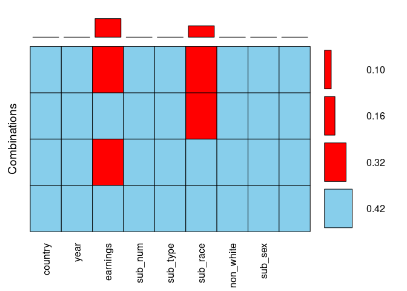<!-- -->

-   10% of the observations have missing values in both earnings and
    sub_race.

-   There are more missing values in sub_race than in earnings. This is
    false

-   42% of the observations have no missing entries.

-   There are exactly two variables in the biopics data that have
    missing values.

-   This one is false! It is actually the other way round, there are
    more missing values in earnings. You can see it from the bars above
    the plot. Now that you have a high-level overview of the missingness
    in the data, let’s look more closely at specific variables!

## Spine plot

The aggregation plot you have drawn in the previous exercise gave you
some high-level overview of the missing data. If you are interested in
the interaction between specific variables, a spine plot is the way to
go. It allows you to study the percentage of missing values in one
variable for different values of the other, which is conceptually very
similar to the t-tests you have been running in the previous lesson.

In this exercise, you will draw a spine plot to investigate the
percentage of missing data in earnings for different categories of
sub_race. Is there more missing data on earnings for some specific races
of the movie’s main character? Let’s find out! The VIM package has
already been loaded for you.

``` r
# Draw a spine plot to analyse missing values in earnings by sub_race
biopics %>% 
    select(sub_race, earnings) %>% as.data.frame() %>%
    spineMiss()
```

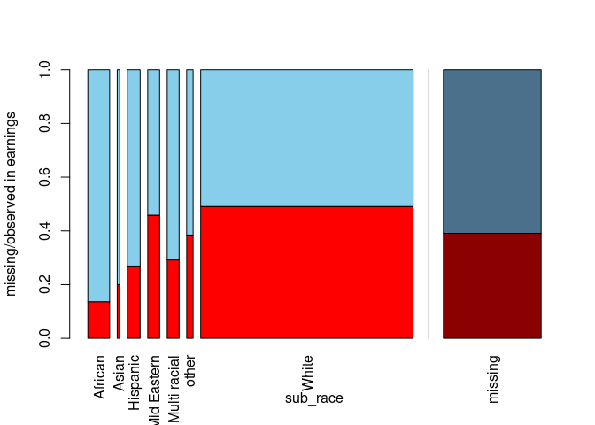<!-- -->

### Based on the spine plot you have just created, which of the following statements is false?

1.  In the vast majority of movies, the main character is white.

2.  When the main subject is African, we are the most likely to have
    complete earnings information.

3.  As far as earnings and sub_race are concerned, the data seem to be
    MAR.

4.  The race that appears most rarely in the data has around 40% of
    earnings missing.

-   ***This one is false! The scarcest race is Asian, as this bar is the
    thinnest. The missing earnings, however, amount to around 20%, not
    40%. Let’s build upon the idea of a spine plot to create one more
    visualization in the next exercise!***

## Mosaic plot

The spine plot you have created in the previous exercise allows you to
study missing data patterns between two variables at a time. This idea
is generalized to more variables in the form of a mosaic plot.

In this exercise, you will start by creating a dummy variable indicating
whether the United States was involved in the production of each movie.
To do this, you will use the grepl() function, which checks if the
string passed as its first argument is present in the object passed as
its second argument. Then, you will draw a mosaic plot to see if the
subject’s gender correlates with the amount of missing data on earnings
for both US and non-US movies.

The biopics data as well as the VIM package are already loaded for you.
Let’s do some exploratory plotting!

Note that a propriety display_image()function has been created to return
the output from the latest VIMpackage version. Make sure to expand the
HTML Viewer section.

``` r
# Prepare data for plotting and draw a mosaic plot
biopics %>%
    # Create a dummy variable for US-produced movies
    mutate(is_US_movie = grepl("US", country)) %>%
    # Draw mosaic plot
    mosaicMiss(highlight = "earnings", 
             plotvars = c("is_US_movie", "sub_sex"))
```

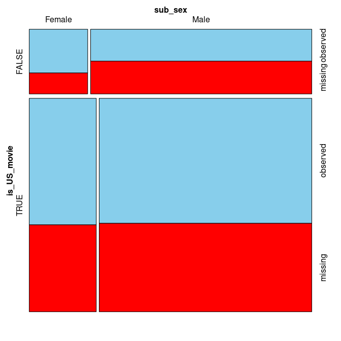<!-- -->

``` r
# Return plot from latest VIM package - expand the HTML viewer section
#display_image()
```

-   ***Before you expand the output, notice how, for non-US movies,
    there is less missing data on earnings for movies featuring females.
    This doesn’t look MCAR! You are now done with Chapter 1 and ready to
    take a deep dive into imputation methods.***

# Donor-based imputation

## Smelling the danger of mean imputation

One of the most popular imputation methods is the mean imputation, in
which missing values in a variable are replaced with the mean of the
observed values in this variable. However, in many cases this simple
approach is a poor choice. Sometimes a quick look at the data can
already alert you to the dangers of mean-imputing.

In this chapter, you will be working with a subsample of the Tropical
Atmosphere Ocean (tao) project data. The dataset consists of atmospheric
measurements taken in two different time periods at five different
locations. The data comes with the VIM package.

In this exercise you will familiarize yourself with the data and perform
a simple analysis that will indicate what the consequences of mean
imputation could be. Let’s take a look at the tao data!

### Print first 10 observations

``` r
tao <- read.csv("data/tao.csv")
# Print first 10 observations
head(tao, 10)
```

    ##    year latitude longitude sea_surface_temp air_temp humidity uwind vwind
    ## 1  1997        0      -110            27.59    27.15     79.6  -6.4   5.4
    ## 2  1997        0      -110            27.55    27.02     75.8  -5.3   5.3
    ## 3  1997        0      -110            27.57    27.00     76.5  -5.1   4.5
    ## 4  1997        0      -110            27.62    26.93     76.2  -4.9   2.5
    ## 5  1997        0      -110            27.65    26.84     76.4  -3.5   4.1
    ## 6  1997        0      -110            27.83    26.94     76.7  -4.4   1.6
    ## 7  1997        0      -110            28.01    27.04     76.5  -2.0   3.5
    ## 8  1997        0      -110            28.04    27.11     78.3  -3.7   4.5
    ## 9  1997        0      -110            28.02    27.21     78.6  -4.2   5.0
    ## 10 1997        0      -110            28.05    27.25     76.9  -3.6   3.5

### Get the number of missing values per column

``` r
# Get the number of missing values per column
tao %>%
  is.na() %>% 
  colSums()
```

    ##             year         latitude        longitude sea_surface_temp 
    ##                0                0                0                3 
    ##         air_temp         humidity            uwind            vwind 
    ##               81               93                0                0

### Calculate the number of missing values in air_temp per year

``` r
# Calculate the number of missing values in air_temp per year
tao %>% 
  group_by(year) %>% 
  summarize(num_miss = sum(is.na(air_temp))) %>%
    kable()
```

| year | num_miss |
|-----:|---------:|
| 1993 |        4 |
| 1997 |       77 |

## Mean-imputing the temperature

Mean imputation can be a risky business. If the variable you are
mean-imputing is correlated with other variables, this correlation might
be destroyed by the imputed values. You saw it looming in the previous
exercise when you analyzed the air_temp variable.

To find out whether these concerns are valid, in this exercise you will
perform mean imputation on air_temp, while also creating a binary
indicator for where the values are imputed. It will come in handy in the
next exercise, when you will be assessing your imputation’s performance.
Let’s fill in those missing values!

``` r
tao_imp <- tao %>% 
  # Create a binary indicator for missing values in air_temp
  mutate(air_temp_imp = ifelse(is.na(air_temp), TRUE, FALSE)) %>% 
  # Impute air_temp with its mean
  mutate(air_temp = ifelse(is.na(air_temp), mean(air_temp, na.rm = TRUE), air_temp))

# Print the first 10 rows of tao_imp
head(tao_imp, 10) %>%
    head() %>%
    kable()
```

| year | latitude | longitude | sea_surface_temp | air_temp | humidity | uwind | vwind | air_temp_imp |
|-----:|---------:|----------:|-----------------:|---------:|---------:|------:|------:|:-------------|
| 1997 |        0 |      -110 |            27.59 |    27.15 |     79.6 |  -6.4 |   5.4 | FALSE        |
| 1997 |        0 |      -110 |            27.55 |    27.02 |     75.8 |  -5.3 |   5.3 | FALSE        |
| 1997 |        0 |      -110 |            27.57 |    27.00 |     76.5 |  -5.1 |   4.5 | FALSE        |
| 1997 |        0 |      -110 |            27.62 |    26.93 |     76.2 |  -4.9 |   2.5 | FALSE        |
| 1997 |        0 |      -110 |            27.65 |    26.84 |     76.4 |  -3.5 |   4.1 | FALSE        |
| 1997 |        0 |      -110 |            27.83 |    26.94 |     76.7 |  -4.4 |   1.6 | FALSE        |

### Assessing imputation quality with margin plot

In the last exercise, you have mean-imputed air_temp and added an
indicator variable to denote which values were imputed, called
air_temp_imp. Time to see how well this works.

Upon examining the tao data, you might have noticed that it also
contains a variable called sea_surface_temp, which could reasonably be
expected to be positively correlated with air_temp. If that’s the case,
you would expect these two temperatures to be both high or both low at
the same time. Imputing mean air temperature when the sea temperature is
high or low would break this relation.

To find out, in this exercise you will select the two temperature
variables and the indicator variable and use them to draw a margin plot.
Let’s assess the mean imputation!

``` r
# Draw a margin plot of air_temp vs sea_surface_temp
tao_imp %>% 
  select(air_temp, sea_surface_temp, air_temp_imp) %>%
  marginplot(delimiter = "imp")
```

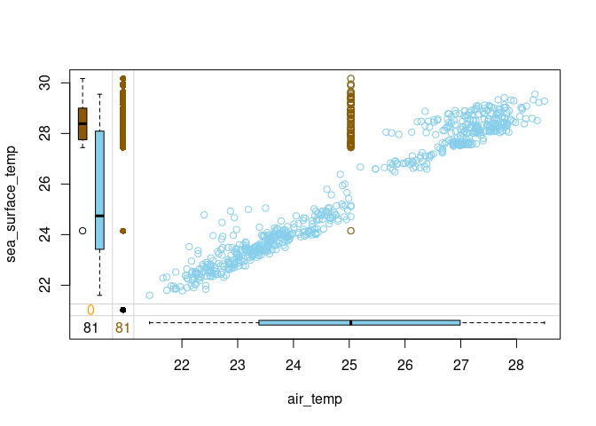<!-- -->

**Question**

-   Judging by the margin plot you have drawn, what’s wrong with this
    mean imputation?

-   *Possible Answers*

1.  All the imputed air_temp values are the same, no matter the
    sea_surface_temp. This breaks the correlation between these two
    variables.

2.  The imputed values are located in the space where there is no
    observed data, which makes them outliers.

3.  The variance of the imputed data differs from the one of observed
    data.

4.  All three above answers are correct. ***correct***

-   ***Notice how air and sea surface temperatures correlate. Imputing
    average air temperature in the observations where sea surface
    temperature is high creates clearly outlying data points and
    destroys the relation between these two variables. If the sea
    surface temperature is high, we would like to impute air temperature
    values that are also high. Head over to the upcoming video to learn
    a method that is able to do that!***

### The problem of mean imputation

``` r
ggplot(tao_imp, aes(air_temp, sea_surface_temp, color = air_temp_imp))+
    geom_point()+
    scale_color_brewer(name = "Imputed", type = "qual", palette = "Dark2")+
    theme(legend.position = "bottom")
```

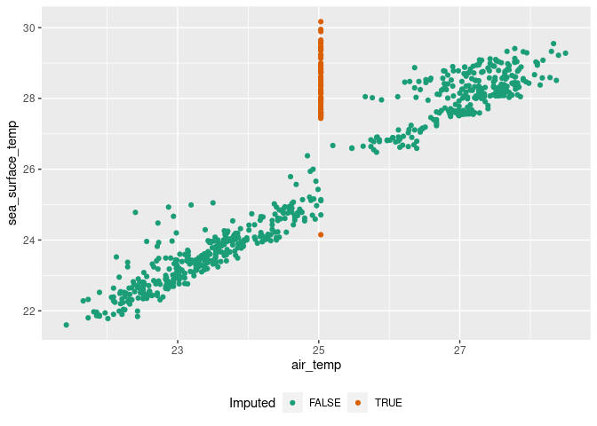<!-- -->

### Vanilla hot-deck

Hot-deck imputation is a simple method that replaces every missing value
in a variable by the last observed value in this variable. It’s very
fast, as only one pass through the data is needed, but in its simplest
form, hot-deck may sometimes break relations between the variables.

In this exercise, you will try it out on the tao dataset. You will
hot-deck-impute missing values in the air temperature column air_temp
and then draw a margin plot to analyze the relation between the imputed
values with the sea surface temperature column sea_surface_temp. Let’s
see how it works!

``` r
# Load VIM package
library(VIM)

# Impute air_temp in tao with hot-deck imputation
tao_imp <- hotdeck(tao, variable = "air_temp")

# Check the number of missing values in each variable
tao_imp %>% 
    is.na() %>% 
    colSums()
```

    ##             year         latitude        longitude sea_surface_temp 
    ##                0                0                0                3 
    ##         air_temp         humidity            uwind            vwind 
    ##                0               93                0                0 
    ##     air_temp_imp 
    ##                0

``` r
# Draw a margin plot of air_temp vs sea_surface_temp
tao_imp %>% 
    select(air_temp, sea_surface_temp, air_temp_imp) %>% 
    marginplot(delimiter = "imp")
```

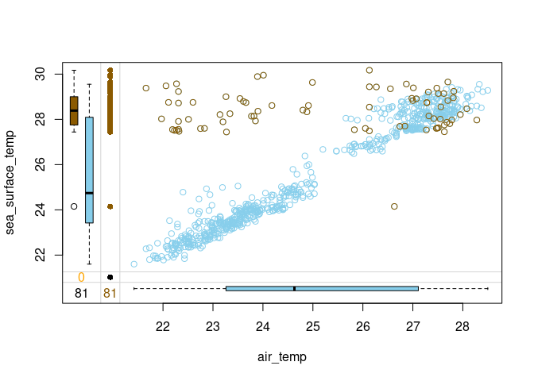<!-- -->

-   ***Does the imputation look good? Notice the observations in the top
    left part of the plot with imputed air_temp and high
    sea_surface_temp. These observations must have been preceded by ones
    with low air_temp in the data frame, and so after hot-deck
    imputation, they ended up being outliers with low air_temp and high
    sea_surface_temp.***

### Hot-deck tricks & tips I: imputing within domains

One trick that may help when hot-deck imputation breaks the relations
between the variables is imputing within domains. What this means is
that if the variable to be imputed is correlated with another,
categorical variable, one can simply run hot-deck separately for each of
its categories.

For instance, you might expect air temperature to depend on time, as we
are seeing the average temperatures rising due to global warming. The
time indicator you have available in the tao data is a categorical
variable, year. Let’s first check if the average air temperature is
different in each of the two studied years and then run hot-deck within
year domains. Finally, you will draw the margin plot again to assess the
imputation performance.

``` r
# Calculate mean air_temp per year
tao %>% 
    group_by(year) %>% 
    summarize(average_air_temp = mean(air_temp, na.rm = TRUE)) %>%
    kable()
```

| year | average_air_temp |
|-----:|-----------------:|
| 1993 |         23.36596 |
| 1997 |         27.10979 |

``` r
# Hot-deck-impute air_temp in tao by year domain
tao_imp <- hotdeck(tao, variable = "air_temp", domain_var = "year")

# Draw a margin plot of air_temp vs sea_surface_temp
tao_imp %>% 
    select(air_temp, sea_surface_temp, air_temp_imp) %>% 
    marginplot(delimiter = "imp")
```

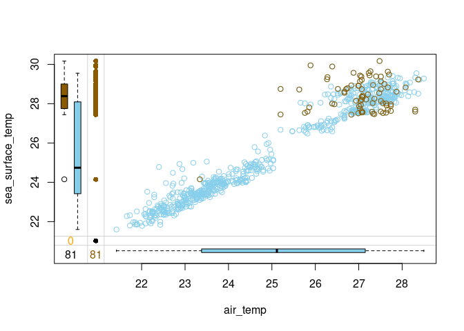<!-- -->

-   ***The results look much better this time. However, if you look at
    the top right corner of the plot, you will see that the variance in
    the imputed (orange) values is somewhat larger than among the
    observed (blue) values. Let’s see if we can improve even further in
    the next exercise***

### Hot-deck tricks & tips II: sorting by correlated variables

Another trick that can boost the performance of hot-deck imputation is
sorting the data by variables correlated to the one we want to impute.

For instance, in all the margin plots you have been drawing recently,
you have seen that air temperature is strongly correlated with sea
surface temperature, which makes a lot of sense. You can exploit this
knowledge to improve your hot-deck imputation. If you first order the
data by sea_surface_temp, then every imputed air_temp value will come
from a donor with a similar sea_surface_temp. Let’s see how this will
work!

``` r
# Hot-deck-impute air_temp in tao ordering by sea_surface_temp
tao_imp <- hotdeck(tao, 
                   variable = "air_temp", 
                   ord_var = "sea_surface_temp")

# Draw a margin plot of air_temp vs sea_surface_temp
tao_imp %>% 
    select(air_temp, sea_surface_temp, air_temp_imp) %>% 
    marginplot(delimiter = "imp")
```

<!-- -->

-   ***This time the imputation seems not to impact the relation between
    air and sea temperatures: if not for the colors, you likely wouldn’t
    know which ones are the imputed values. Hot-deck imputation,
    possibly enhanced with domain-imputing or sorting, is a fast and
    simple method that can serve you well in many situations. However,
    sometimes you may need a more complex approach. Head over to the
    next video to learn about k-Nearest-Neighbors imputation!***

### Just a little experiment

``` r
# Hot-deck-impute air_temp in tao ordering by sea_surface_temp
tao_imp <- hotdeck(tao, 
                   variable = "air_temp", 
                   ord_var = "sea_surface_temp",
                   domain_var = "year")

# Draw a margin plot of air_temp vs sea_surface_temp
tao_imp %>% 
    select(air_temp, sea_surface_temp, air_temp_imp) %>% 
    marginplot(delimiter = "imp")
```

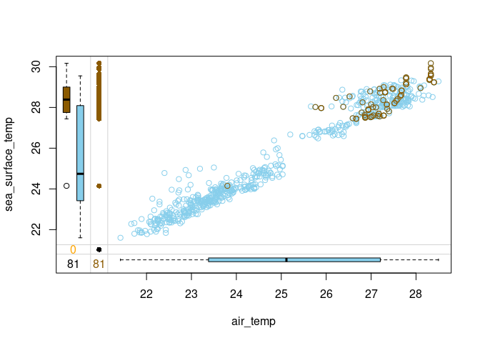<!-- -->

### Choosing the number of neighbors

k-Nearest-Neighbors (or kNN) imputation fills the missing values in an
observation based on the values coming from the k other observations
that are most similar to it. The number of these similar observations,
called neighbors, that are considered is a parameter that has to be
chosen beforehand.

How to choose k? One way is to try different values and see how they
impact the relations between the imputed and observed data.

Let’s try imputing humidity in the tao data using three different values
of k and see how the imputed values fit the relation between humidity
and sea_surface_temp.

-   **Impute humidity with kNN imputation using 30 neighbors and draw a
    marginplot() of sea_surface_temp vs humidity.**

``` r
# Impute humidity using 30 neighbors
tao_imp <- kNN(tao, k = 30, variable = "humidity")

# Draw a margin plot of sea_surface_temp vs humidity
tao_imp %>% 
    select(sea_surface_temp, humidity, humidity_imp) %>% 
    marginplot(delimiter = "imp", main = "k = 30")
```

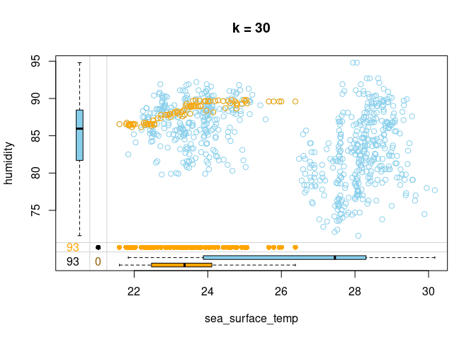<!-- -->

-   **Impute humidity with kNN imputation using 15 neighbors and draw a
    margin plot of sea_surface_temp vs humidity.**

``` r
# Impute humidity using 15 neighbors
tao_imp <- kNN(tao, k = 15, variable = "humidity")

# Draw a margin plot of sea_surface_temp vs humidity
tao_imp %>% 
    select(sea_surface_temp, humidity, humidity_imp) %>% 
    marginplot(delimiter = "imp", main = "k = 15")
```

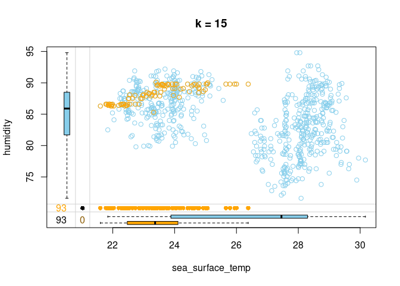<!-- -->

-   **Impute humidity with kNN imputation using 5 neighbors and draw a
    margin plot of sea_surface_temp vs humidity.**

``` r
# Impute humidity using 5 neighbors
tao_imp <- kNN(tao, k = 5, variable = "humidity")

# Draw a margin plot of sea_surface_temp vs humidity
tao_imp %>% 
    select(sea_surface_temp, humidity, humidity_imp) %>% 
    marginplot(delimiter = "imp", main = "k = 5")
```

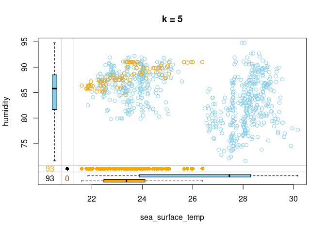<!-- -->

-   ***You can browse through the three plots you have just drawn. The
    last one seems to capture the most variation in the data, so you
    should be good to use k = 5 in this case. Let’s look at how we can
    improve on this default kNN imputation with some tricks!***

## kNN tricks & tips I: weighting donors

A variation of kNN imputation that is frequently applied uses the
so-called distance-weighted aggregation. What this means is that when we
aggregate the values from the neighbors to obtain a replacement for a
missing value, we do so using the weighted mean and the weights are
inverted distances from each neighbor. As a result, closer neighbors
have more impact on the imputed value.

In this exercise, you will apply the distance-weighted aggregation while
imputing the tao data. This will only require passing two additional
arguments to the kNN() function. Let’s try it out!

``` r
# Load the VIM package
library(VIM)

# Impute humidity with kNN using distance-weighted mean
tao_imp <- kNN(tao, 
               k = 5, 
               variable = "humidity", 
               numFun = weighted.mean,
               weightDist = TRUE)

tao_imp %>% 
    select(sea_surface_temp, humidity, humidity_imp) %>% 
    marginplot(delimiter = "imp")
```

<!-- -->

-   ***Distance-weighted aggregation makes the kNN imputation more
    robust to situations where an observation is unique in some way and
    doesn’t have many very similar neighbors. In such cases, the least
    similar neighbors get assigned a small weight and contribute less to
    the imputed values. Head over to the last exercise of this chapter
    to learn one more trick that makes kNN more robust and accurate!***

## kNN tricks & tips II: sorting variables

As the k-Nearest Neighbors algorithm loops over the variables in the
data to impute them, it computes distances between observations using
other variables, some of which have already been imputed in the previous
steps. This means that if the variables located earlier in the data have
a lot of missing values, then the subsequent distance calculation is
based on a lot of imputed values. This introduces noise to the distance
calculation.

For this reason, it is a good practice to sort the variables
increasingly by the number of missing values before performing kNN
imputation. This way, each distance calculation is based on as much
observed data and as little imputed data as possible.

Let’s try this out on the tao data!

``` r
# Get tao variable names sorted by number of NAs
vars_by_NAs <- tao %>%
  is.na() %>%
  colSums() %>%
  sort(decreasing = FALSE) %>% 
  names()
vars_by_NAs
```

    ## [1] "year"             "latitude"         "longitude"        "uwind"           
    ## [5] "vwind"            "sea_surface_temp" "air_temp"         "humidity"

``` r
# Sort tao variables and feed it to kNN imputation
tao_imp <- tao %>% 
  select(vars_by_NAs) %>% 
  kNN(k = 5)

tao_imp %>% 
    select(sea_surface_temp, humidity, humidity_imp) %>% 
    marginplot(delimiter = "imp")
```

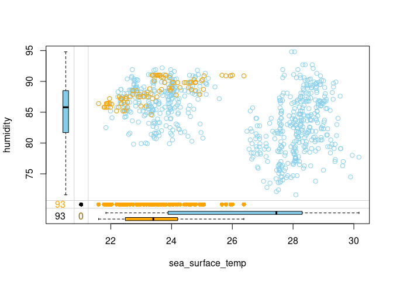<!-- -->

-   ***The kNN you have just coded should be more accurate and robust
    against faulty imputations, so remember to sort your variables first
    before performing kNN imputation! This brings us to the end of this
    chapter. Keep it up! See you in Chapter 3, where you will learn to
    use statistical and machine learning models to impute missing
    values!***

# Model-based imputation

## Linear regression imputation

Sometimes, you can use domain knowledge, previous research or simply
your common sense to describe the relations between the variables in
your data. In such cases, model-based imputation is a great solution, as
it allows you to impute each variable according to a statistical model
that you can specify yourself, taking into account any assumptions you
might have about how the variables impact each other.

For continuous variables, a popular model choice is linear regression.
It doesn’t restrict you to linear relations though! You can always
include a square or a logarithm of a variable in the predictors. In this
exercise, you will work with the simputation package to run a single
linear regression imputation on the tao data and analyze the results.
Let’s give it a try!

``` r
# Load the simputation package
library(simputation)

# Impute air_temp and humidity with linear regression
formula <- air_temp + humidity ~ year + latitude + sea_surface_temp
tao_imp <- impute_lm(tao, formula)

# Check the number of missing values per column
tao_imp %>% 
  is.na() %>% 
  colSums()
```

    ##             year         latitude        longitude sea_surface_temp 
    ##                0                0                0                3 
    ##         air_temp         humidity            uwind            vwind 
    ##                3                2                0                0

``` r
# Print rows of tao_imp in which air_temp or humidity are still missing 
tao_imp %>% 
  filter(is.na(air_temp) | is.na(humidity)) %>%
    kable()
```

| year | latitude | longitude | sea_surface_temp | air_temp | humidity | uwind | vwind |
|-----:|---------:|----------:|-----------------:|---------:|---------:|------:|------:|
| 1993 |        0 |       -95 |               NA |       NA |       NA |  -5.6 |   3.1 |
| 1993 |        0 |       -95 |               NA |       NA |       NA |  -6.3 |   0.5 |
| 1993 |       -2 |       -95 |               NA |       NA |     89.9 |  -3.4 |   2.4 |

-   ***Linear regression fails when at least one of the predictors is
    missing. In this case, it was sea_surface_temp. In the next
    exercise, you will fix it by initializing the missing values before
    running impute_lm()***

## Initializing missing values & iterating over variables

As you have just seen, running impute_lm() might not fill-in all the
missing values. To ensure you impute all of them, you should initialize
the missing values with a simple method, such as the hot-deck imputation
you learned about in the previous chapter, which simply feeds forward
the last observed value.

Moreover, a single imputation is usually not enough. It is based on the
basic initialized values and could be biased. A proper approach is to
iterate over the variables, imputing them one at a time in the locations
where they were originally missing.

In this exercise, you will first initialize the missing values with
hot-deck imputation and then loop five times over air_temp and humidity
from the tao data to impute them with linear regression. Let’s get to
it!

``` r
# Initialize missing values with hot-deck
tao_imp <- hotdeck(tao)

# Create boolean masks for where air_temp and humidity are missing
missing_air_temp <- tao_imp$air_temp_imp
missing_humidity <-  tao_imp$humidity_imp

for (i in 1:5) {
  # Set air_temp to NA in places where it was originally missing and re-impute it
  tao_imp$air_temp[missing_air_temp] <- NA
  tao_imp <- impute_lm(tao_imp, air_temp ~ year + latitude + sea_surface_temp + humidity)
  # Set humidity to NA in places where it was originally missing and re-impute it
  tao_imp$humidity[missing_humidity] <- NA
  tao_imp <- impute_lm(tao_imp, humidity ~ year + latitude + sea_surface_temp + air_temp)
}
```

-   ***That’s a professional approach to model-based imputation you have
    just coded! But how do we know that 5 is the proper number of
    iterations to run? Let’s look at the convergence in the next
    exercise!***

## Detecting convergence

Great job iterating over the variables in the last exercise! But how
many iterations are needed? When the imputed values don’t change with
the new iteration, we can stop.

You will now extend your code to compute the differences between the
imputed variables in subsequent iterations. To do this, you will use the
Mean Absolute Percentage Change function, defined for you as follows:

mapc \<- function(a, b) { mean(abs(b - a) / a, na.rm = TRUE) } mapc()
outputs a single number that tells you how much b differs from a. You
will use it to check how much the imputed variables change across
iterations. Based on this, you will decide how many of them are needed!

The boolean masks missing_air_temp and missing_humidity are available
for you, as is the hotdeck-initialized tao_imp data.

``` r
mapc <- function(a, b) {
  mean(abs(b - a) / a, na.rm = TRUE)
}

diff_air_temp <- c()
diff_humidity <- c()

for (i in 1:5) {
  # Assign the outcome of the previous iteration (or initialization) to prev_iter
  prev_iter <- tao_imp
  # Impute air_temp and humidity at originally missing locations
  tao_imp$air_temp[missing_air_temp] <- NA
  tao_imp <- impute_lm(tao_imp, air_temp ~ year + latitude + sea_surface_temp + humidity)
  tao_imp$humidity[missing_humidity] <- NA
  tao_imp <- impute_lm(tao_imp, humidity ~ year + latitude + sea_surface_temp + air_temp)
  # Calculate MAPC for air_temp and humidity and append them to previous iteration's MAPCs
  diff_air_temp <- c(diff_air_temp, mapc(prev_iter$air_temp, tao_imp$air_temp))
  diff_humidity <- c(diff_humidity, mapc(prev_iter$humidity, tao_imp$humidity))
}

df_diff  <- data.frame(diff_air_temp, diff_humidity)
plot_diffs <- function(a, b) {
  data.frame("mapc" = c(a, b),
             "Variable" = c(rep("air_temp", length(a)),
                            rep("humidity", length(b))),
             "Iterations" = c(1:length(a), 1:length(b))) %>% 
    ggplot(aes(Iterations, mapc, color = Variable)) +
    geom_line(size = 1.5) +
    ylab("Mean absolute percentage change") +
    ggtitle("Changes in imputed variables' values across iterations") +
    theme(legend.position = "bottom")
}

plot_diffs(diff_air_temp, diff_humidity)
```

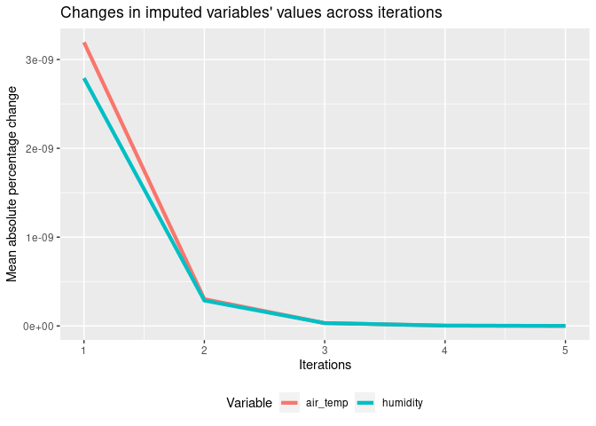<!-- -->

-   ***Two are enough, as the third one brings virtually no change
    anymore!***

## Logistic regression imputation

A popular choice for imputing binary variables is logistic regression.
Unfortunately, there is no function similar to impute_lm() that would do
it. That’s why you’ll write such a function yourself!

Let’s call the function impute_logreg(). Its first argument will be a
data frame df, whose missing values have been initialized and only
containing missing values in the column to be imputed. The second
argument will be a formula for the logistic regression model.

The function will do the following:

Keep the locations of missing values. Build the model. Make predictions.
Replace missing values with predictions. Don’t worry about the line
creating imp_var - this is just a way to extract the name of the column
to impute from the formula. Let’s do some functional programming!

``` r
impute_logreg <- function(df, formula) {
  # Extract name of response variable
  imp_var <- as.character(formula[2])
  # Save locations where the response is missing
  missing_imp_var <- is.na(df[imp_var])
  # Fit logistic regression mode
  logreg_model <- glm(formula, data = df, family = binomial)
  # Predict the response and convert it to 0s and 1s
  preds <- predict(logreg_model, type = "response")
  preds <- ifelse(preds >= 0.5, 1, 0)
  # Impute missing values with predictions
  df[missing_imp_var, imp_var] <-preds[missing_imp_var]
  return(df)
}
```

## Drawing from conditional distribution

Simply calling predict() on a model will always return the same value
for the same values of the predictors. This results in a small
variability in imputed data. In order to increase it, so that the
imputation replicates the variability from the original data, we can
draw from the conditional distribution. What this means is that instead
of always predicting 1 whenever the model outputs a probability larger
than 0.5, we can draw the prediction from a binomial distribution
described by the probability returned by the model.

You will work on the code you have written in the previous exercise. The
following line was removed:

preds \<- ifelse(preds \>= 0.5, 1, 0) Your task is to fill its place
with drawing from a binomial distribution. That’s just one line of code!

``` r
 impute_logreg <- function(df, formula) {
  # Extract name of response variable
  imp_var <- as.character(formula[2])
  # Save locations where the response is missing
  missing_imp_var <- is.na(df[imp_var])
  # Fit logistic regression mode
  logreg_model <- glm(formula, data = df, family = binomial)
  # Predict the response
  preds <- predict(logreg_model, type = "response")
  # Sample the predictions from binomial distribution
  preds <- rbinom(length(preds), size = 1, prob = preds)
  # Impute missing values with predictions
  df[missing_imp_var, imp_var] <- preds[missing_imp_var]
  return(df)
}
```

-   ***Drawing from the conditional distribution will make the imputed
    data’s variability more similar to the one of original, observed
    data. With this powerful function at hand, you are now ready to
    design a model-based imputation flow that takes care of both
    continuous and binary variables. Let’s do it in the next
    exercise!***

## Model-based imputation with multiple variable types

Great job on writing the function to implement logistic regression
imputation with drawing from conditional distribution. That’s pretty
advanced statistics you have coded! In this exercise, you will combine
what you learned so far about model-based imputation to impute different
types of variables in the tao data.

Your task is to iterate over variables just like you have done in the
previous chapter and impute two variables:

is_hot, a new binary variable that was created out of air_temp, which is
1 if air_temp is at or above 26 degrees and is 0 otherwise; humidity, a
continuous variable you are already familiar with. You will have to use
the linear regression function you have learned before, as well as your
own function for logistic regression. Let’s get to it!

``` r
# Initialize missing values with hot-deck
tao <- tao %>% 
    mutate(is_hot = ifelse(air_temp > 26, 1, 0))
tao_imp <- hotdeck(tao)

# Create boolean masks for where is_hota and humidity are missing
missing_is_hot <- tao_imp$is_hot_imp
missing_humidity <- tao_imp$humidity_imp

for (i in 1:3) {
  # Set is_hot to NA in places where it was originally missing and re-impute it
  tao_imp$is_hot[missing_is_hot] <- NA
  tao_imp <- impute_logreg(tao_imp, is_hot ~ sea_surface_temp)
  # Set humidity to NA in places where it was originally missing and re-impute it
  tao_imp$humidity[missing_humidity] <- NA
  tao_imp <- impute_lm(tao_imp, 
  humidity ~ sea_surface_temp + air_temp)
}
```

-   ***You have used the simputation package where possible, filling the
    gaps with your own programming, in order to run a model-based
    imputation that takes care of both continuous and binary variables,
    additionally inreasing variability in imputed data in the latter
    case. Well done! Let’s continue to the final lesson of this chapter,
    where you will learn how to use tree-based machine learning models
    for imputation.***

## Imputing with random forests

A machine learning approach to imputation might be both more accurate
and easier to implement compared to traditional statistical models.
First, it doesn’t require you to specify relationships between
variables. Moreover, machine learning models such as random forests are
able to discover highly complex, non-linear relations and exploit them
to predict missing values.

In this exercise, you will get acquainted with the missForest package,
which builds a separate random forest to predict missing values for each
variable, one by one. You will call the imputing function on the
biographic movies data, biopics, which you have worked with earlier in
the course and then extract the filled-in data as well as the estimated
imputation errors.

Let’s plant some random forests!

``` r
# Load the missForest package
library(missForest)

cont_lev <- c("UK", "US/UK", "Canada US", 
           "Canada/UK", "US/Canada", "US/UK/Canada")

biopics <- biopics %>%
    mutate(country = factor(country, levels = cont_lev))
biopics <- biopics %>%
    mutate_if(is.character, factor)
# Impute biopics data using missForest
biopics <- as.data.frame(biopics)
imp_res <- missForest(biopics)
```

    ##   missForest iteration 1 in progress...done!
    ##   missForest iteration 2 in progress...done!
    ##   missForest iteration 3 in progress...done!
    ##   missForest iteration 4 in progress...done!
    ##   missForest iteration 5 in progress...done!
    ##   missForest iteration 6 in progress...done!
    ##   missForest iteration 7 in progress...done!
    ##   missForest iteration 8 in progress...done!

``` r
# Extract imputed data and check for missing values
imp_data <- imp_res$ximpnhanes_imp
print(sum(is.na(imp_data)))
```

    ## [1] 0

``` r
# Extract and print imputation errors
imp_err <- imp_res$OOBerror
print(imp_err)
```

    ##      NRMSE        PFC 
    ## 0.01761168 0.11189409

***Note that missForest() outputs a list and you have to manually
extract the imputed data - it’s a common mistake to overlook it when
building a data processing pipeline. Also, take a look at the errors.
Can you tell which variables have been imputed particularly well? Let’s
look at it more closely in the next exercise!***

## Variable-wise imputation errors

In the previous exercise you have extracted the estimated imputation
errors from missForest’s output. This gave you two numbers:

the normalized root mean squared error (NRMSE) for all continuous
variables; the proportion of falsely classified entries (PFC) for all
categorical variables. However, it could well be that the imputation
model performs great for one continuous variable and poor for another!
To diagnose such cases, it is enough to tell missForest to produce
variable-wise error estimates. This is done by setting the variablewise
argument to TRUE.

The biopics data and missForest package have already been loaded for
you, so let’s take a closer look at the errors!

``` r
# Impute biopics data with missForest computing per-variable errors
imp_res <- missForest(biopics, variablewise = TRUE)
```

    ##   missForest iteration 1 in progress...done!
    ##   missForest iteration 2 in progress...done!
    ##   missForest iteration 3 in progress...done!
    ##   missForest iteration 4 in progress...done!

``` r
# Extract and print imputation errors
per_variable_errors <- imp_res$OOBerror
print(per_variable_errors)
```

    ##          PFC          MSE          MSE          MSE          PFC          PFC 
    ##    0.2795276    0.0000000 1081.0330025    0.0000000    0.0000000    0.1790780 
    ##          MSE          PFC          MSE 
    ##    0.0000000    0.0000000    0.0000000

``` r
# Rename errors' columns to include variable names
names(per_variable_errors) <- paste(names(biopics), 
                                    names(per_variable_errors),
                                    sep = "_")

# Print the renamed errors
print(per_variable_errors)
```

    ##          country_PFC             year_MSE         earnings_MSE 
    ##            0.2795276            0.0000000         1081.0330025 
    ##          sub_num_MSE         sub_type_PFC         sub_race_PFC 
    ##            0.0000000            0.0000000            0.1790780 
    ##        non_white_MSE          sub_sex_PFC missing_earnings_MSE 
    ##            0.0000000            0.0000000            0.0000000

## Speed-accuracy trade-off

In the last video, you have seen there are two knobs you can tune to
influence the performance of the random forests:

Number of decision trees in each forest. Number of variables used for
splitting within decision trees. Increasing each of them might improve
the accuracy of the imputation model, but it will also require more time
to run. In this exercise, you will explore these ideas yourself by
fitting missForest() to the biopics data twice with different settings.
As you follow the instructions, pay attention to the errors you will be
printing, and to the time the code takes to run.

``` r
# Set number of trees to 50 and number of variables used for splitting to 6
imp_res <- missForest(biopics, ntree = 5, mtry = 2)
```

    ##   missForest iteration 1 in progress...done!
    ##   missForest iteration 2 in progress...done!
    ##   missForest iteration 3 in progress...done!
    ##   missForest iteration 4 in progress...done!

``` r
# Print the resulting imputation errors
print(imp_res$OOBerror)
```

    ##      NRMSE        PFC 
    ## 0.01975874 0.22855413

``` r
# Set number of trees to 50 and number of variables used for splitting to 6
imp_res <- missForest(biopics, ntree = 50, mtry = 6)
```

    ##   missForest iteration 1 in progress...done!
    ##   missForest iteration 2 in progress...done!
    ##   missForest iteration 3 in progress...done!
    ##   missForest iteration 4 in progress...done!
    ##   missForest iteration 5 in progress...done!
    ##   missForest iteration 6 in progress...done!
    ##   missForest iteration 7 in progress...done!

``` r
# Print the resulting imputation errors
print(imp_res$OOBerror)
```

    ##      NRMSE        PFC 
    ## 0.01966464 0.11912939
