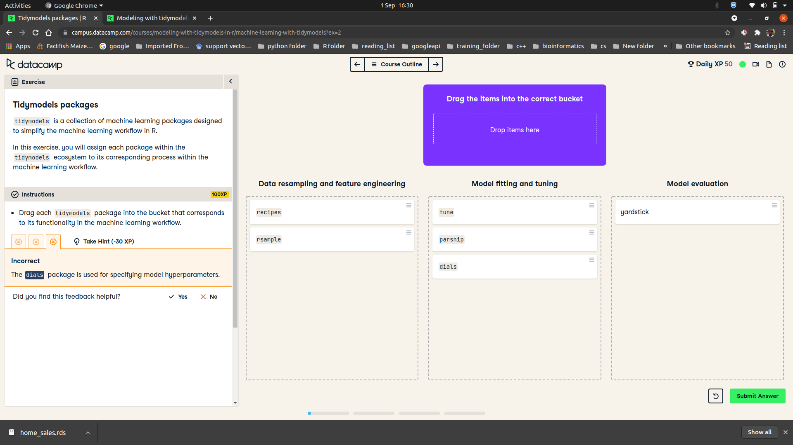
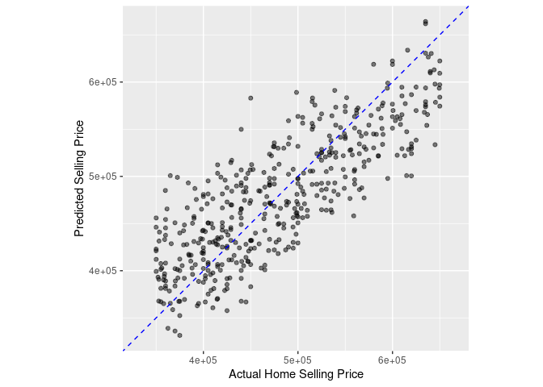
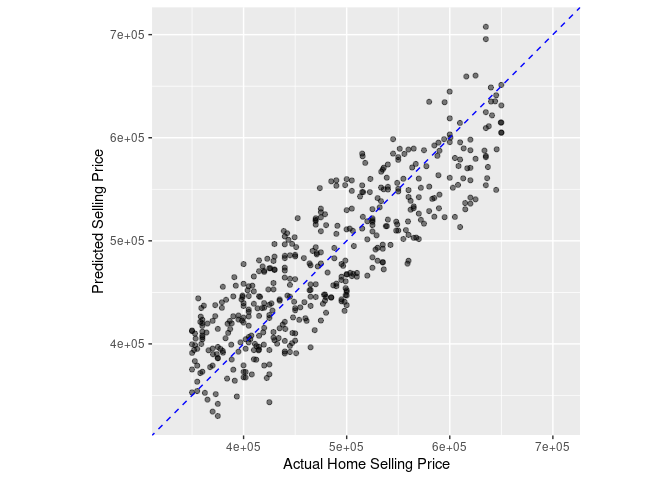
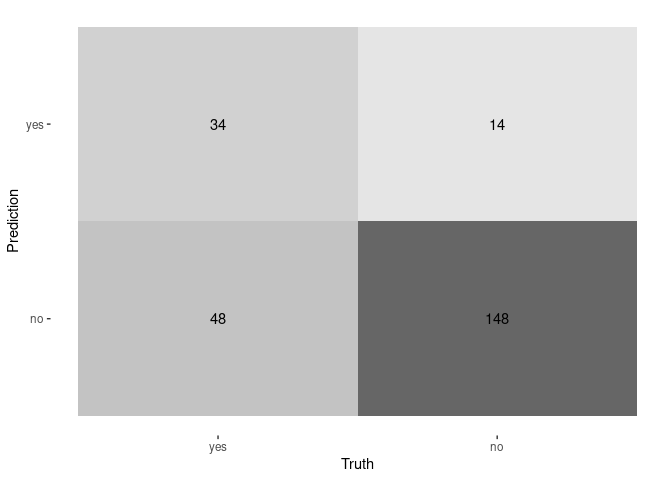
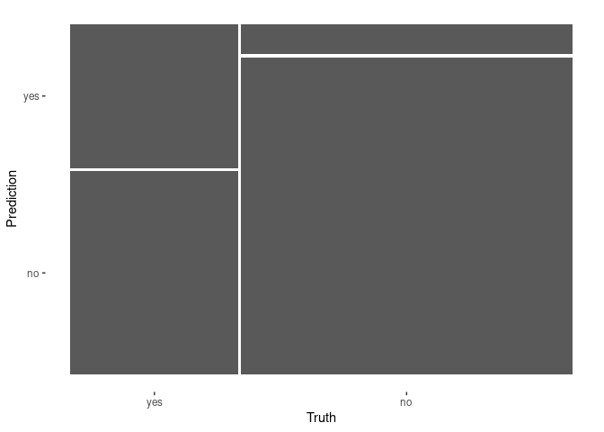
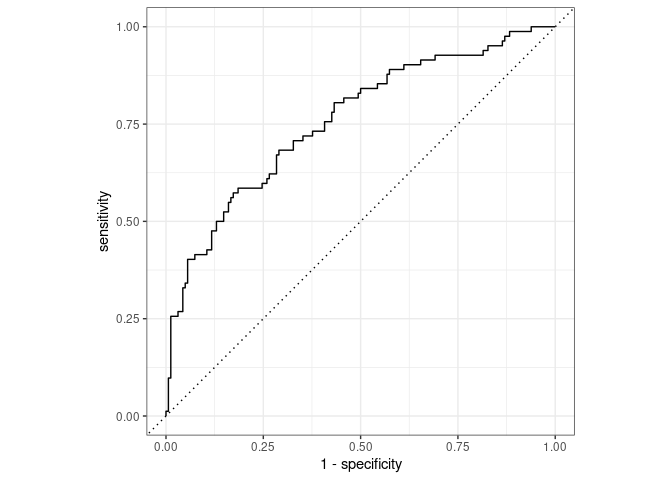
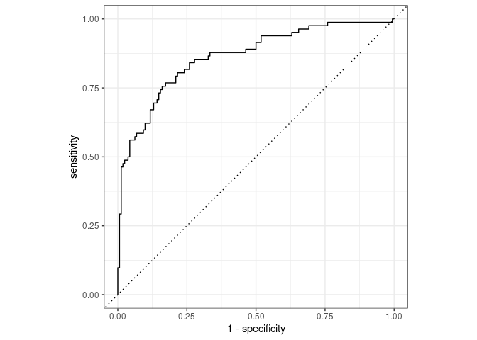

Modeling with tidymodels in R
================

## Creating training and test datasets

The rsample package is designed to create training and test datasets.
Creating a test dataset is important for estimating how a trained model
will likely perform on new data. It also guards against overfitting,
where a model memorizes patterns that exist only in the training data
and performs poorly on new data.

In this exercise, you will create training and test datasets from the
home\_sales data. This data contains information on homes sold in the
Seattle, Washington area between 2015 and 2016.

The outcome variable in this data is selling\_price.

The tidymodels package will be pre-loaded in every exercise in the
course. The home\_sales tibble has also been loaded for you.



``` r
home_sales <- readRDS("home_sales.rds")

# Create a data split object
home_split <- initial_split(home_sales, 
                            prop = 0.7, 
                            strata = selling_price)

# Create the training data
home_training <- home_split %>%
  training()

# Create the test data
home_test <- home_split %>% 
  testing()

# Check number of rows in each dataset
nrow(home_training)
```

    ## [1] 1042

``` r
nrow(home_test)
```

    ## [1] 450

Distribution of outcome variable values Stratifying by the outcome
variable when generating training and test datasets ensures that the
outcome variable values have a similar range in both datasets.

Since the original data is split at random, stratification avoids
placing all the expensive homes in home\_sales into the test dataset,
for example. In this case, your model would most likely perform poorly
because it was trained on less expensive homes.

In this exercise, you will calculate summary statistics for the
selling\_price variable in the training and test datasets. The
home\_training and home\_test tibbles have been loaded from the previous
exercise.

``` r
# Distribution of selling_price in training data
library(knitr)
summary_func <- function(df){
      df %>% summarize(min_sell_price = min(selling_price),
            max_sell_price = max(selling_price),
            mean_sell_price = mean(selling_price),
            sd_sell_price = sd(selling_price)) %>%
    kable()

}
home_training %>% 
    summary_func()
```

| min\_sell\_price | max\_sell\_price | mean\_sell\_price | sd\_sell\_price |
|-----------------:|-----------------:|------------------:|----------------:|
|           350000 |           650000 |          478773.5 |        80047.73 |

``` r
home_test %>% 
  summary_func()
```

| min\_sell\_price | max\_sell\_price | mean\_sell\_price | sd\_sell\_price |
|-----------------:|-----------------:|------------------:|----------------:|
|           350000 |           650000 |          479804.6 |        83181.14 |

## Fitting a linear regression model

The parsnip package provides a unified syntax for the model fitting
process in R.

With parsnip, it is easy to define models using the various packages, or
engines, that exist in the R ecosystem.

In this exercise, you will define a parsnip linear regression object and
train your model to predict selling\_price using home\_age and
sqft\_living as predictor variables from the home\_sales data.

The home\_training and home\_test tibbles that you created in the
previous lesson have been loaded into this session.

``` r
# Specify a linear regression model, linear_model
linear_model <- linear_reg() %>% 
  # Set the model engine
  set_engine('lm') %>% 
  # Set the model mode
  set_mode('regression')

# Train the model with the training data
lm_fit <- linear_model %>% 
  fit(selling_price~ home_age + sqft_living,
      data = home_training)

# Print lm_fit to view model information
tidy(lm_fit) %>%
    kable()
```

| term         |    estimate |   std.error | statistic | p.value |
|:-------------|------------:|------------:|----------:|--------:|
| (Intercept)  | 291774.3706 | 7550.546299 | 38.642816 |       0 |
| home\_age    |  -1501.5834 |  174.898792 | -8.585442 |       0 |
| sqft\_living |    102.9247 |    2.755434 | 37.353351 |       0 |

## Predicting home selling prices

After fitting a model using the training data, the next step is to use
it to make predictions on the test dataset. The test dataset acts as a
new source of data for the model and will allow you to evaluate how well
it performs.

Before you can evaluate model performance, you must add your predictions
to the test dataset.

In this exercise, you will use your trained model, lm\_fit, to predict
selling\_price in the home\_test dataset.

Your trained model, lm\_fit, as well as the test dataset, home\_test
have been loaded into your session.

``` r
# Predict selling_price
home_predictions <- predict(lm_fit,
                        new_data = home_test)

# View predicted selling prices
#home_predictions

# Combine test data with predictions
home_test_results <- home_test %>% 
  select(selling_price, home_age, sqft_living) %>% 
  bind_cols(home_predictions)

# View results
home_test_results %>% 
    head()
```

<div class="kable-table">

| selling\_price | home\_age | sqft\_living |    .pred |
|---------------:|----------:|-------------:|---------:|
|         411000 |        18 |         1130 | 381050.8 |
|         635000 |         4 |         3350 | 630565.7 |
|         495000 |        21 |         1650 | 430066.8 |
|         464950 |        19 |         2190 | 488649.3 |
|         425000 |        11 |         1920 | 472872.3 |
|         535000 |         3 |         2360 | 530171.9 |

</div>

## Model performance metrics

Evaluating model results is an important step in the modeling process.
Model evaluation should be done on the test dataset in order to see how
well a model will generalize to new datasets.

In the previous exercise, you trained a linear regression model to
predict selling\_price using home\_age and sqft\_living as predictor
variables. You then created the home\_test\_results tibble using your
trained model on the home\_test data.

In this exercise, you will calculate the RMSE and R squared metrics
using your results in home\_test\_results.

The home\_test\_results tibble has been loaded into your session.

``` r
# Print home_test_results
#home_test_results

# Caculate the RMSE metric
home_test_results %>% 
  rmse(truth = selling_price, estimate =.pred)
```

<div class="kable-table">

| .metric | .estimator | .estimate |
|:--------|:-----------|----------:|
| rmse    | standard   |  47946.05 |

</div>

``` r
# Calculate the R squared metric
home_test_results %>% 
  rsq(truth = selling_price, estimate =.pred)
```

<div class="kable-table">

| .metric | .estimator | .estimate |
|:--------|:-----------|----------:|
| rsq     | standard   | 0.6673122 |

</div>

## R squared plot

In the previous exercise, you got an R squared value of 0.651. The R
squared metric ranges from 0 to 1, 0 being the worst and 1 the best.

Calculating the R squared value is only the first step in studying your
model’s predictions.

Making an R squared plot is extremely important because it will uncover
potential problems with your model, such as non-linear patterns or
regions where your model is either over or under-predicting the outcome
variable.

In this exercise, you will create an R squared plot of your model’s
performance.

The home\_test\_results tibble has been loaded into your session.

``` r
# Create an R squared plot of model performance
ggplot(home_test_results, aes(x = selling_price, y = .pred)) +
  geom_point(alpha = 0.5) + 
  geom_abline(color = 'blue', linetype = 2) +
  coord_obs_pred()  +
  labs(x = 'Actual Home Selling Price', y = 'Predicted Selling Price')
```

<!-- -->

## Complete model fitting process with last\_fit()

In this exercise, you will train and evaluate the performance of a
linear regression model that predicts selling\_price using all the
predictors available in the home\_sales tibble.

This exercise will give you a chance to perform the entire model fitting
process with tidymodels, from defining your model object to evaluating
its performance on the test data.

Earlier in the chapter, you created an rsample object called home\_split
by passing the home\_sales tibble into initial\_split(). The home\_split
object contains the instructions for randomly splitting home\_sales into
training and test sets.

The home\_sales tibble, and home\_split object have been loaded into
this session.

``` r
# Define a linear regression model
linear_model <- linear_reg() %>% 
  set_engine('lm') %>% 
  set_mode('regression')

# Train linear_model with last_fit()
linear_fit <- linear_model %>% 
  last_fit(selling_price ~ ., split = home_split)

# Collect predictions and view results
predictions_df <- linear_fit %>% collect_predictions()
predictions_df %>% head()
```

<div class="kable-table">

| id               |    .pred | .row | selling\_price | .config               |
|:-----------------|---------:|-----:|---------------:|:----------------------|
| train/test split | 400052.7 |    3 |         411000 | Preprocessor1\_Model1 |
| train/test split | 695621.3 |    4 |         635000 | Preprocessor1\_Model1 |
| train/test split | 441355.8 |    6 |         495000 | Preprocessor1\_Model1 |
| train/test split | 476270.7 |    8 |         464950 | Preprocessor1\_Model1 |
| train/test split | 437876.0 |    9 |         425000 | Preprocessor1\_Model1 |
| train/test split | 478999.8 |   10 |         535000 | Preprocessor1\_Model1 |

</div>

``` r
# Make an R squared plot using predictions_df
ggplot(predictions_df, aes(x = selling_price, y = .pred)) + 
  geom_point(alpha = 0.5) + 
  geom_abline(color = 'blue', linetype = 2) +
  coord_obs_pred() +
  labs(x = 'Actual Home Selling Price', y = 'Predicted Selling Price')
```

<!-- -->

## Data resampling

The first step in a machine learning project is to create training and
test datasets for model fitting and evaluation. The test dataset
provides an estimate of how your model will perform on new data and
helps to guard against overfitting.

You will be working with the telecom\_df dataset which contains
information on customers of a telecommunications company. The outcome
variable is canceled\_service and it records whether a customer canceled
their contract with the company. The predictor variables contain
information about customers’ cell phone and internet usage as well as
their contract type and monthly charges.

The telecom\_df tibble has been loaded into your session.

``` r
telecom_df <- readRDS("telecom_df.rds")
# Create data split object
telecom_split <- initial_split(telecom_df, prop = 0.75,
                     strata = canceled_service)

# Create the training data
telecom_training <- telecom_split %>% 
  training()

# Create the test data
telecom_test <- telecom_split %>% 
  testing()

# Check the number of rows
nrow(telecom_training)
```

    ## [1] 731

``` r
nrow(telecom_test)
```

    ## [1] 244

## Fitting a logistic regression model

In addition to regression models, the parsnip package also provides a
general interface to classification models in R.

In this exercise, you will define a parsnip logistic regression object
and train your model to predict canceled\_service using avg\_call\_mins,
avg\_intl\_mins, and monthly\_charges as predictor variables from the
telecom\_df data.

The telecom\_training and telecom\_test tibbles that you created in the
previous lesson have been loaded into this session.

``` r
# Specify a logistic regression model
logistic_model <- logistic_reg() %>% 
  # Set the engine
  set_engine('glm') %>% 
  # Set the mode
  set_mode('classification')

# Fit to training data
logistic_fit <- logistic_model %>% 
  fit(canceled_service ~ avg_call_mins +avg_intl_mins+monthly_charges,
      data = telecom_training)

# Print model fit object
logistic_fit %>% tidy()
```

<div class="kable-table">

| term             |   estimate | std.error | statistic |   p.value |
|:-----------------|-----------:|----------:|----------:|----------:|
| (Intercept)      |  1.8228629 | 0.5789116 |  3.148776 | 0.0016396 |
| avg\_call\_mins  | -0.0099405 | 0.0012841 | -7.741396 | 0.0000000 |
| avg\_intl\_mins  |  0.0221433 | 0.0030544 |  7.249645 | 0.0000000 |
| monthly\_charges |  0.0008847 | 0.0046737 |  0.189299 | 0.8498585 |

</div>

## Combining test dataset results

Evaluating your model’s performance on the test dataset gives insights
into how well your model predicts on new data sources. These insights
will help you communicate your model’s value in solving problems or
improving decision making.

Before you can calculate classification metrics such as sensitivity or
specificity, you must create a results tibble with the required columns
for yardstick metric functions.

In this exercise, you will use your trained model to predict the outcome
variable in the telecom\_test dataset and combine it with the true
outcome values in the canceled\_service column.

Your trained model, logistic\_fit, and test dataset, telecom\_test, have
been loaded from the previous exercise.

``` r
# Predict outcome categories
class_preds <- predict(logistic_fit, new_data = telecom_test,
                       type = 'class')

# Obtain estimated probabilities for each outcome value
prob_preds <- predict(logistic_fit, new_data = telecom_test, 
                      type = 'prob')

# Combine test set results
telecom_results <- telecom_test %>% 
  select(canceled_service) %>% 
  bind_cols(class_preds, prob_preds)

# View results tibble
telecom_results %>%
    head()
```

<div class="kable-table">

| canceled\_service | .pred\_class | .pred\_yes | .pred\_no |
|:------------------|:-------------|-----------:|----------:|
| yes               | yes          |  0.5588097 | 0.4411903 |
| no                | yes          |  0.5984371 | 0.4015629 |
| no                | no           |  0.0218216 | 0.9781784 |
| yes               | no           |  0.1959547 | 0.8040453 |
| no                | yes          |  0.5530747 | 0.4469253 |
| no                | no           |  0.0847185 | 0.9152815 |

</div>

## Evaluating performance with yardstick

In the previous exercise, you calculated classification metrics from a
sample confusion matrix. The yardstick package was designed to automate
this process.

For classification models, yardstick functions require a tibble of model
results as the first argument. This should include the actual outcome
values, predicted outcome values, and estimated probabilities for each
value of the outcome variable.

In this exercise, you will use the results from your logistic regression
model, telecom\_results, to calculate performance metrics.

The telecom\_results tibble has been loaded into your session.

``` r
# Calculate the confusion matrix
conf_mat(telecom_results, truth = canceled_service,
    estimate = .pred_class)
```

    ##           Truth
    ## Prediction yes  no
    ##        yes  34  14
    ##        no   48 148

``` r
# Calculate the accuracy
accuracy(telecom_results, truth = canceled_service,
    estimate = .pred_class)
```

<div class="kable-table">

| .metric  | .estimator | .estimate |
|:---------|:-----------|----------:|
| accuracy | binary     | 0.7459016 |

</div>

``` r
# Calculate the sensitivity

sens(telecom_results, truth = canceled_service,
    estimate = .pred_class)
```

<div class="kable-table">

| .metric | .estimator | .estimate |
|:--------|:-----------|----------:|
| sens    | binary     | 0.4146341 |

</div>

``` r
# Calculate the specificity

spec(telecom_results, truth = canceled_service,
    estimate = .pred_class)
```

<div class="kable-table">

| .metric | .estimator | .estimate |
|:--------|:-----------|----------:|
| spec    | binary     | 0.9135802 |

</div>

## Creating custom metric sets

The yardstick package also provides the ability to create custom sets of
model metrics. In cases where the cost of obtaining false negative
errors is different from the cost of false positive errors, it may be
important to examine a specific set of performance metrics.

Instead of calculating accuracy, sensitivity, and specificity
separately, you can create your own metric function that calculates all
three at the same time.

In this exercise, you will use the results from your logistic regression
model, telecom\_results, to calculate a custom set of performance
metrics. You will also use a confusion matrix to calculate all available
binary classification metrics in tidymodelsall at once.

The telecom\_results tibble has been loaded into your session.

``` r
# Create a custom metric function
telecom_metrics <- metric_set(accuracy, sens, spec)

# Calculate metrics using model results tibble
telecom_metrics(telecom_results, 
                truth = canceled_service,
                estimate = .pred_class)
```

<div class="kable-table">

| .metric  | .estimator | .estimate |
|:---------|:-----------|----------:|
| accuracy | binary     | 0.7459016 |
| sens     | binary     | 0.4146341 |
| spec     | binary     | 0.9135802 |

</div>

``` r
# Create a confusion matrix
conf_mat(telecom_results,
         truth = canceled_service,
         estimate = .pred_class) %>% 
  # Pass to the summary() function
  summary()
```

<div class="kable-table">

| .metric               | .estimator | .estimate |
|:----------------------|:-----------|----------:|
| accuracy              | binary     | 0.7459016 |
| kap                   | binary     | 0.3656491 |
| sens                  | binary     | 0.4146341 |
| spec                  | binary     | 0.9135802 |
| ppv                   | binary     | 0.7083333 |
| npv                   | binary     | 0.7551020 |
| mcc                   | binary     | 0.3900079 |
| j\_index              | binary     | 0.3282144 |
| bal\_accuracy         | binary     | 0.6641072 |
| detection\_prevalence | binary     | 0.1967213 |
| precision             | binary     | 0.7083333 |
| recall                | binary     | 0.4146341 |
| f\_meas               | binary     | 0.5230769 |

</div>

## Plotting the confusion matrix

Calculating performance metrics with the yardstick package provides
insight into how well a classification model is performing on the test
dataset. Most yardstick functions return a single number that summarizes
classification performance.

Many times, it is helpful to create visualizations of the confusion
matrix to more easily communicate your results.

In this exercise, you will make a heat map and mosaic plot of the
confusion matrix from your logistic regression model on the telecom\_df
dataset.

Your model results tibble, telecom\_results, has been loaded into your
session.

``` r
# Create a confusion matrix
conf_mat(telecom_results,
         truth = canceled_service,
         estimate = .pred_class)  %>% 
  # Create a heat map
  autoplot(type = "heatmap")
```

<!-- -->

``` r
conf_mat(telecom_results,
         truth = canceled_service,
         estimate = .pred_class)  %>% 
  # Create a mosaic plot
  autoplot(type = "mosaic")
```

<!-- -->

## ROC curves and area under the ROC curve

ROC curves are used to visualize the performance of a classification
model across a range of probability thresholds. An ROC curve with the
majority of points near the upper left corner of the plot indicates that
a classification model is able to correctly predict both the positive
and negative outcomes correctly across a wide range of probability
thresholds.

The area under this curve provides a letter grade summary of model
performance.

In this exercise, you will create an ROC curve from your logistic
regression model results and calculate the area under the ROC curve with
yardstick.

Your model results tibble, telecom\_results has been loaded into your
session.

``` r
# Calculate metrics across thresholds
threshold_df <- telecom_results %>% 
  roc_curve(truth = canceled_service, .pred_yes)

# View results
threshold_df %>%
  head()
```

<div class="kable-table">

| .threshold | specificity | sensitivity |
|-----------:|------------:|------------:|
|       -Inf |   0.0000000 |           1 |
|  0.0218216 |   0.0000000 |           1 |
|  0.0345143 |   0.0061728 |           1 |
|  0.0540177 |   0.0123457 |           1 |
|  0.0556071 |   0.0185185 |           1 |
|  0.0624909 |   0.0246914 |           1 |

</div>

``` r
# Plot ROC curve
threshold_df %>% 
  autoplot()
```

<!-- -->

``` r
# Calculate ROC AUC
roc_auc(telecom_results, truth = canceled_service, .pred_yes)
```

<div class="kable-table">

| .metric  | .estimator | .estimate |
|:---------|:-----------|----------:|
| roc\_auc | binary     | 0.7585818 |

</div>

Streamlining the modeling process The last\_fit() function is designed
to streamline the modeling workflow in tidymodels. Instead of training
your model on the training data and building a results tibble using the
test data, last\_fit() accomplishes this with one function.

In this exercise, you will train the same logistic regression model as
you fit in the previous exercises, except with the last\_fit() function.

Your data split object, telecom\_split, and model specification,
logistic\_model, have been loaded into your session.

``` r
# Train model with last_fit()
telecom_last_fit <- logistic_model %>% 
  last_fit(canceled_service ~ avg_call_mins +avg_intl_mins+monthly_charges,
           split = telecom_split)

# View test set metrics
telecom_last_fit %>% 
  collect_metrics()
```

<div class="kable-table">

| .metric  | .estimator | .estimate | .config               |
|:---------|:-----------|----------:|:----------------------|
| accuracy | binary     | 0.7459016 | Preprocessor1\_Model1 |
| roc\_auc | binary     | 0.7585818 | Preprocessor1\_Model1 |

</div>

## Collecting predictions and creating custom metrics

Using the last\_fit() modeling workflow also saves time in collecting
model predictions. Instead of manually creating a tibble of model
results, there are helper functions that extract this information
automatically.

In this exercise, you will use your trained model, telecom\_last\_fit,
to create a tibble of model results on the test dataset as well as
calculate custom performance metrics.

You trained model, telecom\_last\_fit, has been loaded into this
session.

``` r
# Collect predictions
last_fit_results <- telecom_last_fit %>% 
  collect_predictions()

# View results
last_fit_results %>%
  head()
```

<div class="kable-table">

| id               | .pred\_yes | .pred\_no | .row | .pred\_class | canceled\_service | .config               |
|:-----------------|-----------:|----------:|-----:|:-------------|:------------------|:----------------------|
| train/test split |  0.5588097 | 0.4411903 |   11 | yes          | yes               | Preprocessor1\_Model1 |
| train/test split |  0.5984371 | 0.4015629 |   18 | yes          | no                | Preprocessor1\_Model1 |
| train/test split |  0.0218216 | 0.9781784 |   37 | no           | no                | Preprocessor1\_Model1 |
| train/test split |  0.1959547 | 0.8040453 |   38 | no           | yes               | Preprocessor1\_Model1 |
| train/test split |  0.5530747 | 0.4469253 |   45 | yes          | no                | Preprocessor1\_Model1 |
| train/test split |  0.0847185 | 0.9152815 |   50 | no           | no                | Preprocessor1\_Model1 |

</div>

``` r
# Custom metrics function
last_fit_metrics <- metric_set(accuracy, sens,
                               spec, roc_auc)

# Calculate metrics
last_fit_metrics(last_fit_results,
                 truth = canceled_service,
                 estimate = .pred_class,
                 .pred_yes)
```

<div class="kable-table">

| .metric  | .estimator | .estimate |
|:---------|:-----------|----------:|
| accuracy | binary     | 0.7459016 |
| sens     | binary     | 0.4146341 |
| spec     | binary     | 0.9135802 |
| roc\_auc | binary     | 0.7585818 |

</div>

## Complete modeling workflow

In this exercise, you will use the last\_fit() function to train a
logistic regression model and evaluate its performance on the test data
by assessing the ROC curve and the area under the ROC curve.

Similar to previous exercises, you will predict canceled\_service in the
telecom\_df data, but with an additional predictor variable to see if
you can improve model performance.

The telecom\_df tibble, telecom\_split, and logistic\_model objects from
the previous exercises have been loaded into your workspace. The
telecom\_split object contains the instructions for randomly splitting
the telecom\_df tibble into training and test sets. The logistic\_model
object is a parsnip specification of a logistic regression model.

``` r
# Train a logistic regression model
logistic_fit <- logistic_model %>% 
  last_fit(canceled_service ~ avg_call_mins + avg_intl_mins + monthly_charges + months_with_company, 
           split = telecom_split)

# Collect metrics
logistic_fit %>% 
  collect_metrics()
```

<div class="kable-table">

| .metric  | .estimator | .estimate | .config               |
|:---------|:-----------|----------:|:----------------------|
| accuracy | binary     | 0.8114754 | Preprocessor1\_Model1 |
| roc\_auc | binary     | 0.8633695 | Preprocessor1\_Model1 |

</div>

``` r
# Collect model predictions
logistic_fit %>% 
  collect_predictions() %>% 
  # Plot ROC curve
  roc_curve(truth = canceled_service, .pred_yes) %>% 
  autoplot()
```

<!-- -->
