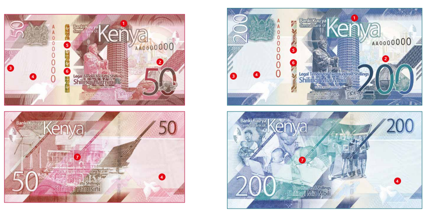

```{r setup, include=FALSE}
knitr::opts_chunk$set(echo = FALSE,
                      message = FALSE,
                      warning = FALSE)
library(tidyverse)
library(data.table)
library(here)
library(mTools)
source(here("R/used_functions.R"))
load(here("data/gok_earnings_exp.rda"))
load(here("data", "domestic_debt.rda"))
current_year  <- year(Sys.Date()) - 1
```



## Income & Expenditure from 2000 to `r current_year`

Decided to have a quick look of the Kenyan government expenditure & income due to the current cash crunch 

There are a number of factors that could be contributing to this trend. One factor is the growth of the economy. As the economy grows, the government needs to spend more money on things like infrastructure, education, and healthcare. Another factor is the growth of the population. As the population grows, the government needs to spend more money on things like social welfare programs and security.

```{r, fig.width=7.3, fig.height=4.5}
options(scipen = 999)

exp_rev <- c("total_expenditure", "total_revenue")

total_types_exp <- c("total_recurrent", 
                     "county_transfer", 
                     "development_expenditure")

recurrent_exp <- c("domestic_interest", 
                   "foreign_interest", 
                   "wages_salaries", 
                   "pensions", "other")

list_graphs_vars <- list(exp_rev, total_types_exp, recurrent_exp)

list_graphs_nms <- c("exp_rev", 
                     "types_exp",
                     "types_reccurrent")

list_graphs <- list()
rev_all <- c(exp_rev, total_types_exp, recurrent_exp)
gok_earnings_exp[, (rev_all) := lapply(.SD, function(x) x/10000), 
                 .SDcols = rev_all]

gok_earnings_exp <- gok_earnings_exp[between(year, 2001, current_year)]

for (i in seq_along(list_graphs_nms)) {
   
    list_graphs[[i]] <- plot_compare(df = gok_earnings_exp, 
                         id_vars = c("year"),
                         compare_vars = list_graphs_vars[[i]],
                         x_val = year,
                         col_val = variable,
                         y_val = sum_val,
                         xlab = "Year",
                         ylab = "Kenya Shillings(Billions)",
                         title_lab = "")  


}

names(list_graphs) <- list_graphs_nms
girafe( ggobj =  list_graphs$exp_rev$plot,
        pointsize =10)
```

```{r}

exp_over_df <- list_graphs$exp_rev$data
exp_over_df[,  shifted_var := shift(sum_val, type= "lag"), by = variable]
exp_over_df[,  diff := sum_val - shifted_var]
exp_over_df[,  diff := sum_val - shifted_var]
exp_over_df[, perc_increase := diff/shifted_var * 100]
```

## What type of expenditure is rising

```{r}

girafe( ggobj =  list_graphs$types_exp$plot,
        pointsize =10)
```

## What Sub type of reccurrent expenditure is causing the rise

```{r}

girafe( ggobj =  list_graphs$types_reccurrent$plot,
        pointsize =10)

```

## Domestic debt composition

```{r}
dm_debt_vec <- c("treasury_bills", "treasury_bonds", 
             "government_stocks", "overdraft_at_central_bank", 
             "advances_from_commercial_banks",
             "other_domestic_debt")

domestic_debt[, (dm_debt_vec) := lapply(.SD, function(x) x/10000), 
                 .SDcols = dm_debt_vec]

domestic_debt <- domestic_debt[year < current_year]
dm_debt_plot <- plot_compare(df = domestic_debt, 
                         id_vars = c("year"),
                         compare_vars =dm_debt_vec,
                         x_val = year,
                         col_val = variable,
                         y_val = sum_val,
                         xlab = "Year",
                         ylab = "Kenya Shillings(Billions)",
                         title_lab = "",
                         nrow_legend = 3)  

girafe( ggobj = dm_debt_plot$plot,
        pointsize =10)
```
