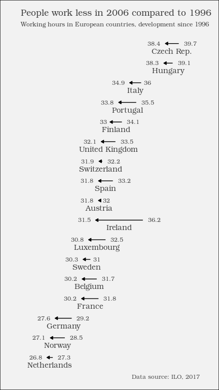

The reduction in weekly working hours in Europe
================
Insert your name here

-   [Summary](#summary)
-   [Preparations](#preparations)
-   [Analysis](#analysis)
    -   [Data](#data)
    -   [Preprocessing](#preprocessing)
    -   [Results](#results)
        -   [An interesting correlation](#an-interesting-correlation)

## Summary

The **International Labour Organization (ILO)** has many [data
sets](http://www.ilo.org/global/statistics-and-databases/lang--en/index.htm)
on working conditions. For example, one can look at how weekly working
hours have been decreasing in many countries of the world, while
monetary compensation has risen. In this report, *the reduction in
weekly working hours* in European countries is analysed, and a
comparison between 1996 and 2006 is made. All analysed countries have
seen a decrease in weekly working hours since 1996 – some more than
others.

## Preparations

``` r
library(dplyr)
library(ggplot2)
library(forcats)
```

## Analysis

### Data

The herein used data can be found in the [statistics database of the
ILO](http://www.ilo.org/ilostat/faces/wcnav_defaultSelection;ILOSTATCOOKIE=ZOm2Lqrr-OIuzxNGn2_08bNe9AmHQ1kUA6FydqyZJeIudFLb2Yz5!1845546174?_afrLoop=32158017365146&_afrWindowMode=0&_afrWindowId=null#!%40%40%3F_afrWindowId%3Dnull%26_afrLoop%3D32158017365146%26_afrWindowMode%3D0%26_adf.ctrl-state%3D4cwaylvi8_4).
For the purpose of this course, it has been slightly preprocessed.

``` r
load(url("http://s3.amazonaws.com/assets.datacamp.com/production/course_5807/datasets/ilo_data.RData"))
```

The loaded data contains 380 rows.

``` r
# Some summary statistics
ilo_data %>%
  group_by(year) %>%
  summarize(mean_hourly_compensation = mean(hourly_compensation),
            mean_working_hours = mean(working_hours))
```

    ## # A tibble: 27 × 3
    ##    year  mean_hourly_compensation mean_working_hours
    ##    <fct>                    <dbl>              <dbl>
    ##  1 1980                      9.27               34.0
    ##  2 1981                      8.69               33.6
    ##  3 1982                      8.36               33.5
    ##  4 1983                      7.81               33.9
    ##  5 1984                      7.54               33.7
    ##  6 1985                      7.79               33.7
    ##  7 1986                      9.70               34.0
    ##  8 1987                     12.1                33.6
    ##  9 1988                     13.2                33.7
    ## 10 1989                     13.1                33.5
    ## # … with 17 more rows

``` r
  # pipe the above data frame into the knitr::kable function
```

As can be seen from the above table, the average weekly working hours of
European countries have been decreasing since 1980.

### Preprocessing

The data is now filtered so it only contains the years 1996 and 2006 – a
good time range for comparison.

``` r
ilo_data <- ilo_data %>%
  filter(year == "1996" | year == "2006")
  
# Reorder country factor levels
ilo_data <- ilo_data %>%
  # Arrange data frame first, so last is always 2006
  arrange(year) %>%
  # Use the fct_reorder function inside mutate to reorder countries by working hours in 2006
  mutate(country = fct_reorder(country,
                               working_hours,
                               last))
```

### Results

In the following, a plot that shows the reduction of weekly working
hours from 1996 to 2006 in each country is produced.

First, a custom theme is defined.

Then, the plot is produced.

``` r
# Compute temporary data set for optimal label placement
median_working_hours <- ilo_data %>%
  group_by(country) %>%
  summarize(median_working_hours_per_country = median(working_hours)) %>%
  ungroup()

# Have a look at the structure of this data set
str(median_working_hours)
```

    ## tibble [17 × 2] (S3: tbl_df/tbl/data.frame)
    ##  $ country                         : Factor w/ 30 levels "Netherlands",..: 1 2 3 4 5 6 7 8 9 10 ...
    ##  $ median_working_hours_per_country: num [1:17] 27 27.8 28.4 31 30.9 ...

``` r
# Plot
ggplot(ilo_data) +
  geom_path(aes(x = working_hours, y = country),
            arrow = arrow(length = unit(1.5, "mm"), type = "closed")) +
  # Add labels for values (both 1996 and 2006)
  geom_text(
        aes(x = working_hours,
            y = country,
            label = round(working_hours, 1),
            hjust = ifelse(year == "2006", 1.4, -0.4)
          ),
        # Change the appearance of the text
        size = 3,
        family = "Bookman",
        color = "gray25"
   ) +
  # Add labels for country
  geom_text(data = median_working_hours,
            aes(y = country,
                x = median_working_hours_per_country,
                label = country),
            vjust = 2,
            family = "Bookman",
            color = "gray25") +
  # Add titles
  labs(
    title = "People work less in 2006 compared to 1996",
    subtitle = "Working hours in European countries, development since 1996",
    caption = "Data source: ILO, 2017"
  ) +
  # Apply your theme 
  theme_ilo() +
  # Remove axes and grids
  theme(
    axis.ticks = element_blank(),
    axis.title = element_blank(),
    axis.text = element_blank(),
    panel.grid = element_blank(),
    # Also, let's reduce the font size of the subtitle
    plot.subtitle = element_text(size = 9)
  ) +
  # Reset coordinate system
  coord_cartesian(xlim = c(25, 41))
```



#### An interesting correlation

The results of another analysis are shown here, even though they cannot
be reproduced with the data at hand.


As you can see, there’s also an interesting relationship. The more
people work, the less compensation they seem to receive, which seems
kind of unfair. This is quite possibly related to other proxy variables
like overall economic stability and performance of a country.
