Census data in r with tidycensus
================

## Obtain and set your Census API key

tidycensus is an R package designed to return data from the US Census
Bureau ready for use within the Tidyverse.

To acquire data from the US Census Bureau using the tidycensus R
package, you must first acquire and set a Census API key. After
obtaining your key, you can install it for future use with the
census\_api\_key() function in tidycensus.

This exercise uses a fake API key for purposes of illustration.

``` r
# Load the tidycensus package into your R session
library(tidycensus)
library(tidyverse)
library(data.table)
library(tigris)
library(here)

# Define your Census API key and set it with census_api_key()
api_key <- Sys.getenv("CENSUS_API_KEY")

census_api_key(api_key)
```

\#\#Setting a cache directory Spatial data from the US Census Bureau can
get very big - sometimes hundreds of megabytes in size. By default,
tigris functions download data from the US Census Bureau’s website - but
this can get tiresome if downloading the same large datasets over and
over. To resolve this, tigris includes an option to cache downloaded
data on a user’s computer for future use, meaning that files only have
to be downloaded from the Census website once. In this exercise, you’ll
get acquainted with the caching functionality in tigris.

``` r
# Set the cache directory
tigris_cache_dir(here("tigris_cache"))

# Set the tigris_use_cache option
options(tigris_use_cache = TRUE)

# Check to see that you've modified the option correctly
getOption("tigris_use_cache")
```

    ## [1] TRUE

## Getting Census data with tidycensus

In this exercise, you will load and inspect data from the 2010 US Census
and 2012-2016 American Community Survey. The core functions of
get\_decennial() and get\_acs() in tidycensus are used to obtain data
from these sources; the 2010 Census and 2012-2016 ACS are the defaults
for these functions, respectively.

By inspecting the data, you’ll get a sense of differences between
decennial US Census data and data from the ACS, which is based on a
sample and subject to a margin of error. Whereas get\_decennial()
returns a data value for each row, get\_acs() returns estimate and moe
columns representing the ACS estimate and margin of error.

``` r
# Obtain and view state populations from the 2010 US Census
state_pop <- get_decennial(geography = "state", 
                           variables = "P001001")

head(state_pop)
```

    ## # A tibble: 6 × 4
    ##   GEOID NAME       variable    value
    ##   <chr> <chr>      <chr>       <dbl>
    ## 1 01    Alabama    P001001   4779736
    ## 2 02    Alaska     P001001    710231
    ## 3 04    Arizona    P001001   6392017
    ## 4 05    Arkansas   P001001   2915918
    ## 5 06    California P001001  37253956
    ## 6 22    Louisiana  P001001   4533372

``` r
# Obtain and view state median household income from the 2012-2016 American Community Survey
state_income <- get_acs(geography = "state", 
                        variables = "B19013_001")

head(state_income)
```

    ## # A tibble: 6 × 5
    ##   GEOID NAME       variable   estimate   moe
    ##   <chr> <chr>      <chr>         <dbl> <dbl>
    ## 1 01    Alabama    B19013_001    50536   304
    ## 2 02    Alaska     B19013_001    77640  1015
    ## 3 04    Arizona    B19013_001    58945   266
    ## 4 05    Arkansas   B19013_001    47597   328
    ## 5 06    California B19013_001    75235   232
    ## 6 08    Colorado   B19013_001    72331   370

## Understanding tidycensus options

As discussed in this lesson, Census data comprise thousands of variables
available across dozens of geographies! Most of these geography-variable
combinations are accessible with tidycensus; however, it helps to
understand the package options.

Some data, like Census tracts, are only available by state, and users
might want to subset by county; tidycensus facilitates this with state
and county parameters when appropriate. Additionally, tidycensus
includes the Census variable ID in the variable column; however, a user
might want to supply her own variable name, which can be accomplished
with a named vector.

You’ll be using the Census variable B19013\_001 here, which refers to
median household income.

``` r
# Get an ACS dataset for Census tracts in Texas by setting the state
tx_income <- get_acs(geography = "tract",
                     variables = "B19013_001",
                     state = "TX")

# Inspect the dataset
head(tx_income)
```

    ## # A tibble: 6 × 5
    ##   GEOID       NAME                                      variable  estimate   moe
    ##   <chr>       <chr>                                     <chr>        <dbl> <dbl>
    ## 1 48001950100 Census Tract 9501, Anderson County, Texas B19013_0…    58750  5604
    ## 2 48001950401 Census Tract 9504.01, Anderson County, T… B19013_0…    75938 49363
    ## 3 48001950402 Census Tract 9504.02, Anderson County, T… B19013_0…    85921  3945
    ## 4 48001950500 Census Tract 9505, Anderson County, Texas B19013_0…    36226  4621
    ## 5 48001950600 Census Tract 9506, Anderson County, Texas B19013_0…    34821  8643
    ## 6 48001950700 Census Tract 9507, Anderson County, Texas B19013_0…    31559  4898

``` r
# Get an ACS dataset for Census tracts in Travis County, TX
travis_income <- get_acs(geography = "tract",
                         variables = "B19013_001", 
                         state = "TX",
                         county = "Travis")

# Inspect the dataset
head(travis_income)
```

    ## # A tibble: 6 × 5
    ##   GEOID       NAME                                    variable   estimate   moe
    ##   <chr>       <chr>                                   <chr>         <dbl> <dbl>
    ## 1 48453000101 Census Tract 1.01, Travis County, Texas B19013_001   102188 26251
    ## 2 48453000102 Census Tract 1.02, Travis County, Texas B19013_001   184583 23435
    ## 3 48453000203 Census Tract 2.03, Travis County, Texas B19013_001    74250 25430
    ## 4 48453000204 Census Tract 2.04, Travis County, Texas B19013_001    70938 15932
    ## 5 48453000205 Census Tract 2.05, Travis County, Texas B19013_001    74035  9867
    ## 6 48453000206 Census Tract 2.06, Travis County, Texas B19013_001    87917 12094

``` r
# Supply custom variable names
travis_income2 <- get_acs(geography = "tract", 
                          variables = c(hhincome = "B19013_001"), 
                          state = "TX",
                          county = "Travis")

# Inspect the dataset
head(travis_income2)
```

    ## # A tibble: 6 × 5
    ##   GEOID       NAME                                    variable estimate   moe
    ##   <chr>       <chr>                                   <chr>       <dbl> <dbl>
    ## 1 48453000101 Census Tract 1.01, Travis County, Texas hhincome   102188 26251
    ## 2 48453000102 Census Tract 1.02, Travis County, Texas hhincome   184583 23435
    ## 3 48453000203 Census Tract 2.03, Travis County, Texas hhincome    74250 25430
    ## 4 48453000204 Census Tract 2.04, Travis County, Texas hhincome    70938 15932
    ## 5 48453000205 Census Tract 2.05, Travis County, Texas hhincome    74035  9867
    ## 6 48453000206 Census Tract 2.06, Travis County, Texas hhincome    87917 12094

## Tidy and wide data in tidycensus

By default, tidycensus functions return tidy data frames, in which each
row represents a unique unit-variable combination. However, at times it
is useful to have each Census variable in its own column for some
methods of visualization and analysis. To accomplish this, you can set
output = “wide” in your calls to get\_acs() or get\_decennial(), which
will place estimates/values and margins of error in their own columns.

``` r
# Return county data in wide format
or_wide <- get_acs(geography = "county", 
                     state = "OR",
                     variables = c(hhincome = "B19013_001", 
                            medage = "B01002_001"), 
                     output = "wide")

# Compare output to the tidy format from previous exercises
head(or_wide)
```

    ## # A tibble: 6 × 6
    ##   GEOID NAME                      hhincomeE hhincomeM medageE medageM
    ##   <chr> <chr>                         <dbl>     <dbl>   <dbl>   <dbl>
    ## 1 41039 Lane County, Oregon           52426       898    39.4     0.2
    ## 2 41067 Washington County, Oregon     82215       997    36.7     0.1
    ## 3 41007 Clatsop County, Oregon        54886      2779    44.2     0.4
    ## 4 41029 Jackson County, Oregon        53412      1291    42.6     0.2
    ## 5 41023 Grant County, Oregon          44712      5598    52.9     0.9
    ## 6 41005 Clackamas County, Oregon      80484      1268    41.5     0.2

``` r
# Create a scatterplot
plot(or_wide$hhincomeE, or_wide$medageE)
```

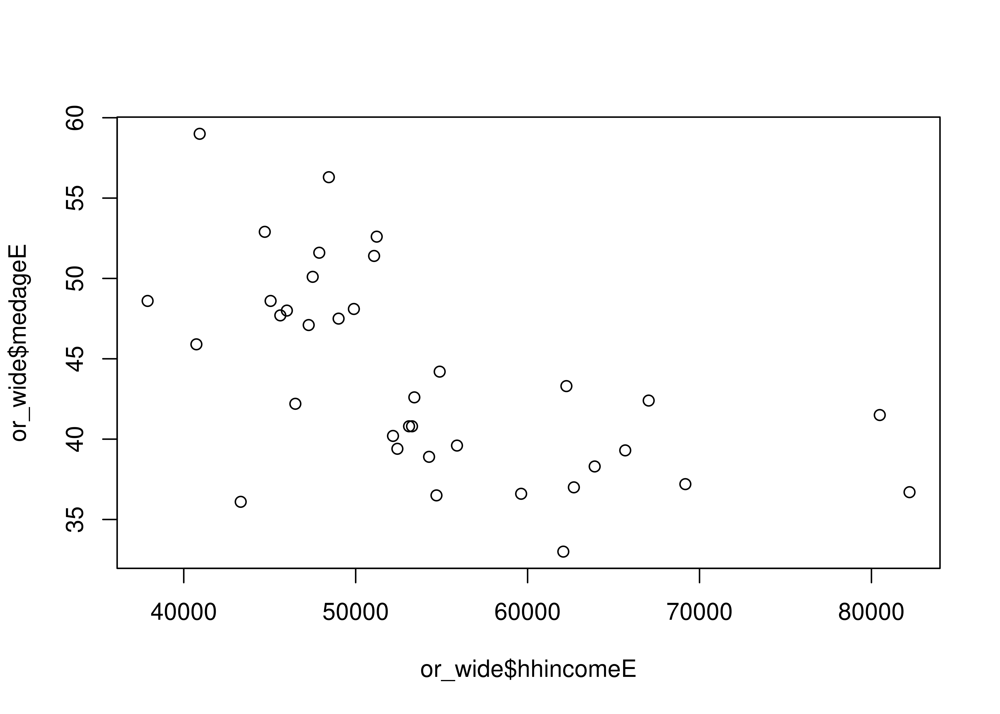<!-- -->

## Loading variables in tidycensus

There are hundreds of thousands of variables in the decennial Census and
American Community Survey samples, which can make it difficult to know
which variable codes to use! tidycensus aims to make this easier with
the load\_variables() function, which obtains a dataset of variables
from a specified sample and loads it into R as a browsable data frame.

``` r
# Load variables from the 2012-2016 ACS
v16 <- load_variables(year = 2016,
           dataset = "acs5",
           cache = TRUE)

# Get variables from the ACS Data Profile
v16p <- load_variables(year = 2016,
                       dataset = "acs5/profile",
                       cache = TRUE)

# Set year and dataset to get variables from the 2000 Census SF3
v00 <- load_variables(year = 2000,
                      dataset = "sf3",
                      cache = TRUE)
```

## Exploring variables with tidyverse tools

Once loaded, your dataset of Census or ACS variables might contain
thousands of rows. In RStudio, it is recommended to use the View()
function to interactively search for these variables. Outside of
RStudio, these datasets can be browsed using tidyverse filtering tools.

``` r
# Filter for table B19001
filter(v16, str_detect(name, "B19001"))
```

    ## # A tibble: 170 × 3
    ##    name     label                  concept                                      
    ##    <chr>    <chr>                  <chr>                                        
    ##  1 B19001_… Estimate!!Total        HOUSEHOLD INCOME IN THE PAST 12 MONTHS (IN 2…
    ##  2 B19001_… Estimate!!Total!!Less… HOUSEHOLD INCOME IN THE PAST 12 MONTHS (IN 2…
    ##  3 B19001_… Estimate!!Total!!$10,… HOUSEHOLD INCOME IN THE PAST 12 MONTHS (IN 2…
    ##  4 B19001_… Estimate!!Total!!$15,… HOUSEHOLD INCOME IN THE PAST 12 MONTHS (IN 2…
    ##  5 B19001_… Estimate!!Total!!$20,… HOUSEHOLD INCOME IN THE PAST 12 MONTHS (IN 2…
    ##  6 B19001_… Estimate!!Total!!$25,… HOUSEHOLD INCOME IN THE PAST 12 MONTHS (IN 2…
    ##  7 B19001_… Estimate!!Total!!$30,… HOUSEHOLD INCOME IN THE PAST 12 MONTHS (IN 2…
    ##  8 B19001_… Estimate!!Total!!$35,… HOUSEHOLD INCOME IN THE PAST 12 MONTHS (IN 2…
    ##  9 B19001_… Estimate!!Total!!$40,… HOUSEHOLD INCOME IN THE PAST 12 MONTHS (IN 2…
    ## 10 B19001_… Estimate!!Total!!$45,… HOUSEHOLD INCOME IN THE PAST 12 MONTHS (IN 2…
    ## # … with 160 more rows

``` r
# Use public transportation to search for related variables
filter(v16p, str_detect(label, fixed("public transportation", 
                                ignore_case = TRUE)))
```

    ## # A tibble: 2 × 3
    ##   name     label                                           concept              
    ##   <chr>    <chr>                                           <chr>                
    ## 1 DP03_00… Estimate!!COMMUTING TO WORK!!Workers 16 years … SELECTED ECONOMIC CH…
    ## 2 DP03_00… Percent!!COMMUTING TO WORK!!Workers 16 years a… SELECTED ECONOMIC CH…

## Comparing geographies with ggplot2 visualizations

When exploring Census or ACS data, you’ll often want to know how data
varies among different geographic units. For example - which US states
have higher - or lower - median household incomes? This can be
accomplished through visualization using dot plots, which are
particularly effective for showing ranks visually. In this exercise,
you’ll use the popular ggplot2 data visualization package to accomplish
this.

``` r
# Access the 1-year ACS  with the survey parameter
ne_income <- get_acs(geography = "state",
                     variables = "B19013_001", 
                     survey = "acs1", 
                     state = c("ME", "NH", "VT", "MA", 
                               "RI", "CT", "NY"))

# Create a dot plot

  
# Reorder the states in descending order of estimates
ggplot(ne_income, aes(x = estimate, y = reorder(NAME, estimate))) + 
  geom_point()
```

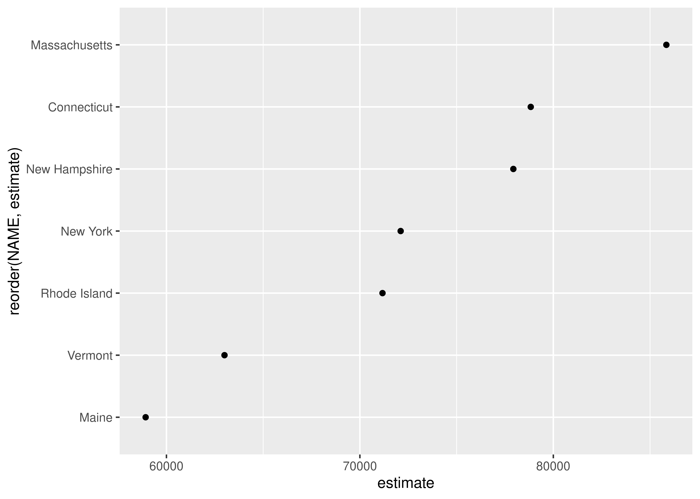<!-- -->

## Customizing ggplot2 visualizations of ACS data

While the ggplot2 defaults are excellent for exploratory visualization
of data, you’ll likely want to customize your charts before sharing them
with others. In this exercise, you’ll customize your tidycensus dot plot
by modifying the chart colors, tick labels, and axis labels. You’ll also
learn how to format labels using the scales package, as label formatters
can be imported using the :: syntax.

``` r
# Set dot color and size
g_color <- ggplot(ne_income, aes(x = estimate, y = reorder(NAME, estimate))) + 
  geom_point(color = "navy", size = 4)

# Format the x-axis labels
g_scale <- g_color + 
  scale_x_continuous(labels = scales::dollar) + 
  theme_minimal(base_size = 12) 

# Label your x-axis, y-axis, and title your chart
g_label <- g_scale + 
  labs(x ="2016 ACS estimate", 
       y = "", 
       title = "Median household income by state")
  
g_label
```

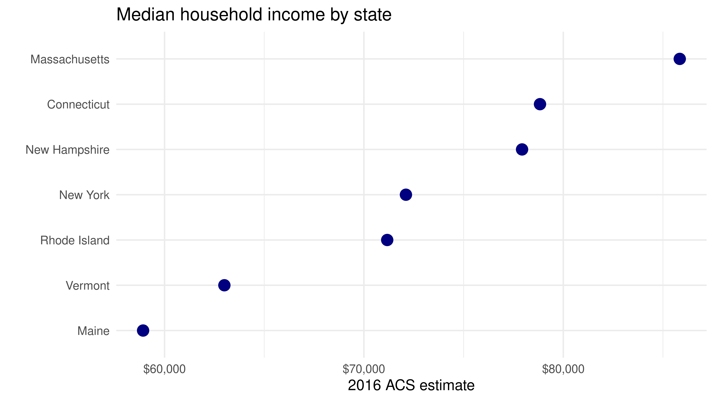<!-- -->

## Download and view a table of data from the ACS

Variables in the decennial Census and American Community Survey are
organized into tables, within which they share a common prefix.
Commonly, analysts will want to work with all variables in a given
table, as these variables might represent different aspects of a common
characteristic (such as race or income levels). To request data for an
entire table in tidycensus, users can specify a table argument with the
table prefix, and optionally cache a dataset of table codes to speed up
table searching in future requests. In this exercise, you’ll acquire a
table of variables representing different income bands, then filter out
the denominator rows.

``` r
# Download table "B19001"
wa_income <- get_acs(geography = "county", 
                 state = "WA", 
                 table = "B19001")

# Check out the first few rows of wa_income
head(wa_income)
```

    ## # A tibble: 6 × 5
    ##   GEOID NAME                     variable   estimate   moe
    ##   <chr> <chr>                    <chr>         <dbl> <dbl>
    ## 1 53001 Adams County, Washington B19001_001     5973   159
    ## 2 53001 Adams County, Washington B19001_002      490   147
    ## 3 53001 Adams County, Washington B19001_003      233    96
    ## 4 53001 Adams County, Washington B19001_004      294   107
    ## 5 53001 Adams County, Washington B19001_005      463   150
    ## 6 53001 Adams County, Washington B19001_006      331   140

## Get a summary variable and calculate percentages

Many variables in the Census and American Community Survey are
represented as counts or estimated counts. While count data is useful
for some applications, it is often good practice to normalize count data
by its denominator to convert it to a proportion or percentage to make
clearer comparisons. This is facilitated in tidycensus with the
summary\_var argument, which allows users to request that a variable is
given its own column in a tidy Census dataset. This value can then be
used as the denominator for subsequent calculations of percentages.

Summary question: When the summary\_var parameter is requested in
get\_acs(), what information is returned by the function?

``` r
# Assign Census variables vector to race_vars 
race_vars <- c(White = "B03002_003", Black = "B03002_004", Native = "B03002_005", 
               Asian = "B03002_006", HIPI = "B03002_007", Hispanic = "B03002_012")

# Request a summary variable from the ACS
ca_race <- get_acs(geography = "county", 
                   state = "CA",
                   variables = race_vars, 
                   summary_var = "B03002_001")

# Calculate a new percentage column and check the result
ca_race_pct <- ca_race %>%
  mutate(pct = 100 * (estimate / summary_est))

head(ca_race_pct)
```

    ## # A tibble: 6 × 8
    ##   GEOID NAME              variable estimate   moe summary_est summary_moe    pct
    ##   <chr> <chr>             <chr>       <dbl> <dbl>       <dbl>       <dbl>  <dbl>
    ## 1 06001 Alameda County, … White      520447   487     1656754          NA 31.4  
    ## 2 06001 Alameda County, … Black      171168  1541     1656754          NA 10.3  
    ## 3 06001 Alameda County, … Native       5210   310     1656754          NA  0.314
    ## 4 06001 Alameda County, … Asian      496006  2088     1656754          NA 29.9  
    ## 5 06001 Alameda County, … HIPI        13277   397     1656754          NA  0.801
    ## 6 06001 Alameda County, … Hispanic   371019    NA     1656754          NA 22.4

## Finding the largest group by county

tidyverse data wrangling tools in packages like dplyr and purrr are
extremely powerful for exploring Census data. tidycensus is specifically
designed with data exploration within the tidyverse in mind. For
example, users might be interested in finding out the largest
racial/ethnic group within each county for a given state. This can be
accomplished using dplyr grouping capabilities, which allow users to
identify the largest ACS group estimate and filter to retain the rows
that match that group.

``` r
# Group the dataset and filter the estimate
ca_largest <- ca_race %>%
  group_by(GEOID) %>%
  filter(estimate == max(estimate)) 

head(ca_largest)
```

    ## # A tibble: 6 × 7
    ## # Groups:   GEOID [6]
    ##   GEOID NAME                     variable estimate   moe summary_est summary_moe
    ##   <chr> <chr>                    <chr>       <dbl> <dbl>       <dbl>       <dbl>
    ## 1 06001 Alameda County, Califor… White      520447   487     1656754          NA
    ## 2 06003 Alpine County, Californ… White         551   118        1039         161
    ## 3 06005 Amador County, Californ… White       30035    34       38429          NA
    ## 4 06007 Butte County, California White      162537   240      225817          NA
    ## 5 06009 Calaveras County, Calif… White       36837    99       45514          NA
    ## 6 06011 Colusa County, Californ… Hispanic    12738    NA       21454          NA

``` r
# Group the dataset and get a breakdown of the results
ca_largest %>% 
  group_by(variable) %>%
  tally()
```

    ## # A tibble: 3 × 2
    ##   variable     n
    ##   <chr>    <int>
    ## 1 Asian        1
    ## 2 Hispanic    16
    ## 3 White       41

## Recoding variables and calculating group sums

dplyr, one of the core packages within the tidyverse, includes numerous
functions for data wrangling. This functionality allows users to recode
datasets, define groups within those datasets, and perform calculations
over those groups. Such operations commonly take place within a pipe,
denoted with the %&gt;% operator.

In this exercise, you’ll work with ACS data in just such a tidyverse
workflow. You’ll be identifying median household income variables in ACS
table B19001 that are below $35,000; between $35,000 and $75,000; and
above $75,000. You’ll then tabulate the number of households that fall
into each group for counties in Washington.

``` r
# Use a tidy workflow to wrangle ACS data
wa_grouped <- wa_income %>%
  filter(variable != "B19001_001") %>%
  mutate(incgroup = case_when(
    variable < "B19001_008" ~ "below35k", 
    variable < "B19001_013" ~ "35kto75k", 
    TRUE ~ "above75k"
  )) %>%
  group_by(NAME, incgroup) %>%
  summarize(group_est = sum(estimate))

wa_grouped
```

    ## # A tibble: 117 × 3
    ## # Groups:   NAME [39]
    ##    NAME                      incgroup group_est
    ##    <chr>                     <chr>        <dbl>
    ##  1 Adams County, Washington  35kto75k      2168
    ##  2 Adams County, Washington  above75k      1791
    ##  3 Adams County, Washington  below35k      2014
    ##  4 Asotin County, Washington 35kto75k      3133
    ##  5 Asotin County, Washington above75k      3157
    ##  6 Asotin County, Washington below35k      2811
    ##  7 Benton County, Washington 35kto75k     22245
    ##  8 Benton County, Washington above75k     32989
    ##  9 Benton County, Washington below35k     16887
    ## 10 Chelan County, Washington 35kto75k      9872
    ## # … with 107 more rows

## Comparing ACS estimates for multiple years

The American Community Survey is updated every year, which allows
researchers to use ACS datasets to study demographic changes over time.

In this exercise, you’ll learn how to use the tidyverse function
map\_df() to work with multi-year ACS data. map\_df() helps analysts
iterate through a sequence of values, compute a process for each of
those values, then combine the results into a single data frame. You’ll
be using map\_df() in this way with ACS data, as you iterate through a
vector of years, retrieve ACS data for each year, and combine the
results. This will allow you to view how ACS estimates have changed over
time.

``` r
# Map through ACS1 estimates to see how they change through the years
mi_cities <- map_df(2012:2016, function(x) {
  get_acs(geography = "place", 
          variables = c(totalpop = "B01003_001"), 
          state = "MI", 
          survey = "acs1", 
          year = x) %>%
    mutate(year = x)
})

mi_cities %>% arrange(NAME, year)
```

    ## # A tibble: 80 × 6
    ##    GEOID   NAME                     variable estimate   moe  year
    ##    <chr>   <chr>                    <chr>       <dbl> <dbl> <int>
    ##  1 2603000 Ann Arbor city, Michigan totalpop   116128    35  2012
    ##  2 2603000 Ann Arbor city, Michigan totalpop   117034    43  2013
    ##  3 2603000 Ann Arbor city, Michigan totalpop   117759    44  2014
    ##  4 2603000 Ann Arbor city, Michigan totalpop   117070    33  2015
    ##  5 2603000 Ann Arbor city, Michigan totalpop   120777    33  2016
    ##  6 2621000 Dearborn city, Michigan  totalpop    96470    28  2012
    ##  7 2621000 Dearborn city, Michigan  totalpop    95888    35  2013
    ##  8 2621000 Dearborn city, Michigan  totalpop    95546    48  2014
    ##  9 2621000 Dearborn city, Michigan  totalpop    95180    40  2015
    ## 10 2621000 Dearborn city, Michigan  totalpop    94430    52  2016
    ## # … with 70 more rows

## Inspecting margins of error

ACS data are distinct from decennial Census data in that they represent
estimates with an associated margin of error. ACS margins of error by
default represent a 90 percent confidence level around an estimate,
which means that we are 90 percent sure that the true value falls within
a range of the reported estimate plus or minus the reported margin of
error.

In this exercise, you’ll get some experience working with data that has
high margins of error relative to their estimates. We’ll use the example
of poverty for the population aged 75 and above for Census tracts in
Vermont.

``` r
# Get data on elderly poverty by Census tract in Vermont
vt_eldpov <- get_acs(geography = "tract", 
                     variables = c(eldpovm = "B17001_016", 
                                   eldpovf = "B17001_030"), 
                     state = "VT")

vt_eldpov
```

    ## # A tibble: 368 × 5
    ##    GEOID       NAME                                      variable estimate   moe
    ##    <chr>       <chr>                                     <chr>       <dbl> <dbl>
    ##  1 50001960100 Census Tract 9601, Addison County, Vermo… eldpovm         3     4
    ##  2 50001960100 Census Tract 9601, Addison County, Vermo… eldpovf        10     8
    ##  3 50001960200 Census Tract 9602, Addison County, Vermo… eldpovm         5     7
    ##  4 50001960200 Census Tract 9602, Addison County, Vermo… eldpovf         0     9
    ##  5 50001960300 Census Tract 9603, Addison County, Vermo… eldpovm        10    10
    ##  6 50001960300 Census Tract 9603, Addison County, Vermo… eldpovf        14    13
    ##  7 50001960400 Census Tract 9604, Addison County, Vermo… eldpovm         8     7
    ##  8 50001960400 Census Tract 9604, Addison County, Vermo… eldpovf        17     9
    ##  9 50001960500 Census Tract 9605, Addison County, Vermo… eldpovm         0     9
    ## 10 50001960500 Census Tract 9605, Addison County, Vermo… eldpovf         0     9
    ## # … with 358 more rows

``` r
# Identify rows with greater margins of error than their estimates
moe_check <- filter(vt_eldpov, moe > estimate)

# Check proportion of rows where the margin of error exceeds the estimate
nrow(moe_check) / nrow(vt_eldpov)
```

    ## [1] 0.7826087

## Using margin of error functions in tidycensus

While the Census Bureau API and tidycensus return pre-computed margins
of error for you, you may want to derive new estimates from downloaded
ACS data and in turn understand the margins of error around these
derived estimates. tidycensus includes four functions (listed below) to
help you with these tasks, each of which incorporates the recommended
formulas from the US Census Bureau.

moe\_sum() moe\_product() moe\_ratio() moe\_prop()

``` r
# Calculate a margin of error for a sum
moe_sum(moe = c(55, 33, 44, 12, 4))
```

    ## [1] 78.80355

``` r
# Calculate a margin of error for a product
moe_product(est1 = 55,
    est2 = 33,
    moe1 = 12,
    moe2 = 9)
```

    ## [1] 633.9093

``` r
# Calculate a margin of error for a ratio
moe_ratio(num = 1000,
    denom = 950,
    moe_num = 200,
    moe_denom = 177)
```

    ## [1] 0.287724

``` r
# Calculate a margin of error for a proportion
moe_prop(num = 374,
    denom = 1200,
    moe_num = 122,
    moe_denom = 333)
```

    ## [1] 0.05344178

## Calculating group-wise margins of error

One way to reduce margins of error in an ACS analysis is to combine
estimates when appropriate. This can be accomplished using tidyverse
group-wise data analysis tools. In this exercise, you’ll combine
estimates for male and female elderly poverty in Vermont, and use the
moe\_sum() function as part of this group-wise analysis. While you may
lose some detail with this type of approach, your estimates will be more
reliable relative to their margins of error than before you combined
them.

``` r
# Group the dataset and calculate a derived margin of error
vt_eldpov2 <- vt_eldpov %>%
  group_by(GEOID) %>%
  summarize(
    estmf = sum(estimate), 
    moemf = moe_sum(moe = moe, estimate = estimate)
  )

# Filter rows where newly-derived margin of error exceeds newly-derived estimate
moe_check2 <- filter(vt_eldpov2, moemf > estmf)

# Check proportion of rows where margin of error exceeds estimate
nrow(moe_check2) / nrow(vt_eldpov2)
```

    ## [1] 0.6032609

## Quick visual exploration of ACS margins of error

In Chapter 1, you learned how to create a dot plot of ACS income
estimates. In this chapter, you’ve also learned about the importance of
taking margins of error into account in ACS analyses. While margins of
error are likely minimal for state-level estimates, they may be more
significant for sub-state estimates, like counties. In this exercise,
you’ll learn how to visualize margins of error around estimates with
ggplot2.

``` r
# Request median household income data
maine_inc <- get_acs(geography = "county", 
                     variables = c(hhincome = "B19013_001"), 
                     state = "ME") 

# Generate horizontal error bars with dots
ggplot(maine_inc, aes(x = estimate, y = NAME)) + 
  geom_errorbarh(aes(xmin = estimate - moe, xmax = estimate + moe)) + 
  geom_point()
```

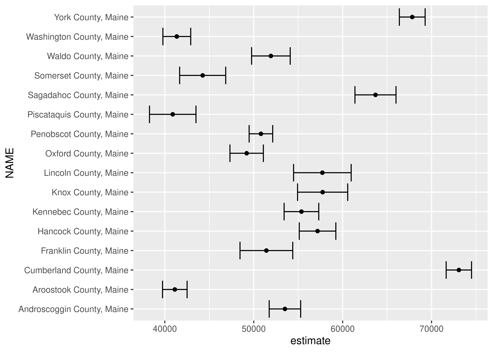<!-- -->

## Customizing a ggplot2 margin of error plot

You’ve hopefully identified some problems with the chart you created in
the previous exercise. As the counties are not ordered, patterns in the
data are difficult for a viewer to parse. Specifically, margin of error
plots are much more effective when dots are ordered as the ordering
allows viewers to understand the uncertainty in estimate values relative
to other estimates. Additionally, the lack of plot formatting makes it
difficult for chart viewers to understand the chart’s content. In this
exercise, you’ll clean up your ggplot2 code to create a much more
visually appealing margin of error chart.

``` r
# Remove unnecessary content from the county's name
maine_inc2 <- maine_inc %>%
  mutate(NAME = str_replace(NAME, " County, Maine", ""))

# Build a margin of error plot incorporating your modifications
ggplot(maine_inc2, aes(x = estimate, y = reorder(NAME, estimate))) + 
  geom_errorbarh(aes(xmin = estimate - moe, xmax = estimate + moe)) + 
  geom_point(size = 3, color = "darkgreen") + 
  theme_grey(base_size = 14) + 
  labs(title = "Median household income", 
       subtitle = "Counties in Maine", 
       x = "ACS estimate (bars represent margins of error)", 
       y = "") + 
  scale_x_continuous(labels = scales::dollar)
```

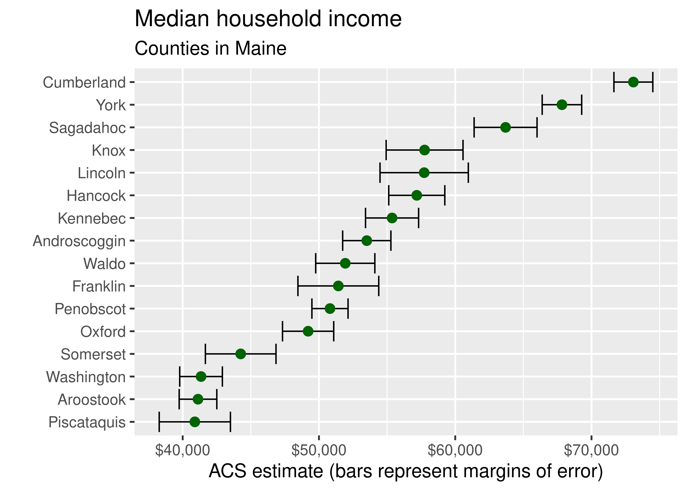<!-- -->

## Getting Census boundary files with tigris

The US Census Bureau’s TIGER/Line shapefiles include boundary files for
the geography at which decennial Census and ACS data are aggregated.
These geographies include legal entities that have legal standing in the
U.S., such as states and counties, and statistical entities used for
data tabulation such as Census tracts and block groups. In this
exercise, you’ll use the tigris package to acquire such boundary files
for counties in Colorado and Census tracts for Colorado’s Denver County,
which covers the city of Denver.

``` r
# Get a counties dataset for Colorado and plot it
co_counties <- counties(state = "CO")
```

    ##   |                                                                              |                                                                      |   0%  |                                                                              |                                                                      |   1%  |                                                                              |=                                                                     |   1%  |                                                                              |=                                                                     |   2%  |                                                                              |==                                                                    |   2%  |                                                                              |==                                                                    |   3%  |                                                                              |==                                                                    |   4%  |                                                                              |===                                                                   |   4%  |                                                                              |===                                                                   |   5%  |                                                                              |====                                                                  |   5%  |                                                                              |====                                                                  |   6%  |                                                                              |=====                                                                 |   6%  |                                                                              |=====                                                                 |   7%  |                                                                              |=====                                                                 |   8%  |                                                                              |======                                                                |   8%  |                                                                              |======                                                                |   9%  |                                                                              |=======                                                               |   9%  |                                                                              |=======                                                               |  10%  |                                                                              |=======                                                               |  11%  |                                                                              |========                                                              |  11%  |                                                                              |========                                                              |  12%  |                                                                              |=========                                                             |  12%  |                                                                              |=========                                                             |  13%  |                                                                              |=========                                                             |  14%  |                                                                              |==========                                                            |  14%  |                                                                              |==========                                                            |  15%  |                                                                              |===========                                                           |  15%  |                                                                              |===========                                                           |  16%  |                                                                              |============                                                          |  16%  |                                                                              |============                                                          |  17%  |                                                                              |============                                                          |  18%  |                                                                              |=============                                                         |  18%  |                                                                              |=============                                                         |  19%  |                                                                              |==============                                                        |  20%  |                                                                              |==============                                                        |  21%  |                                                                              |===============                                                       |  21%  |                                                                              |===============                                                       |  22%  |                                                                              |================                                                      |  22%  |                                                                              |================                                                      |  23%  |                                                                              |================                                                      |  24%  |                                                                              |=================                                                     |  24%  |                                                                              |=================                                                     |  25%  |                                                                              |==================                                                    |  25%  |                                                                              |==================                                                    |  26%  |                                                                              |===================                                                   |  26%  |                                                                              |===================                                                   |  27%  |                                                                              |===================                                                   |  28%  |                                                                              |====================                                                  |  28%  |                                                                              |====================                                                  |  29%  |                                                                              |=====================                                                 |  29%  |                                                                              |=====================                                                 |  30%  |                                                                              |=====================                                                 |  31%  |                                                                              |======================                                                |  31%  |                                                                              |======================                                                |  32%  |                                                                              |=======================                                               |  32%  |                                                                              |=======================                                               |  33%  |                                                                              |=======================                                               |  34%  |                                                                              |========================                                              |  34%  |                                                                              |========================                                              |  35%  |                                                                              |=========================                                             |  35%  |                                                                              |=========================                                             |  36%  |                                                                              |==========================                                            |  36%  |                                                                              |==========================                                            |  37%  |                                                                              |==========================                                            |  38%  |                                                                              |===========================                                           |  38%  |                                                                              |===========================                                           |  39%  |                                                                              |============================                                          |  39%  |                                                                              |============================                                          |  40%  |                                                                              |============================                                          |  41%  |                                                                              |=============================                                         |  41%  |                                                                              |=============================                                         |  42%  |                                                                              |==============================                                        |  42%  |                                                                              |==============================                                        |  43%  |                                                                              |==============================                                        |  44%  |                                                                              |===============================                                       |  44%  |                                                                              |===============================                                       |  45%  |                                                                              |================================                                      |  45%  |                                                                              |================================                                      |  46%  |                                                                              |=================================                                     |  46%  |                                                                              |=================================                                     |  47%  |                                                                              |=================================                                     |  48%  |                                                                              |==================================                                    |  48%  |                                                                              |==================================                                    |  49%  |                                                                              |===================================                                   |  49%  |                                                                              |===================================                                   |  50%  |                                                                              |===================================                                   |  51%  |                                                                              |====================================                                  |  51%  |                                                                              |====================================                                  |  52%  |                                                                              |=====================================                                 |  52%  |                                                                              |=====================================                                 |  53%  |                                                                              |=====================================                                 |  54%  |                                                                              |======================================                                |  54%  |                                                                              |======================================                                |  55%  |                                                                              |=======================================                               |  55%  |                                                                              |=======================================                               |  56%  |                                                                              |========================================                              |  56%  |                                                                              |========================================                              |  57%  |                                                                              |========================================                              |  58%  |                                                                              |=========================================                             |  58%  |                                                                              |=========================================                             |  59%  |                                                                              |==========================================                            |  59%  |                                                                              |==========================================                            |  60%  |                                                                              |==========================================                            |  61%  |                                                                              |===========================================                           |  61%  |                                                                              |===========================================                           |  62%  |                                                                              |============================================                          |  62%  |                                                                              |============================================                          |  63%  |                                                                              |============================================                          |  64%  |                                                                              |=============================================                         |  64%  |                                                                              |=============================================                         |  65%  |                                                                              |==============================================                        |  65%  |                                                                              |==============================================                        |  66%  |                                                                              |===============================================                       |  66%  |                                                                              |===============================================                       |  67%  |                                                                              |===============================================                       |  68%  |                                                                              |================================================                      |  68%  |                                                                              |================================================                      |  69%  |                                                                              |=================================================                     |  69%  |                                                                              |=================================================                     |  70%  |                                                                              |=================================================                     |  71%  |                                                                              |==================================================                    |  71%  |                                                                              |==================================================                    |  72%  |                                                                              |===================================================                   |  72%  |                                                                              |===================================================                   |  73%  |                                                                              |===================================================                   |  74%  |                                                                              |====================================================                  |  74%  |                                                                              |====================================================                  |  75%  |                                                                              |=====================================================                 |  75%  |                                                                              |=====================================================                 |  76%  |                                                                              |======================================================                |  76%  |                                                                              |======================================================                |  77%  |                                                                              |======================================================                |  78%  |                                                                              |=======================================================               |  78%  |                                                                              |=======================================================               |  79%  |                                                                              |========================================================              |  79%  |                                                                              |========================================================              |  80%  |                                                                              |========================================================              |  81%  |                                                                              |=========================================================             |  81%  |                                                                              |=========================================================             |  82%  |                                                                              |==========================================================            |  82%  |                                                                              |==========================================================            |  83%  |                                                                              |==========================================================            |  84%  |                                                                              |===========================================================           |  84%  |                                                                              |===========================================================           |  85%  |                                                                              |============================================================          |  85%  |                                                                              |============================================================          |  86%  |                                                                              |=============================================================         |  86%  |                                                                              |=============================================================         |  87%  |                                                                              |=============================================================         |  88%  |                                                                              |==============================================================        |  88%  |                                                                              |==============================================================        |  89%  |                                                                              |===============================================================       |  89%  |                                                                              |===============================================================       |  90%  |                                                                              |===============================================================       |  91%  |                                                                              |================================================================      |  91%  |                                                                              |================================================================      |  92%  |                                                                              |=================================================================     |  92%  |                                                                              |=================================================================     |  93%  |                                                                              |=================================================================     |  94%  |                                                                              |==================================================================    |  94%  |                                                                              |==================================================================    |  95%  |                                                                              |===================================================================   |  95%  |                                                                              |===================================================================   |  96%  |                                                                              |====================================================================  |  96%  |                                                                              |====================================================================  |  97%  |                                                                              |====================================================================  |  98%  |                                                                              |===================================================================== |  98%  |                                                                              |===================================================================== |  99%  |                                                                              |======================================================================|  99%  |                                                                              |======================================================================| 100%

``` r
plot(co_counties)
```

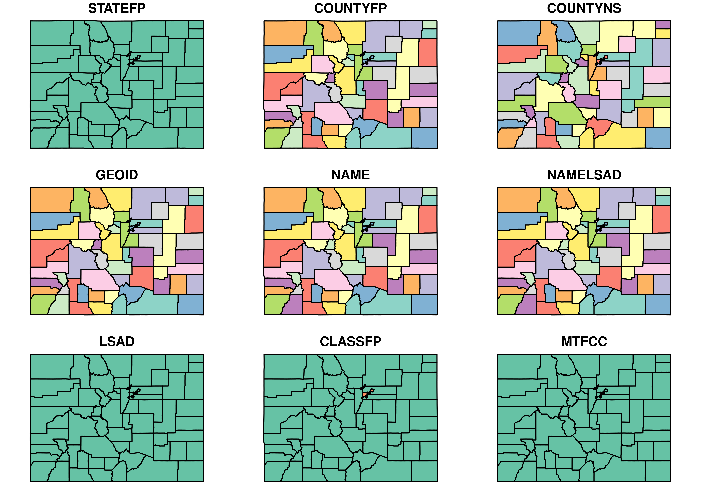<!-- -->

``` r
# Get a Census tracts dataset for Denver County, Colorado and plot it
denver_tracts <- tracts(state = "CO", county = "Denver")
```

    ##   |                                                                              |                                                                      |   0%  |                                                                              |                                                                      |   1%  |                                                                              |=                                                                     |   1%  |                                                                              |=                                                                     |   2%  |                                                                              |==                                                                    |   2%  |                                                                              |==                                                                    |   3%  |                                                                              |==                                                                    |   4%  |                                                                              |===                                                                   |   4%  |                                                                              |===                                                                   |   5%  |                                                                              |====                                                                  |   5%  |                                                                              |====                                                                  |   6%  |                                                                              |=====                                                                 |   6%  |                                                                              |=====                                                                 |   7%  |                                                                              |=====                                                                 |   8%  |                                                                              |======                                                                |   8%  |                                                                              |======                                                                |   9%  |                                                                              |=======                                                               |   9%  |                                                                              |=======                                                               |  10%  |                                                                              |=======                                                               |  11%  |                                                                              |========                                                              |  11%  |                                                                              |========                                                              |  12%  |                                                                              |=========                                                             |  12%  |                                                                              |=========                                                             |  13%  |                                                                              |=========                                                             |  14%  |                                                                              |==========                                                            |  14%  |                                                                              |==========                                                            |  15%  |                                                                              |===========                                                           |  15%  |                                                                              |===========                                                           |  16%  |                                                                              |============                                                          |  16%  |                                                                              |============                                                          |  17%  |                                                                              |============                                                          |  18%  |                                                                              |=============                                                         |  18%  |                                                                              |=============                                                         |  19%  |                                                                              |==============                                                        |  19%  |                                                                              |==============                                                        |  20%  |                                                                              |==============                                                        |  21%  |                                                                              |===============                                                       |  21%  |                                                                              |===============                                                       |  22%  |                                                                              |================                                                      |  22%  |                                                                              |================                                                      |  23%  |                                                                              |================                                                      |  24%  |                                                                              |=================                                                     |  24%  |                                                                              |=================                                                     |  25%  |                                                                              |==================                                                    |  25%  |                                                                              |==================                                                    |  26%  |                                                                              |===================                                                   |  26%  |                                                                              |===================                                                   |  27%  |                                                                              |===================                                                   |  28%  |                                                                              |====================                                                  |  28%  |                                                                              |====================                                                  |  29%  |                                                                              |=====================                                                 |  29%  |                                                                              |=====================                                                 |  30%  |                                                                              |=====================                                                 |  31%  |                                                                              |======================                                                |  31%  |                                                                              |======================                                                |  32%  |                                                                              |=======================                                               |  32%  |                                                                              |=======================                                               |  33%  |                                                                              |=======================                                               |  34%  |                                                                              |========================                                              |  34%  |                                                                              |========================                                              |  35%  |                                                                              |=========================                                             |  35%  |                                                                              |=========================                                             |  36%  |                                                                              |==========================                                            |  36%  |                                                                              |==========================                                            |  37%  |                                                                              |==========================                                            |  38%  |                                                                              |===========================                                           |  38%  |                                                                              |===========================                                           |  39%  |                                                                              |============================                                          |  39%  |                                                                              |============================                                          |  40%  |                                                                              |============================                                          |  41%  |                                                                              |=============================                                         |  41%  |                                                                              |=============================                                         |  42%  |                                                                              |==============================                                        |  42%  |                                                                              |==============================                                        |  43%  |                                                                              |==============================                                        |  44%  |                                                                              |===============================                                       |  44%  |                                                                              |===============================                                       |  45%  |                                                                              |================================                                      |  45%  |                                                                              |================================                                      |  46%  |                                                                              |=================================                                     |  46%  |                                                                              |=================================                                     |  47%  |                                                                              |=================================                                     |  48%  |                                                                              |==================================                                    |  48%  |                                                                              |==================================                                    |  49%  |                                                                              |===================================                                   |  49%  |                                                                              |===================================                                   |  50%  |                                                                              |===================================                                   |  51%  |                                                                              |====================================                                  |  51%  |                                                                              |====================================                                  |  52%  |                                                                              |=====================================                                 |  52%  |                                                                              |=====================================                                 |  53%  |                                                                              |=====================================                                 |  54%  |                                                                              |======================================                                |  54%  |                                                                              |======================================                                |  55%  |                                                                              |=======================================                               |  55%  |                                                                              |=======================================                               |  56%  |                                                                              |========================================                              |  56%  |                                                                              |========================================                              |  57%  |                                                                              |========================================                              |  58%  |                                                                              |=========================================                             |  58%  |                                                                              |=========================================                             |  59%  |                                                                              |==========================================                            |  59%  |                                                                              |==========================================                            |  60%  |                                                                              |==========================================                            |  61%  |                                                                              |===========================================                           |  61%  |                                                                              |===========================================                           |  62%  |                                                                              |============================================                          |  62%  |                                                                              |============================================                          |  63%  |                                                                              |============================================                          |  64%  |                                                                              |=============================================                         |  64%  |                                                                              |=============================================                         |  65%  |                                                                              |==============================================                        |  65%  |                                                                              |==============================================                        |  66%  |                                                                              |===============================================                       |  66%  |                                                                              |===============================================                       |  67%  |                                                                              |===============================================                       |  68%  |                                                                              |================================================                      |  68%  |                                                                              |================================================                      |  69%  |                                                                              |=================================================                     |  69%  |                                                                              |=================================================                     |  70%  |                                                                              |=================================================                     |  71%  |                                                                              |==================================================                    |  71%  |                                                                              |==================================================                    |  72%  |                                                                              |===================================================                   |  72%  |                                                                              |===================================================                   |  73%  |                                                                              |===================================================                   |  74%  |                                                                              |====================================================                  |  74%  |                                                                              |=====================================================                 |  75%  |                                                                              |=====================================================                 |  76%  |                                                                              |======================================================                |  76%  |                                                                              |======================================================                |  77%  |                                                                              |======================================================                |  78%  |                                                                              |=======================================================               |  78%  |                                                                              |=======================================================               |  79%  |                                                                              |========================================================              |  80%  |                                                                              |========================================================              |  81%  |                                                                              |=========================================================             |  81%  |                                                                              |=========================================================             |  82%  |                                                                              |==========================================================            |  82%  |                                                                              |==========================================================            |  83%  |                                                                              |==========================================================            |  84%  |                                                                              |===========================================================           |  84%  |                                                                              |===========================================================           |  85%  |                                                                              |============================================================          |  85%  |                                                                              |============================================================          |  86%  |                                                                              |=============================================================         |  87%  |                                                                              |=============================================================         |  88%  |                                                                              |==============================================================        |  88%  |                                                                              |==============================================================        |  89%  |                                                                              |===============================================================       |  90%  |                                                                              |===============================================================       |  91%  |                                                                              |================================================================      |  91%  |                                                                              |================================================================      |  92%  |                                                                              |=================================================================     |  92%  |                                                                              |=================================================================     |  93%  |                                                                              |=================================================================     |  94%  |                                                                              |==================================================================    |  94%  |                                                                              |==================================================================    |  95%  |                                                                              |===================================================================   |  95%  |                                                                              |===================================================================   |  96%  |                                                                              |====================================================================  |  96%  |                                                                              |====================================================================  |  97%  |                                                                              |====================================================================  |  98%  |                                                                              |===================================================================== |  98%  |                                                                              |===================================================================== |  99%  |                                                                              |======================================================================|  99%  |                                                                              |======================================================================| 100%

``` r
plot(denver_tracts)
```

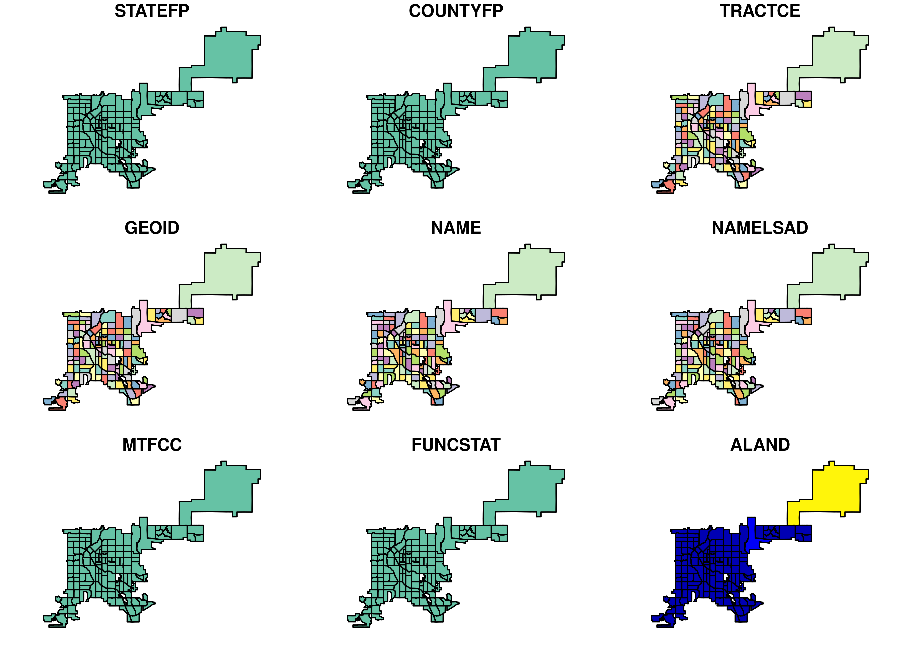<!-- -->

## Getting geographic features with tigris

In addition to enumeration units, the TIGER/Line database produced by
the Census Bureau includes geographic features. These features consist
of several datasets for use in thematic mapping and spatial analysis,
such as transportation infrastructure and water features. In this
exercise, you’ll acquire and plot roads and water data with tigris.

``` r
# Plot area water features for Lane County, Oregon
lane_water <- area_water(state = "OR", county = "Lane")
```

    ##   |                                                                              |                                                                      |   0%  |                                                                              |=                                                                     |   1%  |                                                                              |==                                                                    |   3%  |                                                                              |===                                                                   |   4%  |                                                                              |====                                                                  |   5%  |                                                                              |=====                                                                 |   7%  |                                                                              |======                                                                |   8%  |                                                                              |======                                                                |   9%  |                                                                              |=======                                                               |  11%  |                                                                              |========                                                              |  12%  |                                                                              |=========                                                             |  13%  |                                                                              |==========                                                            |  15%  |                                                                              |===========                                                           |  16%  |                                                                              |============                                                          |  17%  |                                                                              |=============                                                         |  19%  |                                                                              |==============                                                        |  20%  |                                                                              |===============                                                       |  21%  |                                                                              |===============                                                       |  22%  |                                                                              |================                                                      |  23%  |                                                                              |=================                                                     |  24%  |                                                                              |=================                                                     |  25%  |                                                                              |==================                                                    |  25%  |                                                                              |==================                                                    |  26%  |                                                                              |===================                                                   |  27%  |                                                                              |===================                                                   |  28%  |                                                                              |====================                                                  |  28%  |                                                                              |====================                                                  |  29%  |                                                                              |=====================                                                 |  30%  |                                                                              |======================                                                |  31%  |                                                                              |======================                                                |  32%  |                                                                              |=======================                                               |  32%  |                                                                              |=======================                                               |  33%  |                                                                              |========================                                              |  34%  |                                                                              |========================                                              |  35%  |                                                                              |=========================                                             |  35%  |                                                                              |=========================                                             |  36%  |                                                                              |==========================                                            |  37%  |                                                                              |===========================                                           |  38%  |                                                                              |===========================                                           |  39%  |                                                                              |============================                                          |  40%  |                                                                              |=============================                                         |  41%  |                                                                              |=============================                                         |  42%  |                                                                              |==============================                                        |  42%  |                                                                              |==============================                                        |  43%  |                                                                              |===============================                                       |  44%  |                                                                              |===============================                                       |  45%  |                                                                              |================================                                      |  46%  |                                                                              |=================================                                     |  47%  |                                                                              |==================================                                    |  48%  |                                                                              |==================================                                    |  49%  |                                                                              |===================================                                   |  49%  |                                                                              |===================================                                   |  50%  |                                                                              |===================================                                   |  51%  |                                                                              |====================================                                  |  51%  |                                                                              |====================================                                  |  52%  |                                                                              |=====================================                                 |  53%  |                                                                              |======================================                                |  54%  |                                                                              |=======================================                               |  55%  |                                                                              |=======================================                               |  56%  |                                                                              |========================================                              |  57%  |                                                                              |========================================                              |  58%  |                                                                              |=========================================                             |  58%  |                                                                              |=========================================                             |  59%  |                                                                              |==========================================                            |  59%  |                                                                              |==========================================                            |  60%  |                                                                              |===========================================                           |  61%  |                                                                              |===========================================                           |  62%  |                                                                              |============================================                          |  63%  |                                                                              |=============================================                         |  64%  |                                                                              |=============================================                         |  65%  |                                                                              |==============================================                        |  65%  |                                                                              |==============================================                        |  66%  |                                                                              |===============================================                       |  66%  |                                                                              |===============================================                       |  67%  |                                                                              |===============================================                       |  68%  |                                                                              |================================================                      |  68%  |                                                                              |================================================                      |  69%  |                                                                              |=================================================                     |  70%  |                                                                              |==================================================                    |  71%  |                                                                              |==================================================                    |  72%  |                                                                              |===================================================                   |  72%  |                                                                              |===================================================                   |  73%  |                                                                              |====================================================                  |  74%  |                                                                              |====================================================                  |  75%  |                                                                              |=====================================================                 |  75%  |                                                                              |=====================================================                 |  76%  |                                                                              |======================================================                |  77%  |                                                                              |=======================================================               |  78%  |                                                                              |=======================================================               |  79%  |                                                                              |========================================================              |  80%  |                                                                              |=========================================================             |  81%  |                                                                              |=========================================================             |  82%  |                                                                              |==========================================================            |  82%  |                                                                              |==========================================================            |  83%  |                                                                              |===========================================================           |  84%  |                                                                              |===========================================================           |  85%  |                                                                              |============================================================          |  86%  |                                                                              |=============================================================         |  87%  |                                                                              |==============================================================        |  88%  |                                                                              |==============================================================        |  89%  |                                                                              |===============================================================       |  89%  |                                                                              |===============================================================       |  90%  |                                                                              |===============================================================       |  91%  |                                                                              |================================================================      |  91%  |                                                                              |================================================================      |  92%  |                                                                              |=================================================================     |  92%  |                                                                              |=================================================================     |  93%  |                                                                              |==================================================================    |  94%  |                                                                              |===================================================================   |  95%  |                                                                              |===================================================================   |  96%  |                                                                              |====================================================================  |  97%  |                                                                              |====================================================================  |  98%  |                                                                              |===================================================================== |  98%  |                                                                              |===================================================================== |  99%  |                                                                              |======================================================================|  99%  |                                                                              |======================================================================| 100%

``` r
plot(lane_water)
```

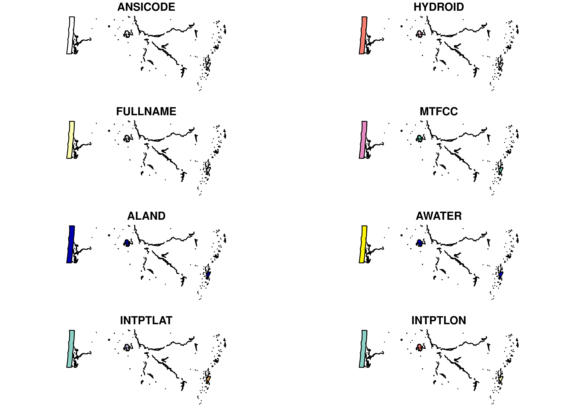<!-- -->

``` r
# Plot primary & secondary roads for the state of New Hampshire
nh_roads <- primary_secondary_roads(state = "NH")
```

    ##   |                                                                              |                                                                      |   0%  |                                                                              |                                                                      |   1%  |                                                                              |=                                                                     |   1%  |                                                                              |=                                                                     |   2%  |                                                                              |==                                                                    |   2%  |                                                                              |==                                                                    |   3%  |                                                                              |===                                                                   |   4%  |                                                                              |===                                                                   |   5%  |                                                                              |====                                                                  |   5%  |                                                                              |====                                                                  |   6%  |                                                                              |=====                                                                 |   7%  |                                                                              |=====                                                                 |   8%  |                                                                              |======                                                                |   8%  |                                                                              |======                                                                |   9%  |                                                                              |=======                                                               |   9%  |                                                                              |=======                                                               |  10%  |                                                                              |=======                                                               |  11%  |                                                                              |========                                                              |  11%  |                                                                              |========                                                              |  12%  |                                                                              |=========                                                             |  12%  |                                                                              |=========                                                             |  13%  |                                                                              |=========                                                             |  14%  |                                                                              |==========                                                            |  14%  |                                                                              |==========                                                            |  15%  |                                                                              |===========                                                           |  15%  |                                                                              |===========                                                           |  16%  |                                                                              |============                                                          |  16%  |                                                                              |============                                                          |  17%  |                                                                              |============                                                          |  18%  |                                                                              |=============                                                         |  18%  |                                                                              |=============                                                         |  19%  |                                                                              |==============                                                        |  19%  |                                                                              |==============                                                        |  20%  |                                                                              |==============                                                        |  21%  |                                                                              |===============                                                       |  21%  |                                                                              |===============                                                       |  22%  |                                                                              |================                                                      |  22%  |                                                                              |================                                                      |  23%  |                                                                              |=================                                                     |  24%  |                                                                              |=================                                                     |  25%  |                                                                              |==================                                                    |  25%  |                                                                              |==================                                                    |  26%  |                                                                              |===================                                                   |  27%  |                                                                              |===================                                                   |  28%  |                                                                              |====================                                                  |  28%  |                                                                              |====================                                                  |  29%  |                                                                              |=====================                                                 |  29%  |                                                                              |=====================                                                 |  30%  |                                                                              |=====================                                                 |  31%  |                                                                              |======================                                                |  31%  |                                                                              |======================                                                |  32%  |                                                                              |=======================                                               |  32%  |                                                                              |=======================                                               |  33%  |                                                                              |=======================                                               |  34%  |                                                                              |========================                                              |  34%  |                                                                              |========================                                              |  35%  |                                                                              |=========================                                             |  35%  |                                                                              |=========================                                             |  36%  |                                                                              |==========================                                            |  37%  |                                                                              |==========================                                            |  38%  |                                                                              |===========================                                           |  38%  |                                                                              |===========================                                           |  39%  |                                                                              |============================                                          |  39%  |                                                                              |============================                                          |  40%  |                                                                              |============================                                          |  41%  |                                                                              |=============================                                         |  41%  |                                                                              |=============================                                         |  42%  |                                                                              |==============================                                        |  42%  |                                                                              |==============================                                        |  43%  |                                                                              |===============================                                       |  44%  |                                                                              |===============================                                       |  45%  |                                                                              |================================                                      |  45%  |                                                                              |================================                                      |  46%  |                                                                              |=================================                                     |  46%  |                                                                              |=================================                                     |  47%  |                                                                              |=================================                                     |  48%  |                                                                              |==================================                                    |  48%  |                                                                              |==================================                                    |  49%  |                                                                              |===================================                                   |  49%  |                                                                              |===================================                                   |  50%  |                                                                              |===================================                                   |  51%  |                                                                              |====================================                                  |  51%  |                                                                              |====================================                                  |  52%  |                                                                              |=====================================                                 |  52%  |                                                                              |=====================================                                 |  53%  |                                                                              |=====================================                                 |  54%  |                                                                              |======================================                                |  54%  |                                                                              |======================================                                |  55%  |                                                                              |=======================================                               |  55%  |                                                                              |=======================================                               |  56%  |                                                                              |========================================                              |  57%  |                                                                              |========================================                              |  58%  |                                                                              |=========================================                             |  58%  |                                                                              |=========================================                             |  59%  |                                                                              |==========================================                            |  59%  |                                                                              |==========================================                            |  60%  |                                                                              |==========================================                            |  61%  |                                                                              |===========================================                           |  61%  |                                                                              |===========================================                           |  62%  |                                                                              |============================================                          |  62%  |                                                                              |============================================                          |  63%  |                                                                              |=============================================                         |  64%  |                                                                              |=============================================                         |  65%  |                                                                              |==============================================                        |  65%  |                                                                              |==============================================                        |  66%  |                                                                              |===============================================                       |  66%  |                                                                              |===============================================                       |  67%  |                                                                              |===============================================                       |  68%  |                                                                              |================================================                      |  68%  |                                                                              |================================================                      |  69%  |                                                                              |=================================================                     |  70%  |                                                                              |=================================================                     |  71%  |                                                                              |==================================================                    |  71%  |                                                                              |==================================================                    |  72%  |                                                                              |===================================================                   |  72%  |                                                                              |===================================================                   |  73%  |                                                                              |===================================================                   |  74%  |                                                                              |====================================================                  |  74%  |                                                                              |====================================================                  |  75%  |                                                                              |=====================================================                 |  75%  |                                                                              |=====================================================                 |  76%  |                                                                              |======================================================                |  76%  |                                                                              |======================================================                |  77%  |                                                                              |======================================================                |  78%  |                                                                              |=======================================================               |  78%  |                                                                              |=======================================================               |  79%  |                                                                              |========================================================              |  79%  |                                                                              |========================================================              |  80%  |                                                                              |========================================================              |  81%  |                                                                              |=========================================================             |  81%  |                                                                              |=========================================================             |  82%  |                                                                              |==========================================================            |  82%  |                                                                              |==========================================================            |  83%  |                                                                              |===========================================================           |  84%  |                                                                              |===========================================================           |  85%  |                                                                              |============================================================          |  85%  |                                                                              |============================================================          |  86%  |                                                                              |=============================================================         |  86%  |                                                                              |=============================================================         |  87%  |                                                                              |=============================================================         |  88%  |                                                                              |==============================================================        |  88%  |                                                                              |==============================================================        |  89%  |                                                                              |===============================================================       |  89%  |                                                                              |===============================================================       |  90%  |                                                                              |===============================================================       |  91%  |                                                                              |================================================================      |  91%  |                                                                              |================================================================      |  92%  |                                                                              |=================================================================     |  92%  |                                                                              |=================================================================     |  93%  |                                                                              |==================================================================    |  94%  |                                                                              |==================================================================    |  95%  |                                                                              |===================================================================   |  95%  |                                                                              |===================================================================   |  96%  |                                                                              |====================================================================  |  97%  |                                                                              |====================================================================  |  98%  |                                                                              |===================================================================== |  98%  |                                                                              |===================================================================== |  99%  |                                                                              |======================================================================|  99%  |                                                                              |======================================================================| 100%

``` r
plot(nh_roads)
```

<!-- -->

## Understanding the structure of tigris objects

By default, tigris returns objects of class Spatial*DataFrame from the
sp package. Objects of class Spatial* represent components of spatial
data in different slots, which include descriptions of the object’s
geometry, attributes, and coordinate system. In this exercise, we’ll
briefly examine the structure of objects returned by tigris functions.

``` r
# Check the class of the data
class(co_counties)
```

    ## [1] "sf"         "data.frame"

``` r
# Take a look at the information in the data slot
head(co_counties)
```

    ## Simple feature collection with 6 features and 17 fields
    ## Geometry type: MULTIPOLYGON
    ## Dimension:     XY
    ## Bounding box:  xmin: -108.3811 ymin: 36.99961 xmax: -102.0448 ymax: 41.0026
    ## Geodetic CRS:  NAD83
    ##     STATEFP COUNTYFP COUNTYNS GEOID     NAME        NAMELSAD LSAD CLASSFP MTFCC
    ## 23       08      109 00198170 08109 Saguache Saguache County   06      H1 G4020
    ## 107      08      115 00198173 08115 Sedgwick Sedgwick County   06      H1 G4020
    ## 124      08      017 00198124 08017 Cheyenne Cheyenne County   06      H1 G4020
    ## 163      08      027 00198129 08027   Custer   Custer County   06      H1 G4020
    ## 200      08      067 00198148 08067 La Plata La Plata County   06      H1 G4020
    ## 228      08      111 00198171 08111 San Juan San Juan County   06      H1 G4020
    ##     CSAFP CBSAFP METDIVFP FUNCSTAT      ALAND   AWATER    INTPTLAT     INTPTLON
    ## 23   <NA>   <NA>     <NA>        A 8206547705  4454510 +38.0316514 -106.2346662
    ## 107  <NA>   <NA>     <NA>        A 1419419016  3530746 +40.8715679 -102.3553579
    ## 124  <NA>   <NA>     <NA>        A 4605713960  8166129 +38.8356456 -102.6017914
    ## 163  <NA>   <NA>     <NA>        A 1913031921  3364150 +38.1019955 -105.3735123
    ## 200  <NA>  20420     <NA>        A 4376255148 25642578 +37.2873673 -107.8397178
    ## 228  <NA>   <NA>     <NA>        A 1003660672  2035929 +37.7810492 -107.6702567
    ##                           geometry
    ## 23  MULTIPOLYGON (((-106.8714 3...
    ## 107 MULTIPOLYGON (((-102.6521 4...
    ## 124 MULTIPOLYGON (((-102.5769 3...
    ## 163 MULTIPOLYGON (((-105.7969 3...
    ## 200 MULTIPOLYGON (((-108.2952 3...
    ## 228 MULTIPOLYGON (((-107.9751 3...

``` r
# Check the coordinate system of the data
```

## TIGER/Line and cartographic boundary files

In addition to its TIGER/Line shapefiles, the US Census Bureau releases
cartographic boundary shapefiles for enumeration units. TIGER/Line
shapefiles correspond to legal boundaries of units, which can include
water area and in turn, may not be preferable for thematic mapping. The
Census Bureau’s cartographic boundary shapefiles are clipped to the US
shoreline and are generalized, which can make them superior for mapping
projects. In this exercise, you’ll compare the TIGER/Line and
cartographic boundary representations of the US state of Michigan.

``` r
# Get a counties dataset for Michigan
mi_tiger <- counties("MI")

# Get the equivalent cartographic boundary shapefile
mi_cb <- counties("MI", cb = TRUE)
```

    ##   |                                                                              |                                                                      |   0%  |                                                                              |                                                                      |   1%  |                                                                              |=                                                                     |   1%  |                                                                              |=                                                                     |   2%  |                                                                              |==                                                                    |   2%  |                                                                              |==                                                                    |   3%  |                                                                              |==                                                                    |   4%  |                                                                              |===                                                                   |   4%  |                                                                              |===                                                                   |   5%  |                                                                              |====                                                                  |   5%  |                                                                              |====                                                                  |   6%  |                                                                              |=====                                                                 |   6%  |                                                                              |=====                                                                 |   7%  |                                                                              |=====                                                                 |   8%  |                                                                              |======                                                                |   8%  |                                                                              |======                                                                |   9%  |                                                                              |=======                                                               |   9%  |                                                                              |=======                                                               |  10%  |                                                                              |=======                                                               |  11%  |                                                                              |========                                                              |  11%  |                                                                              |========                                                              |  12%  |                                                                              |=========                                                             |  12%  |                                                                              |=========                                                             |  13%  |                                                                              |=========                                                             |  14%  |                                                                              |==========                                                            |  14%  |                                                                              |==========                                                            |  15%  |                                                                              |===========                                                           |  15%  |                                                                              |===========                                                           |  16%  |                                                                              |============                                                          |  16%  |                                                                              |============                                                          |  17%  |                                                                              |============                                                          |  18%  |                                                                              |=============                                                         |  18%  |                                                                              |=============                                                         |  19%  |                                                                              |==============                                                        |  19%  |                                                                              |==============                                                        |  20%  |                                                                              |==============                                                        |  21%  |                                                                              |===============                                                       |  21%  |                                                                              |===============                                                       |  22%  |                                                                              |================                                                      |  22%  |                                                                              |================                                                      |  23%  |                                                                              |================                                                      |  24%  |                                                                              |=================                                                     |  24%  |                                                                              |=================                                                     |  25%  |                                                                              |==================                                                    |  25%  |                                                                              |==================                                                    |  26%  |                                                                              |===================                                                   |  26%  |                                                                              |===================                                                   |  27%  |                                                                              |===================                                                   |  28%  |                                                                              |====================                                                  |  28%  |                                                                              |====================                                                  |  29%  |                                                                              |=====================                                                 |  29%  |                                                                              |=====================                                                 |  30%  |                                                                              |=====================                                                 |  31%  |                                                                              |======================                                                |  31%  |                                                                              |======================                                                |  32%  |                                                                              |=======================                                               |  32%  |                                                                              |=======================                                               |  33%  |                                                                              |=======================                                               |  34%  |                                                                              |========================                                              |  34%  |                                                                              |========================                                              |  35%  |                                                                              |=========================                                             |  35%  |                                                                              |=========================                                             |  36%  |                                                                              |==========================                                            |  36%  |                                                                              |==========================                                            |  37%  |                                                                              |==========================                                            |  38%  |                                                                              |===========================                                           |  38%  |                                                                              |===========================                                           |  39%  |                                                                              |============================                                          |  39%  |                                                                              |============================                                          |  40%  |                                                                              |============================                                          |  41%  |                                                                              |=============================                                         |  41%  |                                                                              |=============================                                         |  42%  |                                                                              |==============================                                        |  42%  |                                                                              |==============================                                        |  43%  |                                                                              |==============================                                        |  44%  |                                                                              |===============================                                       |  44%  |                                                                              |===============================                                       |  45%  |                                                                              |================================                                      |  45%  |                                                                              |================================                                      |  46%  |                                                                              |=================================                                     |  46%  |                                                                              |=================================                                     |  47%  |                                                                              |=================================                                     |  48%  |                                                                              |==================================                                    |  48%  |                                                                              |==================================                                    |  49%  |                                                                              |===================================                                   |  49%  |                                                                              |===================================                                   |  50%  |                                                                              |===================================                                   |  51%  |                                                                              |====================================                                  |  51%  |                                                                              |====================================                                  |  52%  |                                                                              |=====================================                                 |  52%  |                                                                              |=====================================                                 |  53%  |                                                                              |=====================================                                 |  54%  |                                                                              |======================================                                |  54%  |                                                                              |======================================                                |  55%  |                                                                              |=======================================                               |  55%  |                                                                              |=======================================                               |  56%  |                                                                              |========================================                              |  56%  |                                                                              |========================================                              |  57%  |                                                                              |========================================                              |  58%  |                                                                              |=========================================                             |  58%  |                                                                              |=========================================                             |  59%  |                                                                              |==========================================                            |  59%  |                                                                              |==========================================                            |  60%  |                                                                              |==========================================                            |  61%  |                                                                              |===========================================                           |  61%  |                                                                              |===========================================                           |  62%  |                                                                              |============================================                          |  62%  |                                                                              |============================================                          |  63%  |                                                                              |============================================                          |  64%  |                                                                              |=============================================                         |  64%  |                                                                              |=============================================                         |  65%  |                                                                              |==============================================                        |  65%  |                                                                              |==============================================                        |  66%  |                                                                              |===============================================                       |  66%  |                                                                              |===============================================                       |  67%  |                                                                              |===============================================                       |  68%  |                                                                              |================================================                      |  68%  |                                                                              |================================================                      |  69%  |                                                                              |=================================================                     |  69%  |                                                                              |=================================================                     |  70%  |                                                                              |=================================================                     |  71%  |                                                                              |==================================================                    |  71%  |                                                                              |==================================================                    |  72%  |                                                                              |===================================================                   |  72%  |                                                                              |===================================================                   |  73%  |                                                                              |===================================================                   |  74%  |                                                                              |====================================================                  |  74%  |                                                                              |====================================================                  |  75%  |                                                                              |=====================================================                 |  75%  |                                                                              |=====================================================                 |  76%  |                                                                              |======================================================                |  76%  |                                                                              |======================================================                |  77%  |                                                                              |======================================================                |  78%  |                                                                              |=======================================================               |  78%  |                                                                              |=======================================================               |  79%  |                                                                              |========================================================              |  79%  |                                                                              |========================================================              |  80%  |                                                                              |========================================================              |  81%  |                                                                              |=========================================================             |  81%  |                                                                              |=========================================================             |  82%  |                                                                              |==========================================================            |  83%  |                                                                              |==========================================================            |  84%  |                                                                              |===========================================================           |  84%  |                                                                              |===========================================================           |  85%  |                                                                              |============================================================          |  85%  |                                                                              |============================================================          |  86%  |                                                                              |=============================================================         |  86%  |                                                                              |=============================================================         |  87%  |                                                                              |=============================================================         |  88%  |                                                                              |==============================================================        |  88%  |                                                                              |==============================================================        |  89%  |                                                                              |===============================================================       |  89%  |                                                                              |===============================================================       |  90%  |                                                                              |===============================================================       |  91%  |                                                                              |================================================================      |  91%  |                                                                              |================================================================      |  92%  |                                                                              |=================================================================     |  92%  |                                                                              |=================================================================     |  93%  |                                                                              |=================================================================     |  94%  |                                                                              |==================================================================    |  94%  |                                                                              |==================================================================    |  95%  |                                                                              |===================================================================   |  95%  |                                                                              |===================================================================   |  96%  |                                                                              |====================================================================  |  96%  |                                                                              |====================================================================  |  97%  |                                                                              |====================================================================  |  98%  |                                                                              |===================================================================== |  98%  |                                                                              |===================================================================== |  99%  |                                                                              |======================================================================|  99%  |                                                                              |======================================================================| 100%

``` r
# Overlay the two on a plot to make a comparison
plot(mi_tiger)
plot(mi_cb, add = TRUE, border = "red")
```

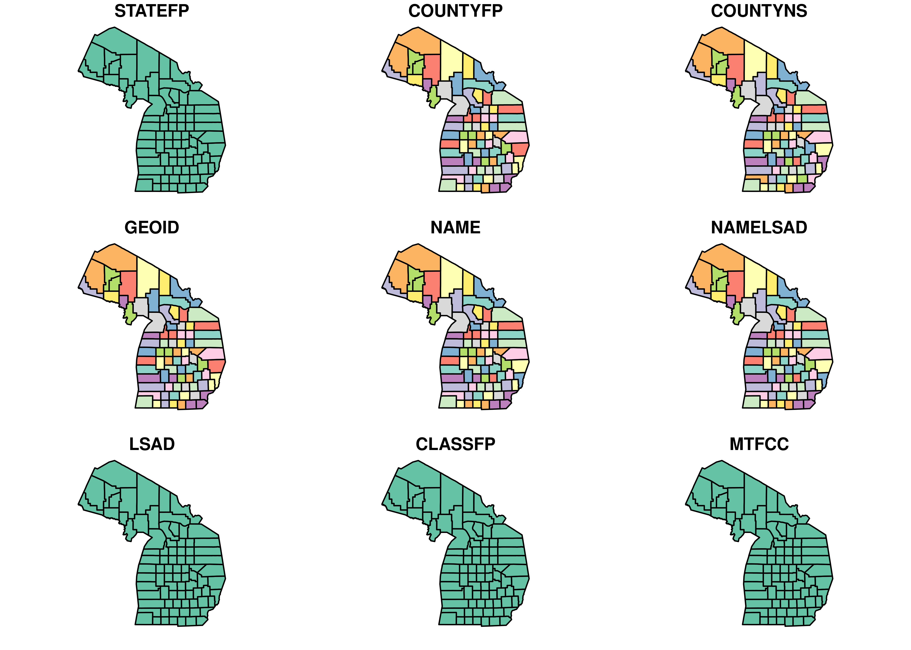<!-- -->

## Getting data as simple features objects

The sf package, which stands for simple features, promises to
revolutionize the way that vector spatial data are handled within R. sf
objects represent spatial data much like regular data frames, with a
list-column that contains the geometry of the geographic dataset. tigris
can return spatial data as simple features objects either by declaring
class = “sf” within a function call or by setting as a global option. In
this exercise, you’ll get acquainted with simple features in tigris.

``` r
# Get data from tigris as simple features
options(tigris_class = "sf")

# Get countries from Colorado and view the first few rows
colorado_sf <- counties("CO")
head(colorado_sf)
```

    ## Simple feature collection with 6 features and 17 fields
    ## Geometry type: MULTIPOLYGON
    ## Dimension:     XY
    ## Bounding box:  xmin: -108.3811 ymin: 36.99961 xmax: -102.0448 ymax: 41.0026
    ## Geodetic CRS:  NAD83
    ##     STATEFP COUNTYFP COUNTYNS GEOID     NAME        NAMELSAD LSAD CLASSFP MTFCC
    ## 23       08      109 00198170 08109 Saguache Saguache County   06      H1 G4020
    ## 107      08      115 00198173 08115 Sedgwick Sedgwick County   06      H1 G4020
    ## 124      08      017 00198124 08017 Cheyenne Cheyenne County   06      H1 G4020
    ## 163      08      027 00198129 08027   Custer   Custer County   06      H1 G4020
    ## 200      08      067 00198148 08067 La Plata La Plata County   06      H1 G4020
    ## 228      08      111 00198171 08111 San Juan San Juan County   06      H1 G4020
    ##     CSAFP CBSAFP METDIVFP FUNCSTAT      ALAND   AWATER    INTPTLAT     INTPTLON
    ## 23   <NA>   <NA>     <NA>        A 8206547705  4454510 +38.0316514 -106.2346662
    ## 107  <NA>   <NA>     <NA>        A 1419419016  3530746 +40.8715679 -102.3553579
    ## 124  <NA>   <NA>     <NA>        A 4605713960  8166129 +38.8356456 -102.6017914
    ## 163  <NA>   <NA>     <NA>        A 1913031921  3364150 +38.1019955 -105.3735123
    ## 200  <NA>  20420     <NA>        A 4376255148 25642578 +37.2873673 -107.8397178
    ## 228  <NA>   <NA>     <NA>        A 1003660672  2035929 +37.7810492 -107.6702567
    ##                           geometry
    ## 23  MULTIPOLYGON (((-106.8714 3...
    ## 107 MULTIPOLYGON (((-102.6521 4...
    ## 124 MULTIPOLYGON (((-102.5769 3...
    ## 163 MULTIPOLYGON (((-105.7969 3...
    ## 200 MULTIPOLYGON (((-108.2952 3...
    ## 228 MULTIPOLYGON (((-107.9751 3...

``` r
# Plot its geometry column
plot(colorado_sf$geometry)
```

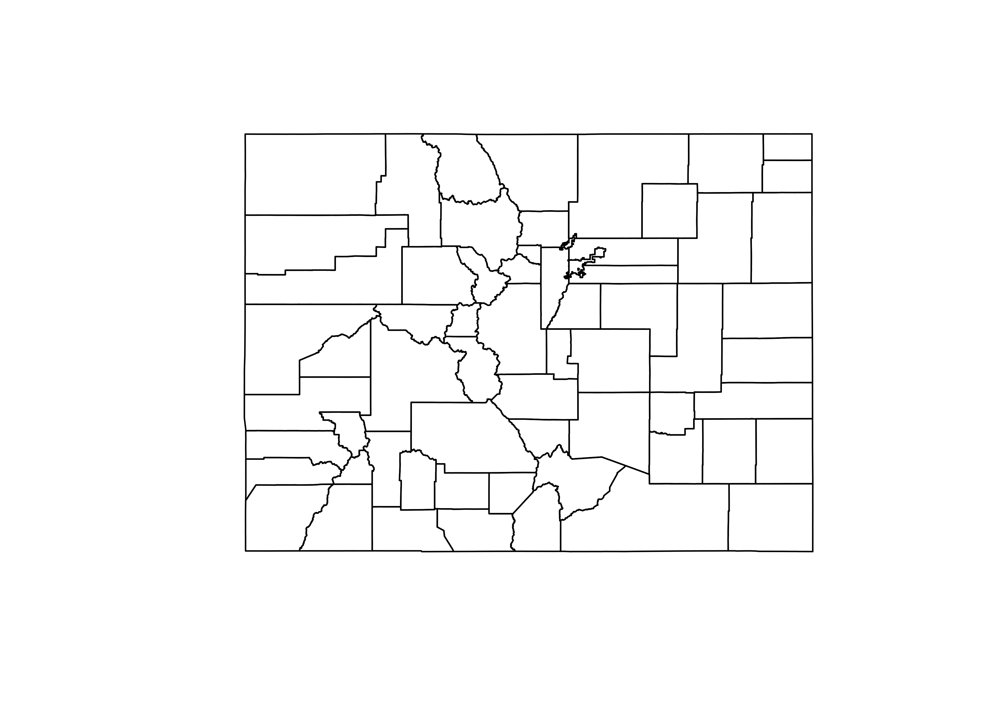<!-- -->

## Working with historic shapefiles

To ensure clean integration with the tidycensus package - which you’ll
learn about in the next chapter - tigris defaults to returning
shapefiles that correspond to the year of the most recently-released ACS
data. However, you may want boundary files for other years. tigris
allows R users to obtain shapefiles for 1990, 2000, and 2010 through
2017, which represent many boundary changes over time. In this exercise,
you’ll use tigris to explore how Census tract boundaries have changed in
Williamson County, Texas between 1990 and 2016.

``` r
# Get a historic Census tract shapefile from 1990 for Williamson County, Texas
williamson90 <- tracts(state = "TX", county = "Williamson", 
                       cb = TRUE, year = 1990)
```

    ##   |                                                                              |                                                                      |   0%  |                                                                              |=                                                                     |   1%  |                                                                              |=                                                                     |   2%  |                                                                              |==                                                                    |   3%  |                                                                              |===                                                                   |   4%  |                                                                              |===                                                                   |   5%  |                                                                              |====                                                                  |   5%  |                                                                              |====                                                                  |   6%  |                                                                              |=====                                                                 |   7%  |                                                                              |=====                                                                 |   8%  |                                                                              |======                                                                |   8%  |                                                                              |======                                                                |   9%  |                                                                              |=======                                                               |  10%  |                                                                              |=======                                                               |  11%  |                                                                              |========                                                              |  11%  |                                                                              |========                                                              |  12%  |                                                                              |=========                                                             |  13%  |                                                                              |==========                                                            |  14%  |                                                                              |==========                                                            |  15%  |                                                                              |===========                                                           |  15%  |                                                                              |===========                                                           |  16%  |                                                                              |============                                                          |  17%  |                                                                              |============                                                          |  18%  |                                                                              |=============                                                         |  18%  |                                                                              |=============                                                         |  19%  |                                                                              |==============                                                        |  20%  |                                                                              |==============                                                        |  21%  |                                                                              |===============                                                       |  21%  |                                                                              |===============                                                       |  22%  |                                                                              |================                                                      |  22%  |                                                                              |================                                                      |  23%  |                                                                              |=================                                                     |  24%  |                                                                              |=================                                                     |  25%  |                                                                              |==================                                                    |  25%  |                                                                              |==================                                                    |  26%  |                                                                              |===================                                                   |  27%  |                                                                              |===================                                                   |  28%  |                                                                              |====================                                                  |  28%  |                                                                              |====================                                                  |  29%  |                                                                              |=====================                                                 |  30%  |                                                                              |======================                                                |  31%  |                                                                              |======================                                                |  32%  |                                                                              |=======================                                               |  32%  |                                                                              |=======================                                               |  33%  |                                                                              |========================                                              |  34%  |                                                                              |========================                                              |  35%  |                                                                              |=========================                                             |  35%  |                                                                              |=========================                                             |  36%  |                                                                              |==========================                                            |  37%  |                                                                              |==========================                                            |  38%  |                                                                              |===========================                                           |  38%  |                                                                              |===========================                                           |  39%  |                                                                              |============================                                          |  40%  |                                                                              |=============================                                         |  41%  |                                                                              |=============================                                         |  42%  |                                                                              |==============================                                        |  42%  |                                                                              |==============================                                        |  43%  |                                                                              |===============================                                       |  44%  |                                                                              |===============================                                       |  45%  |                                                                              |================================                                      |  45%  |                                                                              |================================                                      |  46%  |                                                                              |=================================                                     |  47%  |                                                                              |=================================                                     |  48%  |                                                                              |==================================                                    |  48%  |                                                                              |==================================                                    |  49%  |                                                                              |===================================                                   |  49%  |                                                                              |===================================                                   |  50%  |                                                                              |====================================                                  |  51%  |                                                                              |====================================                                  |  52%  |                                                                              |=====================================                                 |  52%  |                                                                              |=====================================                                 |  53%  |                                                                              |======================================                                |  54%  |                                                                              |======================================                                |  55%  |                                                                              |=======================================                               |  55%  |                                                                              |=======================================                               |  56%  |                                                                              |========================================                              |  57%  |                                                                              |========================================                              |  58%  |                                                                              |=========================================                             |  58%  |                                                                              |=========================================                             |  59%  |                                                                              |==========================================                            |  59%  |                                                                              |==========================================                            |  60%  |                                                                              |===========================================                           |  61%  |                                                                              |===========================================                           |  62%  |                                                                              |============================================                          |  62%  |                                                                              |============================================                          |  63%  |                                                                              |=============================================                         |  64%  |                                                                              |=============================================                         |  65%  |                                                                              |==============================================                        |  65%  |                                                                              |==============================================                        |  66%  |                                                                              |===============================================                       |  67%  |                                                                              |================================================                      |  68%  |                                                                              |================================================                      |  69%  |                                                                              |=================================================                     |  69%  |                                                                              |=================================================                     |  70%  |                                                                              |==================================================                    |  71%  |                                                                              |==================================================                    |  72%  |                                                                              |===================================================                   |  72%  |                                                                              |===================================================                   |  73%  |                                                                              |====================================================                  |  74%  |                                                                              |====================================================                  |  75%  |                                                                              |=====================================================                 |  75%  |                                                                              |=====================================================                 |  76%  |                                                                              |======================================================                |  77%  |                                                                              |======================================================                |  78%  |                                                                              |=======================================================               |  78%  |                                                                              |=======================================================               |  79%  |                                                                              |========================================================              |  79%  |                                                                              |========================================================              |  80%  |                                                                              |=========================================================             |  81%  |                                                                              |=========================================================             |  82%  |                                                                              |==========================================================            |  82%  |                                                                              |==========================================================            |  83%  |                                                                              |===========================================================           |  84%  |                                                                              |===========================================================           |  85%  |                                                                              |============================================================          |  85%  |                                                                              |============================================================          |  86%  |                                                                              |=============================================================         |  86%  |                                                                              |=============================================================         |  87%  |                                                                              |=============================================================         |  88%  |                                                                              |==============================================================        |  88%  |                                                                              |==============================================================        |  89%  |                                                                              |===============================================================       |  89%  |                                                                              |===============================================================       |  90%  |                                                                              |===============================================================       |  91%  |                                                                              |================================================================      |  91%  |                                                                              |================================================================      |  92%  |                                                                              |=================================================================     |  92%  |                                                                              |=================================================================     |  93%  |                                                                              |==================================================================    |  94%  |                                                                              |==================================================================    |  95%  |                                                                              |===================================================================   |  95%  |                                                                              |===================================================================   |  96%  |                                                                              |====================================================================  |  96%  |                                                                              |====================================================================  |  97%  |                                                                              |====================================================================  |  98%  |                                                                              |===================================================================== |  98%  |                                                                              |===================================================================== |  99%  |                                                                              |======================================================================|  99%  |                                                                              |======================================================================| 100%

``` r
# Compare with a current dataset for 2016
williamson16 <- tracts(state = "TX", county = "Williamson", 
                       cb = TRUE, year = 2016)
```

    ##   |                                                                              |                                                                      |   0%  |                                                                              |                                                                      |   1%  |                                                                              |=                                                                     |   1%  |                                                                              |=                                                                     |   2%  |                                                                              |==                                                                    |   2%  |                                                                              |==                                                                    |   3%  |                                                                              |==                                                                    |   4%  |                                                                              |===                                                                   |   4%  |                                                                              |===                                                                   |   5%  |                                                                              |====                                                                  |   5%  |                                                                              |====                                                                  |   6%  |                                                                              |=====                                                                 |   6%  |                                                                              |=====                                                                 |   7%  |                                                                              |=====                                                                 |   8%  |                                                                              |======                                                                |   8%  |                                                                              |======                                                                |   9%  |                                                                              |=======                                                               |   9%  |                                                                              |=======                                                               |  10%  |                                                                              |=======                                                               |  11%  |                                                                              |========                                                              |  11%  |                                                                              |========                                                              |  12%  |                                                                              |=========                                                             |  12%  |                                                                              |=========                                                             |  13%  |                                                                              |=========                                                             |  14%  |                                                                              |==========                                                            |  14%  |                                                                              |==========                                                            |  15%  |                                                                              |===========                                                           |  15%  |                                                                              |===========                                                           |  16%  |                                                                              |============                                                          |  16%  |                                                                              |============                                                          |  17%  |                                                                              |============                                                          |  18%  |                                                                              |=============                                                         |  18%  |                                                                              |=============                                                         |  19%  |                                                                              |==============                                                        |  19%  |                                                                              |==============                                                        |  20%  |                                                                              |==============                                                        |  21%  |                                                                              |===============                                                       |  21%  |                                                                              |===============                                                       |  22%  |                                                                              |================                                                      |  22%  |                                                                              |================                                                      |  23%  |                                                                              |=================                                                     |  24%  |                                                                              |=================                                                     |  25%  |                                                                              |==================                                                    |  25%  |                                                                              |==================                                                    |  26%  |                                                                              |===================                                                   |  26%  |                                                                              |===================                                                   |  27%  |                                                                              |===================                                                   |  28%  |                                                                              |====================                                                  |  28%  |                                                                              |====================                                                  |  29%  |                                                                              |=====================                                                 |  29%  |                                                                              |=====================                                                 |  30%  |                                                                              |=====================                                                 |  31%  |                                                                              |======================                                                |  31%  |                                                                              |======================                                                |  32%  |                                                                              |=======================                                               |  32%  |                                                                              |=======================                                               |  33%  |                                                                              |=======================                                               |  34%  |                                                                              |========================                                              |  34%  |                                                                              |========================                                              |  35%  |                                                                              |=========================                                             |  35%  |                                                                              |=========================                                             |  36%  |                                                                              |==========================                                            |  37%  |                                                                              |==========================                                            |  38%  |                                                                              |===========================                                           |  38%  |                                                                              |===========================                                           |  39%  |                                                                              |============================                                          |  39%  |                                                                              |============================                                          |  40%  |                                                                              |============================                                          |  41%  |                                                                              |=============================                                         |  41%  |                                                                              |=============================                                         |  42%  |                                                                              |==============================                                        |  42%  |                                                                              |==============================                                        |  43%  |                                                                              |==============================                                        |  44%  |                                                                              |===============================                                       |  44%  |                                                                              |===============================                                       |  45%  |                                                                              |================================                                      |  45%  |                                                                              |================================                                      |  46%  |                                                                              |=================================                                     |  46%  |                                                                              |=================================                                     |  47%  |                                                                              |=================================                                     |  48%  |                                                                              |==================================                                    |  48%  |                                                                              |==================================                                    |  49%  |                                                                              |===================================                                   |  49%  |                                                                              |===================================                                   |  50%  |                                                                              |===================================                                   |  51%  |                                                                              |====================================                                  |  51%  |                                                                              |====================================                                  |  52%  |                                                                              |=====================================                                 |  52%  |                                                                              |=====================================                                 |  53%  |                                                                              |=====================================                                 |  54%  |                                                                              |======================================                                |  54%  |                                                                              |======================================                                |  55%  |                                                                              |=======================================                               |  55%  |                                                                              |=======================================                               |  56%  |                                                                              |========================================                              |  56%  |                                                                              |========================================                              |  57%  |                                                                              |========================================                              |  58%  |                                                                              |=========================================                             |  58%  |                                                                              |=========================================                             |  59%  |                                                                              |==========================================                            |  59%  |                                                                              |==========================================                            |  60%  |                                                                              |==========================================                            |  61%  |                                                                              |===========================================                           |  61%  |                                                                              |===========================================                           |  62%  |                                                                              |============================================                          |  62%  |                                                                              |============================================                          |  63%  |                                                                              |=============================================                         |  64%  |                                                                              |=============================================                         |  65%  |                                                                              |==============================================                        |  65%  |                                                                              |==============================================                        |  66%  |                                                                              |===============================================                       |  67%  |                                                                              |===============================================                       |  68%  |                                                                              |================================================                      |  68%  |                                                                              |================================================                      |  69%  |                                                                              |=================================================                     |  69%  |                                                                              |=================================================                     |  70%  |                                                                              |=================================================                     |  71%  |                                                                              |==================================================                    |  71%  |                                                                              |==================================================                    |  72%  |                                                                              |===================================================                   |  72%  |                                                                              |===================================================                   |  73%  |                                                                              |===================================================                   |  74%  |                                                                              |====================================================                  |  74%  |                                                                              |====================================================                  |  75%  |                                                                              |=====================================================                 |  75%  |                                                                              |=====================================================                 |  76%  |                                                                              |======================================================                |  76%  |                                                                              |======================================================                |  77%  |                                                                              |======================================================                |  78%  |                                                                              |=======================================================               |  78%  |                                                                              |=======================================================               |  79%  |                                                                              |========================================================              |  79%  |                                                                              |========================================================              |  80%  |                                                                              |========================================================              |  81%  |                                                                              |=========================================================             |  81%  |                                                                              |=========================================================             |  82%  |                                                                              |==========================================================            |  82%  |                                                                              |==========================================================            |  83%  |                                                                              |==========================================================            |  84%  |                                                                              |===========================================================           |  84%  |                                                                              |===========================================================           |  85%  |                                                                              |============================================================          |  85%  |                                                                              |============================================================          |  86%  |                                                                              |=============================================================         |  86%  |                                                                              |=============================================================         |  87%  |                                                                              |=============================================================         |  88%  |                                                                              |==============================================================        |  88%  |                                                                              |==============================================================        |  89%  |                                                                              |===============================================================       |  89%  |                                                                              |===============================================================       |  90%  |                                                                              |===============================================================       |  91%  |                                                                              |================================================================      |  91%  |                                                                              |================================================================      |  92%  |                                                                              |=================================================================     |  92%  |                                                                              |=================================================================     |  93%  |                                                                              |==================================================================    |  94%  |                                                                              |==================================================================    |  95%  |                                                                              |===================================================================   |  95%  |                                                                              |===================================================================   |  96%  |                                                                              |====================================================================  |  96%  |                                                                              |====================================================================  |  97%  |                                                                              |====================================================================  |  98%  |                                                                              |===================================================================== |  98%  |                                                                              |===================================================================== |  99%  |                                                                              |======================================================================|  99%  |                                                                              |======================================================================| 100%

``` r
# Plot the geometry to compare the results                       
par(mfrow = c(1, 2))
plot(williamson90$geometry)
plot(williamson16$geometry)
```

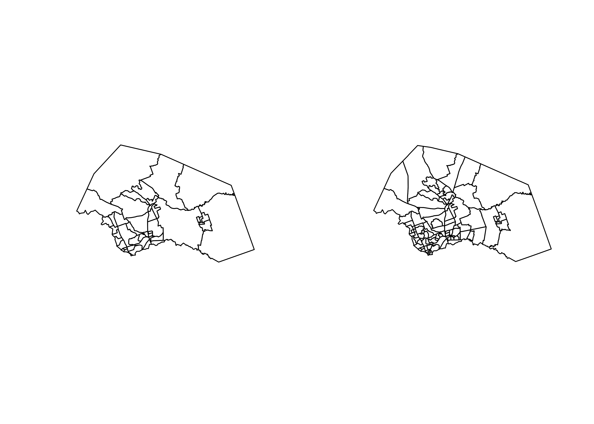<!-- -->

## Combining datasets of the same tigris type

Often, datasets from the US Census Bureau are available by state, which
means they are available by state from tigris as well. In many
instances, you’ll want to combine datasets for multiple states. For
example, an analysis of the Portland, Oregon metropolitan area would
include areas in both Oregon and Washington north of the Columbia River;
however, these areas are represented in different Census files. In this
exercise, you’ll learn how to combine datasets with the rbind\_tigris()
function.

``` r
# Get Census tract boundaries for Oregon and Washington
or_tracts <- tracts("OR", cb = TRUE)
```

    ##   |                                                                              |                                                                      |   0%  |                                                                              |                                                                      |   1%  |                                                                              |=                                                                     |   1%  |                                                                              |=                                                                     |   2%  |                                                                              |==                                                                    |   3%  |                                                                              |===                                                                   |   4%  |                                                                              |===                                                                   |   5%  |                                                                              |====                                                                  |   5%  |                                                                              |====                                                                  |   6%  |                                                                              |=====                                                                 |   7%  |                                                                              |======                                                                |   8%  |                                                                              |======                                                                |   9%  |                                                                              |=======                                                               |   9%  |                                                                              |=======                                                               |  10%  |                                                                              |=======                                                               |  11%  |                                                                              |========                                                              |  11%  |                                                                              |========                                                              |  12%  |                                                                              |=========                                                             |  12%  |                                                                              |=========                                                             |  13%  |                                                                              |==========                                                            |  14%  |                                                                              |==========                                                            |  15%  |                                                                              |===========                                                           |  15%  |                                                                              |===========                                                           |  16%  |                                                                              |============                                                          |  17%  |                                                                              |============                                                          |  18%  |                                                                              |=============                                                         |  18%  |                                                                              |=============                                                         |  19%  |                                                                              |==============                                                        |  20%  |                                                                              |==============                                                        |  21%  |                                                                              |===============                                                       |  21%  |                                                                              |===============                                                       |  22%  |                                                                              |================                                                      |  22%  |                                                                              |================                                                      |  23%  |                                                                              |=================                                                     |  24%  |                                                                              |=================                                                     |  25%  |                                                                              |==================                                                    |  25%  |                                                                              |==================                                                    |  26%  |                                                                              |===================                                                   |  26%  |                                                                              |===================                                                   |  27%  |                                                                              |===================                                                   |  28%  |                                                                              |====================                                                  |  28%  |                                                                              |====================                                                  |  29%  |                                                                              |=====================                                                 |  30%  |                                                                              |======================                                                |  31%  |                                                                              |======================                                                |  32%  |                                                                              |=======================                                               |  32%  |                                                                              |=======================                                               |  33%  |                                                                              |========================                                              |  34%  |                                                                              |========================                                              |  35%  |                                                                              |=========================                                             |  35%  |                                                                              |=========================                                             |  36%  |                                                                              |==========================                                            |  37%  |                                                                              |==========================                                            |  38%  |                                                                              |===========================                                           |  38%  |                                                                              |===========================                                           |  39%  |                                                                              |============================                                          |  39%  |                                                                              |============================                                          |  40%  |                                                                              |=============================                                         |  41%  |                                                                              |=============================                                         |  42%  |                                                                              |==============================                                        |  42%  |                                                                              |==============================                                        |  43%  |                                                                              |==============================                                        |  44%  |                                                                              |===============================                                       |  44%  |                                                                              |===============================                                       |  45%  |                                                                              |================================                                      |  45%  |                                                                              |================================                                      |  46%  |                                                                              |=================================                                     |  47%  |                                                                              |=================================                                     |  48%  |                                                                              |==================================                                    |  48%  |                                                                              |==================================                                    |  49%  |                                                                              |===================================                                   |  49%  |                                                                              |===================================                                   |  50%  |                                                                              |===================================                                   |  51%  |                                                                              |====================================                                  |  51%  |                                                                              |====================================                                  |  52%  |                                                                              |=====================================                                 |  52%  |                                                                              |=====================================                                 |  53%  |                                                                              |======================================                                |  54%  |                                                                              |======================================                                |  55%  |                                                                              |=======================================                               |  55%  |                                                                              |=======================================                               |  56%  |                                                                              |========================================                              |  57%  |                                                                              |========================================                              |  58%  |                                                                              |=========================================                             |  58%  |                                                                              |=========================================                             |  59%  |                                                                              |==========================================                            |  59%  |                                                                              |==========================================                            |  60%  |                                                                              |==========================================                            |  61%  |                                                                              |===========================================                           |  61%  |                                                                              |===========================================                           |  62%  |                                                                              |============================================                          |  62%  |                                                                              |============================================                          |  63%  |                                                                              |=============================================                         |  64%  |                                                                              |=============================================                         |  65%  |                                                                              |==============================================                        |  65%  |                                                                              |==============================================                        |  66%  |                                                                              |===============================================                       |  66%  |                                                                              |===============================================                       |  67%  |                                                                              |===============================================                       |  68%  |                                                                              |================================================                      |  68%  |                                                                              |================================================                      |  69%  |                                                                              |=================================================                     |  70%  |                                                                              |==================================================                    |  71%  |                                                                              |==================================================                    |  72%  |                                                                              |===================================================                   |  72%  |                                                                              |===================================================                   |  73%  |                                                                              |====================================================                  |  74%  |                                                                              |====================================================                  |  75%  |                                                                              |=====================================================                 |  75%  |                                                                              |=====================================================                 |  76%  |                                                                              |======================================================                |  77%  |                                                                              |======================================================                |  78%  |                                                                              |=======================================================               |  78%  |                                                                              |=======================================================               |  79%  |                                                                              |========================================================              |  80%  |                                                                              |=========================================================             |  81%  |                                                                              |=========================================================             |  82%  |                                                                              |==========================================================            |  82%  |                                                                              |==========================================================            |  83%  |                                                                              |==========================================================            |  84%  |                                                                              |===========================================================           |  84%  |                                                                              |===========================================================           |  85%  |                                                                              |============================================================          |  85%  |                                                                              |============================================================          |  86%  |                                                                              |=============================================================         |  87%  |                                                                              |=============================================================         |  88%  |                                                                              |==============================================================        |  88%  |                                                                              |==============================================================        |  89%  |                                                                              |===============================================================       |  89%  |                                                                              |===============================================================       |  90%  |                                                                              |================================================================      |  91%  |                                                                              |================================================================      |  92%  |                                                                              |=================================================================     |  92%  |                                                                              |=================================================================     |  93%  |                                                                              |==================================================================    |  94%  |                                                                              |==================================================================    |  95%  |                                                                              |===================================================================   |  95%  |                                                                              |===================================================================   |  96%  |                                                                              |====================================================================  |  97%  |                                                                              |===================================================================== |  98%  |                                                                              |===================================================================== |  99%  |                                                                              |======================================================================|  99%  |                                                                              |======================================================================| 100%

``` r
wa_tracts <- tracts("WA", cb = TRUE)
```

    ##   |                                                                              |                                                                      |   0%  |                                                                              |                                                                      |   1%  |                                                                              |=                                                                     |   1%  |                                                                              |=                                                                     |   2%  |                                                                              |==                                                                    |   3%  |                                                                              |===                                                                   |   4%  |                                                                              |===                                                                   |   5%  |                                                                              |====                                                                  |   5%  |                                                                              |====                                                                  |   6%  |                                                                              |=====                                                                 |   7%  |                                                                              |=====                                                                 |   8%  |                                                                              |======                                                                |   8%  |                                                                              |======                                                                |   9%  |                                                                              |=======                                                               |  10%  |                                                                              |=======                                                               |  11%  |                                                                              |========                                                              |  11%  |                                                                              |========                                                              |  12%  |                                                                              |=========                                                             |  12%  |                                                                              |=========                                                             |  13%  |                                                                              |=========                                                             |  14%  |                                                                              |==========                                                            |  14%  |                                                                              |==========                                                            |  15%  |                                                                              |===========                                                           |  15%  |                                                                              |===========                                                           |  16%  |                                                                              |============                                                          |  16%  |                                                                              |============                                                          |  17%  |                                                                              |============                                                          |  18%  |                                                                              |=============                                                         |  18%  |                                                                              |=============                                                         |  19%  |                                                                              |==============                                                        |  19%  |                                                                              |==============                                                        |  20%  |                                                                              |===============                                                       |  21%  |                                                                              |===============                                                       |  22%  |                                                                              |================                                                      |  22%  |                                                                              |================                                                      |  23%  |                                                                              |=================                                                     |  24%  |                                                                              |=================                                                     |  25%  |                                                                              |==================                                                    |  25%  |                                                                              |==================                                                    |  26%  |                                                                              |===================                                                   |  27%  |                                                                              |===================                                                   |  28%  |                                                                              |====================                                                  |  28%  |                                                                              |====================                                                  |  29%  |                                                                              |=====================                                                 |  30%  |                                                                              |=====================                                                 |  31%  |                                                                              |======================                                                |  31%  |                                                                              |======================                                                |  32%  |                                                                              |=======================                                               |  32%  |                                                                              |=======================                                               |  33%  |                                                                              |=======================                                               |  34%  |                                                                              |========================                                              |  34%  |                                                                              |========================                                              |  35%  |                                                                              |=========================                                             |  35%  |                                                                              |=========================                                             |  36%  |                                                                              |==========================                                            |  36%  |                                                                              |==========================                                            |  37%  |                                                                              |==========================                                            |  38%  |                                                                              |===========================                                           |  38%  |                                                                              |===========================                                           |  39%  |                                                                              |============================                                          |  39%  |                                                                              |============================                                          |  40%  |                                                                              |=============================                                         |  41%  |                                                                              |=============================                                         |  42%  |                                                                              |==============================                                        |  42%  |                                                                              |==============================                                        |  43%  |                                                                              |===============================                                       |  44%  |                                                                              |===============================                                       |  45%  |                                                                              |================================                                      |  45%  |                                                                              |================================                                      |  46%  |                                                                              |=================================                                     |  47%  |                                                                              |=================================                                     |  48%  |                                                                              |==================================                                    |  48%  |                                                                              |==================================                                    |  49%  |                                                                              |===================================                                   |  50%  |                                                                              |===================================                                   |  51%  |                                                                              |====================================                                  |  51%  |                                                                              |====================================                                  |  52%  |                                                                              |=====================================                                 |  52%  |                                                                              |=====================================                                 |  53%  |                                                                              |======================================                                |  54%  |                                                                              |======================================                                |  55%  |                                                                              |=======================================                               |  55%  |                                                                              |=======================================                               |  56%  |                                                                              |========================================                              |  56%  |                                                                              |========================================                              |  57%  |                                                                              |========================================                              |  58%  |                                                                              |=========================================                             |  58%  |                                                                              |=========================================                             |  59%  |                                                                              |==========================================                            |  59%  |                                                                              |==========================================                            |  60%  |                                                                              |==========================================                            |  61%  |                                                                              |===========================================                           |  61%  |                                                                              |===========================================                           |  62%  |                                                                              |============================================                          |  62%  |                                                                              |============================================                          |  63%  |                                                                              |=============================================                         |  64%  |                                                                              |=============================================                         |  65%  |                                                                              |==============================================                        |  65%  |                                                                              |==============================================                        |  66%  |                                                                              |===============================================                       |  67%  |                                                                              |===============================================                       |  68%  |                                                                              |================================================                      |  68%  |                                                                              |================================================                      |  69%  |                                                                              |=================================================                     |  70%  |                                                                              |=================================================                     |  71%  |                                                                              |==================================================                    |  71%  |                                                                              |==================================================                    |  72%  |                                                                              |===================================================                   |  72%  |                                                                              |===================================================                   |  73%  |                                                                              |====================================================                  |  74%  |                                                                              |====================================================                  |  75%  |                                                                              |=====================================================                 |  75%  |                                                                              |=====================================================                 |  76%  |                                                                              |======================================================                |  77%  |                                                                              |======================================================                |  78%  |                                                                              |=======================================================               |  78%  |                                                                              |=======================================================               |  79%  |                                                                              |========================================================              |  79%  |                                                                              |========================================================              |  80%  |                                                                              |========================================================              |  81%  |                                                                              |=========================================================             |  81%  |                                                                              |=========================================================             |  82%  |                                                                              |==========================================================            |  82%  |                                                                              |==========================================================            |  83%  |                                                                              |===========================================================           |  84%  |                                                                              |===========================================================           |  85%  |                                                                              |============================================================          |  85%  |                                                                              |============================================================          |  86%  |                                                                              |=============================================================         |  87%  |                                                                              |=============================================================         |  88%  |                                                                              |==============================================================        |  88%  |                                                                              |==============================================================        |  89%  |                                                                              |===============================================================       |  90%  |                                                                              |===============================================================       |  91%  |                                                                              |================================================================      |  91%  |                                                                              |================================================================      |  92%  |                                                                              |=================================================================     |  92%  |                                                                              |=================================================================     |  93%  |                                                                              |==================================================================    |  94%  |                                                                              |==================================================================    |  95%  |                                                                              |===================================================================   |  95%  |                                                                              |===================================================================   |  96%  |                                                                              |====================================================================  |  97%  |                                                                              |====================================================================  |  98%  |                                                                              |===================================================================== |  98%  |                                                                              |===================================================================== |  99%  |                                                                              |======================================================================|  99%  |                                                                              |======================================================================| 100%

``` r
# Check the tigris attributes of each object
attr(or_tracts, "tigris")
```

    ## [1] "tract"

``` r
attr(wa_tracts, "tigris")
```

    ## [1] "tract"

``` r
# Combine the datasets then plot the result
or_wa_tracts <- rbind_tigris(or_tracts, wa_tracts)
plot(or_wa_tracts$geometry)
```

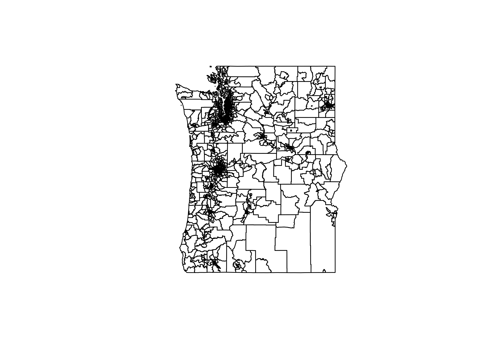<!-- -->

## Getting data for multiple states

In the previous exercise, you learned how to combine datasets with the
rbind\_tigris() function. If you need data for more than two states,
however, this process can get tedious. In this exercise, you’ll learn
how to generate a list of datasets for multiple states with the
tidyverse map() function, and combine those datasets with
rbind\_tigris().

``` r
# Generate a vector of state codes and assign to new_england
new_england <- c("ME", "NH", "VT", "MA")

# Iterate through the states and request tract data for state
ne_tracts <- map(new_england, function(x) {
  tracts(state = x, cb = TRUE)
}) %>%
  rbind_tigris()
```

    ##   |                                                                              |                                                                      |   0%  |                                                                              |==                                                                    |   2%  |                                                                              |===                                                                   |   4%  |                                                                              |=====                                                                 |   7%  |                                                                              |======                                                                |   9%  |                                                                              |========                                                              |  11%  |                                                                              |=========                                                             |  13%  |                                                                              |==========                                                            |  14%  |                                                                              |===========                                                           |  15%  |                                                                              |===========                                                           |  16%  |                                                                              |============                                                          |  18%  |                                                                              |=============                                                         |  19%  |                                                                              |==============                                                        |  20%  |                                                                              |===============                                                       |  22%  |                                                                              |================                                                      |  23%  |                                                                              |=================                                                     |  24%  |                                                                              |==================                                                    |  25%  |                                                                              |===================                                                   |  27%  |                                                                              |====================                                                  |  28%  |                                                                              |====================                                                  |  29%  |                                                                              |=====================                                                 |  31%  |                                                                              |======================                                                |  32%  |                                                                              |=======================                                               |  33%  |                                                                              |========================                                              |  34%  |                                                                              |=========================                                             |  36%  |                                                                              |==========================                                            |  37%  |                                                                              |===========================                                           |  38%  |                                                                              |============================                                          |  40%  |                                                                              |=============================                                         |  41%  |                                                                              |=============================                                         |  42%  |                                                                              |==============================                                        |  43%  |                                                                              |===============================                                       |  45%  |                                                                              |================================                                      |  46%  |                                                                              |=================================                                     |  47%  |                                                                              |==================================                                    |  48%  |                                                                              |===================================                                   |  50%  |                                                                              |====================================                                  |  51%  |                                                                              |=====================================                                 |  52%  |                                                                              |======================================                                |  54%  |                                                                              |======================================                                |  55%  |                                                                              |=======================================                               |  56%  |                                                                              |========================================                              |  57%  |                                                                              |=========================================                             |  59%  |                                                                              |==========================================                            |  60%  |                                                                              |===========================================                           |  61%  |                                                                              |============================================                          |  63%  |                                                                              |=============================================                         |  64%  |                                                                              |==============================================                        |  65%  |                                                                              |===============================================                       |  66%  |                                                                              |===============================================                       |  68%  |                                                                              |================================================                      |  69%  |                                                                              |=================================================                     |  70%  |                                                                              |==================================================                    |  72%  |                                                                              |===================================================                   |  73%  |                                                                              |====================================================                  |  74%  |                                                                              |=====================================================                 |  75%  |                                                                              |======================================================                |  77%  |                                                                              |=======================================================               |  78%  |                                                                              |=======================================================               |  79%  |                                                                              |========================================================              |  81%  |                                                                              |=========================================================             |  82%  |                                                                              |==========================================================            |  83%  |                                                                              |===========================================================           |  84%  |                                                                              |============================================================          |  86%  |                                                                              |=============================================================         |  87%  |                                                                              |==============================================================        |  88%  |                                                                              |===============================================================       |  90%  |                                                                              |================================================================      |  91%  |                                                                              |================================================================      |  92%  |                                                                              |=================================================================     |  93%  |                                                                              |==================================================================    |  95%  |                                                                              |===================================================================   |  96%  |                                                                              |====================================================================  |  97%  |                                                                              |===================================================================== |  99%  |                                                                              |======================================================================| 100%
    ##   |                                                                              |                                                                      |   0%  |                                                                              |====                                                                  |   5%  |                                                                              |========                                                              |  11%  |                                                                              |============                                                          |  16%  |                                                                              |===============                                                       |  22%  |                                                                              |===================                                                   |  28%  |                                                                              |=======================                                               |  33%  |                                                                              |===========================                                           |  39%  |                                                                              |=============================                                         |  42%  |                                                                              |=================================                                     |  47%  |                                                                              |=====================================                                 |  53%  |                                                                              |=========================================                             |  59%  |                                                                              |=============================================                         |  64%  |                                                                              |=================================================                     |  70%  |                                                                              |=====================================================                 |  75%  |                                                                              |========================================================              |  81%  |                                                                              |============================================================          |  86%  |                                                                              |================================================================      |  92%  |                                                                              |====================================================================  |  97%  |                                                                              |======================================================================| 100%
    ##   |                                                                              |                                                                      |   0%  |                                                                              |=====                                                                 |   7%  |                                                                              |==========                                                            |  15%  |                                                                              |================                                                      |  23%  |                                                                              |=====================                                                 |  30%  |                                                                              |==========================                                            |  38%  |                                                                              |================================                                      |  45%  |                                                                              |=====================================                                 |  53%  |                                                                              |======================================                                |  54%  |                                                                              |========================================                              |  57%  |                                                                              |===========================================                           |  61%  |                                                                              |=============================================                         |  65%  |                                                                              |================================================                      |  68%  |                                                                              |==================================================                    |  72%  |                                                                              |=====================================================                 |  76%  |                                                                              |=======================================================               |  79%  |                                                                              |==========================================================            |  83%  |                                                                              |=============================================================         |  86%  |                                                                              |===============================================================       |  90%  |                                                                              |==================================================================    |  94%  |                                                                              |====================================================================  |  97%  |                                                                              |======================================================================| 100%
    ##   |                                                                              |                                                                      |   0%  |                                                                              |=                                                                     |   1%  |                                                                              |==                                                                    |   3%  |                                                                              |===                                                                   |   4%  |                                                                              |====                                                                  |   6%  |                                                                              |=====                                                                 |   7%  |                                                                              |======                                                                |   9%  |                                                                              |=======                                                               |  10%  |                                                                              |=======                                                               |  11%  |                                                                              |========                                                              |  11%  |                                                                              |========                                                              |  12%  |                                                                              |=========                                                             |  13%  |                                                                              |==========                                                            |  14%  |                                                                              |==========                                                            |  15%  |                                                                              |===========                                                           |  15%  |                                                                              |===========                                                           |  16%  |                                                                              |============                                                          |  17%  |                                                                              |============                                                          |  18%  |                                                                              |=============                                                         |  18%  |                                                                              |=============                                                         |  19%  |                                                                              |==============                                                        |  20%  |                                                                              |===============                                                       |  21%  |                                                                              |===============                                                       |  22%  |                                                                              |================                                                      |  22%  |                                                                              |================                                                      |  23%  |                                                                              |=================                                                     |  24%  |                                                                              |==================                                                    |  25%  |                                                                              |==================                                                    |  26%  |                                                                              |===================                                                   |  26%  |                                                                              |===================                                                   |  27%  |                                                                              |====================                                                  |  28%  |                                                                              |====================                                                  |  29%  |                                                                              |=====================                                                 |  30%  |                                                                              |=====================                                                 |  31%  |                                                                              |=======================                                               |  33%  |                                                                              |========================                                              |  34%  |                                                                              |========================                                              |  35%  |                                                                              |=========================                                             |  35%  |                                                                              |=========================                                             |  36%  |                                                                              |==========================                                            |  37%  |                                                                              |==========================                                            |  38%  |                                                                              |===========================                                           |  38%  |                                                                              |===========================                                           |  39%  |                                                                              |============================                                          |  40%  |                                                                              |=============================                                         |  41%  |                                                                              |=============================                                         |  42%  |                                                                              |==============================                                        |  42%  |                                                                              |==============================                                        |  43%  |                                                                              |===============================                                       |  44%  |                                                                              |================================                                      |  45%  |                                                                              |================================                                      |  46%  |                                                                              |=================================                                     |  47%  |                                                                              |==================================                                    |  48%  |                                                                              |==================================                                    |  49%  |                                                                              |===================================                                   |  50%  |                                                                              |===================================                                   |  51%  |                                                                              |====================================                                  |  51%  |                                                                              |====================================                                  |  52%  |                                                                              |=====================================                                 |  53%  |                                                                              |======================================                                |  54%  |                                                                              |======================================                                |  55%  |                                                                              |=======================================                               |  55%  |                                                                              |=======================================                               |  56%  |                                                                              |========================================                              |  57%  |                                                                              |========================================                              |  58%  |                                                                              |=========================================                             |  58%  |                                                                              |=========================================                             |  59%  |                                                                              |==========================================                            |  60%  |                                                                              |===========================================                           |  61%  |                                                                              |===========================================                           |  62%  |                                                                              |============================================                          |  62%  |                                                                              |============================================                          |  63%  |                                                                              |=============================================                         |  64%  |                                                                              |==============================================                        |  65%  |                                                                              |==============================================                        |  66%  |                                                                              |===============================================                       |  67%  |                                                                              |================================================                      |  68%  |                                                                              |================================================                      |  69%  |                                                                              |=================================================                     |  69%  |                                                                              |=================================================                     |  70%  |                                                                              |=================================================                     |  71%  |                                                                              |==================================================                    |  71%  |                                                                              |==================================================                    |  72%  |                                                                              |===================================================                   |  73%  |                                                                              |====================================================                  |  74%  |                                                                              |====================================================                  |  75%  |                                                                              |=====================================================                 |  75%  |                                                                              |=====================================================                 |  76%  |                                                                              |======================================================                |  77%  |                                                                              |======================================================                |  78%  |                                                                              |=======================================================               |  78%  |                                                                              |=======================================================               |  79%  |                                                                              |========================================================              |  80%  |                                                                              |=========================================================             |  81%  |                                                                              |=========================================================             |  82%  |                                                                              |==========================================================            |  82%  |                                                                              |==========================================================            |  83%  |                                                                              |===========================================================           |  84%  |                                                                              |============================================================          |  85%  |                                                                              |============================================================          |  86%  |                                                                              |=============================================================         |  87%  |                                                                              |==============================================================        |  88%  |                                                                              |==============================================================        |  89%  |                                                                              |===============================================================       |  89%  |                                                                              |===============================================================       |  90%  |                                                                              |===============================================================       |  91%  |                                                                              |================================================================      |  91%  |                                                                              |================================================================      |  92%  |                                                                              |=================================================================     |  93%  |                                                                              |==================================================================    |  94%  |                                                                              |==================================================================    |  95%  |                                                                              |===================================================================   |  96%  |                                                                              |====================================================================  |  97%  |                                                                              |====================================================================  |  98%  |                                                                              |===================================================================== |  98%  |                                                                              |===================================================================== |  99%  |                                                                              |======================================================================| 100%

``` r
plot(ne_tracts$geometry)
```

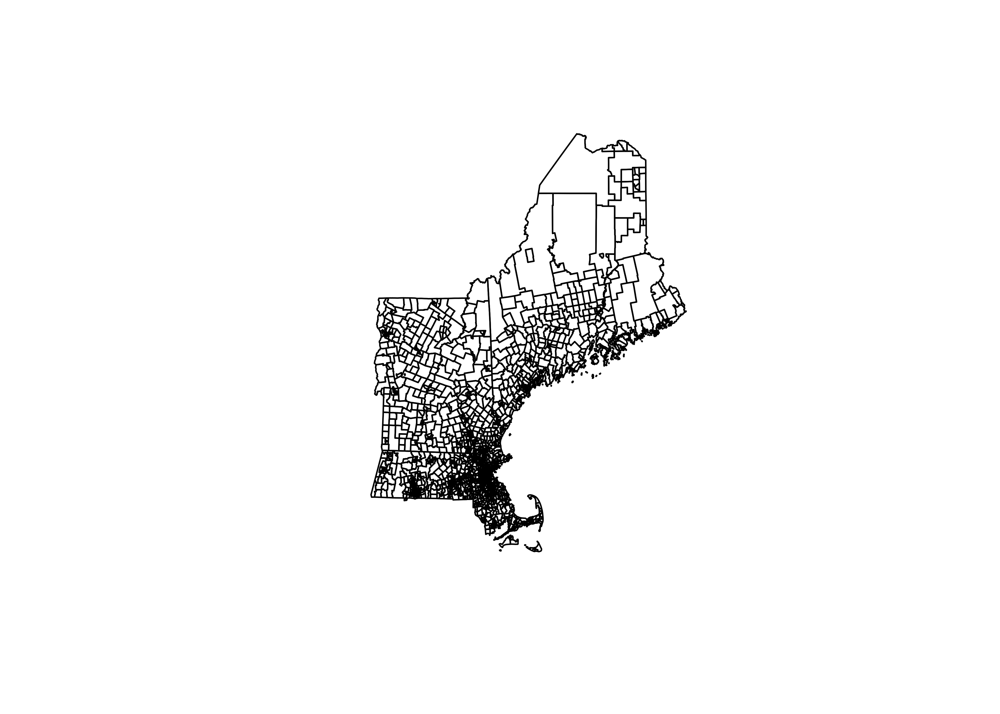<!-- -->

## Joining data from an external data frame

When working with geographic data in R, you’ll commonly want to join
attribute information from an external dataset to it for mapping and
spatial analysis. The sf package enables the use of the tidyverse
\*\_join() functions for simple features objects for this purpose. In
this exercise, you’ll learn how to join data to a spatial dataset of
legislative boundaries for the Texas House of Representatives that
you’ve obtained using tigris.

``` r
# Get boundaries for Texas and set the house parameter
tx_house <- state_legislative_districts(state = "TX", house = "lower", cb = TRUE)

# Merge data on legislators to their corresponding boundaries
tx_joined <- left_join(tx_house, tx_members, by = c("NAME" = "District"))

head(tx_joined)
```

## Plotting simple features with geom\_sf()

The newest version of ggplot2 includes a geom\_sf() function to plot
simple features objects natively. This allows you to make maps using
familiar ggplot2 syntax! In this exercise, you’ll walk through the
process of creating a map with ggplot2 step-by-step.

``` r
# Plot the legislative district boundaries
ggplot(tx_joined) + 
  geom_sf()

# Set fill aesthetic to map areas represented by Republicans and Democrats
ggplot(tx_joined, aes(fill = Party)) + 
  geom_sf()

# Set values so that Republican areas are red and Democratic areas are blue
ggplot(tx_joined, aes(fill = Party)) + 
  geom_sf() + 
  scale_fill_manual(values = c("R" = "red", "D" = "blue"))
```

## Customizing geom\_sf() plots

As you’ve learned in previous chapters, it is a good idea to clean up
and format your ggplot2 visualizations before sharing with others. In
this exercise, you’ll make some modifications to your map of Texas House
districts such as removing the gridlines and adding an informative
title.

``` r
# Draw a ggplot without gridlines and with an informative title
ggplot(tx_joined, aes(fill = Party)) + 
  geom_sf() + 
  coord_sf(crs = 3083, datum = NA) + 
  scale_fill_manual(values = c("R" = "red", "D" = "blue")) + 
  theme_minimal(base_size = 16) + 
  labs(title = "State House Districts in Texas")
```

## Getting simple feature geometry

tidycensus can obtain simple feature geometry for many geographies by
adding the argument geometry = TRUE. In this exercise, you’ll obtain a
dataset of median housing values for owner-occupied units by Census
tract in Orange County, California with simple feature geometry
included.

``` r
library(tidycensus)
library(tidyverse)
library(sf)

# Get dataset with geometry set to TRUE
orange_value <- get_acs(geography = "tract", state = "CA", 
                    county = "Orange", 
                    variables = "B25077_001", 
                    geometry = TRUE)
```

    ##   |                                                                              |                                                                      |   0%  |                                                                              |                                                                      |   1%  |                                                                              |=                                                                     |   1%  |                                                                              |=                                                                     |   2%  |                                                                              |==                                                                    |   2%  |                                                                              |==                                                                    |   3%  |                                                                              |==                                                                    |   4%  |                                                                              |===                                                                   |   4%  |                                                                              |===                                                                   |   5%  |                                                                              |====                                                                  |   5%  |                                                                              |====                                                                  |   6%  |                                                                              |=====                                                                 |   6%  |                                                                              |=====                                                                 |   7%  |                                                                              |=====                                                                 |   8%  |                                                                              |======                                                                |   8%  |                                                                              |======                                                                |   9%  |                                                                              |=======                                                               |   9%  |                                                                              |=======                                                               |  10%  |                                                                              |=======                                                               |  11%  |                                                                              |========                                                              |  11%  |                                                                              |========                                                              |  12%  |                                                                              |=========                                                             |  12%  |                                                                              |=========                                                             |  13%  |                                                                              |=========                                                             |  14%  |                                                                              |==========                                                            |  14%  |                                                                              |==========                                                            |  15%  |                                                                              |===========                                                           |  15%  |                                                                              |===========                                                           |  16%  |                                                                              |============                                                          |  17%  |                                                                              |============                                                          |  18%  |                                                                              |=============                                                         |  18%  |                                                                              |=============                                                         |  19%  |                                                                              |==============                                                        |  19%  |                                                                              |==============                                                        |  20%  |                                                                              |==============                                                        |  21%  |                                                                              |===============                                                       |  21%  |                                                                              |===============                                                       |  22%  |                                                                              |================                                                      |  22%  |                                                                              |================                                                      |  23%  |                                                                              |================                                                      |  24%  |                                                                              |=================                                                     |  24%  |                                                                              |=================                                                     |  25%  |                                                                              |==================                                                    |  25%  |                                                                              |==================                                                    |  26%  |                                                                              |===================                                                   |  27%  |                                                                              |===================                                                   |  28%  |                                                                              |====================                                                  |  28%  |                                                                              |====================                                                  |  29%  |                                                                              |=====================                                                 |  29%  |                                                                              |=====================                                                 |  30%  |                                                                              |=====================                                                 |  31%  |                                                                              |======================                                                |  31%  |                                                                              |======================                                                |  32%  |                                                                              |=======================                                               |  32%  |                                                                              |=======================                                               |  33%  |                                                                              |========================                                              |  34%  |                                                                              |========================                                              |  35%  |                                                                              |=========================                                             |  35%  |                                                                              |=========================                                             |  36%  |                                                                              |==========================                                            |  37%  |                                                                              |==========================                                            |  38%  |                                                                              |===========================                                           |  38%  |                                                                              |===========================                                           |  39%  |                                                                              |============================                                          |  39%  |                                                                              |============================                                          |  40%  |                                                                              |============================                                          |  41%  |                                                                              |=============================                                         |  41%  |                                                                              |=============================                                         |  42%  |                                                                              |==============================                                        |  42%  |                                                                              |==============================                                        |  43%  |                                                                              |===============================                                       |  44%  |                                                                              |===============================                                       |  45%  |                                                                              |================================                                      |  45%  |                                                                              |================================                                      |  46%  |                                                                              |=================================                                     |  47%  |                                                                              |=================================                                     |  48%  |                                                                              |==================================                                    |  48%  |                                                                              |==================================                                    |  49%  |                                                                              |===================================                                   |  49%  |                                                                              |===================================                                   |  50%  |                                                                              |===================================                                   |  51%  |                                                                              |====================================                                  |  51%  |                                                                              |====================================                                  |  52%  |                                                                              |=====================================                                 |  52%  |                                                                              |=====================================                                 |  53%  |                                                                              |======================================                                |  54%  |                                                                              |======================================                                |  55%  |                                                                              |=======================================                               |  55%  |                                                                              |=======================================                               |  56%  |                                                                              |========================================                              |  56%  |                                                                              |========================================                              |  57%  |                                                                              |========================================                              |  58%  |                                                                              |=========================================                             |  58%  |                                                                              |=========================================                             |  59%  |                                                                              |==========================================                            |  59%  |                                                                              |==========================================                            |  60%  |                                                                              |==========================================                            |  61%  |                                                                              |===========================================                           |  61%  |                                                                              |===========================================                           |  62%  |                                                                              |============================================                          |  62%  |                                                                              |============================================                          |  63%  |                                                                              |============================================                          |  64%  |                                                                              |=============================================                         |  64%  |                                                                              |=============================================                         |  65%  |                                                                              |==============================================                        |  65%  |                                                                              |==============================================                        |  66%  |                                                                              |===============================================                       |  66%  |                                                                              |===============================================                       |  67%  |                                                                              |===============================================                       |  68%  |                                                                              |================================================                      |  68%  |                                                                              |================================================                      |  69%  |                                                                              |=================================================                     |  69%  |                                                                              |=================================================                     |  70%  |                                                                              |=================================================                     |  71%  |                                                                              |==================================================                    |  71%  |                                                                              |==================================================                    |  72%  |                                                                              |===================================================                   |  72%  |                                                                              |===================================================                   |  73%  |                                                                              |===================================================                   |  74%  |                                                                              |====================================================                  |  74%  |                                                                              |====================================================                  |  75%  |                                                                              |=====================================================                 |  75%  |                                                                              |======================================================                |  77%  |                                                                              |======================================================                |  78%  |                                                                              |=======================================================               |  78%  |                                                                              |=======================================================               |  79%  |                                                                              |========================================================              |  79%  |                                                                              |========================================================              |  80%  |                                                                              |========================================================              |  81%  |                                                                              |=========================================================             |  81%  |                                                                              |=========================================================             |  82%  |                                                                              |==========================================================            |  82%  |                                                                              |==========================================================            |  83%  |                                                                              |==========================================================            |  84%  |                                                                              |===========================================================           |  84%  |                                                                              |===========================================================           |  85%  |                                                                              |============================================================          |  85%  |                                                                              |============================================================          |  86%  |                                                                              |=============================================================         |  86%  |                                                                              |=============================================================         |  87%  |                                                                              |=============================================================         |  88%  |                                                                              |==============================================================        |  88%  |                                                                              |==============================================================        |  89%  |                                                                              |===============================================================       |  89%  |                                                                              |===============================================================       |  90%  |                                                                              |================================================================      |  92%  |                                                                              |=================================================================     |  92%  |                                                                              |===================================================================   |  95%  |                                                                              |===================================================================   |  96%  |                                                                              |====================================================================  |  97%  |                                                                              |===================================================================== |  99%  |                                                                              |======================================================================|  99%  |                                                                              |======================================================================| 100%

``` r
# Plot the estimate to view a map of the data
plot(orange_value["estimate"])
```

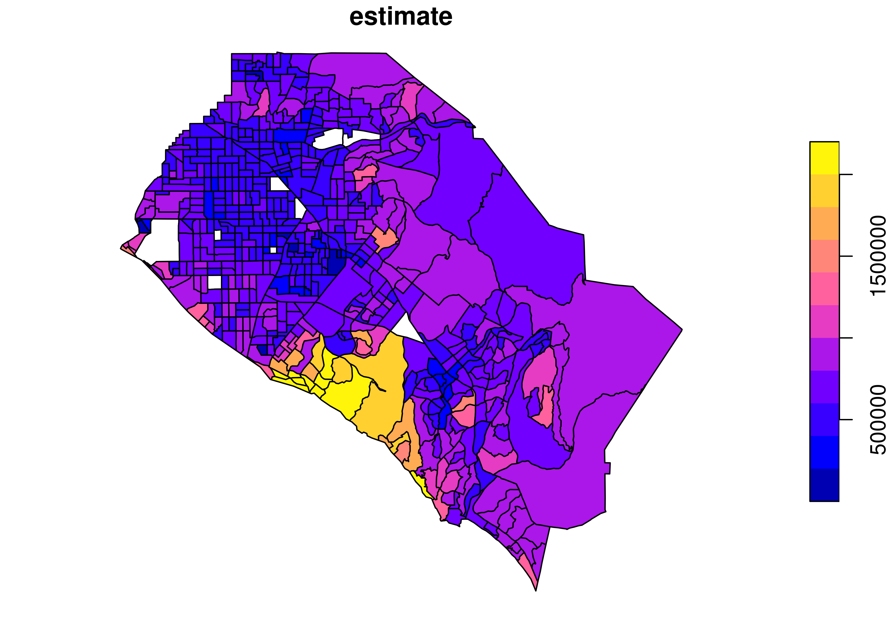<!-- -->

## Joining data from tigris and tidycensus

Geometry is currently supported in tidycensus for geographies in the
core Census hierarchy - state, county, Census tract, block group, and
block - as well as zip code tabulation areas. However, you may be
interested in mapping data for other geographies. In this case, you can
download the equivalent boundary file from the Census Bureau using the
tigris package and join your demographic data to it for mapping.

``` r
# Get an income dataset for Idaho by school district
idaho_income <- get_acs(geography = "school district (unified)", 
                        variables = "B19013_001", 
                        state = "ID")

# Get a school district dataset for Idaho
idaho_school <- school_districts(state = "ID", type = "unified", class = "sf")
```

    ##   |                                                                              |                                                                      |   0%  |                                                                              |                                                                      |   1%  |                                                                              |=                                                                     |   1%  |                                                                              |=                                                                     |   2%  |                                                                              |==                                                                    |   3%  |                                                                              |==                                                                    |   4%  |                                                                              |===                                                                   |   4%  |                                                                              |===                                                                   |   5%  |                                                                              |====                                                                  |   5%  |                                                                              |====                                                                  |   6%  |                                                                              |=====                                                                 |   7%  |                                                                              |=====                                                                 |   8%  |                                                                              |======                                                                |   8%  |                                                                              |======                                                                |   9%  |                                                                              |===========                                                           |  16%  |                                                                              |============                                                          |  16%  |                                                                              |============                                                          |  17%  |                                                                              |============                                                          |  18%  |                                                                              |=============                                                         |  18%  |                                                                              |=============                                                         |  19%  |                                                                              |=================                                                     |  24%  |                                                                              |=================                                                     |  25%  |                                                                              |==================                                                    |  25%  |                                                                              |==================                                                    |  26%  |                                                                              |===================                                                   |  26%  |                                                                              |===================                                                   |  27%  |                                                                              |===================                                                   |  28%  |                                                                              |====================                                                  |  28%  |                                                                              |====================                                                  |  29%  |                                                                              |=====================                                                 |  29%  |                                                                              |=====================                                                 |  30%  |                                                                              |=====================                                                 |  31%  |                                                                              |======================                                                |  31%  |                                                                              |======================                                                |  32%  |                                                                              |=======================                                               |  32%  |                                                                              |=======================                                               |  33%  |                                                                              |========================                                              |  34%  |                                                                              |========================                                              |  35%  |                                                                              |=========================                                             |  35%  |                                                                              |=========================                                             |  36%  |                                                                              |==========================                                            |  37%  |                                                                              |==========================                                            |  38%  |                                                                              |===========================                                           |  38%  |                                                                              |===========================                                           |  39%  |                                                                              |============================                                          |  39%  |                                                                              |============================                                          |  40%  |                                                                              |============================                                          |  41%  |                                                                              |=============================                                         |  41%  |                                                                              |=============================                                         |  42%  |                                                                              |==============================                                        |  42%  |                                                                              |==============================                                        |  43%  |                                                                              |==============================                                        |  44%  |                                                                              |===============================                                       |  44%  |                                                                              |===============================                                       |  45%  |                                                                              |================================                                      |  45%  |                                                                              |================================                                      |  46%  |                                                                              |=================================                                     |  47%  |                                                                              |=================================                                     |  48%  |                                                                              |==================================                                    |  48%  |                                                                              |==================================                                    |  49%  |                                                                              |===================================                                   |  49%  |                                                                              |===================================                                   |  50%  |                                                                              |===================================                                   |  51%  |                                                                              |====================================                                  |  51%  |                                                                              |====================================                                  |  52%  |                                                                              |=====================================                                 |  52%  |                                                                              |=====================================                                 |  53%  |                                                                              |=====================================                                 |  54%  |                                                                              |======================================                                |  54%  |                                                                              |======================================                                |  55%  |                                                                              |=======================================                               |  55%  |                                                                              |=======================================                               |  56%  |                                                                              |========================================                              |  57%  |                                                                              |========================================                              |  58%  |                                                                              |=========================================                             |  58%  |                                                                              |=========================================                             |  59%  |                                                                              |==========================================                            |  59%  |                                                                              |==========================================                            |  60%  |                                                                              |==========================================                            |  61%  |                                                                              |===========================================                           |  61%  |                                                                              |===========================================                           |  62%  |                                                                              |============================================                          |  62%  |                                                                              |============================================                          |  63%  |                                                                              |=============================================                         |  64%  |                                                                              |=============================================                         |  65%  |                                                                              |==============================================                        |  65%  |                                                                              |==============================================                        |  66%  |                                                                              |===============================================                       |  66%  |                                                                              |===============================================                       |  67%  |                                                                              |===============================================                       |  68%  |                                                                              |================================================                      |  68%  |                                                                              |================================================                      |  69%  |                                                                              |=================================================                     |  69%  |                                                                              |=================================================                     |  70%  |                                                                              |=================================================                     |  71%  |                                                                              |==================================================                    |  71%  |                                                                              |==================================================                    |  72%  |                                                                              |===================================================                   |  72%  |                                                                              |===================================================                   |  73%  |                                                                              |====================================================                  |  74%  |                                                                              |====================================================                  |  75%  |                                                                              |=====================================================                 |  75%  |                                                                              |=====================================================                 |  76%  |                                                                              |======================================================                |  76%  |                                                                              |======================================================                |  77%  |                                                                              |======================================================                |  78%  |                                                                              |=======================================================               |  78%  |                                                                              |=======================================================               |  79%  |                                                                              |========================================================              |  79%  |                                                                              |========================================================              |  80%  |                                                                              |========================================================              |  81%  |                                                                              |=========================================================             |  81%  |                                                                              |=========================================================             |  82%  |                                                                              |==========================================================            |  82%  |                                                                              |==========================================================            |  83%  |                                                                              |===========================================================           |  84%  |                                                                              |===========================================================           |  85%  |                                                                              |============================================================          |  85%  |                                                                              |============================================================          |  86%  |                                                                              |=============================================================         |  87%  |                                                                              |=============================================================         |  88%  |                                                                              |==============================================================        |  88%  |                                                                              |==============================================================        |  89%  |                                                                              |===============================================================       |  89%  |                                                                              |===============================================================       |  90%  |                                                                              |===============================================================       |  91%  |                                                                              |================================================================      |  91%  |                                                                              |================================================================      |  92%  |                                                                              |=================================================================     |  92%  |                                                                              |=================================================================     |  93%  |                                                                              |=================================================================     |  94%  |                                                                              |==================================================================    |  94%  |                                                                              |==================================================================    |  95%  |                                                                              |===================================================================   |  95%  |                                                                              |===================================================================   |  96%  |                                                                              |====================================================================  |  97%  |                                                                              |====================================================================  |  98%  |                                                                              |===================================================================== |  98%  |                                                                              |===================================================================== |  99%  |                                                                              |======================================================================|  99%  |                                                                              |======================================================================| 100%

``` r
# Join the income dataset to the boundaries dataset
id_school_joined <- left_join(idaho_school, idaho_income, by = "GEOID")

plot(id_school_joined["estimate"])
```

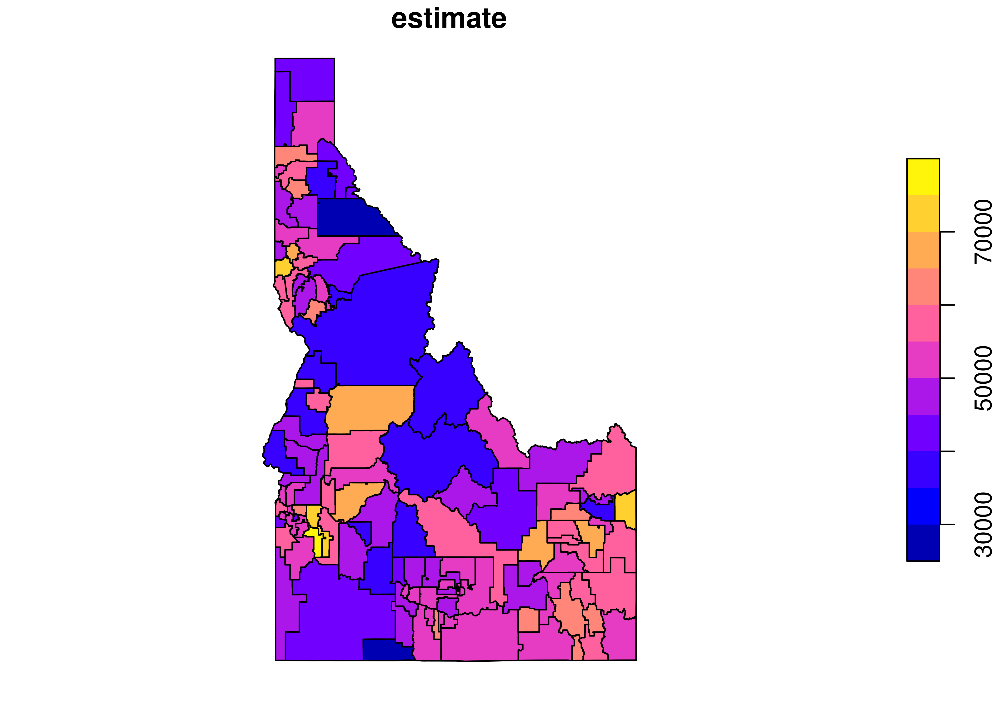<!-- -->

## Shifting Alaska and Hawaii geometry

Analysts will commonly want to map data for the entire United States by
state or county; however, this can be difficult by default as Alaska and
Hawaii are distant from the continental United States. A common solution
is to rescale and shift Alaska and Hawaii for mapping purposes, which is
supported in tidycensus. You’ll learn how to do this in this exercise.

``` r
# Get a dataset of median home values from the 1-year ACS
state_value <- get_acs(geography = "state", 
                       variables = "B25077_001", 
                       survey = "acs1", 
                       geometry = TRUE, 
                       shift_geo = TRUE)

# Plot the dataset to view the shifted geometry
plot(state_value["estimate"])
```

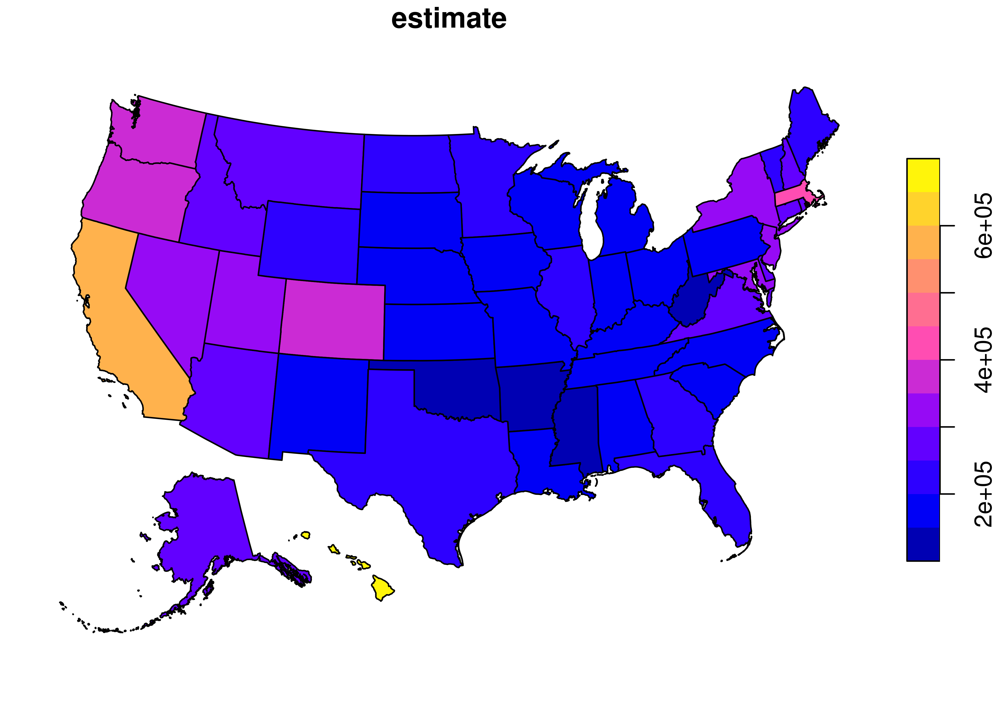<!-- -->

## Making a choropleth map

Choropleth maps, which visualize statistical variation through the
shading of areas, are among the most popular ways to map demographic
data. Census or ACS data acquired with tidycensus can be mapped in this
way in ggplot2 with geom\_sf using the estimate column as a fill
aesthetic. In this exercise, you’ll make a choropleth map with ggplot2
of median owner-occupied home values by Census tract for Marin County,
California.

``` r
# Create a choropleth map with ggplot
ggplot(marin_value, aes(fill = estimate)) + 
  geom_sf()
```

## Modifying map colors

ggplot2 version 3.0 integrated the viridis color palettes, which are
perceptually uniform and legible to colorblind individuals and in black
and white. For these reasons, the viridis palettes have become very
popular for data visualization, including for choropleth mapping. In
this exercise, you’ll learn how to use the viridis palettes for
choropleth mapping in ggplot2.

``` r
# Set continuous viridis palettes for your map
ggplot(marin_value, aes(fill = estimate, color = estimate)) + 
  geom_sf() + 
  scale_fill_viridis_c() +  
  scale_color_viridis_c()
```

## Customizing the map output

Now that you’ve chosen an appropriate color palette for your choropleth
map of median home values by Census tract in Marin County, you’ll want
to customize the output. In this exercise, you’ll clean up some map
elements and add some descriptive information to provide context to your
map.

``` r
# Set the color guide to FALSE and add a subtitle and caption to your map
ggplot(marin_value, aes(fill = estimate, color = estimate)) + 
  geom_sf() + 
  scale_fill_viridis_c(labels = scales::dollar) +  
  scale_color_viridis_c(guide = FALSE) + 
  theme_minimal() + 
  coord_sf(crs = 26911, datum = NA) + 
  labs(title = "Median owner-occupied housing value by Census tract", 
       subtitle = "Marin County, California", 
       caption = "Data source: 2012-2016 ACS.\nData acquired with the R tidycensus package.", 
       fill = "ACS estimate")
```

## Graduated symbol maps

There are many other effective ways to map statistical data besides
choropleth maps. One such example is the graduated symbol map, which
represents statistical variation by differently-sized symbols. In this
exercise, you’ll learn how to use the st\_centroid() tool in the sf
package to create points at the center of each state to be used as
inputs to a graduated symbol map in ggplot2.

``` r
library(sf)

# Generate point centers
centers <- st_centroid(state_value)

# Set size parameter and the size range
ggplot() + 
  geom_sf(data = state_value, fill = "white") + 
  geom_sf(data = centers, aes(size = estimate), shape = 21, 
          fill = "lightblue", alpha = 0.7, show.legend = "point") + 
  scale_size_continuous(range = c(1, 20))
```

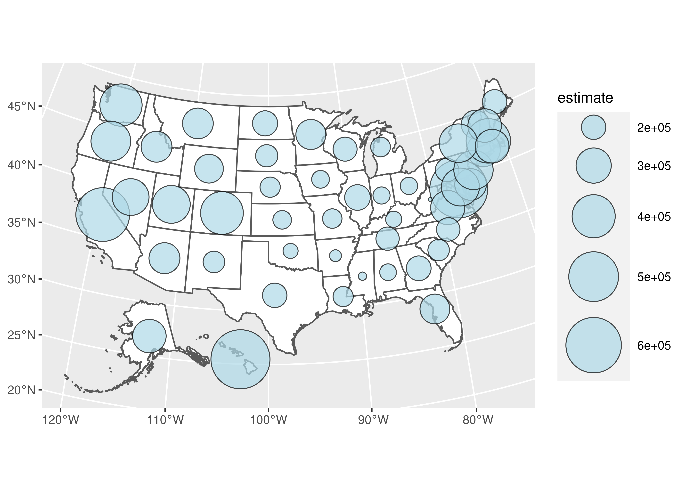<!-- -->

## Faceted maps with ggplot2

One of the most powerful features of ggplot2 is its support for faceted
plotting, in which multiple plots are generated for unique values of a
column in the data. Faceted maps can be produced with geom\_sf() in this
way as well if tidycensus data are in tidy format. In this exercise,
you’ll produce faceted maps that show the racial and ethnic geography of
Washington, DC from the 2010 decennial Census.

``` r
# Check the first few rows of the loaded dataset dc_race
head(dc_race)

# Remove the gridlines and generate faceted maps
ggplot(dc_race, aes(fill = percent, color = percent)) + 
  geom_sf() + 
  coord_sf(datum = NA) + 
  facet_wrap(~variable)
```

## Interactive visualization with mapview

The mapview R package allows R users to interactively map spatial
datasets in one line of R code. This makes it an essential tool for
exploratory spatial data analysis in R. In this exercise, you’ll learn
how to quickly map tidycensus data interactively using mapview and your
Orange County, California median housing values dataset.

``` r
# Add a legend to your map
m <- mapview(orange_value, 
         zcol = "estimate", 
         legend = TRUE)
m@map
```

## Generating random dots with sf

Dot-density maps are created by randomly placing dots within areas where
each dot is proportional to a certain number of observations. In this
exercise, you’ll learn how to create dots in this way with the sf
package using the st\_sample() function. You will generate dots that are
proportional to about 100 people in the decennial Census, and then you
will group the dots to speed up plotting with ggplot2.

``` r
# Generate dots, create a group column, and group by group column
dc_dots <- map(c("White", "Black", "Hispanic", "Asian"), function(group) {
  dc_race %>%
    filter(variable == group) %>%
    st_sample(., size = .$value / 100) %>%
    st_sf() %>%
    group_by(group = group) 
}) %>%
  reduce(rbind) %>%
  group_by(group) %>%
  summarize()
```

## Obtaining data for cartography with tigris

Before making your dot-density map of Washington, DC with ggplot2, it
will be useful to acquire some ancillary cartographic data with the
tigris package that will help map viewers understand what you’ve
visualized. These datasets will include major roads in DC; area water
features; and the boundary of the District of Columbia, which you’ll use
as a background in your map.

``` r
# Filter the DC roads object for major roads only
dc_roads <- roads("DC", "District of Columbia") %>%
  filter(RTTYP %in% c("I", "S", "U"))

# Get an area water dataset for DC
dc_water <- area_water("DC", "District of Columbia")

# Get the boundary of DC
dc_boundary <- counties("DC", cb = TRUE)
```

## Making a dot-density map with ggplot2

In your final exercise of this course, you are going to put together the
datasets you’ve acquired and generated into a dot-density map with
ggplot2. You’ll plot your generated dots and ancillary datasets with
geom\_sf(), and add some informative map elements to create a
cartographic product.

``` r
# Plot your datasets and give your map an informative caption
ggplot() + 
  geom_sf(data = dc_boundary, color = NA, fill = "white") + 
  geom_sf(data = dc_dots, aes(color = group, fill = group), size = 0.1) + 
  geom_sf(data = dc_roads, color = "lightblue", fill = "lightblue") + 
  geom_sf(data = dc_water, color = "grey") + 
  coord_sf(crs = 26918, datum = NA) + 
  scale_color_brewer(palette = "Set1", guide = FALSE) +
  scale_fill_brewer(palette = "Set1") +
  labs(title = "The racial geography of Washington, DC", 
       subtitle = "2010 decennial U.S. Census", 
       fill = "", 
       caption = "1 dot = approximately 100 people.\nData acquired with the R tidycensus and tigris packages.")
```
