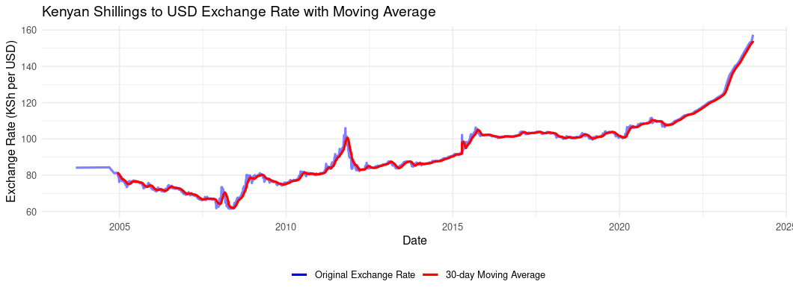

```{r setup, include=FALSE}
knitr::opts_chunk$set(echo = FALSE,
                      message = FALSE,
                      warning = FALSE)
library(tidyverse)
library(data.table)
library(lubridate)
source("R/used_functions.R")
load("data/gok_earnings_exp.rda")
# load("data/domestic_debt.rda")
current_year  <- year(Sys.Date()) - 1
```

## Income & Expenditure from 2000 to September 2023

Kenya's government revenue has grown since 2000, but expenditure has grown faster. The result is a persistent gap between what the government collects and what it spends.

That gap matters because it has to be financed. In practice, this often means more borrowing.

The chart below shows this clearly. Revenue rises over time, but total expenditure remains higher. Expenditure begins to rise more sharply after the mid-2010s, when the government was spending heavily on infrastructure. Expenditure rises again around 2020 during the COVID-19 period.

The main question is therefore simple: what exactly is pushing expenditure up?

The data used here come from the Central Bank of Kenya's [Government Finance Statistics](https://www.centralbank.go.ke/statistics/government-finance-statistics/). Some 2023 data was still incomplete when this analysis was first done.
```{r, fig.width=7.3, fig.height=4.5}
options(scipen = 999)

exp_rev <- c("total_expenditure", "total_revenue")

tax_revs <- c("import_duty", "excise_duty",
              "income_tax", "vat",
              "other_tax_income")
total_types_exp <- c("total_recurrent_expenditure", 
                     "county_transfer", 
                     "development_expenditure")

recurrent_exp <- c("domestic_interest", 
                   "foreign_interest", 
                   "wages_salaries", 
                   "pensions", "recurrent_expenditure_other")

list_graphs_vars <- list(exp_rev, tax_revs, total_types_exp, recurrent_exp)

list_graphs_nms <- c("exp_rev", 
                     "tax_revs",
                     "types_exp",
                     "types_reccurrent")

list_graphs <- list()
rev_all <- c(exp_rev, tax_revs, total_types_exp, recurrent_exp)
gok_earnings_exp[, (rev_all) := lapply(.SD, function(x) x/10000), 
                 .SDcols = rev_all]

gok_earnings_exp <- gok_earnings_exp[between(year, 2001, current_year)]

for (i in seq_along(list_graphs_nms)) {
    
    list_graphs[[i]] <- plot_compare(df = gok_earnings_exp, 
                                     id_vars = c("year"),
                                     compare_vars = list_graphs_vars[[i]],
                                     x_val = year,
                                     col_val = variable,
                                     y_val = sum_val,
                                     xlab = "Year",
                                     ylab = "Kenya Shillings(Billions)",
                                     title_lab = "")  
    
    
    
}

names(list_graphs) <- list_graphs_nms
girafe( ggobj =  list_graphs$exp_rev$plot,
        pointsize =10)
```

```{r}

exp_over_df <- list_graphs$exp_rev$data
exp_over_df[,  shifted_var := shift(sum_val, type= "lag"), by = variable]
exp_over_df[,  diff := sum_val - shifted_var]
exp_over_df[,  diff := sum_val - shifted_var]
exp_over_df[, perc_increase := diff/shifted_var * 100]
```

## What type of expenditure is rising?

Government spending can be grouped into three broad areas.

Recurrent expenditure is the regular cost of running the government. This includes salaries, pensions, interest payments, and other operating costs.

Development expenditure is spending on projects such as infrastructure and other long-term investments.

County transfers are funds sent to county governments under devolution.

The chart shows that recurrent expenditure is the largest and fastest-growing part of spending. Development expenditure has also increased, but most of the increase in total expenditure comes from recurrent expenditure.

County transfers have increased since devolution, but their increase is smaller than the increase in recurrent expenditure.

So the next question is: what is inside recurrent expenditure?
```{r}

girafe( ggobj =  list_graphs$types_exp$plot,
        pointsize =10)
```

## What is causing the rise in recurrent expenditure?

The recurrent expenditure chart gives a clearer picture.

Wages and salaries have grown steadily. Pensions have also increased gradually as the government continues to meet obligations to retired public workers.

But the sharpest rise is in domestic interest payments.

This means the government is spending more on interest payments for locally borrowed debt. That is important because interest payments do not build roads, hospitals, schools, or other services. They are the cost of past borrowing.

Foreign interest payments have also increased, though not as sharply as domestic interest. They still matter because a weaker shilling makes foreign debt more expensive when converted back into Kenyan shillings.

The chart shows that Kenya's budget pressure is not only caused by higher spending. The cost of servicing debt, especially domestic debt, has also increased.

When interest payments take up more space in the budget, there is less room for development spending and basic services. It can also make borrowing more difficult for the private sector if the government takes up a large share of available credit.
```{r}

girafe( ggobj =  list_graphs$types_reccurrent$plot,
        pointsize =10)

```

## Outlook

Kenya has received financing from the IMF and the World Bank. This can help the government meet foreign debt payments, especially when a weaker shilling makes those payments more expensive. However, this financing is still debt that must be repaid.

If revenue continues to grow more slowly than expenditure, the government will continue to borrow to cover the difference. The data show that recurrent expenditure is the largest part of government spending and that interest payments are rising particularly quickly.

This means that a growing amount of government revenue is being used to pay for earlier borrowing. That leaves less money for development projects and public services.

